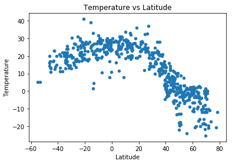
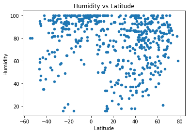
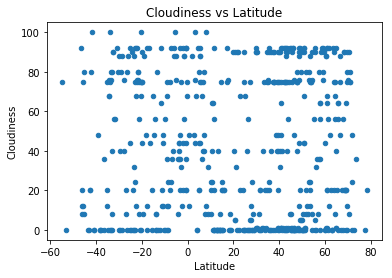
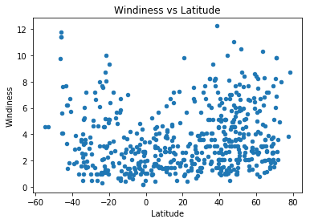

## Unit 6 | Assignment - What's the Weather Like?

## Background

Whether financial, political, or social -- data's true power lies in its ability to answer questions definitively. So let's take what you've learned about Python requests, APIs, and JSON traversals to answer a fundamental question: "What's the weather like as we approach the equator?"

Now, we know what you may be thinking: _"Duh. It gets hotter..."_ 

But, if pressed, how would you **prove** it? 


## WeatherPy

In this example, you'll be creating a Python script to visualize the weather of 500+ cities across the world of varying distance from the equator. To accomplish this, you'll be utilizing a [simple Python library](https://pypi.python.org/pypi/citipy), the [OpenWeatherMap API](https://openweathermap.org/api), and a little common sense to create a representative model of weather across world cities.

Your objective is to build a series of scatter plots to showcase the following relationships:

* Temperature (F) vs. Latitude
* Humidity (%) vs. Latitude
* Cloudiness (%) vs. Latitude
* Wind Speed (mph) vs. Latitude

Your final notebook must:

* Randomly select **at least** 500 unique (non-repeat) cities based on latitude and longitude.
* Perform a weather check on each of the cities using a series of successive API calls. 
* Include a print log of each city as it's being processed with the city number, city name, and requested URL.
* Save both a CSV of all data retrieved and png images for each scatter plot.

As final considerations:

* You must use the Matplotlib and Seaborn libraries.
* You must include a written description of three observable trends based on the data. 
* You must use proper labeling of your plots, including aspects like: Plot Titles (with date of analysis) and Axes Labels.
* You must include an exported markdown version of your Notebook called  `README.md` in your GitHub repository.  
* See [Example Solution](WeatherPy_Example.pdf) for a reference on expected format. 

## Hints and Considerations

* You may want to start this assignment by refreshing yourself on 4th grade geography, in particular, the [geographic coordinate system](http://desktop.arcgis.com/en/arcmap/10.3/guide-books/map-projections/about-geographic-coordinate-systems.htm). 

* Next, spend the requisite time necessary to study the OpenWeatherMap API. Based on your initial study, you should be able to answer  basic questions about the API: Where do you request the API key? Which Weather API in particular will you need? What URL endpoints does it expect? What JSON structure does it respond with? Before you write a line of code, you should be aiming to have a crystal clear understanding of your intended outcome.

* Though we've never worked with the [citipy Python library](https://pypi.python.org/pypi/citipy), push yourself to decipher how it works, and why it might be relevant. Before you try to incorporate the library into your analysis, start by creating simple test cases outside your main script to confirm that you are using it correctly. Too often, when introduced to a new library, students get bogged down by the most minor of errors -- spending hours investigating their entire code -- when, in fact, a simple and focused test would have shown their basic utilization of the library was wrong from the start. Don't let this be you!

* Part of our expectation in this challenge is that you will use critical thinking skills to understand how and why we're recommending the tools we are. What is Citipy for? Why would you use it in conjunction with the OpenWeatherMap API? How would you do so?

* In building your script, pay attention to the cities you are using in your query pool. Are you getting coverage of the full gamut of latitudes and longitudes? Or are you simply choosing 500 cities concentrated in one region of the world? Even if you were a geographic genius, simply rattling 500 cities based on your human selection would create a biased dataset. Be thinking of how you should counter this. (Hint: Consider the full range of latitudes).

* Lastly, remember -- this is a challenging activity. Push yourself! If you complete this task, then you can safely say that you've gained a strong mastery of the core foundations of data analytics and it will only go better from here. Good luck!

## Copyright

Coding Boot Camp (C) 2016. All Rights Reserved.


```python
"""
Pseudocode: Step by Step
(1) Install the citipy library. 
(2) Generate a list of random latitude / longitude combinations.
(3) Iterate over the combinations, and find the city names (Maybe citipy will help)!
(4) Use the OpenWeatherMap API to get the data associated with each city.
(5) Put the data in a DataFrame.
(6) Build scatter plots.
HINT: Don't forget what we learned about exception handling!
"""
```


    "\nPseudocode: Step by Step\n(1) Install the citipy library. \n(2) Generate a list of random latitude / longitude combinations.\n(3) Iterate over the combinations, and find the city names (Maybe citipy will help)!\n(4) Use the OpenWeatherMap API to get the data associated with each city.\n(5) Put the data in a DataFrame.\n(6) Build scatter plots.\nHINT: Don't forget what we learned about exception handling!\n"


```python
import json
import requests
import seaborn
import openweathermapy.core as owm
import matplotlib.pyplot as plt
import pandas as pd
import numpy as np
import random
from random import randint
from citipy import citipy
from config import api_key
from random import uniform
from pprint import pprint as pp
```


```python
settings = {"units": "metric", "appid": api_key}
```


```python
#Generate a list of random lat and lon combinations
lat = np.random.uniform(-90,90,1500)
lon = np.random.uniform(-180,180,1500)
#len(lon)
coordinates = zip(lat, lon)
```


```python
cities=[]
for pair in coordinates:
    city = citipy.nearest_city(pair[0],pair[1]).city_name
    #print(city)
    if city not in cities:
        cities.append(city)
len(cities)
```


    618


```python
weather_info = []
for a in cities:
    try:
        print(f"Calling OpenWeatherMap API for city [{a}]")
        current_weather  = owm.get_current(q=a, units= "metric", appid= api_key)
        weather_info.append(current_weather)
    except:
        print("it worked")
        print(a)
        
weather_info
```

    Calling OpenWeatherMap API for city [charagua]
    Calling OpenWeatherMap API for city [ushuaia]
    Calling OpenWeatherMap API for city [galiwinku]
    it worked
    galiwinku
    Calling OpenWeatherMap API for city [upernavik]
    Calling OpenWeatherMap API for city [kapaa]
    Calling OpenWeatherMap API for city [belushya guba]
    it worked
    belushya guba
    Calling OpenWeatherMap API for city [matamoros]
    Calling OpenWeatherMap API for city [saint-philippe]
    Calling OpenWeatherMap API for city [ozernovskiy]
    Calling OpenWeatherMap API for city [ayan]
    Calling OpenWeatherMap API for city [port elizabeth]
    Calling OpenWeatherMap API for city [jamestown]
    Calling OpenWeatherMap API for city [voznesenye]
    Calling OpenWeatherMap API for city [pemalang]
    Calling OpenWeatherMap API for city [albany]
    Calling OpenWeatherMap API for city [kodiak]
    Calling OpenWeatherMap API for city [axim]
    Calling OpenWeatherMap API for city [harper]
    Calling OpenWeatherMap API for city [fortuna]
    Calling OpenWeatherMap API for city [punta arenas]
    Calling OpenWeatherMap API for city [loveland]
    Calling OpenWeatherMap API for city [saleaula]
    it worked
    saleaula
    Calling OpenWeatherMap API for city [hobart]
    Calling OpenWeatherMap API for city [port blair]
    Calling OpenWeatherMap API for city [winnemucca]
    Calling OpenWeatherMap API for city [laguna]
    Calling OpenWeatherMap API for city [rikitea]
    Calling OpenWeatherMap API for city [busselton]
    Calling OpenWeatherMap API for city [mataura]
    Calling OpenWeatherMap API for city [tsihombe]
    it worked
    tsihombe
    Calling OpenWeatherMap API for city [rungata]
    it worked
    rungata
    Calling OpenWeatherMap API for city [ribeira grande]
    Calling OpenWeatherMap API for city [samusu]
    it worked
    samusu
    Calling OpenWeatherMap API for city [hovd]
    Calling OpenWeatherMap API for city [new norfolk]
    Calling OpenWeatherMap API for city [codrington]
    Calling OpenWeatherMap API for city [vila franca do campo]
    Calling OpenWeatherMap API for city [aranjuez]
    Calling OpenWeatherMap API for city [sao filipe]
    Calling OpenWeatherMap API for city [micheweni]
    Calling OpenWeatherMap API for city [kaitangata]
    Calling OpenWeatherMap API for city [bredasdorp]
    Calling OpenWeatherMap API for city [georgetown]
    Calling OpenWeatherMap API for city [inongo]
    Calling OpenWeatherMap API for city [sentyabrskiy]
    it worked
    sentyabrskiy
    Calling OpenWeatherMap API for city [nizhniy tsasuchey]
    Calling OpenWeatherMap API for city [baixa grande]
    Calling OpenWeatherMap API for city [mitsamiouli]
    Calling OpenWeatherMap API for city [beringovskiy]
    Calling OpenWeatherMap API for city [camopi]
    Calling OpenWeatherMap API for city [evensk]
    Calling OpenWeatherMap API for city [hilo]
    Calling OpenWeatherMap API for city [guerrero negro]
    Calling OpenWeatherMap API for city [hofn]
    Calling OpenWeatherMap API for city [attawapiskat]
    it worked
    attawapiskat
    Calling OpenWeatherMap API for city [katha]
    it worked
    katha
    Calling OpenWeatherMap API for city [caravelas]
    Calling OpenWeatherMap API for city [olafsvik]
    it worked
    olafsvik
    Calling OpenWeatherMap API for city [vaini]
    Calling OpenWeatherMap API for city [lompoc]
    Calling OpenWeatherMap API for city [barrow]
    Calling OpenWeatherMap API for city [qaanaaq]
    Calling OpenWeatherMap API for city [bluff]
    Calling OpenWeatherMap API for city [chuy]
    Calling OpenWeatherMap API for city [hasaki]
    Calling OpenWeatherMap API for city [shahada]
    Calling OpenWeatherMap API for city [vaitupu]
    it worked
    vaitupu
    Calling OpenWeatherMap API for city [northam]
    Calling OpenWeatherMap API for city [hermanus]
    Calling OpenWeatherMap API for city [sai buri]
    Calling OpenWeatherMap API for city [melilla]
    Calling OpenWeatherMap API for city [gubkinskiy]
    Calling OpenWeatherMap API for city [korla]
    it worked
    korla
    Calling OpenWeatherMap API for city [nelson bay]
    Calling OpenWeatherMap API for city [arraial do cabo]
    Calling OpenWeatherMap API for city [pingzhuang]
    it worked
    pingzhuang
    Calling OpenWeatherMap API for city [luba]
    Calling OpenWeatherMap API for city [camacha]
    Calling OpenWeatherMap API for city [castro]
    Calling OpenWeatherMap API for city [tura]
    it worked
    tura
    Calling OpenWeatherMap API for city [enid]
    Calling OpenWeatherMap API for city [cape town]
    Calling OpenWeatherMap API for city [juneau]
    Calling OpenWeatherMap API for city [nome]
    Calling OpenWeatherMap API for city [porto novo]
    Calling OpenWeatherMap API for city [grand river south east]
    it worked
    grand river south east
    Calling OpenWeatherMap API for city [katsuura]
    Calling OpenWeatherMap API for city [nikolskoye]
    Calling OpenWeatherMap API for city [dikson]
    Calling OpenWeatherMap API for city [inderborskiy]
    it worked
    inderborskiy
    Calling OpenWeatherMap API for city [kahului]
    Calling OpenWeatherMap API for city [ibia]
    Calling OpenWeatherMap API for city [pisco]
    Calling OpenWeatherMap API for city [rocha]
    Calling OpenWeatherMap API for city [airai]
    Calling OpenWeatherMap API for city [galgani]
    it worked
    galgani
    Calling OpenWeatherMap API for city [coari]
    Calling OpenWeatherMap API for city [bethel]
    Calling OpenWeatherMap API for city [okhotsk]
    Calling OpenWeatherMap API for city [buturlinovka]
    Calling OpenWeatherMap API for city [tuatapere]
    Calling OpenWeatherMap API for city [creel]
    Calling OpenWeatherMap API for city [tiksi]
    Calling OpenWeatherMap API for city [stolac]
    Calling OpenWeatherMap API for city [pochutla]
    Calling OpenWeatherMap API for city [saint-georges]
    Calling OpenWeatherMap API for city [tasiilaq]
    Calling OpenWeatherMap API for city [mount gambier]
    Calling OpenWeatherMap API for city [imphal]
    Calling OpenWeatherMap API for city [beloha]
    Calling OpenWeatherMap API for city [ust-nera]
    Calling OpenWeatherMap API for city [clyde river]
    Calling OpenWeatherMap API for city [cidreira]
    Calling OpenWeatherMap API for city [batagay-alyta]
    Calling OpenWeatherMap API for city [bosaso]
    Calling OpenWeatherMap API for city [san carlos de bariloche]
    Calling OpenWeatherMap API for city [kavaratti]
    Calling OpenWeatherMap API for city [provideniya]
    Calling OpenWeatherMap API for city [dalby]
    Calling OpenWeatherMap API for city [luderitz]
    Calling OpenWeatherMap API for city [pevek]
    Calling OpenWeatherMap API for city [kudahuvadhoo]
    Calling OpenWeatherMap API for city [illoqqortoormiut]
    it worked
    illoqqortoormiut
    Calling OpenWeatherMap API for city [mar del plata]
    Calling OpenWeatherMap API for city [butaritari]
    Calling OpenWeatherMap API for city [kruisfontein]
    Calling OpenWeatherMap API for city [saldanha]
    Calling OpenWeatherMap API for city [benghazi]
    Calling OpenWeatherMap API for city [khatanga]
    Calling OpenWeatherMap API for city [taolanaro]
    it worked
    taolanaro
    Calling OpenWeatherMap API for city [denpasar]
    Calling OpenWeatherMap API for city [hithadhoo]
    Calling OpenWeatherMap API for city [ponta do sol]
    Calling OpenWeatherMap API for city [baoqing]
    Calling OpenWeatherMap API for city [mandra]
    Calling OpenWeatherMap API for city [iguatemi]
    Calling OpenWeatherMap API for city [mogadishu]
    Calling OpenWeatherMap API for city [sitka]
    Calling OpenWeatherMap API for city [marawi]
    Calling OpenWeatherMap API for city [petropavlovsk-kamchatskiy]
    Calling OpenWeatherMap API for city [tumannyy]
    it worked
    tumannyy
    Calling OpenWeatherMap API for city [lazarev]
    Calling OpenWeatherMap API for city [nyurba]
    Calling OpenWeatherMap API for city [grand gaube]
    Calling OpenWeatherMap API for city [rawson]
    Calling OpenWeatherMap API for city [talnakh]
    Calling OpenWeatherMap API for city [port lincoln]
    Calling OpenWeatherMap API for city [amapa]
    Calling OpenWeatherMap API for city [los llanos de aridane]
    Calling OpenWeatherMap API for city [mys shmidta]
    it worked
    mys shmidta
    Calling OpenWeatherMap API for city [puerto ayora]
    Calling OpenWeatherMap API for city [gimli]
    Calling OpenWeatherMap API for city [blagoevgrad]
    Calling OpenWeatherMap API for city [thompson]
    Calling OpenWeatherMap API for city [zhigansk]
    Calling OpenWeatherMap API for city [mundo nuevo]
    Calling OpenWeatherMap API for city [aklavik]
    Calling OpenWeatherMap API for city [grand forks]
    Calling OpenWeatherMap API for city [umzimvubu]
    it worked
    umzimvubu
    Calling OpenWeatherMap API for city [bonavista]
    Calling OpenWeatherMap API for city [marsh harbour]
    Calling OpenWeatherMap API for city [sisimiut]
    Calling OpenWeatherMap API for city [jardim]
    Calling OpenWeatherMap API for city [grindavik]
    Calling OpenWeatherMap API for city [sinnamary]
    Calling OpenWeatherMap API for city [biryusinsk]
    Calling OpenWeatherMap API for city [iqaluit]
    Calling OpenWeatherMap API for city [yellowknife]
    Calling OpenWeatherMap API for city [tanout]
    Calling OpenWeatherMap API for city [atuona]
    Calling OpenWeatherMap API for city [leningradskiy]
    Calling OpenWeatherMap API for city [price]
    Calling OpenWeatherMap API for city [coquimbo]
    Calling OpenWeatherMap API for city [bubaque]
    Calling OpenWeatherMap API for city [torbay]
    Calling OpenWeatherMap API for city [santa maria]
    Calling OpenWeatherMap API for city [mehamn]
    Calling OpenWeatherMap API for city [avarua]
    Calling OpenWeatherMap API for city [teguldet]
    Calling OpenWeatherMap API for city [severo-kurilsk]
    Calling OpenWeatherMap API for city [ushtobe]
    it worked
    ushtobe
    Calling OpenWeatherMap API for city [kailua]
    Calling OpenWeatherMap API for city [linxia]
    Calling OpenWeatherMap API for city [yerbogachen]
    Calling OpenWeatherMap API for city [victoria]
    Calling OpenWeatherMap API for city [amderma]
    it worked
    amderma
    Calling OpenWeatherMap API for city [gap]
    Calling OpenWeatherMap API for city [bambous virieux]
    Calling OpenWeatherMap API for city [haines junction]
    Calling OpenWeatherMap API for city [narsaq]
    Calling OpenWeatherMap API for city [yulara]
    Calling OpenWeatherMap API for city [iberia]
    Calling OpenWeatherMap API for city [paka]
    Calling OpenWeatherMap API for city [asau]
    it worked
    asau
    Calling OpenWeatherMap API for city [tuktoyaktuk]
    Calling OpenWeatherMap API for city [chokurdakh]
    Calling OpenWeatherMap API for city [luau]
    Calling OpenWeatherMap API for city [alofi]
    Calling OpenWeatherMap API for city [ihosy]
    Calling OpenWeatherMap API for city [saskylakh]
    Calling OpenWeatherMap API for city [la asuncion]
    Calling OpenWeatherMap API for city [walvis bay]
    Calling OpenWeatherMap API for city [babanusah]
    it worked
    babanusah
    Calling OpenWeatherMap API for city [moosomin]
    Calling OpenWeatherMap API for city [norman wells]
    Calling OpenWeatherMap API for city [portland]
    Calling OpenWeatherMap API for city [prince george]
    Calling OpenWeatherMap API for city [saint-joseph]
    Calling OpenWeatherMap API for city [surok]
    Calling OpenWeatherMap API for city [dusetos]
    Calling OpenWeatherMap API for city [mutis]
    Calling OpenWeatherMap API for city [vredendal]
    Calling OpenWeatherMap API for city [nakhon phanom]
    Calling OpenWeatherMap API for city [kurilsk]
    Calling OpenWeatherMap API for city [lagoa]
    Calling OpenWeatherMap API for city [huarmey]
    Calling OpenWeatherMap API for city [kendari]
    Calling OpenWeatherMap API for city [along]
    Calling OpenWeatherMap API for city [namatanai]
    Calling OpenWeatherMap API for city [romny]
    Calling OpenWeatherMap API for city [shaunavon]
    Calling OpenWeatherMap API for city [miri]
    Calling OpenWeatherMap API for city [morlaix]
    Calling OpenWeatherMap API for city [mujiayingzi]
    Calling OpenWeatherMap API for city [east london]
    Calling OpenWeatherMap API for city [abu dhabi]
    Calling OpenWeatherMap API for city [arys]
    Calling OpenWeatherMap API for city [auki]
    Calling OpenWeatherMap API for city [moree]
    Calling OpenWeatherMap API for city [berlevag]
    Calling OpenWeatherMap API for city [pampierstad]
    Calling OpenWeatherMap API for city [port alfred]
    Calling OpenWeatherMap API for city [tevriz]
    Calling OpenWeatherMap API for city [esperance]
    Calling OpenWeatherMap API for city [meulaboh]
    Calling OpenWeatherMap API for city [scalloway]
    it worked
    scalloway
    Calling OpenWeatherMap API for city [faanui]
    Calling OpenWeatherMap API for city [buqayq]
    it worked
    buqayq
    Calling OpenWeatherMap API for city [mount darwin]
    Calling OpenWeatherMap API for city [galle]
    Calling OpenWeatherMap API for city [bestobe]
    Calling OpenWeatherMap API for city [lebu]
    Calling OpenWeatherMap API for city [zakamensk]
    Calling OpenWeatherMap API for city [canmore]
    Calling OpenWeatherMap API for city [qeshm]
    Calling OpenWeatherMap API for city [troitskoye]
    Calling OpenWeatherMap API for city [snyder]
    Calling OpenWeatherMap API for city [tadine]
    Calling OpenWeatherMap API for city [kamenskoye]
    it worked
    kamenskoye
    Calling OpenWeatherMap API for city [diego de almagro]
    Calling OpenWeatherMap API for city [merauke]
    Calling OpenWeatherMap API for city [port hawkesbury]
    Calling OpenWeatherMap API for city [samatau]
    it worked
    samatau
    Calling OpenWeatherMap API for city [zhezkazgan]
    Calling OpenWeatherMap API for city [jiangyou]
    Calling OpenWeatherMap API for city [eureka]
    Calling OpenWeatherMap API for city [carlos chagas]
    Calling OpenWeatherMap API for city [christchurch]
    Calling OpenWeatherMap API for city [marcona]
    it worked
    marcona
    Calling OpenWeatherMap API for city [inhambane]
    Calling OpenWeatherMap API for city [pocatello]
    Calling OpenWeatherMap API for city [tarudant]
    it worked
    tarudant
    Calling OpenWeatherMap API for city [tiznit]
    Calling OpenWeatherMap API for city [fort-shevchenko]
    Calling OpenWeatherMap API for city [cap malheureux]
    Calling OpenWeatherMap API for city [viedma]
    Calling OpenWeatherMap API for city [cayenne]
    Calling OpenWeatherMap API for city [vostok]
    Calling OpenWeatherMap API for city [nizhneyansk]
    it worked
    nizhneyansk
    Calling OpenWeatherMap API for city [trois-rivieres]
    Calling OpenWeatherMap API for city [gornopravdinsk]
    Calling OpenWeatherMap API for city [maumere]
    Calling OpenWeatherMap API for city [bamako]
    Calling OpenWeatherMap API for city [ouallam]
    Calling OpenWeatherMap API for city [san jeronimo]
    Calling OpenWeatherMap API for city [bertoua]
    Calling OpenWeatherMap API for city [lamu]
    Calling OpenWeatherMap API for city [sakata]
    Calling OpenWeatherMap API for city [aripuana]
    Calling OpenWeatherMap API for city [yashkul]
    Calling OpenWeatherMap API for city [louisbourg]
    it worked
    louisbourg
    Calling OpenWeatherMap API for city [bulancak]
    Calling OpenWeatherMap API for city [susurluk]
    Calling OpenWeatherMap API for city [pingdingshan]
    Calling OpenWeatherMap API for city [bremervorde]
    Calling OpenWeatherMap API for city [eyl]
    Calling OpenWeatherMap API for city [cherskiy]
    Calling OpenWeatherMap API for city [salalah]
    Calling OpenWeatherMap API for city [susehri]
    Calling OpenWeatherMap API for city [oranjemund]
    Calling OpenWeatherMap API for city [kununurra]
    Calling OpenWeatherMap API for city [casambalangan]
    Calling OpenWeatherMap API for city [bonnyville]
    Calling OpenWeatherMap API for city [treinta y tres]
    Calling OpenWeatherMap API for city [manggar]
    Calling OpenWeatherMap API for city [destin]
    Calling OpenWeatherMap API for city [naze]
    Calling OpenWeatherMap API for city [fos-sur-mer]
    Calling OpenWeatherMap API for city [knysna]
    Calling OpenWeatherMap API for city [itum-kale]
    it worked
    itum-kale
    Calling OpenWeatherMap API for city [san cristobal]
    Calling OpenWeatherMap API for city [alenquer]
    Calling OpenWeatherMap API for city [gainesville]
    Calling OpenWeatherMap API for city [cajamarca]
    Calling OpenWeatherMap API for city [kalmunai]
    Calling OpenWeatherMap API for city [tzermiadon]
    it worked
    tzermiadon
    Calling OpenWeatherMap API for city [monforte de lemos]
    Calling OpenWeatherMap API for city [cabo san lucas]
    Calling OpenWeatherMap API for city [belaya gora]
    Calling OpenWeatherMap API for city [cedar city]
    Calling OpenWeatherMap API for city [deputatskiy]
    Calling OpenWeatherMap API for city [mandalgovi]
    it worked
    mandalgovi
    Calling OpenWeatherMap API for city [raga]
    it worked
    raga
    Calling OpenWeatherMap API for city [lashio]
    Calling OpenWeatherMap API for city [juventino rosas]
    Calling OpenWeatherMap API for city [ponta delgada]
    Calling OpenWeatherMap API for city [blacksburg]
    Calling OpenWeatherMap API for city [ixtapa]
    Calling OpenWeatherMap API for city [gulshat]
    it worked
    gulshat
    Calling OpenWeatherMap API for city [lavrentiya]
    Calling OpenWeatherMap API for city [vao]
    Calling OpenWeatherMap API for city [katsina]
    Calling OpenWeatherMap API for city [port-gentil]
    Calling OpenWeatherMap API for city [statesboro]
    Calling OpenWeatherMap API for city [middletown]
    Calling OpenWeatherMap API for city [vila do maio]
    Calling OpenWeatherMap API for city [surt]
    Calling OpenWeatherMap API for city [senno]
    Calling OpenWeatherMap API for city [richards bay]
    Calling OpenWeatherMap API for city [barsbuttel]
    it worked
    barsbuttel
    Calling OpenWeatherMap API for city [college]
    Calling OpenWeatherMap API for city [eura]
    Calling OpenWeatherMap API for city [anadyr]
    Calling OpenWeatherMap API for city [qasigiannguit]
    Calling OpenWeatherMap API for city [honningsvag]
    Calling OpenWeatherMap API for city [thanh hoa]
    Calling OpenWeatherMap API for city [gold coast]
    Calling OpenWeatherMap API for city [dingle]
    Calling OpenWeatherMap API for city [namibe]
    Calling OpenWeatherMap API for city [benoy]
    Calling OpenWeatherMap API for city [altay]
    Calling OpenWeatherMap API for city [ancud]
    Calling OpenWeatherMap API for city [luangwa]
    Calling OpenWeatherMap API for city [esso]
    Calling OpenWeatherMap API for city [chapadinha]
    Calling OpenWeatherMap API for city [souillac]
    Calling OpenWeatherMap API for city [neosho]
    Calling OpenWeatherMap API for city [ito]
    Calling OpenWeatherMap API for city [ambilobe]
    Calling OpenWeatherMap API for city [rio muerto]
    Calling OpenWeatherMap API for city [erenhot]
    Calling OpenWeatherMap API for city [cravo norte]
    Calling OpenWeatherMap API for city [atambua]
    Calling OpenWeatherMap API for city [dhanera]
    Calling OpenWeatherMap API for city [sirsilla]
    Calling OpenWeatherMap API for city [sur]
    Calling OpenWeatherMap API for city [koslan]
    Calling OpenWeatherMap API for city [isangel]
    Calling OpenWeatherMap API for city [goure]
    Calling OpenWeatherMap API for city [ambodifototra]
    it worked
    ambodifototra
    Calling OpenWeatherMap API for city [armidale]
    Calling OpenWeatherMap API for city [hunza]
    it worked
    hunza
    Calling OpenWeatherMap API for city [parkes]
    Calling OpenWeatherMap API for city [goldsboro]
    Calling OpenWeatherMap API for city [kleck]
    it worked
    kleck
    Calling OpenWeatherMap API for city [puerto escondido]
    Calling OpenWeatherMap API for city [sorong]
    Calling OpenWeatherMap API for city [inuvik]
    Calling OpenWeatherMap API for city [biella]
    Calling OpenWeatherMap API for city [sao joao da barra]
    Calling OpenWeatherMap API for city [mahadday weyne]
    it worked
    mahadday weyne
    Calling OpenWeatherMap API for city [karratha]
    Calling OpenWeatherMap API for city [itoman]
    Calling OpenWeatherMap API for city [zhangjiakou]
    Calling OpenWeatherMap API for city [tandalti]
    Calling OpenWeatherMap API for city [lodja]
    Calling OpenWeatherMap API for city [ialibu]
    Calling OpenWeatherMap API for city [lorengau]
    Calling OpenWeatherMap API for city [palasa]
    it worked
    palasa
    Calling OpenWeatherMap API for city [barentsburg]
    it worked
    barentsburg
    Calling OpenWeatherMap API for city [atasu]
    Calling OpenWeatherMap API for city [nkhata bay]
    Calling OpenWeatherMap API for city [nouakchott]
    Calling OpenWeatherMap API for city [zapolyarnyy]
    Calling OpenWeatherMap API for city [manyana]
    Calling OpenWeatherMap API for city [te anau]
    Calling OpenWeatherMap API for city [necochea]
    Calling OpenWeatherMap API for city [malchin]
    Calling OpenWeatherMap API for city [ossora]
    Calling OpenWeatherMap API for city [karasjok]
    Calling OpenWeatherMap API for city [praia]
    Calling OpenWeatherMap API for city [kenai]
    Calling OpenWeatherMap API for city [mozarlandia]
    Calling OpenWeatherMap API for city [udachnyy]
    Calling OpenWeatherMap API for city [duku]
    Calling OpenWeatherMap API for city [constitucion]
    Calling OpenWeatherMap API for city [neftcala]
    Calling OpenWeatherMap API for city [neufahrn]
    Calling OpenWeatherMap API for city [elko]
    Calling OpenWeatherMap API for city [fondi]
    Calling OpenWeatherMap API for city [hohhot]
    Calling OpenWeatherMap API for city [kaeo]
    Calling OpenWeatherMap API for city [zverinogolovskoye]
    Calling OpenWeatherMap API for city [hihifo]
    it worked
    hihifo
    Calling OpenWeatherMap API for city [mago]
    Calling OpenWeatherMap API for city [luanda]
    Calling OpenWeatherMap API for city [komsomolskiy]
    Calling OpenWeatherMap API for city [longyearbyen]
    Calling OpenWeatherMap API for city [gizo]
    Calling OpenWeatherMap API for city [esna]
    Calling OpenWeatherMap API for city [el carmen]
    Calling OpenWeatherMap API for city [bowen]
    Calling OpenWeatherMap API for city [kaseda]
    Calling OpenWeatherMap API for city [yenagoa]
    Calling OpenWeatherMap API for city [edd]
    Calling OpenWeatherMap API for city [betioky]
    it worked
    betioky
    Calling OpenWeatherMap API for city [bomi]
    Calling OpenWeatherMap API for city [samarai]
    Calling OpenWeatherMap API for city [ust-kuyga]
    Calling OpenWeatherMap API for city [rozkishne]
    Calling OpenWeatherMap API for city [hervey bay]
    Calling OpenWeatherMap API for city [henties bay]
    Calling OpenWeatherMap API for city [verkhniy avzyan]
    Calling OpenWeatherMap API for city [riyadh]
    Calling OpenWeatherMap API for city [touros]
    Calling OpenWeatherMap API for city [vila velha]
    Calling OpenWeatherMap API for city [bermeo]
    Calling OpenWeatherMap API for city [poronaysk]
    Calling OpenWeatherMap API for city [spencer]
    Calling OpenWeatherMap API for city [mackay]
    Calling OpenWeatherMap API for city [leshukonskoye]
    Calling OpenWeatherMap API for city [tuggurt]
    it worked
    tuggurt
    Calling OpenWeatherMap API for city [sovetskiy]
    Calling OpenWeatherMap API for city [jining]
    Calling OpenWeatherMap API for city [tsabong]
    Calling OpenWeatherMap API for city [noumea]
    Calling OpenWeatherMap API for city [geraldton]
    Calling OpenWeatherMap API for city [nevelsk]
    Calling OpenWeatherMap API for city [salta]
    Calling OpenWeatherMap API for city [asnaes]
    Calling OpenWeatherMap API for city [le vauclin]
    Calling OpenWeatherMap API for city [saquarema]
    Calling OpenWeatherMap API for city [jalu]
    Calling OpenWeatherMap API for city [chapais]
    Calling OpenWeatherMap API for city [inawashiro]
    Calling OpenWeatherMap API for city [swakopmund]
    Calling OpenWeatherMap API for city [saint-pierre]
    Calling OpenWeatherMap API for city [nemuro]
    Calling OpenWeatherMap API for city [bayir]
    it worked
    bayir
    Calling OpenWeatherMap API for city [saint george]
    Calling OpenWeatherMap API for city [krupina]
    Calling OpenWeatherMap API for city [candawaga]
    it worked
    candawaga
    Calling OpenWeatherMap API for city [el faiyum]
    it worked
    el faiyum
    Calling OpenWeatherMap API for city [katangli]
    Calling OpenWeatherMap API for city [opuwo]
    Calling OpenWeatherMap API for city [novikovo]
    Calling OpenWeatherMap API for city [ronne]
    Calling OpenWeatherMap API for city [uporovo]
    Calling OpenWeatherMap API for city [ilulissat]
    Calling OpenWeatherMap API for city [syracuse]
    Calling OpenWeatherMap API for city [salamiyah]
    Calling OpenWeatherMap API for city [mae sai]
    Calling OpenWeatherMap API for city [shelburne]
    Calling OpenWeatherMap API for city [zabol]
    Calling OpenWeatherMap API for city [kavieng]
    Calling OpenWeatherMap API for city [okha]
    Calling OpenWeatherMap API for city [amahai]
    Calling OpenWeatherMap API for city [bud]
    Calling OpenWeatherMap API for city [venice]
    Calling OpenWeatherMap API for city [coetupo]
    it worked
    coetupo
    Calling OpenWeatherMap API for city [sambava]
    Calling OpenWeatherMap API for city [bograd]
    Calling OpenWeatherMap API for city [bathsheba]
    Calling OpenWeatherMap API for city [saint-francois]
    Calling OpenWeatherMap API for city [bourail]
    Calling OpenWeatherMap API for city [tilichiki]
    Calling OpenWeatherMap API for city [riohacha]
    Calling OpenWeatherMap API for city [zheleznodorozhnyy]
    Calling OpenWeatherMap API for city [gazni]
    it worked
    gazni
    Calling OpenWeatherMap API for city [moron]
    Calling OpenWeatherMap API for city [iwanai]
    Calling OpenWeatherMap API for city [iraray]
    Calling OpenWeatherMap API for city [nguiu]
    it worked
    nguiu
    Calling OpenWeatherMap API for city [chekmagush]
    Calling OpenWeatherMap API for city [awjilah]
    Calling OpenWeatherMap API for city [palabuhanratu]
    it worked
    palabuhanratu
    Calling OpenWeatherMap API for city [kloulklubed]
    Calling OpenWeatherMap API for city [san joaquin]
    Calling OpenWeatherMap API for city [derzhavinsk]
    Calling OpenWeatherMap API for city [mancora]
    Calling OpenWeatherMap API for city [martapura]
    Calling OpenWeatherMap API for city [ahipara]
    Calling OpenWeatherMap API for city [bangangte]
    Calling OpenWeatherMap API for city [san patricio]
    Calling OpenWeatherMap API for city [sisophon]
    Calling OpenWeatherMap API for city [qaqortoq]
    Calling OpenWeatherMap API for city [umm lajj]
    Calling OpenWeatherMap API for city [mahebourg]
    Calling OpenWeatherMap API for city [alterosa]
    Calling OpenWeatherMap API for city [sorland]
    Calling OpenWeatherMap API for city [kyra]
    it worked
    kyra
    Calling OpenWeatherMap API for city [riberalta]
    Calling OpenWeatherMap API for city [bengkulu]
    it worked
    bengkulu
    Calling OpenWeatherMap API for city [brae]
    Calling OpenWeatherMap API for city [tabiauea]
    it worked
    tabiauea
    Calling OpenWeatherMap API for city [aipe]
    Calling OpenWeatherMap API for city [bambanglipuro]
    Calling OpenWeatherMap API for city [carnarvon]
    Calling OpenWeatherMap API for city [padang]
    Calling OpenWeatherMap API for city [sarakhs]
    Calling OpenWeatherMap API for city [coihaique]
    Calling OpenWeatherMap API for city [ucluelet]
    Calling OpenWeatherMap API for city [alice springs]
    Calling OpenWeatherMap API for city [tono]
    Calling OpenWeatherMap API for city [saravena]
    Calling OpenWeatherMap API for city [pahrump]
    Calling OpenWeatherMap API for city [stange]
    Calling OpenWeatherMap API for city [alyangula]
    Calling OpenWeatherMap API for city [ust-kamchatsk]
    it worked
    ust-kamchatsk
    Calling OpenWeatherMap API for city [mpika]
    Calling OpenWeatherMap API for city [omboue]
    Calling OpenWeatherMap API for city [cockburn harbour]
    it worked
    cockburn harbour
    Calling OpenWeatherMap API for city [canon city]
    Calling OpenWeatherMap API for city [jertih]
    Calling OpenWeatherMap API for city [buena vista]
    Calling OpenWeatherMap API for city [tokur]
    Calling OpenWeatherMap API for city [alekseyevsk]
    Calling OpenWeatherMap API for city [bend]
    Calling OpenWeatherMap API for city [solnechnyy]
    Calling OpenWeatherMap API for city [kupang]
    Calling OpenWeatherMap API for city [turukhansk]
    Calling OpenWeatherMap API for city [vastervik]
    it worked
    vastervik
    Calling OpenWeatherMap API for city [caxito]
    Calling OpenWeatherMap API for city [coihueco]
    Calling OpenWeatherMap API for city [kayerkan]
    Calling OpenWeatherMap API for city [cap-aux-meules]
    Calling OpenWeatherMap API for city [miraflores]
    Calling OpenWeatherMap API for city [vagamo]
    Calling OpenWeatherMap API for city [bosobolo]
    Calling OpenWeatherMap API for city [zyryanka]
    Calling OpenWeatherMap API for city [son la]
    Calling OpenWeatherMap API for city [kirensk]
    Calling OpenWeatherMap API for city [fort walton beach]
    Calling OpenWeatherMap API for city [yanan]
    it worked
    yanan
    Calling OpenWeatherMap API for city [kurchum]
    Calling OpenWeatherMap API for city [nara]
    Calling OpenWeatherMap API for city [rio grande]
    Calling OpenWeatherMap API for city [balkhash]
    Calling OpenWeatherMap API for city [bela]
    Calling OpenWeatherMap API for city [lolua]
    it worked
    lolua
    Calling OpenWeatherMap API for city [salinopolis]
    Calling OpenWeatherMap API for city [thinadhoo]
    Calling OpenWeatherMap API for city [pacasmayo]
    Calling OpenWeatherMap API for city [bolungarvik]
    it worked
    bolungarvik
    Calling OpenWeatherMap API for city [iki-burul]
    Calling OpenWeatherMap API for city [ruatoria]
    it worked
    ruatoria
    Calling OpenWeatherMap API for city [azare]
    Calling OpenWeatherMap API for city [salym]
    Calling OpenWeatherMap API for city [san andres]
    Calling OpenWeatherMap API for city [palafrugell]
    Calling OpenWeatherMap API for city [ust-ilimsk]
    Calling OpenWeatherMap API for city [chicama]
    Calling OpenWeatherMap API for city [nanortalik]
    Calling OpenWeatherMap API for city [wewak]
    Calling OpenWeatherMap API for city [green valley]
    Calling OpenWeatherMap API for city [oblivskaya]
    Calling OpenWeatherMap API for city [fairbanks]
    Calling OpenWeatherMap API for city [yokadouma]
    Calling OpenWeatherMap API for city [dunedin]
    Calling OpenWeatherMap API for city [clyde]
    Calling OpenWeatherMap API for city [manoel urbano]
    Calling OpenWeatherMap API for city [nantucket]
    Calling OpenWeatherMap API for city [kutum]
    Calling OpenWeatherMap API for city [plainview]
    Calling OpenWeatherMap API for city [matara]
    Calling OpenWeatherMap API for city [ongandjera]
    Calling OpenWeatherMap API for city [natal]
    Calling OpenWeatherMap API for city [moose factory]
    Calling OpenWeatherMap API for city [polunochnoye]
    Calling OpenWeatherMap API for city [yakima]
    Calling OpenWeatherMap API for city [shimoda]
    Calling OpenWeatherMap API for city [araouane]
    Calling OpenWeatherMap API for city [darovskoy]
    Calling OpenWeatherMap API for city [tomakomai]
    Calling OpenWeatherMap API for city [port hardy]
    Calling OpenWeatherMap API for city [dalvik]
    Calling OpenWeatherMap API for city [rovaniemi]
    Calling OpenWeatherMap API for city [yevsino]
    Calling OpenWeatherMap API for city [horsham]
    Calling OpenWeatherMap API for city [toppenish]
    Calling OpenWeatherMap API for city [atlantic city]
    it worked
    atlantic city
    Calling OpenWeatherMap API for city [koumac]
    Calling OpenWeatherMap API for city [ormara]
    Calling OpenWeatherMap API for city [zatoka]
    Calling OpenWeatherMap API for city [wairoa]
    Calling OpenWeatherMap API for city [ishigaki]
    Calling OpenWeatherMap API for city [kazalinsk]
    it worked
    kazalinsk
    Calling OpenWeatherMap API for city [iralaya]
    Calling OpenWeatherMap API for city [sioux lookout]
    Calling OpenWeatherMap API for city [damghan]
    Calling OpenWeatherMap API for city [makrana]
    Calling OpenWeatherMap API for city [priiskovyy]
    Calling OpenWeatherMap API for city [husavik]
    Calling OpenWeatherMap API for city [soyo]
    Calling OpenWeatherMap API for city [peniche]
    Calling OpenWeatherMap API for city [guaranda]
    Calling OpenWeatherMap API for city [sao domingos]
    Calling OpenWeatherMap API for city [devils lake]
    Calling OpenWeatherMap API for city [houma]
    Calling OpenWeatherMap API for city [vardo]
    Calling OpenWeatherMap API for city [klaksvik]
    Calling OpenWeatherMap API for city [pokhara]
    Calling OpenWeatherMap API for city [riviere-au-renard]
    Calling OpenWeatherMap API for city [bataipora]
    Calling OpenWeatherMap API for city [amarante do maranhao]
    Calling OpenWeatherMap API for city [morros]
    Calling OpenWeatherMap API for city [sao gabriel da cachoeira]
    Calling OpenWeatherMap API for city [sakakah]
    it worked
    sakakah
    


    [{'base': 'stations',
      'clouds': {'all': 44},
      'cod': 200,
      'coord': {'lat': -19.79, 'lon': -63.2},
      'dt': 1522729103,
      'id': 3921141,
      'main': {'grnd_level': 952.21,
       'humidity': 93,
       'pressure': 952.21,
       'sea_level': 1025.97,
       'temp': 17.95,
       'temp_max': 17.95,
       'temp_min': 17.95},
      'name': 'Charagua',
      'sys': {'country': 'BO',
       'message': 0.1641,
       'sunrise': 1522750819,
       'sunset': 1522793479},
      'weather': [{'description': 'scattered clouds',
        'icon': '03n',
        'id': 802,
        'main': 'Clouds'}],
      'wind': {'deg': 186.5, 'speed': 3.37}},
     {'base': 'stations',
      'clouds': {'all': 75},
      'cod': 200,
      'coord': {'lat': -54.81, 'lon': -68.31},
      'dt': 1522724400,
      'id': 3833367,
      'main': {'humidity': 80,
       'pressure': 995,
       'temp': 5,
       'temp_max': 5,
       'temp_min': 5},
      'name': 'Ushuaia',
      'sys': {'country': 'AR',
       'id': 4754,
       'message': 0.1641,
       'sunrise': 1522753303,
       'sunset': 1522793403,
       'type': 1},
      'visibility': 10000,
      'weather': [{'description': 'broken clouds',
        'icon': '04n',
        'id': 803,
        'main': 'Clouds'}],
      'wind': {'deg': 250, 'speed': 4.6}},
     {'base': 'stations',
      'clouds': {'all': 0},
      'cod': 200,
      'coord': {'lat': 72.79, 'lon': -56.15},
      'dt': 1522729105,
      'id': 3418910,
      'main': {'grnd_level': 1028.81,
       'humidity': 87,
       'pressure': 1028.81,
       'sea_level': 1032.21,
       'temp': -10.91,
       'temp_max': -10.91,
       'temp_min': -10.91},
      'name': 'Upernavik',
      'sys': {'country': 'GL',
       'message': 0.1638,
       'sunrise': 1522743880,
       'sunset': 1522797250},
      'weather': [{'description': 'clear sky',
        'icon': '01n',
        'id': 800,
        'main': 'Clear'}],
      'wind': {'deg': 355, 'speed': 4.92}},
     {'base': 'stations',
      'clouds': {'all': 90},
      'cod': 200,
      'coord': {'lat': 22.08, 'lon': -159.32},
      'dt': 1522727760,
      'id': 5848280,
      'main': {'humidity': 69,
       'pressure': 1009,
       'temp': 23.4,
       'temp_max': 25,
       'temp_min': 22},
      'name': 'Kapaa',
      'sys': {'country': 'US',
       'id': 833,
       'message': 0.004,
       'sunrise': 1522772868,
       'sunset': 1522817594,
       'type': 1},
      'visibility': 16093,
      'weather': [{'description': 'overcast clouds',
        'icon': '04n',
        'id': 804,
        'main': 'Clouds'}],
      'wind': {'deg': 240, 'speed': 5.7}},
     {'base': 'stations',
      'clouds': {'all': 0},
      'cod': 200,
      'coord': {'lat': 25.87, 'lon': -97.51},
      'dt': 1522728900,
      'id': 3523466,
      'main': {'humidity': 93,
       'pressure': 1015,
       'temp': 22.82,
       'temp_max': 24,
       'temp_min': 19},
      'name': 'Matamoros',
      'sys': {'country': 'US',
       'id': 2724,
       'message': 0.0033,
       'sunrise': 1522757932,
       'sunset': 1522802872,
       'type': 1},
      'visibility': 1207,
      'weather': [{'description': 'clear sky',
        'icon': '01n',
        'id': 800,
        'main': 'Clear'}],
      'wind': {'deg': 147.5, 'speed': 7.57}},
     {'base': 'stations',
      'clouds': {'all': 1},
      'cod': 200,
      'coord': {'lat': 45.36, 'lon': -73.48},
      'dt': 1522727700,
      'id': 6138908,
      'main': {'humidity': 74,
       'pressure': 1019,
       'temp': 0.06,
       'temp_max': 2,
       'temp_min': -2},
      'name': 'Saint-Philippe',
      'sys': {'country': 'CA',
       'id': 2901,
       'message': 0.0051,
       'sunrise': 1522751413,
       'sunset': 1522797886,
       'type': 1},
      'visibility': 16093,
      'weather': [{'description': 'clear sky',
        'icon': '01n',
        'id': 800,
        'main': 'Clear'}],
      'wind': {'deg': 140, 'speed': 1.5}},
     {'base': 'stations',
      'clouds': {'all': 80},
      'cod': 200,
      'coord': {'lat': 51.5, 'lon': 156.52},
      'dt': 1522729098,
      'id': 2122293,
      'main': {'grnd_level': 1005.06,
       'humidity': 88,
       'pressure': 1005.06,
       'sea_level': 1030.02,
       'temp': -0.61,
       'temp_max': -0.61,
       'temp_min': -0.61},
      'name': 'Ozernovskiy',
      'sys': {'country': 'RU',
       'message': 0.0042,
       'sunrise': 1522695939,
       'sunset': 1522742995},
      'weather': [{'description': 'broken clouds',
        'icon': '04d',
        'id': 803,
        'main': 'Clouds'}],
      'wind': {'deg': 156.5, 'speed': 6.62}},
     {'base': 'stations',
      'clouds': {'all': 64},
      'cod': 200,
      'coord': {'lat': 40.67, 'lon': 33.6},
      'dt': 1522729107,
      'id': 749747,
      'main': {'grnd_level': 884.04,
       'humidity': 86,
       'pressure': 884.04,
       'sea_level': 1036.14,
       'temp': -3.36,
       'temp_max': -3.36,
       'temp_min': -3.36},
      'name': 'Ayan',
      'sys': {'country': 'TR',
       'message': 0.1669,
       'sunrise': 1522725965,
       'sunset': 1522771937},
      'weather': [{'description': 'broken clouds',
        'icon': '04d',
        'id': 803,
        'main': 'Clouds'}],
      'wind': {'deg': 250.5, 'speed': 1.22}},
     {'base': 'stations',
      'clouds': {'all': 1},
      'cod': 200,
      'coord': {'lat': 39.31, 'lon': -74.98},
      'dt': 1522727700,
      'id': 4501427,
      'main': {'humidity': 86,
       'pressure': 1023,
       'temp': 4.07,
       'temp_max': 6,
       'temp_min': 2},
      'name': 'Port Elizabeth',
      'sys': {'country': 'US',
       'id': 1971,
       'message': 0.0039,
       'sunrise': 1522752054,
       'sunset': 1522797955,
       'type': 1},
      'visibility': 16093,
      'weather': [{'description': 'clear sky',
        'icon': '01n',
        'id': 800,
        'main': 'Clear'}],
      'wind': {'deg': 130, 'speed': 1.5}},
     {'base': 'stations',
      'clouds': {'all': 0},
      'cod': 200,
      'coord': {'lat': -33.21, 'lon': 138.6},
      'dt': 1522728750,
      'id': 2069194,
      'main': {'grnd_level': 977.25,
       'humidity': 42,
       'pressure': 977.25,
       'sea_level': 1035.82,
       'temp': 22,
       'temp_max': 22,
       'temp_min': 22},
      'name': 'Jamestown',
      'sys': {'country': 'AU',
       'message': 0.1689,
       'sunrise': 1522702723,
       'sunset': 1522744718},
      'weather': [{'description': 'clear sky',
        'icon': '01d',
        'id': 800,
        'main': 'Clear'}],
      'wind': {'deg': 107.5, 'speed': 3.37}},
     {'base': 'stations',
      'clouds': {'all': 68},
      'cod': 200,
      'coord': {'lat': 61.02, 'lon': 35.48},
      'dt': 1522729099,
      'id': 471160,
      'main': {'grnd_level': 999.87,
       'humidity': 89,
       'pressure': 999.87,
       'sea_level': 1006.02,
       'temp': 1.95,
       'temp_max': 1.95,
       'temp_min': 1.95},
      'name': 'Voznesenye',
      'rain': {'3h': 0.115},
      'sys': {'country': 'RU',
       'message': 0.0085,
       'sunrise': 1522724139,
       'sunset': 1522772916},
      'weather': [{'description': 'light rain',
        'icon': '10d',
        'id': 500,
        'main': 'Rain'}],
      'wind': {'deg': 175.5, 'speed': 7.52}},
     {'base': 'stations',
      'clouds': {'all': 36},
      'cod': 200,
      'coord': {'lat': -6.89, 'lon': 109.38},
      'dt': 1522729120,
      'id': 1631648,
      'main': {'grnd_level': 1024.68,
       'humidity': 100,
       'pressure': 1024.68,
       'sea_level': 1023.86,
       'temp': 28.95,
       'temp_max': 28.95,
       'temp_min': 28.95},
      'name': 'Pemalang',
      'sys': {'country': 'ID',
       'message': 0.0085,
       'sunrise': 1522709102,
       'sunset': 1522752386},
      'weather': [{'description': 'scattered clouds',
        'icon': '03d',
        'id': 802,
        'main': 'Clouds'}],
      'wind': {'deg': 190, 'speed': 0.92}},
     {'base': 'stations',
      'clouds': {'all': 75},
      'cod': 200,
      'coord': {'lat': 42.65, 'lon': -73.75},
      'dt': 1522727640,
      'id': 5106834,
      'main': {'humidity': 64,
       'pressure': 1021,
       'temp': -0.32,
       'temp_max': 2,
       'temp_min': -2},
      'name': 'Albany',
      'sys': {'country': 'US',
       'id': 2088,
       'message': 0.1864,
       'sunrise': 1522751611,
       'sunset': 1522797813,
       'type': 1},
      'visibility': 16093,
      'weather': [{'description': 'broken clouds',
        'icon': '04n',
        'id': 803,
        'main': 'Clouds'}],
      'wind': {'deg': 150, 'speed': 2.1}},
     {'base': 'stations',
      'clouds': {'all': 90},
      'cod': 200,
      'coord': {'lat': 39.95, 'lon': -94.76},
      'dt': 1522727580,
      'id': 4407665,
      'main': {'humidity': 100,
       'pressure': 1005,
       'temp': 1,
       'temp_max': 1,
       'temp_min': 1},
      'name': 'Kodiak',
      'sys': {'country': 'US',
       'id': 1664,
       'message': 0.1725,
       'sunrise': 1522756769,
       'sunset': 1522802733,
       'type': 1},
      'visibility': 6437,
      'weather': [{'description': 'mist',
        'icon': '50n',
        'id': 701,
        'main': 'Mist'}],
      'wind': {'deg': 90, 'speed': 2.1}},
     {'base': 'stations',
      'clouds': {'all': 20},
      'cod': 200,
      'coord': {'lat': 4.87, 'lon': -2.24},
      'dt': 1522729130,
      'id': 2303611,
      'main': {'grnd_level': 1018.19,
       'humidity': 99,
       'pressure': 1018.19,
       'sea_level': 1020.49,
       'temp': 27.55,
       'temp_max': 27.55,
       'temp_min': 27.55},
      'name': 'Axim',
      'sys': {'country': 'GH',
       'message': 0.165,
       'sunrise': 1522735623,
       'sunset': 1522779441},
      'weather': [{'description': 'few clouds',
        'icon': '02n',
        'id': 801,
        'main': 'Clouds'}],
      'wind': {'deg': 228.5, 'speed': 4.47}},
     {'base': 'stations',
      'clouds': {'all': 90},
      'cod': 200,
      'coord': {'lat': 30.3, 'lon': -99.24},
      'dt': 1522727700,
      'id': 4696310,
      'main': {'humidity': 78,
       'pressure': 1008,
       'temp': 21.3,
       'temp_max': 22,
       'temp_min': 20},
      'name': 'Harper',
      'sys': {'country': 'US',
       'id': 2613,
       'message': 0.1667,
       'sunrise': 1522758206,
       'sunset': 1522803432,
       'type': 1},
      'visibility': 16093,
      'weather': [{'description': 'overcast clouds',
        'icon': '04n',
        'id': 804,
        'main': 'Clouds'}],
      'wind': {'deg': 160, 'speed': 4.1}},
     {'base': 'stations',
      'clouds': {'all': 0},
      'cod': 200,
      'coord': {'lat': 38.18, 'lon': -1.13},
      'dt': 1522728000,
      'id': 2517679,
      'main': {'humidity': 87,
       'pressure': 1009,
       'temp': 11,
       'temp_max': 11,
       'temp_min': 11},
      'name': 'Fortuna',
      'sys': {'country': 'ES',
       'id': 5464,
       'message': 0.0042,
       'sunrise': 1522734395,
       'sunset': 1522780171,
       'type': 1},
      'visibility': 10000,
      'weather': [{'description': 'clear sky',
        'icon': '01n',
        'id': 800,
        'main': 'Clear'}],
      'wind': {'deg': 270, 'speed': 1.5}},
     {'base': 'stations',
      'clouds': {'all': 0},
      'cod': 200,
      'coord': {'lat': -53.16, 'lon': -70.91},
      'dt': 1522724400,
      'id': 3874787,
      'main': {'humidity': 80,
       'pressure': 998,
       'temp': 5,
       'temp_max': 5,
       'temp_min': 5},
      'name': 'Punta Arenas',
      'sys': {'country': 'CL',
       'id': 4642,
       'message': 0.1654,
       'sunrise': 1522753831,
       'sunset': 1522794126,
       'type': 1},
      'visibility': 10000,
      'weather': [{'description': 'clear sky',
        'icon': '01n',
        'id': 800,
        'main': 'Clear'}],
      'wind': {'deg': 270, 'speed': 4.6}},
     {'base': 'stations',
      'clouds': {'all': 40},
      'cod': 200,
      'coord': {'lat': 40.4, 'lon': -105.08},
      'dt': 1522726920,
      'id': 5579368,
      'main': {'humidity': 37,
       'pressure': 1001,
       'temp': 13.68,
       'temp_max': 15,
       'temp_min': 13},
      'name': 'Loveland',
      'sys': {'country': 'US',
       'id': 606,
       'message': 0.0042,
       'sunrise': 1522759223,
       'sunset': 1522805232,
       'type': 1},
      'visibility': 16093,
      'weather': [{'description': 'scattered clouds',
        'icon': '03n',
        'id': 802,
        'main': 'Clouds'}],
      'wind': {'deg': 270, 'gust': 9.3, 'speed': 6.7}},
     {'base': 'stations',
      'clouds': {'all': 20},
      'cod': 200,
      'coord': {'lat': -42.88, 'lon': 147.33},
      'dt': 1522726200,
      'id': 2163355,
      'main': {'humidity': 35,
       'pressure': 1014,
       'temp': 23,
       'temp_max': 23,
       'temp_min': 23},
      'name': 'Hobart',
      'sys': {'country': 'AU',
       'id': 8195,
       'message': 0.0042,
       'sunrise': 1522700937,
       'sunset': 1522742302,
       'type': 1},
      'visibility': 10000,
      'weather': [{'description': 'few clouds',
        'icon': '02d',
        'id': 801,
        'main': 'Clouds'}],
      'wind': {'deg': 300, 'speed': 6.2}},
     {'base': 'stations',
      'clouds': {'all': 0},
      'cod': 200,
      'coord': {'lat': 11.67, 'lon': 92.75},
      'dt': 1522729153,
      'id': 1259385,
      'main': {'grnd_level': 1023.54,
       'humidity': 100,
       'pressure': 1023.54,
       'sea_level': 1023.86,
       'temp': 28.85,
       'temp_max': 28.85,
       'temp_min': 28.85},
      'name': 'Port Blair',
      'sys': {'country': 'IN',
       'message': 0.1725,
       'sunrise': 1522712674,
       'sunset': 1522756809},
      'weather': [{'description': 'clear sky',
        'icon': '01d',
        'id': 800,
        'main': 'Clear'}],
      'wind': {'deg': 53.0002, 'speed': 3.72}},
     {'base': 'stations',
      'clouds': {'all': 1},
      'cod': 200,
      'coord': {'lat': 40.97, 'lon': -117.74},
      'dt': 1522727760,
      'id': 5710360,
      'main': {'humidity': 32,
       'pressure': 1018,
       'temp': 3,
       'temp_max': 3,
       'temp_min': 3},
      'name': 'Winnemucca',
      'sys': {'country': 'US',
       'id': 2078,
       'message': 0.0043,
       'sunrise': 1522762233,
       'sunset': 1522808299,
       'type': 1},
      'visibility': 16093,
      'weather': [{'description': 'clear sky',
        'icon': '01n',
        'id': 800,
        'main': 'Clear'}],
      'wind': {'deg': 10, 'speed': 5.1}},
     {'base': 'stations',
      'clouds': {'all': 5},
      'cod': 200,
      'coord': {'lat': 27.52, 'lon': -110.01},
      'dt': 1522724100,
      'id': 4013704,
      'main': {'humidity': 39,
       'pressure': 1008,
       'temp': 19,
       'temp_max': 19,
       'temp_min': 19},
      'name': 'Laguna',
      'sys': {'country': 'MX',
       'id': 3975,
       'message': 0.0035,
       'sunrise': 1522760879,
       'sunset': 1522805925,
       'type': 1},
      'visibility': 16093,
      'weather': [{'description': 'clear sky',
        'icon': '02n',
        'id': 800,
        'main': 'Clear'}],
      'wind': {'deg': 100, 'speed': 2.6}},
     {'base': 'stations',
      'clouds': {'all': 0},
      'cod': 200,
      'coord': {'lat': -23.12, 'lon': -134.97},
      'dt': 1522728859,
      'id': 4030556,
      'main': {'grnd_level': 1027.44,
       'humidity': 100,
       'pressure': 1027.44,
       'sea_level': 1027.55,
       'temp': 26.1,
       'temp_max': 26.1,
       'temp_min': 26.1},
      'name': 'Rikitea',
      'sys': {'country': 'PF',
       'message': 0.1658,
       'sunrise': 1522768132,
       'sunset': 1522810607},
      'weather': [{'description': 'clear sky',
        'icon': '01n',
        'id': 800,
        'main': 'Clear'}],
      'wind': {'deg': 1.50024, 'speed': 2.12}},
     {'base': 'stations',
      'clouds': {'all': 0},
      'cod': 200,
      'coord': {'lat': -33.64, 'lon': 115.35},
      'dt': 1522728880,
      'id': 2075265,
      'main': {'grnd_level': 1027.84,
       'humidity': 82,
       'pressure': 1027.84,
       'sea_level': 1028.8,
       'temp': 23.95,
       'temp_max': 23.95,
       'temp_min': 23.95},
      'name': 'Busselton',
      'sys': {'country': 'AU',
       'message': 0.1639,
       'sunrise': 1522708318,
       'sunset': 1522750280},
      'weather': [{'description': 'clear sky',
        'icon': '01d',
        'id': 800,
        'main': 'Clear'}],
      'wind': {'deg': 8.00024, 'speed': 5.27}},
     {'base': 'stations',
      'clouds': {'all': 12},
      'cod': 200,
      'coord': {'lat': -46.19, 'lon': 168.86},
      'dt': 1522728921,
      'id': 6201424,
      'main': {'grnd_level': 1004.25,
       'humidity': 62,
       'pressure': 1004.25,
       'sea_level': 1019.08,
       'temp': 16.2,
       'temp_max': 16.2,
       'temp_min': 16.2},
      'name': 'Mataura',
      'sys': {'country': 'NZ',
       'message': 0.0037,
       'sunrise': 1522695893,
       'sunset': 1522737010},
      'weather': [{'description': 'few clouds',
        'icon': '02d',
        'id': 801,
        'main': 'Clouds'}],
      'wind': {'deg': 304.5, 'speed': 11.42}},
     {'base': 'stations',
      'clouds': {'all': 48},
      'cod': 200,
      'coord': {'lat': 38.52, 'lon': -28.7},
      'dt': 1522729032,
      'id': 3372707,
      'main': {'grnd_level': 1026.06,
       'humidity': 100,
       'pressure': 1026.06,
       'sea_level': 1029.57,
       'temp': 15.8,
       'temp_max': 15.8,
       'temp_min': 15.8},
      'name': 'Ribeira Grande',
      'sys': {'country': 'PT',
       'message': 0.1656,
       'sunrise': 1522740991,
       'sunset': 1522786806},
      'weather': [{'description': 'scattered clouds',
        'icon': '03n',
        'id': 802,
        'main': 'Clouds'}],
      'wind': {'deg': 302.5, 'speed': 12.22}},
     {'base': 'stations',
      'clouds': {'all': 20},
      'cod': 200,
      'coord': {'lat': 63.83, 'lon': 10.7},
      'dt': 1522727400,
      'id': 7626384,
      'main': {'humidity': 92,
       'pressure': 1005,
       'temp': -3.44,
       'temp_max': -2,
       'temp_min': -5},
      'name': 'Hovd',
      'sys': {'country': 'NO',
       'id': 5341,
       'message': 0.0036,
       'sunrise': 1522729730,
       'sunset': 1522779231,
       'type': 1},
      'visibility': 10000,
      'weather': [{'description': 'few clouds',
        'icon': '02n',
        'id': 801,
        'main': 'Clouds'}],
      'wind': {'deg': 120, 'speed': 3.1}},
     {'base': 'stations',
      'clouds': {'all': 20},
      'cod': 200,
      'coord': {'lat': -42.78, 'lon': 147.06},
      'dt': 1522728000,
      'id': 2155415,
      'main': {'humidity': 35,
       'pressure': 1014,
       'temp': 23,
       'temp_max': 23,
       'temp_min': 23},
      'name': 'New Norfolk',
      'sys': {'country': 'AU',
       'id': 8195,
       'message': 0.1641,
       'sunrise': 1522700999,
       'sunset': 1522742371,
       'type': 1},
      'visibility': 10000,
      'weather': [{'description': 'few clouds',
        'icon': '02d',
        'id': 801,
        'main': 'Clouds'}],
      'wind': {'deg': 310, 'speed': 6.2}},
     {'base': 'stations',
      'clouds': {'all': 80},
      'cod': 200,
      'coord': {'lat': -28.95, 'lon': 153.24},
      'dt': 1522729028,
      'id': 2160063,
      'main': {'grnd_level': 1005.63,
       'humidity': 100,
       'pressure': 1005.63,
       'sea_level': 1031.48,
       'temp': 19.25,
       'temp_max': 19.25,
       'temp_min': 19.25},
      'name': 'Codrington',
      'rain': {'3h': 2.495},
      'sys': {'country': 'AU',
       'message': 0.1679,
       'sunrise': 1522699091,
       'sunset': 1522741329},
      'weather': [{'description': 'light rain',
        'icon': '10d',
        'id': 500,
        'main': 'Rain'}],
      'wind': {'deg': 115, 'speed': 1.67}},
     {'base': 'stations',
      'clouds': {'all': 75},
      'cod': 200,
      'coord': {'lat': 37.72, 'lon': -25.43},
      'dt': 1522728000,
      'id': 3372472,
      'main': {'humidity': 71,
       'pressure': 1014,
       'temp': 14,
       'temp_max': 14,
       'temp_min': 14},
      'name': 'Vila Franca do Campo',
      'sys': {'country': 'PT',
       'id': 5957,
       'message': 0.0042,
       'sunrise': 1522740239,
       'sunset': 1522785988,
       'type': 1},
      'visibility': 10000,
      'weather': [{'description': 'broken clouds',
        'icon': '04n',
        'id': 803,
        'main': 'Clouds'}],
      'wind': {'deg': 310, 'speed': 8.2}},
     {'base': 'stations',
      'clouds': {'all': 75},
      'cod': 200,
      'coord': {'lat': 40.03, 'lon': -3.6},
      'dt': 1522728000,
      'id': 3129857,
      'main': {'humidity': 87,
       'pressure': 1007,
       'temp': 11.5,
       'temp_max': 12,
       'temp_min': 11},
      'name': 'Aranjuez',
      'sys': {'country': 'ES',
       'id': 5502,
       'message': 0.0205,
       'sunrise': 1522734911,
       'sunset': 1522780843,
       'type': 1},
      'visibility': 10000,
      'weather': [{'description': 'broken clouds',
        'icon': '04n',
        'id': 803,
        'main': 'Clouds'}],
      'wind': {'deg': 220, 'speed': 6.2}},
     {'base': 'stations',
      'clouds': {'all': 24},
      'cod': 200,
      'coord': {'lat': 14.9, 'lon': -24.5},
      'dt': 1522728929,
      'id': 3374210,
      'main': {'grnd_level': 1013.9,
       'humidity': 100,
       'pressure': 1013.9,
       'sea_level': 1025.76,
       'temp': 20.3,
       'temp_max': 20.3,
       'temp_min': 20.3},
      'name': 'Sao Filipe',
      'sys': {'country': 'CV',
       'message': 0.003,
       'sunrise': 1522740722,
       'sunset': 1522785033},
      'weather': [{'description': 'few clouds',
        'icon': '02n',
        'id': 801,
        'main': 'Clouds'}],
      'wind': {'deg': 37.0002, 'speed': 6.42}},
     {'base': 'stations',
      'clouds': {'all': 76},
      'cod': 200,
      'coord': {'lat': -4.97, 'lon': 39.83},
      'dt': 1522729191,
      'id': 153955,
      'main': {'grnd_level': 1023.3,
       'humidity': 100,
       'pressure': 1023.3,
       'sea_level': 1022.93,
       'temp': 24.95,
       'temp_max': 24.95,
       'temp_min': 24.95},
      'name': 'Micheweni',
      'rain': {'3h': 1.79},
      'sys': {'country': 'TZ',
       'message': 0.0037,
       'sunrise': 1522725750,
       'sunset': 1522769117},
      'weather': [{'description': 'light rain',
        'icon': '10d',
        'id': 500,
        'main': 'Rain'}],
      'wind': {'deg': 209, 'speed': 4.12}},
     {'base': 'stations',
      'clouds': {'all': 8},
      'cod': 200,
      'coord': {'lat': -46.28, 'lon': 169.85},
      'dt': 1522728927,
      'id': 2208248,
      'main': {'grnd_level': 1002.46,
       'humidity': 59,
       'pressure': 1002.46,
       'sea_level': 1019.12,
       'temp': 16.05,
       'temp_max': 16.05,
       'temp_min': 16.05},
      'name': 'Kaitangata',
      'sys': {'country': 'NZ',
       'message': 0.1645,
       'sunrise': 1522695659,
       'sunset': 1522736769},
      'weather': [{'description': 'clear sky',
        'icon': '02d',
        'id': 800,
        'main': 'Clear'}],
      'wind': {'deg': 289, 'speed': 11.77}},
     {'base': 'stations',
      'clouds': {'all': 68},
      'cod': 200,
      'coord': {'lat': -34.53, 'lon': 20.04},
      'dt': 1522724400,
      'id': 1015776,
      'main': {'humidity': 93,
       'pressure': 1015,
       'temp': 13,
       'temp_max': 13,
       'temp_min': 13},
      'name': 'Bredasdorp',
      'sys': {'country': 'ZA',
       'id': 6591,
       'message': 0.164,
       'sunrise': 1522731231,
       'sunset': 1522773106,
       'type': 1},
      'weather': [{'description': 'broken clouds',
        'icon': '04n',
        'id': 803,
        'main': 'Clouds'}],
      'wind': {'deg': 260, 'speed': 0.5}},
     {'base': 'stations',
      'clouds': {'all': 75},
      'cod': 200,
      'coord': {'lat': 6.8, 'lon': -58.16},
      'dt': 1522724400,
      'id': 3378644,
      'main': {'humidity': 94,
       'pressure': 1011,
       'temp': 24,
       'temp_max': 24,
       'temp_min': 24},
      'name': 'Georgetown',
      'sys': {'country': 'GY',
       'id': 4343,
       'message': 0.0039,
       'sunrise': 1522748994,
       'sunset': 1522792907,
       'type': 1},
      'visibility': 10000,
      'weather': [{'description': 'broken clouds',
        'icon': '04n',
        'id': 803,
        'main': 'Clouds'}],
      'wind': {'deg': 330, 'speed': 2.1}},
     {'base': 'stations',
      'clouds': {'all': 92},
      'cod': 200,
      'coord': {'lat': -1.93, 'lon': 18.29},
      'dt': 1522729213,
      'id': 2315417,
      'main': {'grnd_level': 975.88,
       'humidity': 98,
       'pressure': 975.88,
       'sea_level': 1019.93,
       'temp': 23.95,
       'temp_max': 23.95,
       'temp_min': 23.95},
      'name': 'Inongo',
      'rain': {'3h': 0.1625},
      'sys': {'country': 'CD',
       'message': 0.0037,
       'sunrise': 1522730851,
       'sunset': 1522774355},
      'weather': [{'description': 'light rain',
        'icon': '10n',
        'id': 500,
        'main': 'Rain'}],
      'wind': {'deg': 314, 'speed': 1.32}},
     {'base': 'stations',
      'clouds': {'all': 8},
      'cod': 200,
      'coord': {'lat': 50.52, 'lon': 115.13},
      'dt': 1522729214,
      'id': 2019118,
      'main': {'grnd_level': 962.1,
       'humidity': 35,
       'pressure': 962.1,
       'sea_level': 1047.33,
       'temp': -3.16,
       'temp_max': -3.16,
       'temp_min': -3.16},
      'name': 'Nizhniy Tsasuchey',
      'sys': {'country': 'RU',
       'message': 0.0031,
       'sunrise': 1522705919,
       'sunset': 1522752877},
      'weather': [{'description': 'clear sky',
        'icon': '02d',
        'id': 800,
        'main': 'Clear'}],
      'wind': {'deg': 322.5, 'speed': 7.02}},
     {'base': 'stations',
      'clouds': {'all': 0},
      'cod': 200,
      'coord': {'lat': -11.96, 'lon': -40.17},
      'dt': 1522729214,
      'id': 3471094,
      'main': {'grnd_level': 976.52,
       'humidity': 76,
       'pressure': 976.52,
       'sea_level': 1024.59,
       'temp': 23.05,
       'temp_max': 23.05,
       'temp_min': 23.05},
      'name': 'Baixa Grande',
      'sys': {'country': 'BR',
       'message': 0.004,
       'sunrise': 1522745106,
       'sunset': 1522788146},
      'weather': [{'description': 'clear sky',
        'icon': '01n',
        'id': 800,
        'main': 'Clear'}],
      'wind': {'deg': 120, 'speed': 2.27}},
     {'base': 'stations',
      'clouds': {'all': 20},
      'cod': 200,
      'coord': {'lat': -11.38, 'lon': 43.28},
      'dt': 1522724400,
      'id': 921786,
      'main': {'humidity': 78,
       'pressure': 1010,
       'temp': 27,
       'temp_max': 27,
       'temp_min': 27},
      'name': 'Mitsamiouli',
      'sys': {'country': 'KM',
       'id': 6787,
       'message': 0.1639,
       'sunrise': 1522725065,
       'sunset': 1522768140,
       'type': 1},
      'visibility': 10000,
      'weather': [{'description': 'few clouds',
        'icon': '02n',
        'id': 801,
        'main': 'Clouds'}],
      'wind': {'deg': 110, 'speed': 2.6}},
     {'base': 'stations',
      'clouds': {'all': 0},
      'cod': 200,
      'coord': {'lat': 63.05, 'lon': 179.32},
      'dt': 1522729224,
      'id': 2126710,
      'main': {'grnd_level': 1042.92,
       'humidity': 98,
       'pressure': 1042.92,
       'sea_level': 1050.97,
       'temp': -0.36,
       'temp_max': -0.36,
       'temp_min': -0.36},
      'name': 'Beringovskiy',
      'sys': {'country': 'RU',
       'message': 0.165,
       'sunrise': 1522689458,
       'sunset': 1522738577},
      'weather': [{'description': 'clear sky',
        'icon': '01d',
        'id': 800,
        'main': 'Clear'}],
      'wind': {'deg': 38.5002, 'speed': 3.07}},
     {'base': 'stations',
      'clouds': {'all': 76},
      'cod': 200,
      'coord': {'lat': 3.17, 'lon': -52.33},
      'dt': 1522729216,
      'id': 3382226,
      'main': {'grnd_level': 1014.14,
       'humidity': 100,
       'pressure': 1014.14,
       'sea_level': 1024.22,
       'temp': 22.15,
       'temp_max': 22.15,
       'temp_min': 22.15},
      'name': 'Camopi',
      'rain': {'3h': 5.13},
      'sys': {'country': 'GF',
       'message': 0.0037,
       'sunrise': 1522747680,
       'sunset': 1522791421},
      'weather': [{'description': 'moderate rain',
        'icon': '10n',
        'id': 501,
        'main': 'Rain'}],
      'wind': {'deg': 96.0002, 'speed': 0.92}},
     {'base': 'stations',
      'clouds': {'all': 92},
      'cod': 200,
      'coord': {'lat': 61.92, 'lon': 159.24},
      'dt': 1522729216,
      'id': 2125693,
      'main': {'grnd_level': 1027.6,
       'humidity': 90,
       'pressure': 1027.6,
       'sea_level': 1036.18,
       'temp': 1.35,
       'temp_max': 1.35,
       'temp_min': 1.35},
      'name': 'Evensk',
      'rain': {'3h': 1.785},
      'sys': {'country': 'RU',
       'message': 0.003,
       'sunrise': 1522694401,
       'sunset': 1522743265},
      'weather': [{'description': 'light rain',
        'icon': '10d',
        'id': 500,
        'main': 'Rain'}],
      'wind': {'deg': 82.0002, 'speed': 5.82}},
     {'base': 'stations',
      'clouds': {'all': 90},
      'cod': 200,
      'coord': {'lat': 19.71, 'lon': -155.08},
      'dt': 1522723980,
      'id': 5855927,
      'main': {'humidity': 73,
       'pressure': 1010,
       'temp': 25,
       'temp_max': 25,
       'temp_min': 25},
      'name': 'Hilo',
      'sys': {'country': 'US',
       'id': 818,
       'message': 0.0032,
       'sunrise': 1522771918,
       'sunset': 1522816508,
       'type': 1},
      'visibility': 16093,
      'weather': [{'description': 'overcast clouds',
        'icon': '04n',
        'id': 804,
        'main': 'Clouds'}],
      'wind': {'deg': 70, 'speed': 2.6}},
     {'base': 'stations',
      'clouds': {'all': 0},
      'cod': 200,
      'coord': {'lat': 27.97, 'lon': -114.04},
      'dt': 1522729217,
      'id': 4021858,
      'main': {'grnd_level': 1014.14,
       'humidity': 93,
       'pressure': 1014.14,
       'sea_level': 1025.52,
       'temp': 14.15,
       'temp_max': 14.15,
       'temp_min': 14.15},
      'name': 'Guerrero Negro',
      'sys': {'country': 'MX',
       'message': 0.0034,
       'sunrise': 1522761831,
       'sunset': 1522806908},
      'weather': [{'description': 'clear sky',
        'icon': '01n',
        'id': 800,
        'main': 'Clear'}],
      'wind': {'deg': 313, 'speed': 3.92}},
     {'base': 'stations',
      'clouds': {'all': 8},
      'cod': 200,
      'coord': {'lat': 64.25, 'lon': -15.21},
      'dt': 1522729226,
      'id': 2630299,
      'main': {'grnd_level': 1016.09,
       'humidity': 100,
       'pressure': 1016.09,
       'sea_level': 1027.47,
       'temp': -3.66,
       'temp_max': -3.66,
       'temp_min': -3.66},
      'name': 'Hofn',
      'sys': {'country': 'IS',
       'message': 0.1641,
       'sunrise': 1522735875,
       'sunset': 1522785523},
      'weather': [{'description': 'clear sky',
        'icon': '02n',
        'id': 800,
        'main': 'Clear'}],
      'wind': {'deg': 7.50024, 'speed': 8.27}},
     {'base': 'stations',
      'clouds': {'all': 0},
      'cod': 200,
      'coord': {'lat': -17.73, 'lon': -39.27},
      'dt': 1522729218,
      'id': 3466980,
      'main': {'grnd_level': 1024.68,
       'humidity': 100,
       'pressure': 1024.68,
       'sea_level': 1024.71,
       'temp': 27.15,
       'temp_max': 27.15,
       'temp_min': 27.15},
      'name': 'Caravelas',
      'sys': {'country': 'BR',
       'message': 0.0083,
       'sunrise': 1522745026,
       'sunset': 1522787790},
      'weather': [{'description': 'clear sky',
        'icon': '01n',
        'id': 800,
        'main': 'Clear'}],
      'wind': {'deg': 41.0002, 'speed': 7.17}},
     {'base': 'stations',
      'clouds': {'all': 0},
      'cod': 200,
      'coord': {'lat': 15.34, 'lon': 74.49},
      'dt': 1522728871,
      'id': 1273574,
      'main': {'grnd_level': 959.02,
       'humidity': 73,
       'pressure': 959.02,
       'sea_level': 1023.86,
       'temp': 23.5,
       'temp_max': 23.5,
       'temp_min': 23.5},
      'name': 'Vaini',
      'sys': {'country': 'IN',
       'message': 0.1634,
       'sunrise': 1522716965,
       'sunset': 1522761285},
      'weather': [{'description': 'clear sky',
        'icon': '01d',
        'id': 800,
        'main': 'Clear'}],
      'wind': {'deg': 150, 'speed': 1.47}},
     {'base': 'stations',
      'clouds': {'all': 90},
      'cod': 200,
      'coord': {'lat': 34.64, 'lon': -120.46},
      'dt': 1522728000,
      'id': 5367788,
      'main': {'humidity': 87,
       'pressure': 1013,
       'temp': 11.67,
       'temp_max': 13,
       'temp_min': 11},
      'name': 'Lompoc',
      'sys': {'country': 'US',
       'id': 410,
       'message': 0.004,
       'sunrise': 1522763142,
       'sunset': 1522808686,
       'type': 1},
      'visibility': 16093,
      'weather': [{'description': 'overcast clouds',
        'icon': '04n',
        'id': 804,
        'main': 'Clouds'}],
      'wind': {'deg': 290, 'speed': 3.1}},
     {'base': 'stations',
      'clouds': {'all': 0},
      'cod': 200,
      'coord': {'lat': -38.31, 'lon': -60.23},
      'dt': 1522728987,
      'id': 3833859,
      'main': {'grnd_level': 1016.33,
       'humidity': 85,
       'pressure': 1016.33,
       'sea_level': 1028.32,
       'temp': 13.3,
       'temp_max': 13.3,
       'temp_min': 13.3},
      'name': 'Barrow',
      'sys': {'country': 'AR',
       'message': 0.0041,
       'sunrise': 1522750628,
       'sunset': 1522792227},
      'weather': [{'description': 'clear sky',
        'icon': '01n',
        'id': 800,
        'main': 'Clear'}],
      'wind': {'deg': 354, 'speed': 3.92}},
     {'base': 'stations',
      'clouds': {'all': 0},
      'cod': 200,
      'coord': {'lat': 77.48, 'lon': -69.36},
      'dt': 1522728881,
      'id': 3831208,
      'main': {'grnd_level': 1005.06,
       'humidity': 82,
       'pressure': 1005.06,
       'sea_level': 1039.79,
       'temp': -20.76,
       'temp_max': -20.76,
       'temp_min': -20.76},
      'name': 'Qaanaaq',
      'sys': {'country': 'GL',
       'message': 0.1642,
       'sunrise': 1522744936,
       'sunset': 1522802658},
      'weather': [{'description': 'clear sky',
        'icon': '01n',
        'id': 800,
        'main': 'Clear'}],
      'wind': {'deg': 92.0002, 'speed': 3.87}},
     {'base': 'stations',
      'clouds': {'all': 88},
      'cod': 200,
      'coord': {'lat': -23.58, 'lon': 149.07},
      'dt': 1522728847,
      'id': 2175403,
      'main': {'grnd_level': 1001.09,
       'humidity': 49,
       'pressure': 1001.09,
       'sea_level': 1023.74,
       'temp': 28.9,
       'temp_max': 28.9,
       'temp_min': 28.9},
      'name': 'Bluff',
      'sys': {'country': 'AU',
       'message': 0.0034,
       'sunrise': 1522699956,
       'sunset': 1522742470},
      'weather': [{'description': 'overcast clouds',
        'icon': '04d',
        'id': 804,
        'main': 'Clouds'}],
      'wind': {'deg': 109, 'speed': 7.57}},
     {'base': 'stations',
      'clouds': {'all': 76},
      'cod': 200,
      'coord': {'lat': -33.69, 'lon': -53.46},
      'dt': 1522728871,
      'id': 3443061,
      'main': {'grnd_level': 1023.79,
       'humidity': 98,
       'pressure': 1023.79,
       'sea_level': 1025.32,
       'temp': 19.35,
       'temp_max': 19.35,
       'temp_min': 19.35},
      'name': 'Chuy',
      'sys': {'country': 'UY',
       'message': 0.1664,
       'sunrise': 1522748855,
       'sunset': 1522790756},
      'weather': [{'description': 'broken clouds',
        'icon': '04n',
        'id': 803,
        'main': 'Clouds'}],
      'wind': {'deg': 230.5, 'speed': 1.87}},
     {'base': 'stations',
      'clouds': {'all': 20},
      'cod': 200,
      'coord': {'lat': 35.73, 'lon': 140.83},
      'dt': 1522726200,
      'id': 2112802,
      'main': {'humidity': 53,
       'pressure': 1016,
       'temp': 20.75,
       'temp_max': 22,
       'temp_min': 20},
      'name': 'Hasaki',
      'sys': {'country': 'JP',
       'id': 7505,
       'message': 0.0155,
       'sunrise': 1522700453,
       'sunset': 1522745983,
       'type': 1},
      'visibility': 9000,
      'weather': [{'description': 'few clouds',
        'icon': '02d',
        'id': 801,
        'main': 'Clouds'}],
      'wind': {'deg': 250, 'speed': 4.1}},
     {'base': 'stations',
      'clouds': {'all': 0},
      'cod': 200,
      'coord': {'lat': 21.54, 'lon': 74.47},
      'dt': 1522729221,
      'id': 1256750,
      'main': {'grnd_level': 989.98,
       'humidity': 39,
       'pressure': 989.98,
       'sea_level': 1023.49,
       'temp': 28.2,
       'temp_max': 28.2,
       'temp_min': 28.2},
      'name': 'Shahada',
      'sys': {'country': 'IN',
       'message': 0.0031,
       'sunrise': 1522716809,
       'sunset': 1522761456},
      'weather': [{'description': 'clear sky',
        'icon': '01d',
        'id': 800,
        'main': 'Clear'}],
      'wind': {'deg': 291, 'speed': 1.67}},
     {'base': 'stations',
      'clouds': {'all': 44},
      'cod': 200,
      'coord': {'lat': 51.04, 'lon': -4.21},
      'dt': 1522723800,
      'id': 2641434,
      'main': {'humidity': 93,
       'pressure': 989,
       'temp': 9,
       'temp_max': 9,
       'temp_min': 9},
      'name': 'Northam',
      'rain': {'3h': 0.37},
      'sys': {'country': 'GB',
       'id': 5071,
       'message': 0.0077,
       'sunrise': 1522734484,
       'sunset': 1522781584,
       'type': 1},
      'visibility': 10000,
      'weather': [{'description': 'light rain',
        'icon': '10n',
        'id': 500,
        'main': 'Rain'}],
      'wind': {'deg': 110, 'speed': 2.6}},
     {'base': 'stations',
      'clouds': {'all': 68},
      'cod': 200,
      'coord': {'lat': -34.42, 'lon': 19.24},
      'dt': 1522729000,
      'id': 3366880,
      'main': {'grnd_level': 988.85,
       'humidity': 98,
       'pressure': 988.85,
       'sea_level': 1028.2,
       'temp': 16.1,
       'temp_max': 16.1,
       'temp_min': 16.1},
      'name': 'Hermanus',
      'rain': {'3h': 0.145},
      'sys': {'country': 'ZA',
       'message': 0.1645,
       'sunrise': 1522731420,
       'sunset': 1522773301},
      'weather': [{'description': 'light rain',
        'icon': '10n',
        'id': 500,
        'main': 'Rain'}],
      'wind': {'deg': 104, 'speed': 2.27}},
     {'base': 'stations',
      'clouds': {'all': 40},
      'cod': 200,
      'coord': {'lat': 6.7, 'lon': 101.62},
      'dt': 1522728000,
      'id': 1606851,
      'main': {'humidity': 70,
       'pressure': 1012,
       'temp': 30,
       'temp_max': 30,
       'temp_min': 30},
      'name': 'Sai Buri',
      'sys': {'country': 'TH',
       'id': 7948,
       'message': 0.0039,
       'sunrise': 1522710662,
       'sunset': 1522754561,
       'type': 1},
      'visibility': 10000,
      'weather': [{'description': 'scattered clouds',
        'icon': '03d',
        'id': 802,
        'main': 'Clouds'}],
      'wind': {'deg': 120, 'speed': 5.7}},
     {'base': 'stations',
      'clouds': {'all': 20},
      'cod': 200,
      'coord': {'lat': -0.8, 'lon': -80.23},
      'dt': 1522729222,
      'id': 3659139,
      'main': {'grnd_level': 1012.35,
       'humidity': 95,
       'pressure': 1012.35,
       'sea_level': 1024.14,
       'temp': 22.95,
       'temp_max': 22.95,
       'temp_min': 22.95},
      'name': 'Melilla',
      'sys': {'country': 'EC',
       'message': 0.0034,
       'sunrise': 1522754466,
       'sunset': 1522798021},
      'weather': [{'description': 'few clouds',
        'icon': '02n',
        'id': 801,
        'main': 'Clouds'}],
      'wind': {'deg': 305, 'speed': 1.62}},
     {'base': 'stations',
      'clouds': {'all': 56},
      'cod': 200,
      'coord': {'lat': 64.43, 'lon': 76.5},
      'dt': 1522729222,
      'id': 1539209,
      'main': {'grnd_level': 1030.27,
       'humidity': 82,
       'pressure': 1030.27,
       'sea_level': 1037.76,
       'temp': -17.01,
       'temp_max': -17.01,
       'temp_min': -17.01},
      'name': 'Gubkinskiy',
      'sys': {'country': 'RU',
       'message': 0.0038,
       'sunrise': 1522713894,
       'sunset': 1522763492},
      'weather': [{'description': 'broken clouds',
        'icon': '04d',
        'id': 803,
        'main': 'Clouds'}],
      'wind': {'deg': 302.5, 'speed': 6.82}},
     {'base': 'stations',
      'clouds': {'all': 90},
      'cod': 200,
      'coord': {'lat': -32.72, 'lon': 152.14},
      'dt': 1522728000,
      'id': 2155562,
      'main': {'humidity': 64,
       'pressure': 1019,
       'temp': 24,
       'temp_max': 24,
       'temp_min': 24},
      'name': 'Nelson Bay',
      'sys': {'country': 'AU',
       'id': 8242,
       'message': 0.1647,
       'sunrise': 1522699458,
       'sunset': 1522741486,
       'type': 1},
      'visibility': 10000,
      'weather': [{'description': 'overcast clouds',
        'icon': '04d',
        'id': 804,
        'main': 'Clouds'}],
      'wind': {'deg': 180, 'speed': 7.2}},
     {'base': 'stations',
      'clouds': {'all': 24},
      'cod': 200,
      'coord': {'lat': -22.97, 'lon': -42.02},
      'dt': 1522729030,
      'id': 3471451,
      'main': {'grnd_level': 1021.11,
       'humidity': 92,
       'pressure': 1021.11,
       'sea_level': 1022.12,
       'temp': 24.65,
       'temp_max': 24.65,
       'temp_min': 24.65},
      'name': 'Arraial do Cabo',
      'sys': {'country': 'BR',
       'message': 0.1704,
       'sunrise': 1522745814,
       'sunset': 1522788317},
      'weather': [{'description': 'few clouds',
        'icon': '02n',
        'id': 801,
        'main': 'Clouds'}],
      'wind': {'deg': 88.0002, 'speed': 1.12}},
     {'base': 'stations',
      'clouds': {'all': 92},
      'cod': 200,
      'coord': {'lat': 17.32, 'lon': 120.7},
      'dt': 1522729232,
      'id': 1705460,
      'main': {'grnd_level': 984.87,
       'humidity': 59,
       'pressure': 984.87,
       'sea_level': 1025.8,
       'temp': 27.45,
       'temp_max': 27.45,
       'temp_min': 27.45},
      'name': 'Luba',
      'sys': {'country': 'PH',
       'message': 0.1662,
       'sunrise': 1522705831,
       'sunset': 1522750245},
      'weather': [{'description': 'overcast clouds',
        'icon': '04d',
        'id': 804,
        'main': 'Clouds'}],
      'wind': {'deg': 292.5, 'speed': 1.82}},
     {'base': 'stations',
      'clouds': {'all': 40},
      'cod': 200,
      'coord': {'lat': 33.08, 'lon': -16.33},
      'dt': 1522728000,
      'id': 2270385,
      'main': {'humidity': 87,
       'pressure': 1014,
       'temp': 15.44,
       'temp_max': 16,
       'temp_min': 15},
      'name': 'Camacha',
      'sys': {'country': 'PT',
       'id': 5960,
       'message': 0.171,
       'sunrise': 1522738230,
       'sunset': 1522783623,
       'type': 1},
      'visibility': 10000,
      'weather': [{'description': 'scattered clouds',
        'icon': '03n',
        'id': 802,
        'main': 'Clouds'}],
      'wind': {'deg': 310, 'speed': 4.1}},
     {'base': 'stations',
      'clouds': {'all': 80},
      'cod': 200,
      'coord': {'lat': -42.48, 'lon': -73.76},
      'dt': 1522728931,
      'id': 3896218,
      'main': {'grnd_level': 1012.76,
       'humidity': 100,
       'pressure': 1012.76,
       'sea_level': 1027.14,
       'temp': 12.5,
       'temp_max': 12.5,
       'temp_min': 12.5},
      'name': 'Castro',
      'rain': {'3h': 0.26},
      'sys': {'country': 'CL',
       'message': 0.003,
       'sunrise': 1522754026,
       'sunset': 1522795316},
      'weather': [{'description': 'light rain',
        'icon': '10n',
        'id': 500,
        'main': 'Rain'}],
      'wind': {'deg': 305.5, 'speed': 1.42}},
     {'base': 'stations',
      'clouds': {'all': 90},
      'cod': 200,
      'coord': {'lat': 36.4, 'lon': -97.88},
      'dt': 1522727760,
      'id': 4535961,
      'main': {'humidity': 100,
       'pressure': 1000,
       'temp': 12.04,
       'temp_max': 13,
       'temp_min': 11},
      'name': 'Enid',
      'sys': {'country': 'US',
       'id': 2230,
       'message': 0.1649,
       'sunrise': 1522757661,
       'sunset': 1522803333,
       'type': 1},
      'visibility': 16093,
      'weather': [{'description': 'overcast clouds',
        'icon': '04n',
        'id': 804,
        'main': 'Clouds'}],
      'wind': {'deg': 160, 'gust': 12.9, 'speed': 9.3}},
     {'base': 'stations',
      'clouds': {'all': 0},
      'cod': 200,
      'coord': {'lat': -33.93, 'lon': 18.42},
      'dt': 1522724400,
      'id': 3369157,
      'main': {'humidity': 82,
       'pressure': 1013,
       'temp': 18,
       'temp_max': 18,
       'temp_min': 18},
      'name': 'Cape Town',
      'sys': {'country': 'ZA',
       'id': 6529,
       'message': 0.0047,
       'sunrise': 1522731602,
       'sunset': 1522773513,
       'type': 1},
      'visibility': 10000,
      'weather': [{'description': 'clear sky',
        'icon': '01n',
        'id': 800,
        'main': 'Clear'}],
      'wind': {'deg': 180, 'speed': 5.1}},
     {'base': 'stations',
      'clouds': {'all': 90},
      'cod': 200,
      'coord': {'lat': 58.3, 'lon': -134.42},
      'dt': 1522727760,
      'id': 5554072,
      'main': {'humidity': 37,
       'pressure': 1014,
       'temp': 2,
       'temp_max': 2,
       'temp_min': 2},
      'name': 'Juneau',
      'sys': {'country': 'US',
       'id': 86,
       'message': 0.004,
       'sunrise': 1522765109,
       'sunset': 1522813470,
       'type': 1},
      'visibility': 16093,
      'weather': [{'description': 'overcast clouds',
        'icon': '04n',
        'id': 804,
        'main': 'Clouds'}],
      'wind': {'deg': 90, 'speed': 2.6}},
     {'base': 'stations',
      'clouds': {'all': 90},
      'cod': 200,
      'coord': {'lat': 30.04, 'lon': -94.42},
      'dt': 1522727700,
      'id': 4732862,
      'main': {'humidity': 88,
       'pressure': 1012,
       'temp': 21.49,
       'temp_max': 22,
       'temp_min': 21},
      'name': 'Nome',
      'sys': {'country': 'US',
       'id': 2561,
       'message': 0.1665,
       'sunrise': 1522757059,
       'sunset': 1522802266,
       'type': 1},
      'visibility': 16093,
      'weather': [{'description': 'overcast clouds',
        'icon': '04n',
        'id': 804,
        'main': 'Clouds'}],
      'wind': {'deg': 160, 'speed': 3.6}},
     {'base': 'stations',
      'clouds': {'all': 0},
      'cod': 200,
      'coord': {'lat': -23.68, 'lon': -45.44},
      'dt': 1522724400,
      'id': 6322184,
      'main': {'humidity': 94,
       'pressure': 1013,
       'temp': 22,
       'temp_max': 22,
       'temp_min': 22},
      'name': 'Porto Novo',
      'sys': {'country': 'BR',
       'id': 4571,
       'message': 0.0034,
       'sunrise': 1522746653,
       'sunset': 1522789118,
       'type': 1},
      'visibility': 10000,
      'weather': [{'description': 'clear sky',
        'icon': '01n',
        'id': 800,
        'main': 'Clear'}],
      'wind': {'deg': 10, 'speed': 1}},
     {'base': 'stations',
      'clouds': {'all': 20},
      'cod': 200,
      'coord': {'lat': 33.93, 'lon': 134.5},
      'dt': 1522724400,
      'id': 1865309,
      'main': {'humidity': 49,
       'pressure': 1018,
       'temp': 23,
       'temp_max': 23,
       'temp_min': 23},
      'name': 'Katsuura',
      'sys': {'country': 'JP',
       'id': 7587,
       'message': 0.0034,
       'sunrise': 1522702034,
       'sunset': 1522747436,
       'type': 1},
      'visibility': 10000,
      'weather': [{'description': 'few clouds',
        'icon': '02d',
        'id': 801,
        'main': 'Clouds'}],
      'wind': {'deg': 280, 'speed': 5.1}},
     {'base': 'stations',
      'clouds': {'all': 90},
      'cod': 200,
      'coord': {'lat': 59.7, 'lon': 30.79},
      'dt': 1522726200,
      'id': 546105,
      'main': {'humidity': 99,
       'pressure': 995,
       'temp': 0,
       'temp_max': 0,
       'temp_min': 0},
      'name': 'Nikolskoye',
      'sys': {'country': 'RU',
       'id': 7267,
       'message': 0.0038,
       'sunrise': 1522725402,
       'sunset': 1522773898,
       'type': 1},
      'visibility': 2500,
      'weather': [{'description': 'light shower snow',
        'icon': '13d',
        'id': 620,
        'main': 'Snow'}],
      'wind': {'deg': 250, 'speed': 4}},
     {'base': 'stations',
      'clouds': {'all': 36},
      'cod': 200,
      'coord': {'lat': 73.51, 'lon': 80.55},
      'dt': 1522728863,
      'id': 1507390,
      'main': {'grnd_level': 1028.57,
       'humidity': 83,
       'pressure': 1028.57,
       'sea_level': 1028.97,
       'temp': -17.26,
       'temp_max': -17.26,
       'temp_min': -17.26},
      'name': 'Dikson',
      'sys': {'country': 'RU',
       'message': 0.1664,
       'sunrise': 1522710968,
       'sunset': 1522764570},
      'weather': [{'description': 'scattered clouds',
        'icon': '03d',
        'id': 802,
        'main': 'Clouds'}],
      'wind': {'deg': 17.0002, 'speed': 7.97}},
     {'base': 'stations',
      'clouds': {'all': 90},
      'cod': 200,
      'coord': {'lat': 20.89, 'lon': -156.47},
      'dt': 1522727760,
      'id': 5847411,
      'main': {'humidity': 94,
       'pressure': 1009,
       'temp': 22.63,
       'temp_max': 24,
       'temp_min': 22},
      'name': 'Kahului',
      'sys': {'country': 'US',
       'id': 823,
       'message': 0.1647,
       'sunrise': 1522772218,
       'sunset': 1522816875,
       'type': 1},
      'visibility': 11265,
      'weather': [{'description': 'light rain',
        'icon': '10n',
        'id': 500,
        'main': 'Rain'},
       {'description': 'mist', 'icon': '50n', 'id': 701, 'main': 'Mist'}],
      'wind': {'deg': 200, 'gust': 13.4, 'speed': 9.8}},
     {'base': 'stations',
      'clouds': {'all': 44},
      'cod': 200,
      'coord': {'lat': 5.18, 'lon': 6.32},
      'dt': 1522729410,
      'id': 2324962,
      'main': {'grnd_level': 1005.14,
       'humidity': 99,
       'pressure': 1005.14,
       'sea_level': 1020.58,
       'temp': 24.2,
       'temp_max': 24.2,
       'temp_min': 24.2},
      'name': 'Ibia',
      'sys': {'country': 'NG',
       'message': 0.0038,
       'sunrise': 1522733562,
       'sunset': 1522777394},
      'weather': [{'description': 'scattered clouds',
        'icon': '03n',
        'id': 802,
        'main': 'Clouds'}],
      'wind': {'deg': 227.5, 'speed': 3.02}},
     {'base': 'stations',
      'clouds': {'all': 0},
      'cod': 200,
      'coord': {'lat': -13.71, 'lon': -76.2},
      'dt': 1522724400,
      'id': 3932145,
      'main': {'humidity': 73,
       'pressure': 1011,
       'temp': 21,
       'temp_max': 21,
       'temp_min': 21},
      'name': 'Pisco',
      'sys': {'country': 'PE',
       'id': 4405,
       'message': 0.0031,
       'sunrise': 1522753795,
       'sunset': 1522796748,
       'type': 1},
      'visibility': 10000,
      'weather': [{'description': 'clear sky',
        'icon': '01n',
        'id': 800,
        'main': 'Clear'}],
      'wind': {'deg': 220, 'speed': 6.7}},
     {'base': 'stations',
      'clouds': {'all': 76},
      'cod': 200,
      'coord': {'lat': -34.48, 'lon': -54.34},
      'dt': 1522729410,
      'id': 3440777,
      'main': {'grnd_level': 1009.19,
       'humidity': 96,
       'pressure': 1009.19,
       'sea_level': 1026.21,
       'temp': 17.7,
       'temp_max': 17.7,
       'temp_min': 17.7},
      'name': 'Rocha',
      'rain': {'3h': 0.185},
      'sys': {'country': 'UY',
       'message': 0.0084,
       'sunrise': 1522749091,
       'sunset': 1522790941},
      'weather': [{'description': 'light rain',
        'icon': '10n',
        'id': 500,
        'main': 'Rain'}],
      'wind': {'deg': 182, 'speed': 4.02}},
     {'base': 'stations',
      'clouds': {'all': 0},
      'cod': 200,
      'coord': {'lat': -8.93, 'lon': 125.41},
      'dt': 1522729411,
      'id': 1651810,
      'main': {'grnd_level': 945.72,
       'humidity': 61,
       'pressure': 945.72,
       'sea_level': 1022.08,
       'temp': 29,
       'temp_max': 29,
       'temp_min': 29},
      'name': 'Airai',
      'rain': {'3h': 0.125},
      'sys': {'country': 'TL',
       'message': 0.0038,
       'sunrise': 1522705299,
       'sunset': 1522748494},
      'weather': [{'description': 'light rain',
        'icon': '10d',
        'id': 500,
        'main': 'Rain'}],
      'wind': {'deg': 183.5, 'speed': 0.77}},
     {'base': 'stations',
      'clouds': {'all': 8},
      'cod': 200,
      'coord': {'lat': -4.09, 'lon': -63.14},
      'dt': 1522729411,
      'id': 3664539,
      'main': {'grnd_level': 1018.19,
       'humidity': 91,
       'pressure': 1018.19,
       'sea_level': 1022.76,
       'temp': 25.35,
       'temp_max': 25.35,
       'temp_min': 25.35},
      'name': 'Coari',
      'sys': {'country': 'BR',
       'message': 0.0057,
       'sunrise': 1522750440,
       'sunset': 1522793843},
      'weather': [{'description': 'clear sky',
        'icon': '02n',
        'id': 800,
        'main': 'Clear'}],
      'wind': {'deg': 55.0002, 'speed': 2.72}},
     {'base': 'stations',
      'clouds': {'all': 1},
      'cod': 200,
      'coord': {'lat': 60.79, 'lon': -161.76},
      'dt': 1522727580,
      'id': 5880568,
      'main': {'humidity': 80,
       'pressure': 1028,
       'temp': 0,
       'temp_max': 0,
       'temp_min': 0},
      'name': 'Bethel',
      'sys': {'country': 'US',
       'id': 28,
       'message': 0.1654,
       'sunrise': 1522771400,
       'sunset': 1522820310,
       'type': 1},
      'visibility': 16093,
      'weather': [{'description': 'clear sky',
        'icon': '01n',
        'id': 800,
        'main': 'Clear'}],
      'wind': {'deg': 30, 'speed': 8.2}},
     {'base': 'stations',
      'clouds': {'all': 80},
      'cod': 200,
      'coord': {'lat': 59.36, 'lon': 143.24},
      'dt': 1522729412,
      'id': 2122605,
      'main': {'grnd_level': 1017.22,
       'humidity': 76,
       'pressure': 1017.22,
       'sea_level': 1023.82,
       'temp': -2.36,
       'temp_max': -2.36,
       'temp_min': -2.36},
      'name': 'Okhotsk',
      'sys': {'country': 'RU',
       'message': 0.004,
       'sunrise': 1522698502,
       'sunset': 1522746831},
      'weather': [{'description': 'broken clouds',
        'icon': '04d',
        'id': 803,
        'main': 'Clouds'}],
      'wind': {'deg': 86.5002, 'speed': 8.57}},
     {'base': 'stations',
      'clouds': {'all': 92},
      'cod': 200,
      'coord': {'lat': 50.83, 'lon': 40.59},
      'dt': 1522729412,
      'id': 570563,
      'main': {'grnd_level': 1001.9,
       'humidity': 90,
       'pressure': 1001.9,
       'sea_level': 1021.91,
       'temp': 2.1,
       'temp_max': 2.1,
       'temp_min': 2.1},
      'name': 'Buturlinovka',
      'rain': {'3h': 2.905},
      'sys': {'country': 'RU',
       'message': 0.0043,
       'sunrise': 1522723762,
       'sunset': 1522770807},
      'weather': [{'description': 'light rain',
        'icon': '10d',
        'id': 500,
        'main': 'Rain'}],
      'wind': {'deg': 155, 'speed': 5.82}},
     {'base': 'stations',
      'clouds': {'all': 20},
      'cod': 200,
      'coord': {'lat': -46.13, 'lon': 167.69},
      'dt': 1522729413,
      'id': 2180815,
      'main': {'grnd_level': 993.39,
       'humidity': 95,
       'pressure': 993.39,
       'sea_level': 1018.67,
       'temp': 14.4,
       'temp_max': 14.4,
       'temp_min': 14.4},
      'name': 'Tuatapere',
      'rain': {'3h': 0.125},
      'sys': {'country': 'NZ',
       'message': 0.0043,
       'sunrise': 1522696172,
       'sunset': 1522737292},
      'weather': [{'description': 'light rain',
        'icon': '10d',
        'id': 500,
        'main': 'Rain'}],
      'wind': {'deg': 313, 'speed': 11.37}},
     {'base': 'stations',
      'clouds': {'all': 12},
      'cod': 200,
      'coord': {'lat': 27.75, 'lon': -107.63},
      'dt': 1522729422,
      'id': 4012593,
      'main': {'grnd_level': 783.85,
       'humidity': 27,
       'pressure': 783.85,
       'sea_level': 1021.59,
       'temp': 12.5,
       'temp_max': 12.5,
       'temp_min': 12.5},
      'name': 'Creel',
      'sys': {'country': 'MX',
       'message': 0.1655,
       'sunrise': 1522760301,
       'sunset': 1522805361},
      'weather': [{'description': 'few clouds',
        'icon': '02n',
        'id': 801,
        'main': 'Clouds'}],
      'wind': {'deg': 243, 'speed': 2.22}},
     {'base': 'stations',
      'clouds': {'all': 24},
      'cod': 200,
      'coord': {'lat': 71.64, 'lon': 128.87},
      'dt': 1522728860,
      'id': 2015306,
      'main': {'grnd_level': 1015.68,
       'humidity': 89,
       'pressure': 1015.68,
       'sea_level': 1033.91,
       'temp': -10.51,
       'temp_max': -10.51,
       'temp_min': -10.51},
      'name': 'Tiksi',
      'sys': {'country': 'RU',
       'message': 0.1646,
       'sunrise': 1522699978,
       'sunset': 1522752342},
      'weather': [{'description': 'few clouds',
        'icon': '02d',
        'id': 801,
        'main': 'Clouds'}],
      'wind': {'deg': 54.5002, 'speed': 2.67}},
     {'base': 'stations',
      'clouds': {'all': 0},
      'cod': 200,
      'coord': {'lat': 43.08, 'lon': 17.95},
      'dt': 1522728000,
      'id': 3189823,
      'main': {'humidity': 93,
       'pressure': 1020,
       'temp': 5.18,
       'temp_max': 7,
       'temp_min': 3},
      'name': 'Stolac',
      'sys': {'country': 'BA',
       'id': 5982,
       'message': 0.0039,
       'sunrise': 1522729609,
       'sunset': 1522775809,
       'type': 1},
      'visibility': 10000,
      'weather': [{'description': 'clear sky',
        'icon': '01n',
        'id': 800,
        'main': 'Clear'}],
      'wind': {'speed': 1}},
     {'base': 'stations',
      'clouds': {'all': 20},
      'cod': 200,
      'coord': {'lat': 15.74, 'lon': -96.47},
      'dt': 1522727100,
      'id': 3517970,
      'main': {'humidity': 74,
       'pressure': 1015,
       'temp': 27,
       'temp_max': 27,
       'temp_min': 27},
      'name': 'Pochutla',
      'sys': {'country': 'MX',
       'id': 4010,
       'message': 0.0042,
       'sunrise': 1522757965,
       'sunset': 1522802330,
       'type': 1},
      'visibility': 16093,
      'weather': [{'description': 'few clouds',
        'icon': '02n',
        'id': 801,
        'main': 'Clouds'}],
      'wind': {'deg': 253.5, 'speed': 1.07}},
     {'base': 'stations',
      'clouds': {'all': 0},
      'cod': 200,
      'coord': {'lat': 46.12, 'lon': -70.67},
      'dt': 1522729415,
      'id': 6295855,
      'main': {'grnd_level': 989.33,
       'humidity': 79,
       'pressure': 989.33,
       'sea_level': 1034.03,
       'temp': -7.01,
       'temp_max': -7.01,
       'temp_min': -7.01},
      'name': 'Saint-Georges',
      'sys': {'country': 'CA',
       'message': 0.0036,
       'sunrise': 1522750699,
       'sunset': 1522797253},
      'weather': [{'description': 'clear sky',
        'icon': '01n',
        'id': 800,
        'main': 'Clear'}],
      'wind': {'deg': 229.5, 'speed': 1.22}},
     {'base': 'stations',
      'clouds': {'all': 64},
      'cod': 200,
      'coord': {'lat': 65.61, 'lon': -37.64},
      'dt': 1522727400,
      'id': 3424607,
      'main': {'humidity': 85,
       'pressure': 1017,
       'temp': -7,
       'temp_max': -7,
       'temp_min': -7},
      'name': 'Tasiilaq',
      'sys': {'country': 'GL',
       'id': 4806,
       'message': 0.164,
       'sunrise': 1522741045,
       'sunset': 1522791126,
       'type': 1},
      'weather': [{'description': 'light snow',
        'icon': '13n',
        'id': 600,
        'main': 'Snow'}],
      'wind': {'deg': 90, 'speed': 7.2}},
     {'base': 'stations',
      'clouds': {'all': 0},
      'cod': 200,
      'coord': {'lat': -37.83, 'lon': 140.78},
      'dt': 1522729416,
      'id': 2156643,
      'main': {'grnd_level': 1028.49,
       'humidity': 66,
       'pressure': 1028.49,
       'sea_level': 1036.83,
       'temp': 20.1,
       'temp_max': 20.1,
       'temp_min': 20.1},
      'name': 'Mount Gambier',
      'sys': {'country': 'AU',
       'message': 0.004,
       'sunrise': 1522702339,
       'sunset': 1522744050},
      'weather': [{'description': 'clear sky',
        'icon': '01d',
        'id': 800,
        'main': 'Clear'}],
      'wind': {'deg': 240.5, 'speed': 1.92}},
     {'base': 'stations',
      'clouds': {'all': 75},
      'cod': 200,
      'coord': {'lat': 24.8, 'lon': 93.94},
      'dt': 1522728000,
      'id': 1269771,
      'main': {'humidity': 60,
       'pressure': 1015,
       'temp': 24,
       'temp_max': 24,
       'temp_min': 24},
      'name': 'Imphal',
      'sys': {'country': 'IN',
       'id': 7789,
       'message': 0.0043,
       'sunrise': 1522712048,
       'sunset': 1522756877,
       'type': 1},
      'visibility': 3000,
      'weather': [{'description': 'haze',
        'icon': '50d',
        'id': 721,
        'main': 'Haze'}],
      'wind': {'deg': 289.5, 'speed': 1.32}},
     {'base': 'stations',
      'clouds': {'all': 44},
      'cod': 200,
      'coord': {'lat': -25.17, 'lon': 45.06},
      'dt': 1522729425,
      'id': 1067565,
      'main': {'grnd_level': 1010.81,
       'humidity': 88,
       'pressure': 1010.81,
       'sea_level': 1027.26,
       'temp': 23.55,
       'temp_max': 23.55,
       'temp_min': 23.55},
      'name': 'Beloha',
      'sys': {'country': 'MG',
       'message': 0.1634,
       'sunrise': 1522724965,
       'sunset': 1522767374},
      'weather': [{'description': 'scattered clouds',
        'icon': '03d',
        'id': 802,
        'main': 'Clouds'}],
      'wind': {'deg': 99.0002, 'speed': 6.12}},
     {'base': 'stations',
      'clouds': {'all': 68},
      'cod': 200,
      'coord': {'lat': 64.57, 'lon': 143.24},
      'dt': 1522729425,
      'id': 2120048,
      'main': {'grnd_level': 903.41,
       'humidity': 78,
       'pressure': 903.41,
       'sea_level': 1030.42,
       'temp': -6.01,
       'temp_max': -6.01,
       'temp_min': -6.01},
      'name': 'Ust-Nera',
      'sys': {'country': 'RU',
       'message': 0.1714,
       'sunrise': 1522697897,
       'sunset': 1522747462},
      'weather': [{'description': 'broken clouds',
        'icon': '04d',
        'id': 803,
        'main': 'Clouds'}],
      'wind': {'deg': 105.5, 'speed': 1.12}},
     {'base': 'stations',
      'clouds': {'all': 90},
      'cod': 200,
      'coord': {'lat': 70.47, 'lon': -68.59},
      'dt': 1522725960,
      'id': 5924351,
      'main': {'humidity': 85,
       'pressure': 1026,
       'temp': -12,
       'temp_max': -12,
       'temp_min': -12},
      'name': 'Clyde River',
      'sys': {'country': 'CA',
       'id': 3585,
       'message': 0.1664,
       'sunrise': 1522747502,
       'sunset': 1522799566,
       'type': 1},
      'visibility': 14484,
      'weather': [{'description': 'light snow',
        'icon': '13n',
        'id': 600,
        'main': 'Snow'}],
      'wind': {'deg': 330, 'speed': 8.2}},
     {'base': 'stations',
      'clouds': {'all': 88},
      'cod': 200,
      'coord': {'lat': -30.17, 'lon': -50.22},
      'dt': 1522728918,
      'id': 3466165,
      'main': {'grnd_level': 1014.14,
       'humidity': 97,
       'pressure': 1014.14,
       'sea_level': 1024.02,
       'temp': 20.35,
       'temp_max': 20.35,
       'temp_min': 20.35},
      'name': 'Cidreira',
      'sys': {'country': 'BR',
       'message': 0.004,
       'sunrise': 1522747974,
       'sunset': 1522790085},
      'weather': [{'description': 'overcast clouds',
        'icon': '04n',
        'id': 804,
        'main': 'Clouds'}],
      'wind': {'deg': 218, 'speed': 3.37}},
     {'base': 'stations',
      'clouds': {'all': 56},
      'cod': 200,
      'coord': {'lat': 67.8, 'lon': 130.41},
      'dt': 1522729418,
      'id': 2027042,
      'main': {'grnd_level': 937.29,
       'humidity': 84,
       'pressure': 937.29,
       'sea_level': 1029.33,
       'temp': -8.51,
       'temp_max': -8.51,
       'temp_min': -8.51},
      'name': 'Batagay-Alyta',
      'sys': {'country': 'RU',
       'message': 0.0034,
       'sunrise': 1522700454,
       'sunset': 1522751085},
      'weather': [{'description': 'broken clouds',
        'icon': '04d',
        'id': 803,
        'main': 'Clouds'}],
      'wind': {'deg': 13.5002, 'speed': 1.82}},
     {'base': 'stations',
      'clouds': {'all': 92},
      'cod': 200,
      'coord': {'lat': 11.28, 'lon': 49.18},
      'dt': 1522729418,
      'id': 64013,
      'main': {'grnd_level': 1014.38,
       'humidity': 95,
       'pressure': 1014.38,
       'sea_level': 1022.52,
       'temp': 26.5,
       'temp_max': 26.5,
       'temp_min': 26.5},
      'name': 'Bosaso',
      'sys': {'country': 'SO',
       'message': 0.0037,
       'sunrise': 1522723136,
       'sunset': 1522767257},
      'weather': [{'description': 'overcast clouds',
        'icon': '04d',
        'id': 804,
        'main': 'Clouds'}],
      'wind': {'deg': 134.5, 'speed': 1.17}},
     {'base': 'stations',
      'clouds': {'all': 0},
      'cod': 200,
      'coord': {'lat': -41.13, 'lon': -71.31},
      'dt': 1522724400,
      'id': 7647007,
      'main': {'humidity': 62,
       'pressure': 1014,
       'temp': 15,
       'temp_max': 15,
       'temp_min': 15},
      'name': 'San Carlos de Bariloche',
      'sys': {'country': 'AR',
       'id': 4774,
       'message': 0.1659,
       'sunrise': 1522753388,
       'sunset': 1522794780,
       'type': 1},
      'visibility': 10000,
      'weather': [{'description': 'clear sky',
        'icon': '01n',
        'id': 800,
        'main': 'Clear'}],
      'wind': {'deg': 320, 'speed': 6.7}},
     {'base': 'stations',
      'clouds': {'all': 24},
      'cod': 200,
      'coord': {'lat': 10.57, 'lon': 72.64},
      'dt': 1522729419,
      'id': 1267390,
      'main': {'grnd_level': 1023.38,
       'humidity': 100,
       'pressure': 1023.38,
       'sea_level': 1023.49,
       'temp': 29.4,
       'temp_max': 29.4,
       'temp_min': 29.4},
      'name': 'Kavaratti',
      'sys': {'country': 'IN',
       'message': 0.0034,
       'sunrise': 1522717525,
       'sunset': 1522761609},
      'weather': [{'description': 'few clouds',
        'icon': '02d',
        'id': 801,
        'main': 'Clouds'}],
      'wind': {'deg': 14.0002, 'speed': 2.67}},
     {'base': 'stations',
      'clouds': {'all': 75},
      'cod': 200,
      'coord': {'lat': 64.42, 'lon': -173.23},
      'dt': 1522726200,
      'id': 4031574,
      'main': {'humidity': 100,
       'pressure': 1035,
       'temp': -1,
       'temp_max': -1,
       'temp_min': -1},
      'name': 'Provideniya',
      'sys': {'country': 'RU',
       'id': 7239,
       'message': 0.1655,
       'sunrise': 1522773682,
       'sunset': 1522823552,
       'type': 1},
      'visibility': 2500,
      'weather': [{'description': 'fog', 'icon': '50n', 'id': 741, 'main': 'Fog'}],
      'wind': {'deg': 10, 'speed': 2}},
     {'base': 'stations',
      'clouds': {'all': 20},
      'cod': 200,
      'coord': {'lat': -27.18, 'lon': 151.26},
      'dt': 1522729419,
      'id': 2169535,
      'main': {'grnd_level': 976.93,
       'humidity': 58,
       'pressure': 976.93,
       'sea_level': 1027.79,
       'temp': 26.75,
       'temp_max': 26.75,
       'temp_min': 26.75},
      'name': 'Dalby',
      'sys': {'country': 'AU',
       'message': 0.0033,
       'sunrise': 1522699520,
       'sunset': 1522741851},
      'weather': [{'description': 'few clouds',
        'icon': '02d',
        'id': 801,
        'main': 'Clouds'}],
      'wind': {'deg': 101.5, 'speed': 6.62}},
     {'base': 'stations',
      'clouds': {'all': 80},
      'cod': 200,
      'coord': {'lat': -26.65, 'lon': 15.16},
      'dt': 1522724400,
      'id': 3355672,
      'main': {'humidity': 82,
       'pressure': 1009,
       'temp': 17,
       'temp_max': 17,
       'temp_min': 17},
      'name': 'Luderitz',
      'sys': {'country': 'NA',
       'id': 6917,
       'message': 0.0054,
       'sunrise': 1522732182,
       'sunset': 1522774505,
       'type': 1},
      'weather': [{'description': 'broken clouds',
        'icon': '04n',
        'id': 803,
        'main': 'Clouds'}],
      'wind': {'deg': 190, 'speed': 1}},
     {'base': 'stations',
      'clouds': {'all': 0},
      'cod': 200,
      'coord': {'lat': 69.7, 'lon': 170.27},
      'dt': 1522728864,
      'id': 2122090,
      'main': {'grnd_level': 1042.27,
       'humidity': 79,
       'pressure': 1042.27,
       'sea_level': 1049.55,
       'temp': 1.3,
       'temp_max': 1.3,
       'temp_min': 1.3},
      'name': 'Pevek',
      'sys': {'country': 'RU',
       'message': 0.1646,
       'sunrise': 1522690542,
       'sunset': 1522741886},
      'weather': [{'description': 'clear sky',
        'icon': '01d',
        'id': 800,
        'main': 'Clear'}],
      'wind': {'deg': 135, 'speed': 5.12}},
     {'base': 'stations',
      'clouds': {'all': 48},
      'cod': 200,
      'coord': {'lat': 2.67, 'lon': 72.89},
      'dt': 1522729420,
      'id': 1337607,
      'main': {'grnd_level': 1022.98,
       'humidity': 100,
       'pressure': 1022.98,
       'sea_level': 1023.13,
       'temp': 28.85,
       'temp_max': 28.85,
       'temp_min': 28.85},
      'name': 'Kudahuvadhoo',
      'sys': {'country': 'MV',
       'message': 0.0036,
       'sunrise': 1522717646,
       'sunset': 1522761361},
      'weather': [{'description': 'scattered clouds',
        'icon': '03d',
        'id': 802,
        'main': 'Clouds'}],
      'wind': {'deg': 254.5, 'speed': 1.27}},
     {'base': 'stations',
      'clouds': {'all': 92},
      'cod': 200,
      'coord': {'lat': -46.43, 'lon': -67.52},
      'dt': 1522728929,
      'id': 3863379,
      'main': {'grnd_level': 994.6,
       'humidity': 53,
       'pressure': 994.6,
       'sea_level': 1015.59,
       'temp': 19.8,
       'temp_max': 19.8,
       'temp_min': 19.8},
      'name': 'Mar del Plata',
      'sys': {'country': 'AR',
       'message': 0.0035,
       'sunrise': 1522752686,
       'sunset': 1522793655},
      'weather': [{'description': 'overcast clouds',
        'icon': '04n',
        'id': 804,
        'main': 'Clouds'}],
      'wind': {'deg': 275.5, 'speed': 9.72}},
     {'base': 'stations',
      'clouds': {'all': 100},
      'cod': 200,
      'coord': {'lat': 3.07, 'lon': 172.79},
      'dt': 1522728609,
      'id': 2110227,
      'main': {'grnd_level': 1020.22,
       'humidity': 100,
       'pressure': 1020.22,
       'sea_level': 1020.29,
       'temp': 28.25,
       'temp_max': 28.25,
       'temp_min': 28.25},
      'name': 'Butaritari',
      'sys': {'country': 'KI',
       'message': 0.0036,
       'sunrise': 1522693668,
       'sunset': 1522737397},
      'weather': [{'description': 'overcast clouds',
        'icon': '04d',
        'id': 804,
        'main': 'Clouds'}],
      'wind': {'deg': 87.0002, 'speed': 5.22}},
     {'base': 'stations',
      'clouds': {'all': 100},
      'cod': 200,
      'coord': {'lat': -34, 'lon': 24.73},
      'dt': 1522729421,
      'id': 986717,
      'main': {'grnd_level': 1018.6,
       'humidity': 93,
       'pressure': 1018.6,
       'sea_level': 1028.07,
       'temp': 20.3,
       'temp_max': 20.3,
       'temp_min': 20.3},
      'name': 'Kruisfontein',
      'rain': {'3h': 0.39},
      'sys': {'country': 'ZA',
       'message': 0.0036,
       'sunrise': 1522730089,
       'sunset': 1522771997},
      'weather': [{'description': 'light rain',
        'icon': '10n',
        'id': 500,
        'main': 'Rain'}],
      'wind': {'deg': 249, 'speed': 3.22}},
     {'base': 'stations',
      'clouds': {'all': 92},
      'cod': 200,
      'coord': {'lat': 41.42, 'lon': -6.55},
      'dt': 1522729018,
      'id': 2737599,
      'main': {'grnd_level': 942.32,
       'humidity': 95,
       'pressure': 942.32,
       'sea_level': 1016.48,
       'temp': 8.8,
       'temp_max': 8.8,
       'temp_min': 8.8},
      'name': 'Saldanha',
      'rain': {'3h': 1.14},
      'sys': {'country': 'PT',
       'message': 0.003,
       'sunrise': 1522735558,
       'sunset': 1522781614},
      'weather': [{'description': 'light rain',
        'icon': '10n',
        'id': 500,
        'main': 'Rain'}],
      'wind': {'deg': 212, 'speed': 6.42}},
     {'base': 'stations',
      'clouds': {'all': 0},
      'cod': 200,
      'coord': {'lat': 32.12, 'lon': 20.07},
      'dt': 1522726200,
      'id': 88319,
      'main': {'humidity': 87,
       'pressure': 1020,
       'temp': 10,
       'temp_max': 10,
       'temp_min': 10},
      'name': 'Benghazi',
      'sys': {'country': 'LY',
       'id': 6437,
       'message': 0.0079,
       'sunrise': 1522729535,
       'sunset': 1522774849,
       'type': 1},
      'visibility': 10000,
      'weather': [{'description': 'clear sky',
        'icon': '01n',
        'id': 800,
        'main': 'Clear'}],
      'wind': {'deg': 60, 'speed': 7.7}},
     {'base': 'stations',
      'clouds': {'all': 48},
      'cod': 200,
      'coord': {'lat': 71.98, 'lon': 102.47},
      'dt': 1522729422,
      'id': 2022572,
      'main': {'grnd_level': 1025.81,
       'humidity': 87,
       'pressure': 1025.81,
       'sea_level': 1030.87,
       'temp': -21.21,
       'temp_max': -21.21,
       'temp_min': -21.21},
      'name': 'Khatanga',
      'sys': {'country': 'RU',
       'message': 0.0041,
       'sunrise': 1522706196,
       'sunset': 1522758798},
      'weather': [{'description': 'scattered clouds',
        'icon': '03d',
        'id': 802,
        'main': 'Clouds'}],
      'wind': {'deg': 175.5, 'speed': 2.07}},
     {'base': 'stations',
      'clouds': {'all': 12},
      'cod': 200,
      'coord': {'lat': -8.65, 'lon': 115.22},
      'dt': 1522729423,
      'id': 1645528,
      'main': {'grnd_level': 969.07,
       'humidity': 80,
       'pressure': 969.07,
       'sea_level': 1023.9,
       'temp': 28,
       'temp_max': 28,
       'temp_min': 28},
      'name': 'Denpasar',
      'sys': {'country': 'ID',
       'message': 0.0066,
       'sunrise': 1522707739,
       'sunset': 1522750945},
      'weather': [{'description': 'few clouds',
        'icon': '02d',
        'id': 801,
        'main': 'Clouds'}],
      'wind': {'deg': 181.5, 'speed': 1.12}},
     {'base': 'stations',
      'clouds': {'all': 92},
      'cod': 200,
      'coord': {'lat': -0.6, 'lon': 73.08},
      'dt': 1522728927,
      'id': 1282256,
      'main': {'grnd_level': 1022.9,
       'humidity': 100,
       'pressure': 1022.9,
       'sea_level': 1022.89,
       'temp': 28.9,
       'temp_max': 28.9,
       'temp_min': 28.9},
      'name': 'Hithadhoo',
      'sys': {'country': 'MV',
       'message': 0.0029,
       'sunrise': 1522717674,
       'sunset': 1522761239},
      'weather': [{'description': 'overcast clouds',
        'icon': '04d',
        'id': 804,
        'main': 'Clouds'}],
      'wind': {'deg': 172, 'speed': 2.57}},
     {'base': 'stations',
      'clouds': {'all': 68},
      'cod': 200,
      'coord': {'lat': -20.63, 'lon': -46},
      'dt': 1522728863,
      'id': 3453439,
      'main': {'grnd_level': 924.24,
       'humidity': 94,
       'pressure': 924.24,
       'sea_level': 1024.18,
       'temp': 18.7,
       'temp_max': 18.7,
       'temp_min': 18.7},
      'name': 'Ponta do Sol',
      'sys': {'country': 'BR',
       'message': 0.0037,
       'sunrise': 1522746711,
       'sunset': 1522789332},
      'weather': [{'description': 'broken clouds',
        'icon': '04n',
        'id': 803,
        'main': 'Clouds'}],
      'wind': {'deg': 241, 'speed': 1.27}},
     {'base': 'stations',
      'clouds': {'all': 0},
      'cod': 200,
      'coord': {'lat': 46.32, 'lon': 132.2},
      'dt': 1522729423,
      'id': 2038446,
      'main': {'grnd_level': 1002.14,
       'humidity': 29,
       'pressure': 1002.14,
       'sea_level': 1030.42,
       'temp': 4.3,
       'temp_max': 4.3,
       'temp_min': 4.3},
      'name': 'Baoqing',
      'sys': {'country': 'CN',
       'message': 0.0043,
       'sunrise': 1522702064,
       'sunset': 1522748530},
      'weather': [{'description': 'clear sky',
        'icon': '01d',
        'id': 800,
        'main': 'Clear'}],
      'wind': {'deg': 297.5, 'speed': 5.82}},
     {'base': 'stations',
      'clouds': {'all': 75},
      'cod': 200,
      'coord': {'lat': 33.37, 'lon': 73.24},
      'dt': 1522726200,
      'id': 1177682,
      'main': {'humidity': 60,
       'pressure': 1015,
       'temp': 22,
       'temp_max': 22,
       'temp_min': 22},
      'name': 'Mandra',
      'sys': {'country': 'PK',
       'id': 7146,
       'message': 0.0072,
       'sunrise': 1522716743,
       'sunset': 1522762126,
       'type': 1},
      'visibility': 7000,
      'weather': [{'description': 'broken clouds',
        'icon': '04d',
        'id': 803,
        'main': 'Clouds'}],
      'wind': {'deg': 130, 'speed': 3.1}},
     {'base': 'stations',
      'clouds': {'all': 32},
      'cod': 200,
      'coord': {'lat': -23.67, 'lon': -54.56},
      'dt': 1522729424,
      'id': 3461455,
      'main': {'grnd_level': 986.66,
       'humidity': 88,
       'pressure': 986.66,
       'sea_level': 1024.26,
       'temp': 20.25,
       'temp_max': 20.25,
       'temp_min': 20.25},
      'name': 'Iguatemi',
      'sys': {'country': 'BR',
       'message': 0.0032,
       'sunrise': 1522748842,
       'sunset': 1522791306},
      'weather': [{'description': 'scattered clouds',
        'icon': '03n',
        'id': 802,
        'main': 'Clouds'}],
      'wind': {'deg': 205.5, 'speed': 0.32}},
     {'base': 'stations',
      'clouds': {'all': 88},
      'cod': 200,
      'coord': {'lat': 2.04, 'lon': 45.34},
      'dt': 1522729264,
      'id': 53654,
      'main': {'grnd_level': 1022.25,
       'humidity': 100,
       'pressure': 1022.25,
       'sea_level': 1022.2,
       'temp': 28.1,
       'temp_max': 28.1,
       'temp_min': 28.1},
      'name': 'Mogadishu',
      'sys': {'country': 'SO',
       'message': 0.0039,
       'sunrise': 1522724271,
       'sunset': 1522767957},
      'weather': [{'description': 'overcast clouds',
        'icon': '04d',
        'id': 804,
        'main': 'Clouds'}],
      'wind': {'deg': 120.5, 'speed': 3.42}},
     {'base': 'stations',
      'clouds': {'all': 0},
      'cod': 200,
      'coord': {'lat': 37.17, 'lon': -99.65},
      'dt': 1522729425,
      'id': 4267710,
      'main': {'grnd_level': 937.53,
       'humidity': 30,
       'pressure': 937.53,
       'sea_level': 1008.86,
       'temp': 19.95,
       'temp_max': 19.95,
       'temp_min': 19.95},
      'name': 'Sitka',
      'sys': {'country': 'US',
       'message': 0.0044,
       'sunrise': 1522758055,
       'sunset': 1522803789},
      'weather': [{'description': 'clear sky',
        'icon': '01n',
        'id': 800,
        'main': 'Clear'}],
      'wind': {'deg': 219.5, 'speed': 8.12}},
     {'base': 'stations',
      'clouds': {'all': 12},
      'cod': 200,
      'coord': {'lat': 8, 'lon': 124.29},
      'dt': 1522729425,
      'id': 1701054,
      'main': {'grnd_level': 935.75,
       'humidity': 73,
       'pressure': 935.75,
       'sea_level': 1022.76,
       'temp': 27.15,
       'temp_max': 27.15,
       'temp_min': 27.15},
      'name': 'Marawi',
      'sys': {'country': 'PH',
       'message': 0.0056,
       'sunrise': 1522705193,
       'sunset': 1522749151},
      'weather': [{'description': 'few clouds',
        'icon': '02d',
        'id': 801,
        'main': 'Clouds'}],
      'wind': {'deg': 345.5, 'speed': 1.52}},
     {'base': 'stations',
      'clouds': {'all': 24},
      'cod': 200,
      'coord': {'lat': 53.05, 'lon': 158.65},
      'dt': 1522726200,
      'id': 2122104,
      'main': {'humidity': 63,
       'pressure': 1018,
       'temp': -1,
       'temp_max': -1,
       'temp_min': -1},
      'name': 'Petropavlovsk-Kamchatskiy',
      'sys': {'country': 'RU',
       'id': 7248,
       'message': 0.004,
       'sunrise': 1522695326,
       'sunset': 1522742591,
       'type': 1},
      'visibility': 10000,
      'weather': [{'description': 'few clouds',
        'icon': '02d',
        'id': 801,
        'main': 'Clouds'}],
      'wind': {'deg': 170, 'speed': 6}},
     {'base': 'stations',
      'clouds': {'all': 12},
      'cod': 200,
      'coord': {'lat': 52.23, 'lon': 141.51},
      'dt': 1522729426,
      'id': 2123836,
      'main': {'grnd_level': 1001.25,
       'humidity': 71,
       'pressure': 1001.25,
       'sea_level': 1005.25,
       'temp': -0.61,
       'temp_max': -0.61,
       'temp_min': -0.61},
      'name': 'Lazarev',
      'sys': {'country': 'RU',
       'message': 0.0044,
       'sunrise': 1522699488,
       'sunset': 1522746652},
      'weather': [{'description': 'few clouds',
        'icon': '02d',
        'id': 801,
        'main': 'Clouds'}],
      'wind': {'deg': 242.5, 'speed': 8.72}},
     {'base': 'stations',
      'clouds': {'all': 0},
      'cod': 200,
      'coord': {'lat': 63.29, 'lon': 118.35},
      'dt': 1522729435,
      'id': 2018735,
      'main': {'grnd_level': 1017.06,
       'humidity': 51,
       'pressure': 1017.06,
       'sea_level': 1040.11,
       'temp': -10.01,
       'temp_max': -10.01,
       'temp_min': -10.01},
      'name': 'Nyurba',
      'sys': {'country': 'RU',
       'message': 0.1664,
       'sunrise': 1522704026,
       'sunset': 1522753270},
      'weather': [{'description': 'clear sky',
        'icon': '01d',
        'id': 800,
        'main': 'Clear'}],
      'wind': {'deg': 258, 'speed': 1.97}},
     {'base': 'stations',
      'clouds': {'all': 75},
      'cod': 200,
      'coord': {'lat': -20.01, 'lon': 57.66},
      'dt': 1522728000,
      'id': 934479,
      'main': {'humidity': 88,
       'pressure': 1015,
       'temp': 27,
       'temp_max': 27,
       'temp_min': 27},
      'name': 'Grand Gaube',
      'sys': {'country': 'MU',
       'id': 6729,
       'message': 0.0044,
       'sunrise': 1522721813,
       'sunset': 1522764484,
       'type': 1},
      'visibility': 8000,
      'weather': [{'description': 'shower rain',
        'icon': '09d',
        'id': 521,
        'main': 'Rain'}],
      'wind': {'deg': 130, 'speed': 5.1}},
     {'base': 'stations',
      'clouds': {'all': 0},
      'cod': 200,
      'coord': {'lat': -43.3, 'lon': -65.11},
      'dt': 1522729436,
      'id': 3839307,
      'main': {'grnd_level': 1007.08,
       'humidity': 35,
       'pressure': 1007.08,
       'sea_level': 1017.98,
       'temp': 17.35,
       'temp_max': 17.35,
       'temp_min': 17.35},
      'name': 'Rawson',
      'sys': {'country': 'AR',
       'message': 0.1627,
       'sunrise': 1522751980,
       'sunset': 1522793209},
      'weather': [{'description': 'clear sky',
        'icon': '01n',
        'id': 800,
        'main': 'Clear'}],
      'wind': {'deg': 239, 'speed': 3.32}},
     {'base': 'stations',
      'clouds': {'all': 12},
      'cod': 200,
      'coord': {'lat': 69.49, 'lon': 88.39},
      'dt': 1522729428,
      'id': 1490256,
      'main': {'grnd_level': 1006.52,
       'humidity': 63,
       'pressure': 1006.52,
       'sea_level': 1029.86,
       'temp': -25.46,
       'temp_max': -25.46,
       'temp_min': -25.46},
      'name': 'Talnakh',
      'sys': {'country': 'RU',
       'message': 0.0041,
       'sunrise': 1522710174,
       'sunset': 1522761547},
      'weather': [{'description': 'few clouds',
        'icon': '02d',
        'id': 801,
        'main': 'Clouds'}],
      'wind': {'deg': 117, 'speed': 1.52}},
     {'base': 'stations',
      'clouds': {'all': 0},
      'cod': 200,
      'coord': {'lat': -34.72, 'lon': 135.86},
      'dt': 1522729428,
      'id': 2063036,
      'main': {'grnd_level': 1034,
       'humidity': 85,
       'pressure': 1034,
       'sea_level': 1037.8,
       'temp': 19.8,
       'temp_max': 19.8,
       'temp_min': 19.8},
      'name': 'Port Lincoln',
      'sys': {'country': 'AU',
       'message': 0.0085,
       'sunrise': 1522703425,
       'sunset': 1522745329},
      'weather': [{'description': 'clear sky',
        'icon': '01d',
        'id': 800,
        'main': 'Clear'}],
      'wind': {'deg': 134, 'speed': 2.57}},
     {'base': 'stations',
      'clouds': {'all': 20},
      'cod': 200,
      'coord': {'lat': 15.09, 'lon': -87.97},
      'dt': 1522728000,
      'id': 3603330,
      'main': {'humidity': 88,
       'pressure': 1013,
       'temp': 25,
       'temp_max': 25,
       'temp_min': 25},
      'name': 'Amapa',
      'sys': {'country': 'HN',
       'id': 4191,
       'message': 0.0044,
       'sunrise': 1522755943,
       'sunset': 1522800272,
       'type': 1},
      'visibility': 10000,
      'weather': [{'description': 'few clouds',
        'icon': '02n',
        'id': 801,
        'main': 'Clouds'}],
      'wind': {'deg': 320, 'speed': 2.6}},
     {'base': 'stations',
      'clouds': {'all': 8},
      'cod': 200,
      'coord': {'lat': 28.66, 'lon': -17.92},
      'dt': 1522728000,
      'id': 2514651,
      'main': {'humidity': 72,
       'pressure': 1015,
       'temp': 16,
       'temp_max': 16,
       'temp_min': 16},
      'name': 'Los Llanos de Aridane',
      'sys': {'country': 'ES',
       'id': 5515,
       'message': 0.0035,
       'sunrise': 1522738758,
       'sunset': 1522783853,
       'type': 1},
      'visibility': 10000,
      'weather': [{'description': 'clear sky',
        'icon': '02n',
        'id': 800,
        'main': 'Clear'}],
      'wind': {'deg': 310, 'speed': 2.1}},
     {'base': 'stations',
      'clouds': {'all': 44},
      'cod': 200,
      'coord': {'lat': -0.74, 'lon': -90.35},
      'dt': 1522729459,
      'id': 3652764,
      'main': {'grnd_level': 1016.41,
       'humidity': 100,
       'pressure': 1016.41,
       'sea_level': 1023.58,
       'temp': 24.65,
       'temp_max': 24.65,
       'temp_min': 24.65},
      'name': 'Puerto Ayora',
      'sys': {'country': 'EC',
       'message': 0.1664,
       'sunrise': 1522756893,
       'sunset': 1522800451},
      'weather': [{'description': 'scattered clouds',
        'icon': '03n',
        'id': 802,
        'main': 'Clouds'}],
      'wind': {'deg': 33.5002, 'speed': 2.67}},
     {'base': 'stations',
      'clouds': {'all': 0},
      'cod': 200,
      'coord': {'lat': 50.63, 'lon': -96.99},
      'dt': 1522729451,
      'id': 5961417,
      'main': {'grnd_level': 1004.65,
       'humidity': 73,
       'pressure': 1004.65,
       'sea_level': 1037.36,
       'temp': -17.61,
       'temp_max': -17.61,
       'temp_min': -17.61},
      'name': 'Gimli',
      'sys': {'country': 'CA',
       'message': 0.0044,
       'sunrise': 1522756743,
       'sunset': 1522803850},
      'weather': [{'description': 'clear sky',
        'icon': '01n',
        'id': 800,
        'main': 'Clear'}],
      'wind': {'deg': 359.5, 'speed': 3.67}},
     {'base': 'stations',
      'clouds': {'all': 0},
      'cod': 200,
      'coord': {'lat': 42.01, 'lon': 23.09},
      'dt': 1522729223,
      'id': 733191,
      'main': {'grnd_level': 931.46,
       'humidity': 79,
       'pressure': 931.46,
       'sea_level': 1036.95,
       'temp': -2.51,
       'temp_max': -2.51,
       'temp_min': -2.51},
      'name': 'Blagoevgrad',
      'sys': {'country': 'BG',
       'message': 0.004,
       'sunrise': 1522728426,
       'sunset': 1522774523},
      'weather': [{'description': 'clear sky',
        'icon': '01d',
        'id': 800,
        'main': 'Clear'}],
      'wind': {'deg': 98.0002, 'speed': 1.52}},
     {'base': 'stations',
      'clouds': {'all': 5},
      'cod': 200,
      'coord': {'lat': 55.74, 'lon': -97.86},
      'dt': 1522728000,
      'id': 6165406,
      'main': {'humidity': 57,
       'pressure': 1019,
       'temp': -24,
       'temp_max': -24,
       'temp_min': -24},
      'name': 'Thompson',
      'sys': {'country': 'CA',
       'id': 3406,
       'message': 0.1657,
       'sunrise': 1522756580,
       'sunset': 1522804445,
       'type': 1},
      'visibility': 24140,
      'weather': [{'description': 'clear sky',
        'icon': '02n',
        'id': 800,
        'main': 'Clear'}],
      'wind': {'deg': 340, 'speed': 2.1}},
     {'base': 'stations',
      'clouds': {'all': 88},
      'cod': 200,
      'coord': {'lat': 66.77, 'lon': 123.37},
      'dt': 1522728921,
      'id': 2012530,
      'main': {'grnd_level': 1025.33,
       'humidity': 64,
       'pressure': 1025.33,
       'sea_level': 1034.03,
       'temp': -10.26,
       'temp_max': -10.26,
       'temp_min': -10.26},
      'name': 'Zhigansk',
      'sys': {'country': 'RU',
       'message': 0.0049,
       'sunrise': 1522702320,
       'sunset': 1522752590},
      'weather': [{'description': 'overcast clouds',
        'icon': '04d',
        'id': 804,
        'main': 'Clouds'}],
      'wind': {'deg': 308.5, 'speed': 3.92}},
     {'base': 'stations',
      'clouds': {'all': 90},
      'cod': 200,
      'coord': {'lat': -32.72, 'lon': -71.41},
      'dt': 1522724400,
      'id': 3888214,
      'main': {'humidity': 82,
       'pressure': 1016,
       'temp': 15,
       'temp_max': 15,
       'temp_min': 15},
      'name': 'Mundo Nuevo',
      'sys': {'country': 'CL',
       'id': 4676,
       'message': 0.0042,
       'sunrise': 1522753136,
       'sunset': 1522795090,
       'type': 1},
      'visibility': 10000,
      'weather': [{'description': 'overcast clouds',
        'icon': '04n',
        'id': 804,
        'main': 'Clouds'}],
      'wind': {'deg': 220, 'speed': 1.5}},
     {'base': 'stations',
      'clouds': {'all': 90},
      'cod': 200,
      'coord': {'lat': 68.22, 'lon': -135.01},
      'dt': 1522728000,
      'id': 5882953,
      'main': {'humidity': 71,
       'pressure': 1036,
       'temp': -16,
       'temp_max': -16,
       'temp_min': -16},
      'name': 'Aklavik',
      'sys': {'country': 'CA',
       'id': 3535,
       'message': 0.0033,
       'sunrise': 1522763886,
       'sunset': 1522815033,
       'type': 1},
      'visibility': 24140,
      'weather': [{'description': 'light snow',
        'icon': '13n',
        'id': 600,
        'main': 'Snow'}],
      'wind': {'deg': 290, 'speed': 3.1}},
     {'base': 'stations',
      'clouds': {'all': 40},
      'cod': 200,
      'coord': {'lat': 47.91, 'lon': -97.06},
      'dt': 1522728900,
      'id': 5059429,
      'main': {'humidity': 72,
       'pressure': 1018,
       'temp': -9.74,
       'temp_max': -8,
       'temp_min': -11},
      'name': 'Grand Forks',
      'sys': {'country': 'US',
       'id': 1499,
       'message': 0.1654,
       'sunrise': 1522756925,
       'sunset': 1522803695,
       'type': 1},
      'visibility': 16093,
      'weather': [{'description': 'scattered clouds',
        'icon': '03n',
        'id': 802,
        'main': 'Clouds'}],
      'wind': {'deg': 10, 'speed': 5.1}},
     {'base': 'stations',
      'clouds': {'all': 88},
      'cod': 200,
      'coord': {'lat': 48.65, 'lon': -53.11},
      'dt': 1522729484,
      'id': 5905393,
      'main': {'grnd_level': 1024.76,
       'humidity': 92,
       'pressure': 1024.76,
       'sea_level': 1027.1,
       'temp': -1.36,
       'temp_max': -1.36,
       'temp_min': -1.36},
      'name': 'Bonavista',
      'sys': {'country': 'CA',
       'message': 0.0042,
       'sunrise': 1522746349,
       'sunset': 1522793181},
      'weather': [{'description': 'overcast clouds',
        'icon': '04n',
        'id': 804,
        'main': 'Clouds'}],
      'wind': {'deg': 281, 'speed': 6.02}},
     {'base': 'stations',
      'clouds': {'all': 56},
      'cod': 200,
      'coord': {'lat': 26.54, 'lon': -77.06},
      'dt': 1522729484,
      'id': 3571913,
      'main': {'grnd_level': 1032.14,
       'humidity': 100,
       'pressure': 1032.14,
       'sea_level': 1032.21,
       'temp': 22.65,
       'temp_max': 22.65,
       'temp_min': 22.65},
      'name': 'Marsh Harbour',
      'sys': {'country': 'BS',
       'message': 0.0043,
       'sunrise': 1522753007,
       'sunset': 1522797983},
      'weather': [{'description': 'broken clouds',
        'icon': '04n',
        'id': 803,
        'main': 'Clouds'}],
      'wind': {'deg': 84.0002, 'speed': 6.52}},
     {'base': 'stations',
      'clouds': {'all': 0},
      'cod': 200,
      'coord': {'lat': 66.94, 'lon': -53.67},
      'dt': 1522729493,
      'id': 3419842,
      'main': {'grnd_level': 994.36,
       'humidity': 66,
       'pressure': 994.36,
       'sea_level': 1032.17,
       'temp': -12.11,
       'temp_max': -12.11,
       'temp_min': -12.11},
      'name': 'Sisimiut',
      'sys': {'country': 'GL',
       'message': 0.1674,
       'sunrise': 1522744660,
       'sunset': 1522795213},
      'weather': [{'description': 'clear sky',
        'icon': '01n',
        'id': 800,
        'main': 'Clear'}],
      'wind': {'deg': 140.5, 'speed': 2.07}},
     {'base': 'stations',
      'clouds': {'all': 8},
      'cod': 200,
      'coord': {'lat': -21.48, 'lon': -56.15},
      'dt': 1522729494,
      'id': 3460087,
      'main': {'grnd_level': 986.9,
       'humidity': 94,
       'pressure': 986.9,
       'sea_level': 1024.35,
       'temp': 18.85,
       'temp_max': 18.85,
       'temp_min': 18.85},
      'name': 'Jardim',
      'sys': {'country': 'BR',
       'message': 0.1637,
       'sunrise': 1522749169,
       'sunset': 1522791744},
      'weather': [{'description': 'clear sky',
        'icon': '02n',
        'id': 800,
        'main': 'Clear'}],
      'wind': {'deg': 155, 'speed': 1.12}},
     {'base': 'stations',
      'clouds': {'all': 90},
      'cod': 200,
      'coord': {'lat': 63.84, 'lon': -22.43},
      'dt': 1522726200,
      'id': 3416888,
      'main': {'humidity': 92,
       'pressure': 1011,
       'temp': -1.61,
       'temp_max': -1,
       'temp_min': -2},
      'name': 'Grindavik',
      'sys': {'country': 'IS',
       'id': 4832,
       'message': 0.0034,
       'sunrise': 1522737661,
       'sunset': 1522787200,
       'type': 1},
      'visibility': 5000,
      'weather': [{'description': 'light snow',
        'icon': '13n',
        'id': 600,
        'main': 'Snow'}],
      'wind': {'deg': 60, 'speed': 6.2}},
     {'base': 'stations',
      'clouds': {'all': 88},
      'cod': 200,
      'coord': {'lat': 5.38, 'lon': -52.96},
      'dt': 1522729486,
      'id': 3380290,
      'main': {'grnd_level': 1022.9,
       'humidity': 100,
       'pressure': 1022.9,
       'sea_level': 1024.3,
       'temp': 26.15,
       'temp_max': 26.15,
       'temp_min': 26.15},
      'name': 'Sinnamary',
      'sys': {'country': 'GF',
       'message': 0.0043,
       'sunrise': 1522747780,
       'sunset': 1522791625},
      'weather': [{'description': 'overcast clouds',
        'icon': '04n',
        'id': 804,
        'main': 'Clouds'}],
      'wind': {'deg': 77.5002, 'speed': 4.02}},
     {'base': 'stations',
      'clouds': {'all': 32},
      'cod': 200,
      'coord': {'lat': 55.96, 'lon': 97.82},
      'dt': 1522729486,
      'id': 1510041,
      'main': {'grnd_level': 987.14,
       'humidity': 48,
       'pressure': 987.14,
       'sea_level': 1036.18,
       'temp': -1.11,
       'temp_max': -1.11,
       'temp_min': -1.11},
      'name': 'Biryusinsk',
      'sys': {'country': 'RU',
       'message': 0.0055,
       'sunrise': 1522709683,
       'sunset': 1522757435},
      'weather': [{'description': 'scattered clouds',
        'icon': '03d',
        'id': 802,
        'main': 'Clouds'}],
      'wind': {'deg': 176.5, 'speed': 1.57}},
     {'base': 'stations',
      'clouds': {'all': 75},
      'cod': 200,
      'coord': {'lat': 63.75, 'lon': -68.52},
      'dt': 1522728000,
      'id': 5983720,
      'main': {'humidity': 85,
       'pressure': 1010,
       'temp': -9,
       'temp_max': -9,
       'temp_min': -9},
      'name': 'Iqaluit',
      'sys': {'country': 'CA',
       'id': 3590,
       'message': 0.0053,
       'sunrise': 1522748706,
       'sunset': 1522798272,
       'type': 1},
      'visibility': 24140,
      'weather': [{'description': 'light snow',
        'icon': '13n',
        'id': 600,
        'main': 'Snow'}],
      'wind': {'deg': 120, 'gust': 12.9, 'speed': 10.3}},
     {'base': 'stations',
      'clouds': {'all': 20},
      'cod': 200,
      'coord': {'lat': 62.45, 'lon': -114.38},
      'dt': 1522728000,
      'id': 6185377,
      'main': {'humidity': 58,
       'pressure': 1025,
       'temp': -20,
       'temp_max': -20,
       'temp_min': -20},
      'name': 'Yellowknife',
      'sys': {'country': 'CA',
       'id': 3558,
       'message': 0.0041,
       'sunrise': 1522759856,
       'sunset': 1522809124,
       'type': 1},
      'visibility': 24140,
      'weather': [{'description': 'few clouds',
        'icon': '02n',
        'id': 801,
        'main': 'Clouds'}],
      'wind': {'deg': 330, 'speed': 4.1}},
     {'base': 'stations',
      'clouds': {'all': 0},
      'cod': 200,
      'coord': {'lat': 14.97, 'lon': 8.88},
      'dt': 1522729508,
      'id': 2439155,
      'main': {'grnd_level': 966.15,
       'humidity': 18,
       'pressure': 966.15,
       'sea_level': 1020.29,
       'temp': 19.25,
       'temp_max': 19.25,
       'temp_min': 19.25},
      'name': 'Tanout',
      'sys': {'country': 'NE',
       'message': 0.0035,
       'sunrise': 1522732713,
       'sunset': 1522777023},
      'weather': [{'description': 'clear sky',
        'icon': '01n',
        'id': 800,
        'main': 'Clear'}],
      'wind': {'deg': 65.5002, 'speed': 3.77}},
     {'base': 'stations',
      'clouds': {'all': 0},
      'cod': 200,
      'coord': {'lat': -9.8, 'lon': -139.03},
      'dt': 1522729517,
      'id': 4020109,
      'main': {'grnd_level': 1023.14,
       'humidity': 100,
       'pressure': 1023.14,
       'sea_level': 1023.17,
       'temp': 27.7,
       'temp_max': 27.7,
       'temp_min': 27.7},
      'name': 'Atuona',
      'sys': {'country': 'PF',
       'message': 0.1678,
       'sunrise': 1522768783,
       'sunset': 1522811915},
      'weather': [{'description': 'clear sky',
        'icon': '01n',
        'id': 800,
        'main': 'Clear'}],
      'wind': {'deg': 100.5, 'speed': 7.02}},
     {'base': 'stations',
      'clouds': {'all': 0},
      'cod': 200,
      'coord': {'lat': 69.38, 'lon': 178.42},
      'dt': 1522728921,
      'id': 2123814,
      'main': {'grnd_level': 1049.08,
       'humidity': 90,
       'pressure': 1049.08,
       'sea_level': 1051.91,
       'temp': -2.11,
       'temp_max': -2.11,
       'temp_min': -2.11},
      'name': 'Leningradskiy',
      'sys': {'country': 'RU',
       'message': 0.0032,
       'sunrise': 1522688660,
       'sunset': 1522739853},
      'weather': [{'description': 'clear sky',
        'icon': '01d',
        'id': 800,
        'main': 'Clear'}],
      'wind': {'deg': 122.5, 'speed': 3.27}},
     {'base': 'stations',
      'clouds': {'all': 1},
      'cod': 200,
      'coord': {'lat': 39.6, 'lon': -110.81},
      'dt': 1522727580,
      'id': 5545269,
      'main': {'humidity': 44,
       'pressure': 1009,
       'temp': 4,
       'temp_max': 4,
       'temp_min': 4},
      'name': 'Price',
      'sys': {'country': 'US',
       'id': 2823,
       'message': 0.003,
       'sunrise': 1522760631,
       'sunset': 1522806573,
       'type': 1},
      'visibility': 16093,
      'weather': [{'description': 'clear sky',
        'icon': '01n',
        'id': 800,
        'main': 'Clear'}],
      'wind': {'deg': 340, 'speed': 4.6}},
     {'base': 'stations',
      'clouds': {'all': 0},
      'cod': 200,
      'coord': {'lat': -29.95, 'lon': -71.34},
      'dt': 1522724400,
      'id': 3893629,
      'main': {'humidity': 82,
       'pressure': 1014,
       'temp': 13,
       'temp_max': 13,
       'temp_min': 13},
      'name': 'Coquimbo',
      'sys': {'country': 'CL',
       'id': 4666,
       'message': 0.0033,
       'sunrise': 1522753039,
       'sunset': 1522795156,
       'type': 1},
      'visibility': 10000,
      'weather': [{'description': 'clear sky',
        'icon': '01n',
        'id': 800,
        'main': 'Clear'}],
      'wind': {'deg': 160, 'speed': 1}},
     {'base': 'stations',
      'clouds': {'all': 0},
      'cod': 200,
      'coord': {'lat': 11.28, 'lon': -15.83},
      'dt': 1522729519,
      'id': 2374583,
      'main': {'grnd_level': 1020.14,
       'humidity': 100,
       'pressure': 1020.14,
       'sea_level': 1020.54,
       'temp': 25.7,
       'temp_max': 25.7,
       'temp_min': 25.7},
      'name': 'Bubaque',
      'sys': {'country': 'GW',
       'message': 0.1667,
       'sunrise': 1522738732,
       'sunset': 1522782859},
      'weather': [{'description': 'clear sky',
        'icon': '01n',
        'id': 800,
        'main': 'Clear'}],
      'wind': {'deg': 287.5, 'speed': 6.17}},
     {'base': 'stations',
      'clouds': {'all': 75},
      'cod': 200,
      'coord': {'lat': 47.66, 'lon': -52.73},
      'dt': 1522724400,
      'id': 6167817,
      'main': {'humidity': 86,
       'pressure': 1013,
       'temp': -2,
       'temp_max': -2,
       'temp_min': -2},
      'name': 'Torbay',
      'sys': {'country': 'CA',
       'id': 3467,
       'message': 0.0048,
       'sunrise': 1522746315,
       'sunset': 1522793030,
       'type': 1},
      'visibility': 24140,
      'weather': [{'description': 'broken clouds',
        'icon': '04n',
        'id': 803,
        'main': 'Clouds'}],
      'wind': {'deg': 280, 'speed': 6.2}},
     {'base': 'stations',
      'clouds': {'all': 40},
      'cod': 200,
      'coord': {'lat': -29.69, 'lon': -53.81},
      'dt': 1522724400,
      'id': 3450083,
      'main': {'humidity': 100,
       'pressure': 1011,
       'temp': 19,
       'temp_max': 19,
       'temp_min': 19},
      'name': 'Santa Maria',
      'sys': {'country': 'BR',
       'id': 4573,
       'message': 0.0034,
       'sunrise': 1522748823,
       'sunset': 1522790960,
       'type': 1},
      'visibility': 10000,
      'weather': [{'description': 'scattered clouds',
        'icon': '03n',
        'id': 802,
        'main': 'Clouds'}],
      'wind': {'speed': 0.5}},
     {'base': 'stations',
      'clouds': {'all': 75},
      'cod': 200,
      'coord': {'lat': 71.03, 'lon': 27.85},
      'dt': 1522727400,
      'id': 778707,
      'main': {'humidity': 92,
       'pressure': 1009,
       'temp': 0,
       'temp_max': 0,
       'temp_min': 0},
      'name': 'Mehamn',
      'sys': {'country': 'NO',
       'id': 5300,
       'message': 0.1686,
       'sunrise': 1522724294,
       'sunset': 1522776498,
       'type': 1},
      'visibility': 10000,
      'weather': [{'description': 'broken clouds',
        'icon': '04d',
        'id': 803,
        'main': 'Clouds'}],
      'wind': {'deg': 60, 'speed': 9.8}},
     {'base': 'stations',
      'clouds': {'all': 75},
      'cod': 200,
      'coord': {'lat': -21.21, 'lon': -159.78},
      'dt': 1522728000,
      'id': 4035715,
      'main': {'humidity': 83,
       'pressure': 1012,
       'temp': 26,
       'temp_max': 26,
       'temp_min': 26},
      'name': 'Avarua',
      'sys': {'country': 'CK',
       'id': 8340,
       'message': 0.1769,
       'sunrise': 1522774039,
       'sunset': 1522816607,
       'type': 1},
      'visibility': 10000,
      'weather': [{'description': 'broken clouds',
        'icon': '04n',
        'id': 803,
        'main': 'Clouds'}],
      'wind': {'deg': 70, 'speed': 3.1}},
     {'base': 'stations',
      'clouds': {'all': 80},
      'cod': 200,
      'coord': {'lat': 57.31, 'lon': 88.17},
      'dt': 1522729513,
      'id': 1489822,
      'main': {'grnd_level': 1009.11,
       'humidity': 80,
       'pressure': 1009.11,
       'sea_level': 1030.91,
       'temp': -3.66,
       'temp_max': -3.66,
       'temp_min': -3.66},
      'name': 'Teguldet',
      'sys': {'country': 'RU',
       'message': 0.0046,
       'sunrise': 1522711881,
       'sunset': 1522759872},
      'weather': [{'description': 'broken clouds',
        'icon': '04d',
        'id': 803,
        'main': 'Clouds'}],
      'wind': {'deg': 275.5, 'speed': 2.77}},
     {'base': 'stations',
      'clouds': {'all': 92},
      'cod': 200,
      'coord': {'lat': 50.68, 'lon': 156.12},
      'dt': 1522729058,
      'id': 2121385,
      'main': {'grnd_level': 1016.41,
       'humidity': 97,
       'pressure': 1016.41,
       'sea_level': 1029.98,
       'temp': -0.26,
       'temp_max': -0.26,
       'temp_min': -0.26},
      'name': 'Severo-Kurilsk',
      'sys': {'country': 'RU',
       'message': 0.0034,
       'sunrise': 1522696087,
       'sunset': 1522743038},
      'weather': [{'description': 'overcast clouds',
        'icon': '04d',
        'id': 804,
        'main': 'Clouds'}],
      'wind': {'deg': 176.5, 'speed': 7.82}},
     {'base': 'stations',
      'clouds': {'all': 90},
      'cod': 200,
      'coord': {'lat': 21.39, 'lon': -157.74},
      'dt': 1522727820,
      'id': 5847486,
      'main': {'humidity': 94,
       'pressure': 1009,
       'temp': 22.67,
       'temp_max': 24,
       'temp_min': 21},
      'name': 'Kailua',
      'sys': {'country': 'US',
       'id': 828,
       'message': 0.1649,
       'sunrise': 1522772508,
       'sunset': 1522817195,
       'type': 1},
      'visibility': 9656,
      'weather': [{'description': 'mist',
        'icon': '50n',
        'id': 701,
        'main': 'Mist'},
       {'description': 'light rain', 'icon': '10n', 'id': 500, 'main': 'Rain'}],
      'wind': {'deg': 360, 'speed': 2.6}},
     {'base': 'stations',
      'clouds': {'all': 0},
      'cod': 200,
      'coord': {'lat': 35.6, 'lon': 103.21},
      'dt': 1522729591,
      'id': 1803331,
      'main': {'grnd_level': 756.77,
       'humidity': 37,
       'pressure': 756.77,
       'sea_level': 1027.1,
       'temp': 8.85,
       'temp_max': 8.85,
       'temp_min': 8.85},
      'name': 'Linxia',
      'sys': {'country': 'CN',
       'message': 0.0034,
       'sunrise': 1522709477,
       'sunset': 1522755012},
      'weather': [{'description': 'clear sky',
        'icon': '01d',
        'id': 800,
        'main': 'Clear'}],
      'wind': {'deg': 350.5, 'speed': 1.92}},
     {'base': 'stations',
      'clouds': {'all': 56},
      'cod': 200,
      'coord': {'lat': 61.28, 'lon': 108.01},
      'dt': 1522729671,
      'id': 2012956,
      'main': {'grnd_level': 995.41,
       'humidity': 60,
       'pressure': 995.41,
       'sea_level': 1037.56,
       'temp': -6.61,
       'temp_max': -6.61,
       'temp_min': -6.61},
      'name': 'Yerbogachen',
      'sys': {'country': 'RU',
       'message': 0.0043,
       'sunrise': 1522706740,
       'sunset': 1522755508},
      'weather': [{'description': 'broken clouds',
        'icon': '04d',
        'id': 803,
        'main': 'Clouds'}],
      'wind': {'deg': 225.5, 'speed': 2.62}},
     {'base': 'stations',
      'clouds': {'all': 75},
      'cod': 200,
      'coord': {'lat': 5.28, 'lon': 115.24},
      'dt': 1522728000,
      'id': 1733782,
      'main': {'humidity': 74,
       'pressure': 1010,
       'temp': 28.32,
       'temp_max': 30,
       'temp_min': 27},
      'name': 'Victoria',
      'sys': {'country': 'BN',
       'id': 8115,
       'message': 0.0031,
       'sunrise': 1522707426,
       'sunset': 1522751259,
       'type': 1},
      'visibility': 8000,
      'weather': [{'description': 'shower rain',
        'icon': '09d',
        'id': 521,
        'main': 'Rain'}],
      'wind': {'deg': 30, 'speed': 3.6}},
     {'base': 'stations',
      'clouds': {'all': 92},
      'cod': 200,
      'coord': {'lat': 44.56, 'lon': 6.08},
      'dt': 1522729672,
      'id': 3016702,
      'main': {'grnd_level': 900.65,
       'humidity': 98,
       'pressure': 900.65,
       'sea_level': 1026.82,
       'temp': 3.8,
       'temp_max': 3.8,
       'temp_min': 3.8},
      'name': 'Gap',
      'rain': {'3h': 2.16},
      'sys': {'country': 'FR',
       'message': 0.0042,
       'sunrise': 1522732382,
       'sunset': 1522778734},
      'weather': [{'description': 'light rain',
        'icon': '10n',
        'id': 500,
        'main': 'Rain'}],
      'wind': {'deg': 70.0002, 'speed': 1.07}},
     {'base': 'stations',
      'clouds': {'all': 75},
      'cod': 200,
      'coord': {'lat': -20.34, 'lon': 57.76},
      'dt': 1522728000,
      'id': 1106677,
      'main': {'humidity': 88,
       'pressure': 1015,
       'temp': 27,
       'temp_max': 27,
       'temp_min': 27},
      'name': 'Bambous Virieux',
      'sys': {'country': 'MU',
       'id': 6729,
       'message': 0.165,
       'sunrise': 1522721797,
       'sunset': 1522764451,
       'type': 1},
      'visibility': 8000,
      'weather': [{'description': 'shower rain',
        'icon': '09d',
        'id': 521,
        'main': 'Rain'}],
      'wind': {'deg': 130, 'speed': 5.1}},
     {'base': 'stations',
      'clouds': {'all': 64},
      'cod': 200,
      'coord': {'lat': 60.75, 'lon': -137.51},
      'dt': 1522729682,
      'id': 5969025,
      'main': {'grnd_level': 903.73,
       'humidity': 70,
       'pressure': 903.73,
       'sea_level': 1038.37,
       'temp': -11.86,
       'temp_max': -11.86,
       'temp_min': -11.86},
      'name': 'Haines Junction',
      'sys': {'country': 'CA',
       'message': 0.1651,
       'sunrise': 1522765595,
       'sunset': 1522814477},
      'weather': [{'description': 'broken clouds',
        'icon': '04n',
        'id': 803,
        'main': 'Clouds'}],
      'wind': {'deg': 2.00024, 'speed': 2.52}},
     {'base': 'stations',
      'clouds': {'all': 20},
      'cod': 200,
      'coord': {'lat': 60.91, 'lon': -46.05},
      'dt': 1522727400,
      'id': 3421719,
      'main': {'humidity': 40,
       'pressure': 1014,
       'temp': 2,
       'temp_max': 2,
       'temp_min': 2},
      'name': 'Narsaq',
      'sys': {'country': 'GL',
       'id': 4791,
       'message': 0.0039,
       'sunrise': 1522743674,
       'sunset': 1522792506,
       'type': 1},
      'weather': [{'description': 'few clouds',
        'icon': '02n',
        'id': 801,
        'main': 'Clouds'}],
      'wind': {'deg': 10, 'speed': 2.6}},
     {'base': 'stations',
      'clouds': {'all': 0},
      'cod': 200,
      'coord': {'lat': -25.24, 'lon': 130.99},
      'dt': 1522728000,
      'id': 6355222,
      'main': {'humidity': 16,
       'pressure': 1017,
       'temp': 31,
       'temp_max': 31,
       'temp_min': 31},
      'name': 'Yulara',
      'sys': {'country': 'AU',
       'id': 8160,
       'message': 0.0033,
       'sunrise': 1522704338,
       'sunset': 1522746763,
       'type': 1},
      'visibility': 10000,
      'weather': [{'description': 'clear sky',
        'icon': '01d',
        'id': 800,
        'main': 'Clear'}],
      'wind': {'deg': 120, 'speed': 3.1}},
     {'base': 'stations',
      'clouds': {'all': 12},
      'cod': 200,
      'coord': {'lat': -11.41, 'lon': -69.49},
      'dt': 1522729675,
      'id': 3938531,
      'main': {'grnd_level': 991.44,
       'humidity': 97,
       'pressure': 991.44,
       'sea_level': 1022.52,
       'temp': 23.35,
       'temp_max': 23.35,
       'temp_min': 23.35},
      'name': 'Iberia',
      'sys': {'country': 'PE',
       'message': 0.0039,
       'sunrise': 1522752131,
       'sunset': 1522795193},
      'weather': [{'description': 'few clouds',
        'icon': '02n',
        'id': 801,
        'main': 'Clouds'}],
      'wind': {'deg': 307, 'speed': 0.97}},
     {'base': 'stations',
      'clouds': {'all': 0},
      'cod': 200,
      'coord': {'lat': 45.29, 'lon': 18.06},
      'dt': 1522728000,
      'id': 3190586,
      'main': {'humidity': 86,
       'pressure': 1016,
       'temp': 5,
       'temp_max': 5,
       'temp_min': 5},
      'name': 'Paka',
      'sys': {'country': 'HR',
       'id': 5455,
       'message': 0.0047,
       'sunrise': 1522729474,
       'sunset': 1522775894,
       'type': 1},
      'visibility': 10000,
      'weather': [{'description': 'clear sky',
        'icon': '01n',
        'id': 800,
        'main': 'Clear'}],
      'wind': {'deg': 150, 'speed': 3.6}},
     {'base': 'stations',
      'clouds': {'all': 90},
      'cod': 200,
      'coord': {'lat': 69.44, 'lon': -133.03},
      'dt': 1522728000,
      'id': 6170031,
      'main': {'humidity': 77,
       'pressure': 1036,
       'temp': -19.17,
       'temp_max': -18,
       'temp_min': -20},
      'name': 'Tuktoyaktuk',
      'sys': {'country': 'CA',
       'id': 3555,
       'message': 0.0035,
       'sunrise': 1522763155,
       'sunset': 1522814826,
       'type': 1},
      'visibility': 24140,
      'weather': [{'description': 'overcast clouds',
        'icon': '04n',
        'id': 804,
        'main': 'Clouds'}],
      'wind': {'deg': 300, 'speed': 2.6}},
     {'base': 'stations',
      'clouds': {'all': 8},
      'cod': 200,
      'coord': {'lat': 70.62, 'lon': 147.9},
      'dt': 1522729685,
      'id': 2126123,
      'main': {'grnd_level': 1034.57,
       'humidity': 92,
       'pressure': 1034.57,
       'sea_level': 1036.71,
       'temp': -4.71,
       'temp_max': -4.71,
       'temp_min': -4.71},
      'name': 'Chokurdakh',
      'sys': {'country': 'RU',
       'message': 0.1682,
       'sunrise': 1522695681,
       'sunset': 1522747492},
      'weather': [{'description': 'clear sky',
        'icon': '02d',
        'id': 800,
        'main': 'Clear'}],
      'wind': {'deg': 118.5, 'speed': 6.02}},
     {'base': 'stations',
      'clouds': {'all': 12},
      'cod': 200,
      'coord': {'lat': -10.7, 'lon': 22.23},
      'dt': 1522729677,
      'id': 876177,
      'main': {'grnd_level': 901.95,
       'humidity': 95,
       'pressure': 901.95,
       'sea_level': 1020.37,
       'temp': 17.85,
       'temp_max': 17.85,
       'temp_min': 17.85},
      'name': 'Luau',
      'sys': {'country': 'CD',
       'message': 0.0039,
       'sunrise': 1522730102,
       'sunset': 1522773206},
      'weather': [{'description': 'few clouds',
        'icon': '02n',
        'id': 801,
        'main': 'Clouds'}],
      'wind': {'deg': 165, 'speed': 1.02}},
     {'base': 'stations',
      'clouds': {'all': 88},
      'cod': 200,
      'coord': {'lat': -19.06, 'lon': -169.92},
      'dt': 1522728000,
      'id': 4036284,
      'main': {'humidity': 83,
       'pressure': 1009,
       'temp': 28,
       'temp_max': 28,
       'temp_min': 28},
      'name': 'Alofi',
      'sys': {'country': 'NU',
       'id': 8341,
       'message': 0.0037,
       'sunrise': 1522776419,
       'sunset': 1522819095,
       'type': 1},
      'weather': [{'description': 'overcast clouds',
        'icon': '04n',
        'id': 804,
        'main': 'Clouds'}],
      'wind': {'deg': 90, 'speed': 2.6}},
     {'base': 'stations',
      'clouds': {'all': 68},
      'cod': 200,
      'coord': {'lat': -22.4, 'lon': 46.13},
      'dt': 1522729698,
      'id': 1064275,
      'main': {'grnd_level': 928.94,
       'humidity': 93,
       'pressure': 928.94,
       'sea_level': 1027.26,
       'temp': 17.4,
       'temp_max': 17.4,
       'temp_min': 17.4},
      'name': 'Ihosy',
      'sys': {'country': 'MG',
       'message': 0.0043,
       'sunrise': 1522724639,
       'sunset': 1522767189},
      'weather': [{'description': 'broken clouds',
        'icon': '04d',
        'id': 803,
        'main': 'Clouds'}],
      'wind': {'deg': 131.5, 'speed': 1.57}},
     {'base': 'stations',
      'clouds': {'all': 0},
      'cod': 200,
      'coord': {'lat': 71.97, 'lon': 114.09},
      'dt': 1522729698,
      'id': 2017155,
      'main': {'grnd_level': 1022.25,
       'humidity': 76,
       'pressure': 1022.25,
       'sea_level': 1035.09,
       'temp': -19.66,
       'temp_max': -19.66,
       'temp_min': -19.66},
      'name': 'Saskylakh',
      'sys': {'country': 'RU',
       'message': 0.0034,
       'sunrise': 1522703419,
       'sunset': 1522755998},
      'weather': [{'description': 'clear sky',
        'icon': '01d',
        'id': 800,
        'main': 'Clear'}],
      'wind': {'deg': 157.5, 'speed': 3.62}},
     {'base': 'stations',
      'clouds': {'all': 88},
      'cod': 200,
      'coord': {'lat': -1.64, 'lon': -78.74},
      'dt': 1522729707,
      'id': 3652350,
      'main': {'grnd_level': 687.79,
       'humidity': 97,
       'pressure': 687.79,
       'sea_level': 1024.1,
       'temp': 8,
       'temp_max': 8,
       'temp_min': 8},
      'name': 'La Asuncion',
      'rain': {'3h': 3.09},
      'sys': {'country': 'EC',
       'message': 0.1664,
       'sunrise': 1522754127,
       'sunset': 1522797644},
      'weather': [{'description': 'moderate rain',
        'icon': '10n',
        'id': 501,
        'main': 'Rain'}],
      'wind': {'deg': 15.0002, 'speed': 0.22}},
     {'base': 'stations',
      'clouds': {'all': 92},
      'cod': 200,
      'coord': {'lat': -22.95, 'lon': 14.51},
      'dt': 1522728000,
      'id': 3359638,
      'main': {'humidity': 88,
       'pressure': 1009,
       'temp': 21,
       'temp_max': 21,
       'temp_min': 21},
      'name': 'Walvis Bay',
      'sys': {'country': 'NA',
       'id': 6925,
       'message': 0.1665,
       'sunrise': 1522732243,
       'sunset': 1522774759,
       'type': 1},
      'weather': [{'description': 'overcast clouds',
        'icon': '04n',
        'id': 804,
        'main': 'Clouds'}],
      'wind': {'deg': 160, 'speed': 4.6}},
     {'base': 'stations',
      'clouds': {'all': 0},
      'cod': 200,
      'coord': {'lat': 50.14, 'lon': -101.67},
      'dt': 1522729700,
      'id': 6078359,
      'main': {'grnd_level': 971.99,
       'humidity': 61,
       'pressure': 971.99,
       'sea_level': 1038.33,
       'temp': -19.86,
       'temp_max': -19.86,
       'temp_min': -19.86},
      'name': 'Moosomin',
      'sys': {'country': 'CA',
       'message': 0.0072,
       'sunrise': 1522757895,
       'sunset': 1522804942},
      'weather': [{'description': 'clear sky',
        'icon': '01n',
        'id': 800,
        'main': 'Clear'}],
      'wind': {'deg': 311.5, 'speed': 1.82}},
     {'base': 'stations',
      'clouds': {'all': 20},
      'cod': 200,
      'coord': {'lat': 65.28, 'lon': -126.83},
      'dt': 1522728000,
      'id': 6089245,
      'main': {'humidity': 65,
       'pressure': 1035,
       'temp': -16,
       'temp_max': -16,
       'temp_min': -16},
      'name': 'Norman Wells',
      'sys': {'country': 'CA',
       'id': 3547,
       'message': 0.0032,
       'sunrise': 1522762443,
       'sunset': 1522812528,
       'type': 1},
      'visibility': 48279,
      'weather': [{'description': 'few clouds',
        'icon': '02n',
        'id': 801,
        'main': 'Clouds'}],
      'wind': {'deg': 300, 'speed': 3.1}},
     {'base': 'stations',
      'clouds': {'all': 75},
      'cod': 200,
      'coord': {'lat': 45.52, 'lon': -122.67},
      'dt': 1522727760,
      'id': 5746545,
      'main': {'humidity': 49,
       'pressure': 1022,
       'temp': 6.87,
       'temp_max': 9,
       'temp_min': 4},
      'name': 'Portland',
      'sys': {'country': 'US',
       'id': 2274,
       'message': 0.1651,
       'sunrise': 1522763194,
       'sunset': 1522809712,
       'type': 1},
      'visibility': 16093,
      'weather': [{'description': 'broken clouds',
        'icon': '04n',
        'id': 803,
        'main': 'Clouds'}],
      'wind': {'deg': 330, 'speed': 3.1}},
     {'base': 'stations',
      'clouds': {'all': 75},
      'cod': 200,
      'coord': {'lat': 53.92, 'lon': -122.75},
      'dt': 1522728000,
      'id': 6113365,
      'main': {'humidity': 49,
       'pressure': 1011,
       'temp': -3,
       'temp_max': -3,
       'temp_min': -3},
      'name': 'Prince George',
      'sys': {'country': 'CA',
       'id': 3324,
       'message': 0.1651,
       'sunrise': 1522762686,
       'sunset': 1522810278,
       'type': 1},
      'visibility': 14484,
      'weather': [{'description': 'broken clouds',
        'icon': '04n',
        'id': 803,
        'main': 'Clouds'}],
      'wind': {'deg': 160, 'speed': 2.1}},
     {'base': 'stations',
      'clouds': {'all': 92},
      'cod': 200,
      'coord': {'lat': 43.56, 'lon': 6.97},
      'dt': 1522728000,
      'id': 3037456,
      'main': {'humidity': 62,
       'pressure': 1014,
       'temp': 13,
       'temp_max': 13,
       'temp_min': 13},
      'name': 'Saint-Joseph',
      'rain': {'3h': 0.715},
      'sys': {'country': 'FR',
       'id': 5579,
       'message': 0.0045,
       'sunrise': 1522732217,
       'sunset': 1522778470,
       'type': 1},
      'visibility': 10000,
      'weather': [{'description': 'light rain',
        'icon': '10n',
        'id': 500,
        'main': 'Rain'}],
      'wind': {'speed': 2.6}},
     {'base': 'stations',
      'clouds': {'all': 56},
      'cod': 200,
      'coord': {'lat': 11.63, 'lon': 125.42},
      'dt': 1522729711,
      'id': 1713986,
      'main': {'grnd_level': 1010.49,
       'humidity': 87,
       'pressure': 1010.49,
       'sea_level': 1024.22,
       'temp': 27.65,
       'temp_max': 27.65,
       'temp_min': 27.65},
      'name': 'Surok',
      'sys': {'country': 'PH',
       'message': 0.1663,
       'sunrise': 1522704838,
       'sunset': 1522748968},
      'weather': [{'description': 'broken clouds',
        'icon': '04d',
        'id': 803,
        'main': 'Clouds'}],
      'wind': {'deg': 43.0002, 'speed': 4.32}},
     {'base': 'stations',
      'clouds': {'all': 0},
      'cod': 200,
      'coord': {'lat': 55.75, 'lon': 25.85},
      'dt': 1522729711,
      'id': 599686,
      'main': {'grnd_level': 1004.73,
       'humidity': 87,
       'pressure': 1004.73,
       'sea_level': 1021.79,
       'temp': -1.81,
       'temp_max': -1.81,
       'temp_min': -1.81},
      'name': 'Dusetos',
      'sys': {'country': 'LT',
       'message': 0.1652,
       'sunrise': 1522726941,
       'sunset': 1522774715},
      'weather': [{'description': 'clear sky',
        'icon': '01d',
        'id': 800,
        'main': 'Clear'}],
      'wind': {'deg': 270, 'speed': 6.62}},
     {'base': 'stations',
      'clouds': {'all': 36},
      'cod': 200,
      'coord': {'lat': 6.23, 'lon': -77.4},
      'dt': 1522729703,
      'id': 3689325,
      'main': {'grnd_level': 1007.57,
       'humidity': 100,
       'pressure': 1007.57,
       'sea_level': 1023.9,
       'temp': 25.1,
       'temp_max': 25.1,
       'temp_min': 25.1},
      'name': 'Mutis',
      'sys': {'country': 'CO',
       'message': 0.0042,
       'sunrise': 1522753624,
       'sunset': 1522797511},
      'weather': [{'description': 'scattered clouds',
        'icon': '03n',
        'id': 802,
        'main': 'Clouds'}],
      'wind': {'deg': 344.5, 'speed': 1.62}},
     {'base': 'stations',
      'clouds': {'all': 56},
      'cod': 200,
      'coord': {'lat': -31.68, 'lon': 18.49},
      'dt': 1522729704,
      'id': 3359736,
      'main': {'grnd_level': 1000.68,
       'humidity': 94,
       'pressure': 1000.68,
       'sea_level': 1026.37,
       'temp': 13.1,
       'temp_max': 13.1,
       'temp_min': 13.1},
      'name': 'Vredendal',
      'sys': {'country': 'ZA',
       'message': 0.0071,
       'sunrise': 1522731520,
       'sunset': 1522773564},
      'weather': [{'description': 'broken clouds',
        'icon': '04n',
        'id': 803,
        'main': 'Clouds'}],
      'wind': {'deg': 28.5002, 'speed': 1.52}},
     {'base': 'stations',
      'clouds': {'all': 76},
      'cod': 200,
      'coord': {'lat': 17.4, 'lon': 104.79},
      'dt': 1522728000,
      'id': 1608531,
      'main': {'humidity': 42,
       'pressure': 1012,
       'temp': 30,
       'temp_max': 30,
       'temp_min': 30},
      'name': 'Nakhon Phanom',
      'sys': {'country': 'LA',
       'id': 7977,
       'message': 0.0034,
       'sunrise': 1522709645,
       'sunset': 1522754066,
       'type': 1},
      'visibility': 8000,
      'weather': [{'description': 'broken clouds',
        'icon': '04d',
        'id': 803,
        'main': 'Clouds'}],
      'wind': {'deg': 110, 'speed': 3.1}},
     {'base': 'stations',
      'clouds': {'all': 92},
      'cod': 200,
      'coord': {'lat': 45.23, 'lon': 147.88},
      'dt': 1522729726,
      'id': 2123979,
      'main': {'grnd_level': 1012.35,
       'humidity': 92,
       'pressure': 1012.35,
       'sea_level': 1022.68,
       'temp': 3,
       'temp_max': 3,
       'temp_min': 3},
      'name': 'Kurilsk',
      'rain': {'3h': 0.77},
      'sys': {'country': 'RU',
       'message': 0.004,
       'sunrise': 1522698361,
       'sunset': 1522744707},
      'weather': [{'description': 'light rain',
        'icon': '10d',
        'id': 500,
        'main': 'Rain'}],
      'wind': {'deg': 198.5, 'speed': 8.12}},
     {'base': 'stations',
      'clouds': {'all': 75},
      'cod': 200,
      'coord': {'lat': 37.14, 'lon': -8.45},
      'dt': 1522728000,
      'id': 2267254,
      'main': {'humidity': 93,
       'pressure': 1010,
       'temp': 15,
       'temp_max': 15,
       'temp_min': 15},
      'name': 'Lagoa',
      'sys': {'country': 'PT',
       'id': 5948,
       'message': 0.0038,
       'sunrise': 1522736191,
       'sunset': 1522781887,
       'type': 1},
      'visibility': 10000,
      'weather': [{'description': 'broken clouds',
        'icon': '04n',
        'id': 803,
        'main': 'Clouds'}],
      'wind': {'deg': 230, 'speed': 3.1}},
     {'base': 'stations',
      'clouds': {'all': 56},
      'cod': 200,
      'coord': {'lat': -10.07, 'lon': -78.15},
      'dt': 1522729735,
      'id': 3939168,
      'main': {'grnd_level': 954.72,
       'humidity': 73,
       'pressure': 954.72,
       'sea_level': 1024.71,
       'temp': 19.05,
       'temp_max': 19.05,
       'temp_min': 19.05},
      'name': 'Huarmey',
      'sys': {'country': 'PE',
       'message': 0.1636,
       'sunrise': 1522754178,
       'sunset': 1522797303},
      'weather': [{'description': 'broken clouds',
        'icon': '04n',
        'id': 803,
        'main': 'Clouds'}],
      'wind': {'deg': 135, 'speed': 1.42}},
     {'base': 'stations',
      'clouds': {'all': 44},
      'cod': 200,
      'coord': {'lat': -3.99, 'lon': 122.52},
      'dt': 1522729727,
      'id': 1640344,
      'main': {'grnd_level': 1008.22,
       'humidity': 91,
       'pressure': 1008.22,
       'sea_level': 1023.01,
       'temp': 29.35,
       'temp_max': 29.35,
       'temp_min': 29.35},
      'name': 'Kendari',
      'sys': {'country': 'ID',
       'message': 0.0063,
       'sunrise': 1522705885,
       'sunset': 1522749299},
      'weather': [{'description': 'scattered clouds',
        'icon': '03d',
        'id': 802,
        'main': 'Clouds'}],
      'wind': {'deg': 248, 'speed': 1.72}},
     {'base': 'stations',
      'clouds': {'all': 24},
      'cod': 200,
      'coord': {'lat': 28.17, 'lon': 94.8},
      'dt': 1522729736,
      'id': 1278969,
      'main': {'grnd_level': 912.97,
       'humidity': 54,
       'pressure': 912.97,
       'sea_level': 1026.49,
       'temp': 20.8,
       'temp_max': 20.8,
       'temp_min': 20.8},
      'name': 'Along',
      'sys': {'country': 'IN',
       'message': 0.1664,
       'sunrise': 1522711742,
       'sunset': 1522756774},
      'weather': [{'description': 'few clouds',
        'icon': '02d',
        'id': 801,
        'main': 'Clouds'}],
      'wind': {'deg': 353, 'speed': 0.87}},
     {'base': 'stations',
      'clouds': {'all': 44},
      'cod': 200,
      'coord': {'lat': -3.66, 'lon': 152.44},
      'dt': 1522729728,
      'id': 2090021,
      'main': {'grnd_level': 1014.38,
       'humidity': 100,
       'pressure': 1014.38,
       'sea_level': 1020.21,
       'temp': 28.35,
       'temp_max': 28.35,
       'temp_min': 28.35},
      'name': 'Namatanai',
      'rain': {'3h': 0.57},
      'sys': {'country': 'PG',
       'message': 0.0031,
       'sunrise': 1522698698,
       'sunset': 1522742128},
      'weather': [{'description': 'light rain',
        'icon': '10d',
        'id': 500,
        'main': 'Rain'}],
      'wind': {'deg': 318, 'speed': 2.87}},
     {'base': 'stations',
      'clouds': {'all': 44},
      'cod': 200,
      'coord': {'lat': 50.74, 'lon': 33.49},
      'dt': 1522729729,
      'id': 695464,
      'main': {'grnd_level': 1005.95,
       'humidity': 93,
       'pressure': 1005.95,
       'sea_level': 1026.82,
       'temp': 0.3,
       'temp_max': 0.3,
       'temp_min': 0.3},
      'name': 'Romny',
      'sys': {'country': 'UA',
       'message': 0.0032,
       'sunrise': 1522725468,
       'sunset': 1522772507},
      'weather': [{'description': 'scattered clouds',
        'icon': '03d',
        'id': 802,
        'main': 'Clouds'}],
      'wind': {'deg': 287, 'speed': 4.97}},
     {'base': 'stations',
      'clouds': {'all': 80},
      'cod': 200,
      'coord': {'lat': 49.65, 'lon': -108.41},
      'dt': 1522729738,
      'id': 6145425,
      'main': {'grnd_level': 920.92,
       'humidity': 81,
       'pressure': 920.92,
       'sea_level': 1038.08,
       'temp': -8.26,
       'temp_max': -8.26,
       'temp_min': -8.26},
      'name': 'Shaunavon',
      'sys': {'country': 'CA',
       'message': 0.1652,
       'sunrise': 1522759541,
       'sunset': 1522806530},
      'weather': [{'description': 'broken clouds',
        'icon': '04n',
        'id': 803,
        'main': 'Clouds'}],
      'wind': {'deg': 109, 'speed': 1.17}},
     {'base': 'stations',
      'clouds': {'all': 8},
      'cod': 200,
      'coord': {'lat': 10.31, 'lon': 9.75},
      'dt': 1522729730,
      'id': 2347470,
      'main': {'grnd_level': 945.48,
       'humidity': 58,
       'pressure': 945.48,
       'sea_level': 1018.75,
       'temp': 18.5,
       'temp_max': 18.5,
       'temp_min': 18.5},
      'name': 'Miri',
      'sys': {'country': 'NG',
       'message': 0.0029,
       'sunrise': 1522732618,
       'sunset': 1522776696},
      'weather': [{'description': 'clear sky',
        'icon': '02n',
        'id': 800,
        'main': 'Clear'}],
      'wind': {'deg': 320.5, 'speed': 1.42}},
     {'base': 'stations',
      'clouds': {'all': 90},
      'cod': 200,
      'coord': {'lat': 48.58, 'lon': -3.83},
      'dt': 1522728000,
      'id': 2991772,
      'main': {'humidity': 87,
       'pressure': 992,
       'temp': 10.25,
       'temp_max': 11,
       'temp_min': 10},
      'name': 'Morlaix',
      'sys': {'country': 'FR',
       'id': 5634,
       'message': 0.0071,
       'sunrise': 1522734542,
       'sunset': 1522781338,
       'type': 1},
      'visibility': 10000,
      'weather': [{'description': 'light rain',
        'icon': '10n',
        'id': 500,
        'main': 'Rain'}],
      'wind': {'deg': 210, 'speed': 7.7}},
     {'base': 'stations',
      'clouds': {'all': 92},
      'cod': 200,
      'coord': {'lat': 42.12, 'lon': 118.78},
      'dt': 1522729730,
      'id': 2035707,
      'main': {'grnd_level': 939.8,
       'humidity': 90,
       'pressure': 939.8,
       'sea_level': 1043.72,
       'temp': -2.76,
       'temp_max': -2.76,
       'temp_min': -2.76},
      'name': 'Mujiayingzi',
      'sys': {'country': 'CN',
       'message': 0.007,
       'sunrise': 1522705482,
       'sunset': 1522751545},
      'weather': [{'description': 'overcast clouds',
        'icon': '04d',
        'id': 804,
        'main': 'Clouds'}],
      'wind': {'deg': 28.5002, 'speed': 4.22}},
     {'base': 'stations',
      'clouds': {'all': 40},
      'cod': 200,
      'coord': {'lat': -33.02, 'lon': 27.91},
      'dt': 1522728000,
      'id': 1006984,
      'main': {'humidity': 88,
       'pressure': 1015,
       'temp': 20,
       'temp_max': 20,
       'temp_min': 20},
      'name': 'East London',
      'sys': {'country': 'ZA',
       'id': 6538,
       'message': 0.0033,
       'sunrise': 1522729297,
       'sunset': 1522771265,
       'type': 1},
      'visibility': 10000,
      'weather': [{'description': 'scattered clouds',
        'icon': '03n',
        'id': 802,
        'main': 'Clouds'}],
      'wind': {'deg': 250, 'speed': 3.6}},
     {'base': 'stations',
      'clouds': {'all': 0},
      'cod': 200,
      'coord': {'lat': 24.47, 'lon': 54.37},
      'dt': 1522728000,
      'id': 292968,
      'main': {'humidity': 61,
       'pressure': 1011,
       'temp': 24.96,
       'temp_max': 26,
       'temp_min': 24},
      'name': 'Abu Dhabi',
      'sys': {'country': 'AE',
       'id': 7097,
       'message': 0.0035,
       'sunrise': 1522721548,
       'sunset': 1522766367,
       'type': 1},
      'visibility': 10000,
      'weather': [{'description': 'clear sky',
        'icon': '01d',
        'id': 800,
        'main': 'Clear'}],
      'wind': {'deg': 290, 'speed': 1.5}},
     {'base': 'stations',
      'clouds': {'all': 0},
      'cod': 200,
      'coord': {'lat': 42.43, 'lon': 68.8},
      'dt': 1522728000,
      'id': 1526168,
      'main': {'humidity': 38,
       'pressure': 1018,
       'temp': 16,
       'temp_max': 16,
       'temp_min': 16},
      'name': 'Arys',
      'sys': {'country': 'KZ',
       'id': 7200,
       'message': 0.0046,
       'sunrise': 1522717449,
       'sunset': 1522763564,
       'type': 1},
      'visibility': 10000,
      'weather': [{'description': 'clear sky',
        'icon': '01d',
        'id': 800,
        'main': 'Clear'}],
      'wind': {'deg': 90, 'gust': 12, 'speed': 6}},
     {'base': 'stations',
      'clouds': {'all': 0},
      'cod': 200,
      'coord': {'lat': 12.18, 'lon': 6.51},
      'dt': 1522729740,
      'id': 2339937,
      'main': {'grnd_level': 963.72,
       'humidity': 52,
       'pressure': 963.72,
       'sea_level': 1018.79,
       'temp': 19.2,
       'temp_max': 19.2,
       'temp_min': 19.2},
      'name': 'Auki',
      'sys': {'country': 'NG',
       'message': 0.1652,
       'sunrise': 1522733350,
       'sunset': 1522777520},
      'weather': [{'description': 'clear sky',
        'icon': '01n',
        'id': 800,
        'main': 'Clear'}],
      'wind': {'deg': 163.5, 'speed': 1.47}},
     {'base': 'stations',
      'clouds': {'all': 0},
      'cod': 200,
      'coord': {'lat': -29.46, 'lon': 149.84},
      'dt': 1522729732,
      'id': 2156927,
      'main': {'grnd_level': 1000.11,
       'humidity': 47,
       'pressure': 1000.11,
       'sea_level': 1028.6,
       'temp': 30.35,
       'temp_max': 30.35,
       'temp_min': 30.35},
      'name': 'Moree',
      'sys': {'country': 'AU',
       'message': 0.0034,
       'sunrise': 1522699921,
       'sunset': 1522742129},
      'weather': [{'description': 'clear sky',
        'icon': '01d',
        'id': 800,
        'main': 'Clear'}],
      'wind': {'deg': 120, 'speed': 2.52}},
     {'base': 'stations',
      'clouds': {'all': 80},
      'cod': 200,
      'coord': {'lat': 70.86, 'lon': 29.09},
      'dt': 1522729741,
      'id': 780687,
      'main': {'grnd_level': 1001.9,
       'humidity': 100,
       'pressure': 1001.9,
       'sea_level': 1020.78,
       'temp': -1.36,
       'temp_max': -1.36,
       'temp_min': -1.36},
      'name': 'Berlevag',
      'sys': {'country': 'NO',
       'message': 0.1652,
       'sunrise': 1522724039,
       'sunset': 1522776155},
      'weather': [{'description': 'broken clouds',
        'icon': '04d',
        'id': 803,
        'main': 'Clouds'}],
      'wind': {'deg': 76.5002, 'speed': 6.87}},
     {'base': 'stations',
      'clouds': {'all': 76},
      'cod': 200,
      'coord': {'lat': -27.78, 'lon': 24.69},
      'dt': 1522729742,
      'id': 966380,
      'main': {'grnd_level': 890.52,
       'humidity': 97,
       'pressure': 890.52,
       'sea_level': 1028.11,
       'temp': 14.85,
       'temp_max': 14.85,
       'temp_min': 14.85},
      'name': 'Pampierstad',
      'sys': {'country': 'ZA',
       'message': 0.1666,
       'sunrise': 1522729924,
       'sunset': 1522772188},
      'weather': [{'description': 'broken clouds',
        'icon': '04n',
        'id': 803,
        'main': 'Clouds'}],
      'wind': {'deg': 22.5002, 'speed': 1.47}},
     {'base': 'stations',
      'clouds': {'all': 80},
      'cod': 200,
      'coord': {'lat': -33.59, 'lon': 26.89},
      'dt': 1522729734,
      'id': 964432,
      'main': {'grnd_level': 1018.19,
       'humidity': 94,
       'pressure': 1018.19,
       'sea_level': 1027.02,
       'temp': 21.35,
       'temp_max': 21.35,
       'temp_min': 21.35},
      'name': 'Port Alfred',
      'sys': {'country': 'ZA',
       'message': 0.003,
       'sunrise': 1522729558,
       'sunset': 1522771492},
      'weather': [{'description': 'broken clouds',
        'icon': '04d',
        'id': 803,
        'main': 'Clouds'}],
      'wind': {'deg': 258, 'speed': 6.02}},
     {'base': 'stations',
      'clouds': {'all': 36},
      'cod': 200,
      'coord': {'lat': 57.51, 'lon': 72.4},
      'dt': 1522729742,
      'id': 1489661,
      'main': {'grnd_level': 1035.14,
       'humidity': 85,
       'pressure': 1035.14,
       'sea_level': 1045.91,
       'temp': -4.81,
       'temp_max': -4.81,
       'temp_min': -4.81},
      'name': 'Tevriz',
      'sys': {'country': 'RU',
       'message': 0.1657,
       'sunrise': 1522715641,
       'sunset': 1522763681},
      'weather': [{'description': 'scattered clouds',
        'icon': '03d',
        'id': 802,
        'main': 'Clouds'}],
      'wind': {'deg': 342, 'speed': 2.12}},
     {'base': 'stations',
      'clouds': {'all': 20},
      'cod': 200,
      'coord': {'lat': 10.24, 'lon': -61.45},
      'dt': 1522728000,
      'id': 3573739,
      'main': {'humidity': 88,
       'pressure': 1011,
       'temp': 24,
       'temp_max': 24,
       'temp_min': 24},
      'name': 'Esperance',
      'sys': {'country': 'TT',
       'id': 4165,
       'message': 0.1649,
       'sunrise': 1522749701,
       'sunset': 1522793782,
       'type': 1},
      'visibility': 10000,
      'weather': [{'description': 'few clouds',
        'icon': '02n',
        'id': 801,
        'main': 'Clouds'}],
      'wind': {'deg': 79.5002, 'speed': 2.97}},
     {'base': 'stations',
      'clouds': {'all': 0},
      'cod': 200,
      'coord': {'lat': 4.14, 'lon': 96.13},
      'dt': 1522729735,
      'id': 1214488,
      'main': {'grnd_level': 1021.6,
       'humidity': 100,
       'pressure': 1021.6,
       'sea_level': 1023.9,
       'temp': 27.95,
       'temp_max': 27.95,
       'temp_min': 27.95},
      'name': 'Meulaboh',
      'sys': {'country': 'ID',
       'message': 0.0031,
       'sunrise': 1522712037,
       'sunset': 1522755818},
      'weather': [{'description': 'clear sky',
        'icon': '01d',
        'id': 800,
        'main': 'Clear'}],
      'wind': {'deg': 58.5002, 'speed': 1.62}},
     {'base': 'stations',
      'clouds': {'all': 44},
      'cod': 200,
      'coord': {'lat': -16.48, 'lon': -151.75},
      'dt': 1522729757,
      'id': 4034551,
      'main': {'grnd_level': 1024.27,
       'humidity': 100,
       'pressure': 1024.27,
       'sea_level': 1024.43,
       'temp': 28,
       'temp_max': 28,
       'temp_min': 28},
      'name': 'Faanui',
      'sys': {'country': 'PF',
       'message': 0.0035,
       'sunrise': 1522771994,
       'sunset': 1522814802},
      'weather': [{'description': 'scattered clouds',
        'icon': '03n',
        'id': 802,
        'main': 'Clouds'}],
      'wind': {'deg': 91.5002, 'speed': 5.27}},
     {'base': 'stations',
      'clouds': {'all': 92},
      'cod': 200,
      'coord': {'lat': -16.77, 'lon': 31.58},
      'dt': 1522729757,
      'id': 885800,
      'main': {'grnd_level': 926.51,
       'humidity': 93,
       'pressure': 926.51,
       'sea_level': 1026.53,
       'temp': 18.25,
       'temp_max': 18.25,
       'temp_min': 18.25},
      'name': 'Mount Darwin',
      'sys': {'country': 'ZW',
       'message': 0.0032,
       'sunrise': 1522727997,
       'sunset': 1522770819},
      'weather': [{'description': 'overcast clouds',
        'icon': '04d',
        'id': 804,
        'main': 'Clouds'}],
      'wind': {'deg': 103.5, 'speed': 2.77}},
     {'base': 'stations',
      'clouds': {'all': 90},
      'cod': 200,
      'coord': {'lat': 29.74, 'lon': -97.91},
      'dt': 1522727760,
      'id': 4695361,
      'main': {'humidity': 83,
       'pressure': 1009,
       'temp': 22,
       'temp_max': 22,
       'temp_min': 22},
      'name': 'Galle',
      'sys': {'country': 'US',
       'id': 2716,
       'message': 0.0036,
       'sunrise': 1522757905,
       'sunset': 1522803094,
       'type': 1},
      'visibility': 16093,
      'weather': [{'description': 'overcast clouds',
        'icon': '04n',
        'id': 804,
        'main': 'Clouds'}],
      'wind': {'deg': 160, 'speed': 5.7}},
     {'base': 'stations',
      'clouds': {'all': 8},
      'cod': 200,
      'coord': {'lat': 52.5, 'lon': 73.1},
      'dt': 1522729767,
      'id': 1525376,
      'main': {'grnd_level': 1034.65,
       'humidity': 94,
       'pressure': 1034.65,
       'sea_level': 1049.35,
       'temp': -3.91,
       'temp_max': -3.91,
       'temp_min': -3.91},
      'name': 'Bestobe',
      'sys': {'country': 'KZ',
       'message': 0.1653,
       'sunrise': 1522715861,
       'sunset': 1522763109},
      'weather': [{'description': 'clear sky',
        'icon': '02d',
        'id': 800,
        'main': 'Clear'}],
      'wind': {'deg': 310.5, 'speed': 4.47}},
     {'base': 'stations',
      'clouds': {'all': 8},
      'cod': 200,
      'coord': {'lat': 8.96, 'lon': 38.73},
      'dt': 1522729767,
      'id': 344979,
      'main': {'grnd_level': 775.25,
       'humidity': 87,
       'pressure': 775.25,
       'sea_level': 1023.33,
       'temp': 7.85,
       'temp_max': 7.85,
       'temp_min': 7.85},
      'name': 'Lebu',
      'sys': {'country': 'ET',
       'message': 0.1655,
       'sunrise': 1522725698,
       'sunset': 1522769708},
      'weather': [{'description': 'clear sky',
        'icon': '02d',
        'id': 800,
        'main': 'Clear'}],
      'wind': {'deg': 353.5, 'speed': 1.42}},
     {'base': 'stations',
      'clouds': {'all': 0},
      'cod': 200,
      'coord': {'lat': 50.38, 'lon': 103.29},
      'dt': 1522729768,
      'id': 2012728,
      'main': {'grnd_level': 870.98,
       'humidity': 56,
       'pressure': 870.98,
       'sea_level': 1043.39,
       'temp': -6.56,
       'temp_max': -6.56,
       'temp_min': -6.56},
      'name': 'Zakamensk',
      'sys': {'country': 'RU',
       'message': 0.1657,
       'sunrise': 1522708764,
       'sunset': 1522755713},
      'weather': [{'description': 'clear sky',
        'icon': '01d',
        'id': 800,
        'main': 'Clear'}],
      'wind': {'deg': 188, 'speed': 2.12}},
     {'base': 'stations',
      'clouds': {'all': 1},
      'cod': 200,
      'coord': {'lat': 51.09, 'lon': -115.35},
      'dt': 1522728000,
      'id': 5914894,
      'main': {'humidity': 78,
       'pressure': 1014,
       'temp': -13,
       'temp_max': -13,
       'temp_min': -13},
      'name': 'Canmore',
      'sys': {'country': 'CA',
       'id': 3146,
       'message': 0.1643,
       'sunrise': 1522761112,
       'sunset': 1522808293,
       'type': 1},
      'visibility': 14484,
      'weather': [{'description': 'clear sky',
        'icon': '01n',
        'id': 800,
        'main': 'Clear'}],
      'wind': {'deg': 170, 'speed': 4.1}},
     {'base': 'stations',
      'clouds': {'all': 0},
      'cod': 200,
      'coord': {'lat': 26.96, 'lon': 56.27},
      'dt': 1522728000,
      'id': 119374,
      'main': {'humidity': 83,
       'pressure': 1010,
       'temp': 24.52,
       'temp_max': 25,
       'temp_min': 24},
      'name': 'Qeshm',
      'sys': {'country': 'IR',
       'id': 7037,
       'message': 0.0041,
       'sunrise': 1522721019,
       'sunset': 1522765986,
       'type': 1},
      'visibility': 3000,
      'weather': [{'description': 'mist',
        'icon': '50d',
        'id': 701,
        'main': 'Mist'}],
      'wind': {'deg': 30, 'speed': 3.1}},
     {'base': 'stations',
      'clouds': {'all': 80},
      'cod': 200,
      'coord': {'lat': 52.98, 'lon': 84.68},
      'dt': 1522729760,
      'id': 1489209,
      'main': {'grnd_level': 1010.25,
       'humidity': 87,
       'pressure': 1010.25,
       'sea_level': 1039.5,
       'temp': -3.66,
       'temp_max': -3.66,
       'temp_min': -3.66},
      'name': 'Troitskoye',
      'sys': {'country': 'RU',
       'message': 0.0044,
       'sunrise': 1522713054,
       'sunset': 1522760361},
      'weather': [{'description': 'broken clouds',
        'icon': '04d',
        'id': 803,
        'main': 'Clouds'}],
      'wind': {'deg': 266.5, 'speed': 4.02}},
     {'base': 'stations',
      'clouds': {'all': 1},
      'cod': 200,
      'coord': {'lat': 32.72, 'lon': -100.92},
      'dt': 1522727700,
      'id': 5530921,
      'main': {'humidity': 82,
       'pressure': 1005,
       'temp': 16,
       'temp_max': 16,
       'temp_min': 16},
      'name': 'Snyder',
      'sys': {'country': 'US',
       'id': 2722,
       'message': 0.0044,
       'sunrise': 1522758526,
       'sunset': 1522803922,
       'type': 1},
      'visibility': 16093,
      'weather': [{'description': 'clear sky',
        'icon': '01n',
        'id': 800,
        'main': 'Clear'}],
      'wind': {'deg': 170, 'gust': 8.7, 'speed': 6.7}},
     {'base': 'stations',
      'clouds': {'all': 76},
      'cod': 200,
      'coord': {'lat': -21.55, 'lon': 167.88},
      'dt': 1522729761,
      'id': 2138285,
      'main': {'grnd_level': 1021.76,
       'humidity': 94,
       'pressure': 1021.76,
       'sea_level': 1022.36,
       'temp': 26.65,
       'temp_max': 26.65,
       'temp_min': 26.65},
      'name': 'Tadine',
      'sys': {'country': 'NC',
       'message': 0.0036,
       'sunrise': 1522695392,
       'sunset': 1522738009},
      'weather': [{'description': 'broken clouds',
        'icon': '04d',
        'id': 803,
        'main': 'Clouds'}],
      'wind': {'deg': 129.5, 'speed': 8.07}},
     {'base': 'stations',
      'clouds': {'all': 0},
      'cod': 200,
      'coord': {'lat': -26.39, 'lon': -70.05},
      'dt': 1522729762,
      'id': 3892454,
      'main': {'grnd_level': 917.03,
       'humidity': 89,
       'pressure': 917.03,
       'sea_level': 1026.09,
       'temp': 13.45,
       'temp_max': 13.45,
       'temp_min': 13.45},
      'name': 'Diego de Almagro',
      'sys': {'country': 'CL',
       'message': 0.0043,
       'sunrise': 1522752632,
       'sunset': 1522794947},
      'weather': [{'description': 'clear sky',
        'icon': '01n',
        'id': 800,
        'main': 'Clear'}],
      'wind': {'deg': 224.5, 'speed': 0.52}},
     {'base': 'stations',
      'clouds': {'all': 24},
      'cod': 200,
      'coord': {'lat': -8.49, 'lon': 140.4},
      'dt': 1522729771,
      'id': 2082539,
      'main': {'grnd_level': 1019.57,
       'humidity': 96,
       'pressure': 1019.57,
       'sea_level': 1020.09,
       'temp': 29.15,
       'temp_max': 29.15,
       'temp_min': 29.15},
      'name': 'Merauke',
      'rain': {'3h': 2.535},
      'sys': {'country': 'ID',
       'message': 0.1639,
       'sunrise': 1522701692,
       'sunset': 1522744907},
      'weather': [{'description': 'light rain',
        'icon': '10d',
        'id': 500,
        'main': 'Rain'}],
      'wind': {'deg': 279, 'speed': 4.22}},
     {'base': 'stations',
      'clouds': {'all': 1},
      'cod': 200,
      'coord': {'lat': 45.62, 'lon': -61.36},
      'dt': 1522728000,
      'id': 6111867,
      'main': {'humidity': 73,
       'pressure': 1019,
       'temp': -6,
       'temp_max': -6,
       'temp_min': -6},
      'name': 'Port Hawkesbury',
      'sys': {'country': 'CA',
       'id': 3499,
       'message': 0.0041,
       'sunrise': 1522748493,
       'sunset': 1522794990,
       'type': 1},
      'visibility': 14484,
      'weather': [{'description': 'clear sky',
        'icon': '01n',
        'id': 800,
        'main': 'Clear'}],
      'wind': {'deg': 330, 'speed': 2.1}},
     {'base': 'stations',
      'clouds': {'all': 75},
      'cod': 200,
      'coord': {'lat': 47.8, 'lon': 67.71},
      'dt': 1522728000,
      'id': 1516589,
      'main': {'humidity': 79,
       'pressure': 1033,
       'temp': -2,
       'temp_max': -2,
       'temp_min': -2},
      'name': 'Zhezkazgan',
      'sys': {'country': 'KZ',
       'id': 7201,
       'message': 0.0043,
       'sunrise': 1522717441,
       'sunset': 1522764105,
       'type': 1},
      'visibility': 10000,
      'weather': [{'description': 'broken clouds',
        'icon': '04d',
        'id': 803,
        'main': 'Clouds'}],
      'wind': {'deg': 70, 'speed': 11}},
     {'base': 'stations',
      'clouds': {'all': 0},
      'cod': 200,
      'coord': {'lat': 31.78, 'lon': 104.73},
      'dt': 1522729763,
      'id': 1885823,
      'main': {'grnd_level': 944.1,
       'humidity': 46,
       'pressure': 944.1,
       'sea_level': 1021.91,
       'temp': 24.7,
       'temp_max': 24.7,
       'temp_min': 24.7},
      'name': 'Jiangyou',
      'sys': {'country': 'CN',
       'message': 0.003,
       'sunrise': 1522709246,
       'sunset': 1522754509},
      'weather': [{'description': 'clear sky',
        'icon': '01d',
        'id': 800,
        'main': 'Clear'}],
      'wind': {'deg': 103.5, 'speed': 1.82}},
     {'base': 'stations',
      'clouds': {'all': 1},
      'cod': 200,
      'coord': {'lat': 40.8, 'lon': -124.16},
      'dt': 1522727580,
      'id': 5563397,
      'main': {'humidity': 75,
       'pressure': 1017,
       'temp': 8,
       'temp_max': 8,
       'temp_min': 8},
      'name': 'Eureka',
      'sys': {'country': 'US',
       'id': 350,
       'message': 0.166,
       'sunrise': 1522763779,
       'sunset': 1522809834,
       'type': 1},
      'visibility': 16093,
      'weather': [{'description': 'clear sky',
        'icon': '01n',
        'id': 800,
        'main': 'Clear'}],
      'wind': {'deg': 349, 'speed': 5.42}},
     {'base': 'stations',
      'clouds': {'all': 12},
      'cod': 200,
      'coord': {'lat': -17.7, 'lon': -40.76},
      'dt': 1522729773,
      'id': 3466931,
      'main': {'grnd_level': 987.79,
       'humidity': 71,
       'pressure': 987.79,
       'sea_level': 1024.47,
       'temp': 22.75,
       'temp_max': 22.75,
       'temp_min': 22.75},
      'name': 'Carlos Chagas',
      'sys': {'country': 'BR',
       'message': 0.1645,
       'sunrise': 1522745383,
       'sunset': 1522788148},
      'weather': [{'description': 'few clouds',
        'icon': '02n',
        'id': 801,
        'main': 'Clouds'}],
      'wind': {'deg': 62.5002, 'speed': 3.47}},
     {'base': 'stations',
      'clouds': {'all': 0},
      'cod': 200,
      'coord': {'lat': -43.53, 'lon': 172.64},
      'dt': 1522728000,
      'id': 2192362,
      'main': {'humidity': 63,
       'pressure': 1011,
       'temp': 17,
       'temp_max': 17,
       'temp_min': 17},
      'name': 'Christchurch',
      'sys': {'country': 'NZ',
       'id': 8278,
       'message': 0.0085,
       'sunrise': 1522694883,
       'sunset': 1522736209,
       'type': 1},
      'visibility': 10000,
      'weather': [{'description': 'clear sky',
        'icon': '01d',
        'id': 800,
        'main': 'Clear'}],
      'wind': {'deg': 60, 'speed': 7.7}},
     {'base': 'stations',
      'clouds': {'all': 20},
      'cod': 200,
      'coord': {'lat': -23.87, 'lon': 35.38},
      'dt': 1522728000,
      'id': 1045114,
      'main': {'humidity': 94,
       'pressure': 1014,
       'temp': 21,
       'temp_max': 21,
       'temp_min': 21},
      'name': 'Inhambane',
      'sys': {'country': 'MZ',
       'id': 6849,
       'message': 0.1655,
       'sunrise': 1522727256,
       'sunset': 1522769729,
       'type': 1},
      'visibility': 10000,
      'weather': [{'description': 'few clouds',
        'icon': '02d',
        'id': 801,
        'main': 'Clouds'}],
      'wind': {'deg': 125, 'speed': 2.07}},
     {'base': 'stations',
      'clouds': {'all': 1},
      'cod': 200,
      'coord': {'lat': 42.87, 'lon': -112.44},
      'dt': 1522727580,
      'id': 5604045,
      'main': {'humidity': 39,
       'pressure': 1017,
       'temp': -1,
       'temp_max': -1,
       'temp_min': -1},
      'name': 'Pocatello',
      'sys': {'country': 'US',
       'id': 932,
       'message': 0.164,
       'sunrise': 1522760874,
       'sunset': 1522807117,
       'type': 1},
      'visibility': 16093,
      'weather': [{'description': 'clear sky',
        'icon': '01n',
        'id': 800,
        'main': 'Clear'}],
      'wind': {'deg': 280, 'speed': 5.1}},
     {'base': 'stations',
      'clouds': {'all': 92},
      'cod': 200,
      'coord': {'lat': 29.7, 'lon': -9.73},
      'dt': 1522729767,
      'id': 2527089,
      'main': {'grnd_level': 1007.81,
       'humidity': 97,
       'pressure': 1007.81,
       'sea_level': 1026.49,
       'temp': 14.15,
       'temp_max': 14.15,
       'temp_min': 14.15},
      'name': 'Tiznit',
      'rain': {'3h': 0.24},
      'sys': {'country': 'MA',
       'message': 0.0088,
       'sunrise': 1522736761,
       'sunset': 1522781921},
      'weather': [{'description': 'light rain',
        'icon': '10n',
        'id': 500,
        'main': 'Rain'}],
      'wind': {'deg': 75.0002, 'speed': 1.17}},
     {'base': 'stations',
      'clouds': {'all': 8},
      'cod': 200,
      'coord': {'lat': 44.51, 'lon': 50.26},
      'dt': 1522729767,
      'id': 609906,
      'main': {'grnd_level': 1025.33,
       'humidity': 83,
       'pressure': 1025.33,
       'sea_level': 1028.97,
       'temp': 8.4,
       'temp_max': 8.4,
       'temp_min': 8.4},
      'name': 'Fort-Shevchenko',
      'sys': {'country': 'KZ',
       'message': 0.0042,
       'sunrise': 1522721795,
       'sunset': 1522768119},
      'weather': [{'description': 'clear sky',
        'icon': '02d',
        'id': 800,
        'main': 'Clear'}],
      'wind': {'deg': 133.5, 'speed': 9.97}},
     {'base': 'stations',
      'clouds': {'all': 75},
      'cod': 200,
      'coord': {'lat': -19.98, 'lon': 57.61},
      'dt': 1522728000,
      'id': 934649,
      'main': {'humidity': 88,
       'pressure': 1015,
       'temp': 27,
       'temp_max': 27,
       'temp_min': 27},
      'name': 'Cap Malheureux',
      'sys': {'country': 'MU',
       'id': 6729,
       'message': 0.1658,
       'sunrise': 1522721824,
       'sunset': 1522764496,
       'type': 1},
      'visibility': 8000,
      'weather': [{'description': 'shower rain',
        'icon': '09d',
        'id': 521,
        'main': 'Rain'}],
      'wind': {'deg': 130, 'speed': 5.1}},
     {'base': 'stations',
      'clouds': {'all': 0},
      'cod': 200,
      'coord': {'lat': -40.81, 'lon': -62.99},
      'dt': 1522729768,
      'id': 3832899,
      'main': {'grnd_level': 1019.82,
       'humidity': 44,
       'pressure': 1019.82,
       'sea_level': 1023.49,
       'temp': 20.1,
       'temp_max': 20.1,
       'temp_min': 20.1},
      'name': 'Viedma',
      'sys': {'country': 'AR',
       'message': 0.0038,
       'sunrise': 1522751378,
       'sunset': 1522792797},
      'weather': [{'description': 'clear sky',
        'icon': '01n',
        'id': 800,
        'main': 'Clear'}],
      'wind': {'deg': 342, 'speed': 5.72}},
     {'base': 'stations',
      'clouds': {'all': 20},
      'cod': 200,
      'coord': {'lat': 4.94, 'lon': -52.33},
      'dt': 1522728000,
      'id': 3382160,
      'main': {'humidity': 83,
       'pressure': 1010,
       'temp': 26,
       'temp_max': 26,
       'temp_min': 26},
      'name': 'Cayenne',
      'sys': {'country': 'GF',
       'id': 4338,
       'message': 0.0036,
       'sunrise': 1522747639,
       'sunset': 1522791463,
       'type': 1},
      'visibility': 10000,
      'weather': [{'description': 'few clouds',
        'icon': '02n',
        'id': 801,
        'main': 'Clouds'}],
      'wind': {'deg': 80, 'speed': 3.1}},
     {'base': 'stations',
      'clouds': {'all': 76},
      'cod': 200,
      'coord': {'lat': 46.45, 'lon': 135.83},
      'dt': 1522729778,
      'id': 2013279,
      'main': {'grnd_level': 959.02,
       'humidity': 54,
       'pressure': 959.02,
       'sea_level': 1026.57,
       'temp': -0.26,
       'temp_max': -0.26,
       'temp_min': -0.26},
      'name': 'Vostok',
      'sys': {'country': 'RU',
       'message': 0.1715,
       'sunrise': 1522701187,
       'sunset': 1522747665},
      'weather': [{'description': 'broken clouds',
        'icon': '04d',
        'id': 803,
        'main': 'Clouds'}],
      'wind': {'deg': 292.5, 'speed': 3.47}},
     {'base': 'stations',
      'clouds': {'all': 48},
      'cod': 200,
      'coord': {'lat': 46.35, 'lon': -72.55},
      'dt': 1522729501,
      'id': 6169141,
      'main': {'grnd_level': 1026.3,
       'humidity': 80,
       'pressure': 1026.3,
       'sea_level': 1032.73,
       'temp': -5.36,
       'temp_max': -5.36,
       'temp_min': -5.36},
      'name': 'Trois-Rivieres',
      'sys': {'country': 'CA',
       'message': 0.0043,
       'sunrise': 1522751137,
       'sunset': 1522797718},
      'weather': [{'description': 'scattered clouds',
        'icon': '03n',
        'id': 802,
        'main': 'Clouds'}],
      'wind': {'deg': 172.5, 'speed': 1.67}},
     {'base': 'stations',
      'clouds': {'all': 0},
      'cod': 200,
      'coord': {'lat': 60.06, 'lon': 69.92},
      'dt': 1522729791,
      'id': 1506268,
      'main': {'grnd_level': 1038.62,
       'humidity': 64,
       'pressure': 1038.62,
       'sea_level': 1048.22,
       'temp': -11.21,
       'temp_max': -11.21,
       'temp_min': -11.21},
      'name': 'Gornopravdinsk',
      'sys': {'country': 'RU',
       'message': 0.0054,
       'sunrise': 1522715992,
       'sunset': 1522764531},
      'weather': [{'description': 'clear sky',
        'icon': '01d',
        'id': 800,
        'main': 'Clear'}],
      'wind': {'deg': 325.5, 'speed': 1.67}},
     {'base': 'stations',
      'clouds': {'all': 0},
      'cod': 200,
      'coord': {'lat': -8.63, 'lon': 122.22},
      'dt': 1522729792,
      'id': 1635815,
      'main': {'grnd_level': 1013.66,
       'humidity': 92,
       'pressure': 1013.66,
       'sea_level': 1022.93,
       'temp': 30,
       'temp_max': 30,
       'temp_min': 30},
      'name': 'Maumere',
      'sys': {'country': 'ID',
       'message': 0.0037,
       'sunrise': 1522706058,
       'sunset': 1522749266},
      'weather': [{'description': 'clear sky',
        'icon': '01d',
        'id': 800,
        'main': 'Clear'}],
      'wind': {'deg': 174.5, 'speed': 3.12}},
     {'base': 'stations',
      'clouds': {'all': 0},
      'cod': 200,
      'coord': {'lat': 12.65, 'lon': -8},
      'dt': 1522728000,
      'id': 2460596,
      'main': {'humidity': 54,
       'pressure': 1007,
       'temp': 26,
       'temp_max': 26,
       'temp_min': 26},
      'name': 'Bamako',
      'sys': {'country': 'ML',
       'id': 6092,
       'message': 0.0031,
       'sunrise': 1522736820,
       'sunset': 1522781015,
       'type': 1},
      'visibility': 10000,
      'weather': [{'description': 'clear sky',
        'icon': '01n',
        'id': 800,
        'main': 'Clear'}],
      'wind': {'deg': 300, 'speed': 1}},
     {'base': 'stations',
      'clouds': {'all': 8},
      'cod': 200,
      'coord': {'lat': 14.32, 'lon': 2.08},
      'dt': 1522729792,
      'id': 2440371,
      'main': {'grnd_level': 988.52,
       'humidity': 16,
       'pressure': 988.52,
       'sea_level': 1018.51,
       'temp': 26.45,
       'temp_max': 26.45,
       'temp_min': 26.45},
      'name': 'Ouallam',
      'sys': {'country': 'NE',
       'message': 0.0038,
       'sunrise': 1522734360,
       'sunset': 1522778638},
      'weather': [{'description': 'clear sky',
        'icon': '02n',
        'id': 800,
        'main': 'Clear'}],
      'wind': {'deg': 35.0002, 'speed': 4.62}},
     {'base': 'stations',
      'clouds': {'all': 8},
      'cod': 200,
      'coord': {'lat': -13.65, 'lon': -73.37},
      'dt': 1522729793,
      'id': 3929607,
      'main': {'grnd_level': 670.52,
       'humidity': 91,
       'pressure': 670.52,
       'sea_level': 1023.74,
       'temp': 4.35,
       'temp_max': 4.35,
       'temp_min': 4.35},
      'name': 'San Jeronimo',
      'sys': {'country': 'PE',
       'message': 0.0034,
       'sunrise': 1522753114,
       'sunset': 1522796070},
      'weather': [{'description': 'clear sky',
        'icon': '02n',
        'id': 800,
        'main': 'Clear'}],
      'wind': {'deg': 26.5002, 'speed': 0.52}},
     {'base': 'stations',
      'clouds': {'all': 92},
      'cod': 200,
      'coord': {'lat': 4.58, 'lon': 13.68},
      'dt': 1522729802,
      'id': 2234359,
      'main': {'grnd_level': 941.25,
       'humidity': 96,
       'pressure': 941.25,
       'sea_level': 1022.42,
       'temp': 21.08,
       'temp_max': 21.08,
       'temp_min': 21.08},
      'name': 'Bertoua',
      'rain': {'3h': 2.505},
      'sys': {'country': 'CM',
       'message': 0.17,
       'sunrise': 1522731809,
       'sunset': 1522775614},
      'weather': [{'description': 'light rain',
        'icon': '10n',
        'id': 500,
        'main': 'Rain'}],
      'wind': {'deg': 97.0004, 'speed': 1.76}},
     {'base': 'stations',
      'clouds': {'all': 12},
      'cod': 200,
      'coord': {'lat': 0.57, 'lon': 122.3},
      'dt': 1522729794,
      'id': 1623890,
      'main': {'grnd_level': 984.79,
       'humidity': 88,
       'pressure': 984.79,
       'sea_level': 1022.89,
       'temp': 27.9,
       'temp_max': 27.9,
       'temp_min': 27.9},
      'name': 'Lamu',
      'rain': {'3h': 0.455},
      'sys': {'country': 'ID',
       'message': 0.0037,
       'sunrise': 1522705837,
       'sunset': 1522749456},
      'weather': [{'description': 'light rain',
        'icon': '10d',
        'id': 500,
        'main': 'Rain'}],
      'wind': {'deg': 185.5, 'speed': 1.07}},
     {'base': 'stations',
      'clouds': {'all': 40},
      'cod': 200,
      'coord': {'lat': 38.92, 'lon': 139.93},
      'dt': 1522724400,
      'id': 1853140,
      'main': {'humidity': 52,
       'pressure': 1015,
       'temp': 16.89,
       'temp_max': 20,
       'temp_min': 15},
      'name': 'Sakata',
      'sys': {'country': 'JP',
       'id': 7605,
       'message': 0.1692,
       'sunrise': 1522700546,
       'sunset': 1522746325,
       'type': 1},
      'visibility': 10000,
      'weather': [{'description': 'scattered clouds',
        'icon': '03d',
        'id': 802,
        'main': 'Clouds'}],
      'wind': {'deg': 230, 'speed': 7.2}},
     {'base': 'stations',
      'clouds': {'all': 68},
      'cod': 200,
      'coord': {'lat': -9.17, 'lon': -60.63},
      'dt': 1522729803,
      'id': 3665202,
      'main': {'grnd_level': 1008.21,
       'humidity': 96,
       'pressure': 1008.21,
       'sea_level': 1022.1,
       'temp': 23.03,
       'temp_max': 23.03,
       'temp_min': 23.03},
      'name': 'Aripuana',
      'sys': {'country': 'BR',
       'message': 0.1645,
       'sunrise': 1522749953,
       'sunset': 1522793121},
      'weather': [{'description': 'broken clouds',
        'icon': '04n',
        'id': 803,
        'main': 'Clouds'}],
      'wind': {'deg': 238, 'speed': 0.81}},
     {'base': 'stations',
      'clouds': {'all': 92},
      'cod': 200,
      'coord': {'lat': 46.17, 'lon': 45.34},
      'dt': 1522729795,
      'id': 468747,
      'main': {'grnd_level': 1027.44,
       'humidity': 84,
       'pressure': 1027.44,
       'sea_level': 1026.9,
       'temp': 7.8,
       'temp_max': 7.8,
       'temp_min': 7.8},
      'name': 'Yashkul',
      'rain': {'3h': 0.115},
      'sys': {'country': 'RU',
       'message': 0.0064,
       'sunrise': 1522722890,
       'sunset': 1522769388},
      'weather': [{'description': 'light rain',
        'icon': '10d',
        'id': 500,
        'main': 'Rain'}],
      'wind': {'deg': 152, 'speed': 4.37}},
     {'base': 'stations',
      'clouds': {'all': 48},
      'cod': 200,
      'coord': {'lat': 40.94, 'lon': 38.23},
      'dt': 1522729796,
      'id': 750317,
      'main': {'grnd_level': 938.51,
       'humidity': 100,
       'pressure': 938.51,
       'sea_level': 1035.61,
       'temp': 2.85,
       'temp_max': 2.85,
       'temp_min': 2.85},
      'name': 'Bulancak',
      'sys': {'country': 'TR',
       'message': 0.0033,
       'sunrise': 1522724843,
       'sunset': 1522770838},
      'weather': [{'description': 'scattered clouds',
        'icon': '03d',
        'id': 802,
        'main': 'Clouds'}],
      'wind': {'deg': 155.5, 'speed': 0.92}},
     {'base': 'stations',
      'clouds': {'all': 0},
      'cod': 200,
      'coord': {'lat': 39.91, 'lon': 28.16},
      'dt': 1522727400,
      'id': 300058,
      'main': {'humidity': 100,
       'pressure': 1023,
       'temp': 2,
       'temp_max': 2,
       'temp_min': 2},
      'name': 'Susurluk',
      'sys': {'country': 'TR',
       'id': 6047,
       'message': 0.1674,
       'sunrise': 1522727301,
       'sunset': 1522773211,
       'type': 1},
      'visibility': 2000,
      'weather': [{'description': 'mist',
        'icon': '50d',
        'id': 701,
        'main': 'Mist'}],
      'wind': {'deg': 32.5004, 'speed': 2.06}},
     {'base': 'stations',
      'clouds': {'all': 0},
      'cod': 200,
      'coord': {'lat': 33.74, 'lon': 113.3},
      'dt': 1522729805,
      'id': 1798827,
      'main': {'grnd_level': 1009.1,
       'humidity': 81,
       'pressure': 1009.1,
       'sea_level': 1021.65,
       'temp': 27.88,
       'temp_max': 27.88,
       'temp_min': 27.88},
      'name': 'Pingdingshan',
      'rain': {'3h': 0.7},
      'sys': {'country': 'CN',
       'message': 0.1693,
       'sunrise': 1522707124,
       'sunset': 1522752520},
      'weather': [{'description': 'light rain',
        'icon': '10d',
        'id': 500,
        'main': 'Rain'}],
      'wind': {'deg': 160, 'speed': 2.31}},
     {'base': 'stations',
      'clouds': {'all': 75},
      'cod': 200,
      'coord': {'lat': 53.48, 'lon': 9.13},
      'dt': 1522727400,
      'id': 2944354,
      'main': {'humidity': 93,
       'pressure': 999,
       'temp': 7.49,
       'temp_max': 8,
       'temp_min': 7},
      'name': 'Bremervorde',
      'sys': {'country': 'DE',
       'id': 4901,
       'message': 0.0037,
       'sunrise': 1522731120,
       'sunset': 1522778553,
       'type': 1},
      'visibility': 10000,
      'weather': [{'description': 'light intensity drizzle',
        'icon': '09n',
        'id': 300,
        'main': 'Drizzle'},
       {'description': 'mist', 'icon': '50n', 'id': 701, 'main': 'Mist'},
       {'description': 'light rain', 'icon': '10n', 'id': 500, 'main': 'Rain'}],
      'wind': {'deg': 190, 'speed': 5.1}},
     {'base': 'stations',
      'clouds': {'all': 100},
      'cod': 200,
      'coord': {'lat': 7.98, 'lon': 49.82},
      'dt': 1522729798,
      'id': 60019,
      'main': {'grnd_level': 1011.7,
       'humidity': 100,
       'pressure': 1011.7,
       'sea_level': 1022.97,
       'temp': 26.4,
       'temp_max': 26.4,
       'temp_min': 26.4},
      'name': 'Eyl',
      'sys': {'country': 'SO',
       'message': 0.0052,
       'sunrise': 1522723060,
       'sunset': 1522767022},
      'weather': [{'description': 'overcast clouds',
        'icon': '04d',
        'id': 804,
        'main': 'Clouds'}],
      'wind': {'deg': 78.0002, 'speed': 2.42}},
     {'base': 'stations',
      'clouds': {'all': 20},
      'cod': 200,
      'coord': {'lat': 68.75, 'lon': 161.3},
      'dt': 1522729807,
      'id': 2126199,
      'main': {'grnd_level': 1036.09,
       'humidity': 73,
       'pressure': 1036.09,
       'sea_level': 1044.39,
       'temp': 0.13,
       'temp_max': 0.13,
       'temp_min': 0.13},
      'name': 'Cherskiy',
      'sys': {'country': 'RU',
       'message': 0.1635,
       'sunrise': 1522692881,
       'sunset': 1522743841},
      'weather': [{'description': 'few clouds',
        'icon': '02d',
        'id': 801,
        'main': 'Clouds'}],
      'wind': {'deg': 134, 'speed': 2.56}},
     {'base': 'stations',
      'clouds': {'all': 75},
      'cod': 200,
      'coord': {'lat': 17.01, 'lon': 54.1},
      'dt': 1522727400,
      'id': 286621,
      'main': {'humidity': 78,
       'pressure': 1012,
       'temp': 27,
       'temp_max': 27,
       'temp_min': 27},
      'name': 'Salalah',
      'sys': {'country': 'OM',
       'id': 7115,
       'message': 0.0036,
       'sunrise': 1522721814,
       'sunset': 1522766223,
       'type': 1},
      'visibility': 10000,
      'weather': [{'description': 'broken clouds',
        'icon': '04d',
        'id': 803,
        'main': 'Clouds'}],
      'wind': {'speed': 0.5}},
     {'base': 'stations',
      'clouds': {'all': 32},
      'cod': 200,
      'coord': {'lat': 40.16, 'lon': 38.09},
      'dt': 1522729829,
      'id': 739209,
      'main': {'grnd_level': 854.76,
       'humidity': 97,
       'pressure': 854.76,
       'sea_level': 1035.19,
       'temp': 0.73,
       'temp_max': 0.73,
       'temp_min': 0.73},
      'name': 'Susehri',
      'sys': {'country': 'TR',
       'message': 0.1656,
       'sunrise': 1522724910,
       'sunset': 1522770837},
      'weather': [{'description': 'scattered clouds',
        'icon': '03d',
        'id': 802,
        'main': 'Clouds'}],
      'wind': {'deg': 335.5, 'speed': 1.06}},
     {'base': 'stations',
      'clouds': {'all': 88},
      'cod': 200,
      'coord': {'lat': -28.55, 'lon': 16.43},
      'dt': 1522729821,
      'id': 3354071,
      'main': {'grnd_level': 1026.2,
       'humidity': 100,
       'pressure': 1026.2,
       'sea_level': 1026.88,
       'temp': 16.38,
       'temp_max': 16.38,
       'temp_min': 16.38},
      'name': 'Oranjemund',
      'rain': {'3h': 0.12},
      'sys': {'country': 'ZA',
       'message': 0.1961,
       'sunrise': 1522731928,
       'sunset': 1522774148},
      'weather': [{'description': 'light rain',
        'icon': '10n',
        'id': 500,
        'main': 'Rain'}],
      'wind': {'deg': 139, 'speed': 5.06}},
     {'base': 'stations',
      'clouds': {'all': 0},
      'cod': 200,
      'coord': {'lat': -15.77, 'lon': 128.74},
      'dt': 1522728000,
      'id': 2068110,
      'main': {'humidity': 16,
       'pressure': 1008,
       'temp': 39,
       'temp_max': 39,
       'temp_min': 39},
      'name': 'Kununurra',
      'sys': {'country': 'AU',
       'id': 8215,
       'message': 0.0292,
       'sunrise': 1522704653,
       'sunset': 1522747536,
       'type': 1},
      'visibility': 10000,
      'weather': [{'description': 'clear sky',
        'icon': '01d',
        'id': 800,
        'main': 'Clear'}],
      'wind': {'deg': 110, 'speed': 5.7}},
     {'base': 'stations',
      'clouds': {'all': 8},
      'cod': 200,
      'coord': {'lat': 18.38, 'lon': 122.13},
      'dt': 1522729822,
      'id': 1718214,
      'main': {'grnd_level': 1024.98,
       'humidity': 100,
       'pressure': 1024.98,
       'sea_level': 1025.86,
       'temp': 25.58,
       'temp_max': 25.58,
       'temp_min': 25.58},
      'name': 'Casambalangan',
      'sys': {'country': 'PH',
       'message': 0.0037,
       'sunrise': 1522705461,
       'sunset': 1522749929},
      'weather': [{'description': 'clear sky',
        'icon': '02d',
        'id': 800,
        'main': 'Clear'}],
      'wind': {'deg': 77.5004, 'speed': 4.86}},
     {'base': 'stations',
      'clouds': {'all': 90},
      'cod': 200,
      'coord': {'lat': 54.27, 'lon': -110.74},
      'dt': 1522728000,
      'id': 5905616,
      'main': {'humidity': 57,
       'pressure': 1018,
       'temp': -6,
       'temp_max': -6,
       'temp_min': -6},
      'name': 'Bonnyville',
      'sys': {'country': 'CA',
       'id': 3151,
       'message': 0.1699,
       'sunrise': 1522759781,
       'sunset': 1522807420,
       'type': 1},
      'visibility': 24140,
      'weather': [{'description': 'overcast clouds',
        'icon': '04n',
        'id': 804,
        'main': 'Clouds'}],
      'wind': {'deg': 30, 'speed': 4.6}},
     {'base': 'stations',
      'clouds': {'all': 80},
      'cod': 200,
      'coord': {'lat': -33.23, 'lon': -54.39},
      'dt': 1522729823,
      'id': 3439781,
      'main': {'grnd_level': 1006.75,
       'humidity': 99,
       'pressure': 1006.75,
       'sea_level': 1025.86,
       'temp': 16.88,
       'temp_max': 16.88,
       'temp_min': 16.88},
      'name': 'Treinta y Tres',
      'sys': {'country': 'UY',
       'message': 0.0609,
       'sunrise': 1522749065,
       'sunset': 1522790992},
      'weather': [{'description': 'broken clouds',
        'icon': '04n',
        'id': 803,
        'main': 'Clouds'}],
      'wind': {'deg': 193, 'speed': 2.51}},
     {'base': 'stations',
      'clouds': {'all': 32},
      'cod': 200,
      'coord': {'lat': -2.88, 'lon': 108.27},
      'dt': 1522729853,
      'id': 1636426,
      'main': {'grnd_level': 1018.26,
       'humidity': 100,
       'pressure': 1018.26,
       'sea_level': 1022.22,
       'temp': 26.48,
       'temp_max': 26.48,
       'temp_min': 26.48},
      'name': 'Manggar',
      'rain': {'3h': 10.71},
      'sys': {'country': 'ID',
       'message': 0.1644,
       'sunrise': 1522709280,
       'sunset': 1522752743},
      'weather': [{'description': 'moderate rain',
        'icon': '10d',
        'id': 501,
        'main': 'Rain'}],
      'wind': {'deg': 303.5, 'speed': 1.96}},
     {'base': 'stations',
      'clouds': {'all': 1},
      'cod': 200,
      'coord': {'lat': 30.39, 'lon': -86.5},
      'dt': 1522728660,
      'id': 4153188,
      'main': {'humidity': 78,
       'pressure': 1016,
       'temp': 20.29,
       'temp_max': 23,
       'temp_min': 18},
      'name': 'Destin',
      'sys': {'country': 'US',
       'id': 649,
       'message': 0.1663,
       'sunrise': 1522755148,
       'sunset': 1522800377,
       'type': 1},
      'visibility': 16093,
      'weather': [{'description': 'mist',
        'icon': '50n',
        'id': 701,
        'main': 'Mist'}],
      'wind': {'deg': 150, 'speed': 2.6}},
     {'base': 'stations',
      'clouds': {'all': 88},
      'cod': 200,
      'coord': {'lat': 5.43, 'lon': 7.07},
      'dt': 1522724400,
      'id': 2337542,
      'main': {'humidity': 94,
       'pressure': 1006,
       'temp': 24,
       'temp_max': 24,
       'temp_min': 24},
      'name': 'Naze',
      'sys': {'country': 'NG',
       'id': 6299,
       'message': 0.1647,
       'sunrise': 1522733376,
       'sunset': 1522777220,
       'type': 1},
      'visibility': 5000,
      'weather': [{'description': 'haze',
        'icon': '50n',
        'id': 721,
        'main': 'Haze'}],
      'wind': {'deg': 189.5, 'speed': 1.76}},
     {'base': 'stations',
      'clouds': {'all': 0},
      'cod': 200,
      'coord': {'lat': 43.44, 'lon': 4.95},
      'dt': 1522728000,
      'id': 3017651,
      'main': {'humidity': 62,
       'pressure': 1010,
       'temp': 11.97,
       'temp_max': 14,
       'temp_min': 8},
      'name': 'Fos-sur-Mer',
      'sys': {'country': 'FR',
       'id': 5582,
       'message': 0.0046,
       'sunrise': 1522732707,
       'sunset': 1522778949,
       'type': 1},
      'visibility': 10000,
      'weather': [{'description': 'clear sky',
        'icon': '01n',
        'id': 800,
        'main': 'Clear'}],
      'wind': {'deg': 90, 'speed': 5.1}},
     {'base': 'stations',
      'clouds': {'all': 75},
      'cod': 200,
      'coord': {'lat': -34.04, 'lon': 23.05},
      'dt': 1522728000,
      'id': 988698,
      'main': {'humidity': 100,
       'pressure': 1016,
       'temp': 16,
       'temp_max': 16,
       'temp_min': 16},
      'name': 'Knysna',
      'sys': {'country': 'ZA',
       'id': 6549,
       'message': 0.1676,
       'sunrise': 1522730494,
       'sunset': 1522772398,
       'type': 1},
      'visibility': 10000,
      'weather': [{'description': 'broken clouds',
        'icon': '04n',
        'id': 803,
        'main': 'Clouds'}],
      'wind': {'deg': 330, 'speed': 1}},
     {'base': 'stations',
      'clouds': {'all': 75},
      'cod': 200,
      'coord': {'lat': -0.39, 'lon': -78.55},
      'dt': 1522728000,
      'id': 3652462,
      'main': {'humidity': 100,
       'pressure': 1030,
       'temp': 11,
       'temp_max': 11,
       'temp_min': 11},
      'name': 'San Cristobal',
      'sys': {'country': 'EC',
       'id': 4361,
       'message': 0.0045,
       'sunrise': 1522754053,
       'sunset': 1522797628,
       'type': 1},
      'visibility': 10000,
      'weather': [{'description': 'broken clouds',
        'icon': '04n',
        'id': 803,
        'main': 'Clouds'}],
      'wind': {'deg': 300, 'speed': 0.5}},
     {'base': 'stations',
      'clouds': {'all': 20},
      'cod': 200,
      'coord': {'lat': -1.95, 'lon': -54.74},
      'dt': 1522729857,
      'id': 3407980,
      'main': {'grnd_level': 1009.51,
       'humidity': 98,
       'pressure': 1009.51,
       'sea_level': 1021.85,
       'temp': 23.53,
       'temp_max': 23.53,
       'temp_min': 23.53},
      'name': 'Alenquer',
      'sys': {'country': 'BR',
       'message': 0.0048,
       'sunrise': 1522748375,
       'sunset': 1522791878},
      'weather': [{'description': 'few clouds',
        'icon': '02n',
        'id': 801,
        'main': 'Clouds'}],
      'wind': {'deg': 5.00043, 'speed': 1.16}},
     {'base': 'stations',
      'clouds': {'all': 1},
      'cod': 200,
      'coord': {'lat': 29.65, 'lon': -82.33},
      'dt': 1522727700,
      'id': 4156404,
      'main': {'humidity': 88,
       'pressure': 1019,
       'temp': 18.69,
       'temp_max': 19,
       'temp_min': 18},
      'name': 'Gainesville',
      'sys': {'country': 'US',
       'id': 661,
       'message': 0.0042,
       'sunrise': 1522754172,
       'sunset': 1522799350,
       'type': 1},
      'visibility': 16093,
      'weather': [{'description': 'clear sky',
        'icon': '01n',
        'id': 800,
        'main': 'Clear'}],
      'wind': {'deg': 119.5, 'speed': 1.47}},
     {'base': 'stations',
      'clouds': {'all': 92},
      'cod': 200,
      'coord': {'lat': -7.16, 'lon': -78.52},
      'dt': 1522729867,
      'id': 3699088,
      'main': {'grnd_level': 733.5,
       'humidity': 97,
       'pressure': 733.5,
       'sea_level': 1024,
       'temp': 10.58,
       'temp_max': 10.58,
       'temp_min': 10.58},
      'name': 'Cajamarca',
      'rain': {'3h': 0.83},
      'sys': {'country': 'PE',
       'message': 0.1718,
       'sunrise': 1522754200,
       'sunset': 1522797461},
      'weather': [{'description': 'light rain',
        'icon': '10n',
        'id': 500,
        'main': 'Rain'}],
      'wind': {'deg': 77.5004, 'speed': 0.61}},
     {'base': 'stations',
      'clouds': {'all': 8},
      'cod': 200,
      'coord': {'lat': 7.42, 'lon': 81.82},
      'dt': 1522729859,
      'id': 1242110,
      'main': {'grnd_level': 1007.72,
       'humidity': 79,
       'pressure': 1007.72,
       'sea_level': 1022.95,
       'temp': 30.78,
       'temp_max': 30.78,
       'temp_min': 30.78},
      'name': 'Kalmunai',
      'sys': {'country': 'LK',
       'message': 0.0114,
       'sunrise': 1522715396,
       'sunset': 1522759329},
      'weather': [{'description': 'clear sky',
        'icon': '02d',
        'id': 800,
        'main': 'Clear'}],
      'wind': {'deg': 10.0004, 'speed': 2.81}},
     {'base': 'stations',
      'clouds': {'all': 92},
      'cod': 200,
      'coord': {'lat': 42.52, 'lon': -7.51},
      'dt': 1522729860,
      'id': 3116478,
      'main': {'grnd_level': 946.93,
       'humidity': 100,
       'pressure': 946.93,
       'sea_level': 1011.76,
       'temp': 7.33,
       'temp_max': 7.33,
       'temp_min': 7.33},
      'name': 'Monforte de Lemos',
      'rain': {'3h': 1.17},
      'sys': {'country': 'ES',
       'message': 0.004,
       'sunrise': 1522735737,
       'sunset': 1522781897},
      'weather': [{'description': 'light rain',
        'icon': '10n',
        'id': 500,
        'main': 'Rain'}],
      'wind': {'deg': 203.5, 'speed': 4.56}},
     {'base': 'stations',
      'clouds': {'all': 20},
      'cod': 200,
      'coord': {'lat': 22.89, 'lon': -109.91},
      'dt': 1522726980,
      'id': 3985710,
      'main': {'humidity': 41,
       'pressure': 1011,
       'temp': 24,
       'temp_max': 24,
       'temp_min': 24},
      'name': 'Cabo San Lucas',
      'sys': {'country': 'MX',
       'id': 4015,
       'message': 0.0028,
       'sunrise': 1522760994,
       'sunset': 1522805757,
       'type': 1},
      'visibility': 19312,
      'weather': [{'description': 'few clouds',
        'icon': '02n',
        'id': 801,
        'main': 'Clouds'}],
      'wind': {'deg': 310, 'speed': 3.1}},
     {'base': 'stations',
      'clouds': {'all': 20},
      'cod': 200,
      'coord': {'lat': 68.54, 'lon': 146.19},
      'dt': 1522729860,
      'id': 2126785,
      'main': {'grnd_level': 1024.98,
       'humidity': 94,
       'pressure': 1024.98,
       'sea_level': 1032.27,
       'temp': -1.22,
       'temp_max': -1.22,
       'temp_min': -1.22},
      'name': 'Belaya Gora',
      'sys': {'country': 'RU',
       'message': 0.0038,
       'sunrise': 1522696538,
       'sunset': 1522747435},
      'weather': [{'description': 'few clouds',
        'icon': '02d',
        'id': 801,
        'main': 'Clouds'}],
      'wind': {'deg': 168.5, 'speed': 3.66}},
     {'base': 'stations',
      'clouds': {'all': 90},
      'cod': 200,
      'coord': {'lat': 37.68, 'lon': -113.06},
      'dt': 1522727580,
      'id': 5536630,
      'main': {'humidity': 37,
       'pressure': 1011,
       'temp': 12,
       'temp_max': 12,
       'temp_min': 12},
      'name': 'Cedar City',
      'sys': {'country': 'US',
       'id': 2806,
       'message': 0.0041,
       'sunrise': 1522761250,
       'sunset': 1522807031,
       'type': 1},
      'visibility': 16093,
      'weather': [{'description': 'overcast clouds',
        'icon': '04n',
        'id': 804,
        'main': 'Clouds'}],
      'wind': {'deg': 40, 'gust': 12.3, 'speed': 7.7}},
     {'base': 'stations',
      'clouds': {'all': 64},
      'cod': 200,
      'coord': {'lat': 69.3, 'lon': 139.9},
      'dt': 1522729861,
      'id': 2028164,
      'main': {'grnd_level': 961.52,
       'humidity': 92,
       'pressure': 961.52,
       'sea_level': 1029.63,
       'temp': -8.02,
       'temp_max': -8.02,
       'temp_min': -8.02},
      'name': 'Deputatskiy',
      'sys': {'country': 'RU',
       'message': 0.0036,
       'sunrise': 1522697889,
       'sunset': 1522749109},
      'weather': [{'description': 'broken clouds',
        'icon': '04d',
        'id': 803,
        'main': 'Clouds'}],
      'wind': {'deg': 129, 'speed': 2.06}},
     {'base': 'stations',
      'clouds': {'all': 68},
      'cod': 200,
      'coord': {'lat': 22.93, 'lon': 97.75},
      'dt': 1522730018,
      'id': 1314759,
      'main': {'grnd_level': 929.74,
       'humidity': 56,
       'pressure': 929.74,
       'sea_level': 1022.34,
       'temp': 27.73,
       'temp_max': 27.73,
       'temp_min': 27.73},
      'name': 'Lashio',
      'sys': {'country': 'MM',
       'message': 0.0045,
       'sunrise': 1522711187,
       'sunset': 1522755908},
      'weather': [{'description': 'broken clouds',
        'icon': '04d',
        'id': 803,
        'main': 'Clouds'}],
      'wind': {'deg': 317, 'speed': 1.21}},
     {'base': 'stations',
      'clouds': {'all': 5},
      'cod': 200,
      'coord': {'lat': 20.64, 'lon': -101},
      'dt': 1522726920,
      'id': 4003662,
      'main': {'humidity': 32,
       'pressure': 1021,
       'temp': 20,
       'temp_max': 20,
       'temp_min': 20},
      'name': 'Juventino Rosas',
      'sys': {'country': 'MX',
       'id': 3981,
       'message': 0.004,
       'sunrise': 1522758920,
       'sunset': 1522803553,
       'type': 1},
      'visibility': 12874,
      'weather': [{'description': 'clear sky',
        'icon': '02n',
        'id': 800,
        'main': 'Clear'}],
      'wind': {'deg': 330, 'speed': 2.1}},
     {'base': 'stations',
      'clouds': {'all': 75},
      'cod': 200,
      'coord': {'lat': 37.73, 'lon': -25.67},
      'dt': 1522728000,
      'id': 3372783,
      'main': {'humidity': 71,
       'pressure': 1014,
       'temp': 14,
       'temp_max': 14,
       'temp_min': 14},
      'name': 'Ponta Delgada',
      'sys': {'country': 'PT',
       'id': 5957,
       'message': 0.0085,
       'sunrise': 1522740296,
       'sunset': 1522786046,
       'type': 1},
      'visibility': 10000,
      'weather': [{'description': 'broken clouds',
        'icon': '04n',
        'id': 803,
        'main': 'Clouds'}],
      'wind': {'deg': 310, 'speed': 8.2}},
     {'base': 'stations',
      'clouds': {'all': 90},
      'cod': 200,
      'coord': {'lat': 37.23, 'lon': -80.41},
      'dt': 1522727700,
      'id': 4747845,
      'main': {'humidity': 100,
       'pressure': 1019,
       'temp': 9.77,
       'temp_max': 11,
       'temp_min': 9},
      'name': 'Blacksburg',
      'sys': {'country': 'US',
       'id': 2838,
       'message': 0.1655,
       'sunrise': 1522753439,
       'sunset': 1522799172,
       'type': 1},
      'visibility': 16093,
      'weather': [{'description': 'light rain',
        'icon': '10n',
        'id': 500,
        'main': 'Rain'},
       {'description': 'mist', 'icon': '50n', 'id': 701, 'main': 'Mist'}],
      'wind': {'deg': 100, 'speed': 3.6}},
     {'base': 'stations',
      'clouds': {'all': 5},
      'cod': 200,
      'coord': {'lat': 20.71, 'lon': -105.21},
      'dt': 1522726860,
      'id': 4004293,
      'main': {'humidity': 94,
       'pressure': 1012,
       'temp': 20,
       'temp_max': 20,
       'temp_min': 20},
      'name': 'Ixtapa',
      'sys': {'country': 'MX',
       'id': 4011,
       'message': 0.0031,
       'sunrise': 1522759928,
       'sunset': 1522804565,
       'type': 1},
      'visibility': 19312,
      'weather': [{'description': 'clear sky',
        'icon': '02n',
        'id': 800,
        'main': 'Clear'}],
      'wind': {'deg': 77.0004, 'speed': 0.86}},
     {'base': 'stations',
      'clouds': {'all': 0},
      'cod': 200,
      'coord': {'lat': 65.58, 'lon': -170.99},
      'dt': 1522730020,
      'id': 4031637,
      'main': {'grnd_level': 1046.22,
       'humidity': 84,
       'pressure': 1046.22,
       'sea_level': 1050.47,
       'temp': -4.42,
       'temp_max': -4.42,
       'temp_min': -4.42},
      'name': 'Lavrentiya',
      'sys': {'country': 'RU',
       'message': 0.0034,
       'sunrise': 1522772966,
       'sunset': 1522823200},
      'weather': [{'description': 'clear sky',
        'icon': '01n',
        'id': 800,
        'main': 'Clear'}],
      'wind': {'deg': 16.0004, 'speed': 1.16}},
     {'base': 'stations',
      'clouds': {'all': 76},
      'cod': 200,
      'coord': {'lat': 59.1, 'lon': 26.19},
      'dt': 1522730029,
      'id': 588365,
      'main': {'grnd_level': 1005.7,
       'humidity': 87,
       'pressure': 1005.7,
       'sea_level': 1013.71,
       'temp': -0.87,
       'temp_max': -0.87,
       'temp_min': -0.87},
      'name': 'Vao',
      'sys': {'country': 'EE',
       'message': 0.1644,
       'sunrise': 1522726561,
       'sunset': 1522774943},
      'weather': [{'description': 'broken clouds',
        'icon': '04d',
        'id': 803,
        'main': 'Clouds'}],
      'wind': {'deg': 285, 'speed': 6.46}},
     {'base': 'stations',
      'clouds': {'all': 0},
      'cod': 200,
      'coord': {'lat': 12.99, 'lon': 7.6},
      'dt': 1522730029,
      'id': 2334802,
      'main': {'grnd_level': 968,
       'humidity': 34,
       'pressure': 968,
       'sea_level': 1020.39,
       'temp': 19.98,
       'temp_max': 19.98,
       'temp_min': 19.98},
      'name': 'Katsina',
      'sys': {'country': 'NG',
       'message': 0.1671,
       'sunrise': 1522733069,
       'sunset': 1522777279},
      'weather': [{'description': 'clear sky',
        'icon': '01n',
        'id': 800,
        'main': 'Clear'}],
      'wind': {'deg': 70.0004, 'speed': 2.96}},
     {'base': 'stations',
      'clouds': {'all': 92},
      'cod': 200,
      'coord': {'lat': -0.72, 'lon': 8.78},
      'dt': 1522730021,
      'id': 2396518,
      'main': {'grnd_level': 1021.42,
       'humidity': 100,
       'pressure': 1021.42,
       'sea_level': 1021.69,
       'temp': 26.13,
       'temp_max': 26.13,
       'temp_min': 26.13},
      'name': 'Port-Gentil',
      'rain': {'3h': 1.925},
      'sys': {'country': 'GA',
       'message': 0.003,
       'sunrise': 1522733105,
       'sunset': 1522776665},
      'weather': [{'description': 'light rain',
        'icon': '10n',
        'id': 500,
        'main': 'Rain'}],
      'wind': {'deg': 160.5, 'speed': 1.96}},
     {'base': 'stations',
      'clouds': {'all': 1},
      'cod': 200,
      'coord': {'lat': 32.45, 'lon': -81.78},
      'dt': 1522727820,
      'id': 4224413,
      'main': {'humidity': 72,
       'pressure': 1017,
       'temp': 17.02,
       'temp_max': 20,
       'temp_min': 15},
      'name': 'Statesboro',
      'sys': {'country': 'US',
       'id': 797,
       'message': 0.0038,
       'sunrise': 1522753946,
       'sunset': 1522799316,
       'type': 1},
      'visibility': 16093,
      'weather': [{'description': 'clear sky',
        'icon': '01n',
        'id': 800,
        'main': 'Clear'}],
      'wind': {'deg': 214, 'speed': 3.07}},
     {'base': 'stations',
      'clouds': {'all': 1},
      'cod': 200,
      'coord': {'lat': 41.55, 'lon': -71.29},
      'dt': 1522729020,
      'id': 5223358,
      'main': {'humidity': 92,
       'pressure': 1023,
       'temp': -1,
       'temp_max': 1,
       'temp_min': -3},
      'name': 'Middletown',
      'sys': {'country': 'US',
       'id': 2388,
       'message': 0.0069,
       'sunrise': 1522751070,
       'sunset': 1522797171,
       'type': 1},
      'visibility': 16093,
      'weather': [{'description': 'mist',
        'icon': '50n',
        'id': 701,
        'main': 'Mist'}],
      'wind': {'deg': 178.5, 'speed': 2.51}},
     {'base': 'stations',
      'clouds': {'all': 20},
      'cod': 200,
      'coord': {'lat': 15.13, 'lon': -23.22},
      'dt': 1522724400,
      'id': 3374120,
      'main': {'humidity': 68,
       'pressure': 1012,
       'temp': 20,
       'temp_max': 20,
       'temp_min': 20},
      'name': 'Vila do Maio',
      'sys': {'country': 'CV',
       'id': 6188,
       'message': 0.0043,
       'sunrise': 1522740409,
       'sunset': 1522784732,
       'type': 1},
      'visibility': 10000,
      'weather': [{'description': 'few clouds',
        'icon': '02n',
        'id': 801,
        'main': 'Clouds'}],
      'wind': {'deg': 30, 'speed': 7.2}},
     {'base': 'stations',
      'clouds': {'all': 8},
      'cod': 200,
      'coord': {'lat': 31.21, 'lon': 16.59},
      'dt': 1522730023,
      'id': 2210554,
      'main': {'grnd_level': 1029.36,
       'humidity': 100,
       'pressure': 1029.36,
       'sea_level': 1033.81,
       'temp': 13.83,
       'temp_max': 13.83,
       'temp_min': 13.83},
      'name': 'Surt',
      'sys': {'country': 'LY',
       'message': 0.0037,
       'sunrise': 1522730400,
       'sunset': 1522775653},
      'weather': [{'description': 'clear sky',
        'icon': '02n',
        'id': 800,
        'main': 'Clear'}],
      'wind': {'deg': 110, 'speed': 4.01}},
     {'base': 'stations',
      'clouds': {'all': 36},
      'cod': 200,
      'coord': {'lat': 57.76, 'lon': 27.95},
      'dt': 1522728000,
      'id': 554873,
      'main': {'humidity': 86,
       'pressure': 1002,
       'temp': 1,
       'temp_max': 1,
       'temp_min': 1},
      'name': 'Senno',
      'sys': {'country': 'RU',
       'id': 7270,
       'message': 0.0035,
       'sunrise': 1522726266,
       'sunset': 1522774389,
       'type': 1},
      'visibility': 9000,
      'weather': [{'description': 'scattered clouds',
        'icon': '03d',
        'id': 802,
        'main': 'Clouds'}],
      'wind': {'deg': 230, 'speed': 3}},
     {'base': 'stations',
      'clouds': {'all': 0},
      'cod': 200,
      'coord': {'lat': -28.77, 'lon': 32.06},
      'dt': 1522730032,
      'id': 962367,
      'main': {'grnd_level': 1009.67,
       'humidity': 78,
       'pressure': 1009.67,
       'sea_level': 1027.61,
       'temp': 24.53,
       'temp_max': 24.53,
       'temp_min': 24.53},
      'name': 'Richards Bay',
      'sys': {'country': 'ZA',
       'message': 0.1645,
       'sunrise': 1522728181,
       'sunset': 1522770393},
      'weather': [{'description': 'clear sky',
        'icon': '01d',
        'id': 800,
        'main': 'Clear'}],
      'wind': {'deg': 11.5004, 'speed': 4.66}},
     {'base': 'stations',
      'clouds': {'all': 1},
      'cod': 200,
      'coord': {'lat': 64.86, 'lon': -147.8},
      'dt': 1522727880,
      'id': 5859699,
      'main': {'humidity': 21,
       'pressure': 1029,
       'temp': -4.03,
       'temp_max': -3,
       'temp_min': -5},
      'name': 'College',
      'sys': {'country': 'US',
       'id': 63,
       'message': 0.1666,
       'sunrise': 1522767526,
       'sunset': 1522817506,
       'type': 1},
      'visibility': 16093,
      'weather': [{'description': 'clear sky',
        'icon': '01n',
        'id': 800,
        'main': 'Clear'}],
      'wind': {'deg': 30, 'speed': 3.6}},
     {'base': 'stations',
      'clouds': {'all': 0},
      'cod': 200,
      'coord': {'lat': 61.13, 'lon': 22.13},
      'dt': 1522729200,
      'id': 660080,
      'main': {'humidity': 79,
       'pressure': 1001,
       'temp': -3.53,
       'temp_max': -3,
       'temp_min': -4},
      'name': 'Eura',
      'sys': {'country': 'FI',
       'id': 5038,
       'message': 0.1654,
       'sunrise': 1522727321,
       'sunset': 1522776140,
       'type': 1},
      'visibility': 10000,
      'weather': [{'description': 'clear sky',
        'icon': '01d',
        'id': 800,
        'main': 'Clear'}],
      'wind': {'deg': 280, 'speed': 2.6}},
     {'base': 'stations',
      'clouds': {'all': 40},
      'cod': 200,
      'coord': {'lat': 64.73, 'lon': 177.51},
      'dt': 1522728000,
      'id': 2127202,
      'main': {'humidity': 92,
       'pressure': 1037,
       'temp': -3,
       'temp_max': -3,
       'temp_min': -3},
      'name': 'Anadyr',
      'sys': {'country': 'RU',
       'id': 7238,
       'message': 0.0033,
       'sunrise': 1522689669,
       'sunset': 1522739244,
       'type': 1},
      'visibility': 10000,
      'weather': [{'description': 'scattered clouds',
        'icon': '03d',
        'id': 802,
        'main': 'Clouds'}],
      'wind': {'deg': 10, 'speed': 2}},
     {'base': 'stations',
      'clouds': {'all': 20},
      'cod': 200,
      'coord': {'lat': 68.82, 'lon': -51.19},
      'dt': 1522727400,
      'id': 3420768,
      'main': {'humidity': 78,
       'pressure': 1017,
       'temp': -12,
       'temp_max': -12,
       'temp_min': -12},
      'name': 'Qasigiannguit',
      'sys': {'country': 'GL',
       'id': 4805,
       'message': 0.0046,
       'sunrise': 1522743707,
       'sunset': 1522794992,
       'type': 1},
      'weather': [{'description': 'few clouds',
        'icon': '02n',
        'id': 801,
        'main': 'Clouds'}],
      'wind': {'deg': 140, 'speed': 2.6}},
     {'base': 'stations',
      'clouds': {'all': 75},
      'cod': 200,
      'coord': {'lat': 70.98, 'lon': 25.97},
      'dt': 1522727400,
      'id': 779554,
      'main': {'humidity': 100,
       'pressure': 1009,
       'temp': 0,
       'temp_max': 0,
       'temp_min': 0},
      'name': 'Honningsvag',
      'sys': {'country': 'NO',
       'id': 5300,
       'message': 0.0043,
       'sunrise': 1522724754,
       'sunset': 1522776939,
       'type': 1},
      'visibility': 10000,
      'weather': [{'description': 'broken clouds',
        'icon': '04d',
        'id': 803,
        'main': 'Clouds'}],
      'wind': {'deg': 60, 'speed': 9.8}},
     {'base': 'stations',
      'clouds': {'all': 24},
      'cod': 200,
      'coord': {'lat': 10.21, 'lon': 106.33},
      'dt': 1522730026,
      'id': 1574023,
      'main': {'grnd_level': 1021.82,
       'humidity': 50,
       'pressure': 1021.82,
       'sea_level': 1022.1,
       'temp': 33.78,
       'temp_max': 33.78,
       'temp_min': 33.78},
      'name': 'Thanh Hoa',
      'sys': {'country': 'VN',
       'message': 0.0037,
       'sunrise': 1522709451,
       'sunset': 1522753514},
      'weather': [{'description': 'few clouds',
        'icon': '02d',
        'id': 801,
        'main': 'Clouds'}],
      'wind': {'deg': 100, 'speed': 2.66}},
     {'base': 'stations',
      'clouds': {'all': 40},
      'cod': 200,
      'coord': {'lat': -28, 'lon': 153.41},
      'dt': 1522728000,
      'id': 2165087,
      'main': {'humidity': 57,
       'pressure': 1016,
       'temp': 27,
       'temp_max': 27,
       'temp_min': 27},
      'name': 'Gold Coast',
      'sys': {'country': 'AU',
       'id': 8165,
       'message': 0.0049,
       'sunrise': 1522699026,
       'sunset': 1522741313,
       'type': 1},
      'visibility': 10000,
      'weather': [{'description': 'scattered clouds',
        'icon': '03d',
        'id': 802,
        'main': 'Clouds'}],
      'wind': {'deg': 120, 'speed': 7.2}},
     {'base': 'stations',
      'clouds': {'all': 64},
      'cod': 200,
      'coord': {'lat': 11, 'lon': 122.67},
      'dt': 1522730036,
      'id': 1714733,
      'main': {'grnd_level': 1002.29,
       'humidity': 75,
       'pressure': 1002.29,
       'sea_level': 1022.5,
       'temp': 28.08,
       'temp_max': 28.08,
       'temp_min': 28.08},
      'name': 'Dingle',
      'rain': {'3h': 0.685},
      'sys': {'country': 'PH',
       'message': 0.1645,
       'sunrise': 1522705512,
       'sunset': 1522749612},
      'weather': [{'description': 'light rain',
        'icon': '10d',
        'id': 500,
        'main': 'Rain'}],
      'wind': {'deg': 39.5004, 'speed': 3.76}},
     {'base': 'stations',
      'clouds': {'all': 68},
      'cod': 200,
      'coord': {'lat': -15.19, 'lon': 12.15},
      'dt': 1522730036,
      'id': 3347019,
      'main': {'grnd_level': 1017.2,
       'humidity': 100,
       'pressure': 1017.2,
       'sea_level': 1021.08,
       'temp': 25.63,
       'temp_max': 25.63,
       'temp_min': 25.63},
      'name': 'Namibe',
      'sys': {'country': 'AO',
       'message': 0.1652,
       'sunrise': 1522732624,
       'sunset': 1522775518},
      'weather': [{'description': 'broken clouds',
        'icon': '04n',
        'id': 803,
        'main': 'Clouds'}],
      'wind': {'deg': 240, 'speed': 0.66}},
     {'base': 'stations',
      'clouds': {'all': 92},
      'cod': 200,
      'coord': {'lat': 43.06, 'lon': 46.02},
      'dt': 1522730028,
      'id': 495940,
      'main': {'grnd_level': 986.48,
       'humidity': 100,
       'pressure': 986.48,
       'sea_level': 1033.12,
       'temp': 7.43,
       'temp_max': 7.43,
       'temp_min': 7.43},
      'name': 'Benoy',
      'rain': {'3h': 2.02},
      'sys': {'country': 'RU',
       'message': 0.0041,
       'sunrise': 1522722880,
       'sunset': 1522769066},
      'weather': [{'description': 'light rain',
        'icon': '10d',
        'id': 500,
        'main': 'Rain'}],
      'wind': {'deg': 282.5, 'speed': 4.01}},
     {'base': 'stations',
      'clouds': {'all': 80},
      'cod': 200,
      'coord': {'lat': 47.83, 'lon': 88.13},
      'dt': 1522730028,
      'id': 1529651,
      'main': {'grnd_level': 820.88,
       'humidity': 78,
       'pressure': 820.88,
       'sea_level': 1036.44,
       'temp': -5.57,
       'temp_max': -5.57,
       'temp_min': -5.57},
      'name': 'Altay',
      'sys': {'country': 'CN',
       'message': 0.0039,
       'sunrise': 1522712545,
       'sunset': 1522759201},
      'weather': [{'description': 'broken clouds',
        'icon': '04d',
        'id': 803,
        'main': 'Clouds'}],
      'wind': {'deg': 210, 'speed': 1.36}},
     {'base': 'stations',
      'clouds': {'all': 100},
      'cod': 200,
      'coord': {'lat': -41.87, 'lon': -73.83},
      'dt': 1522730029,
      'id': 3899695,
      'main': {'grnd_level': 1019.23,
       'humidity': 97,
       'pressure': 1019.23,
       'sea_level': 1026.72,
       'temp': 13.93,
       'temp_max': 13.93,
       'temp_min': 13.93},
      'name': 'Ancud',
      'rain': {'3h': 0.67},
      'sys': {'country': 'CL',
       'message': 0.0034,
       'sunrise': 1522754021,
       'sunset': 1522795355},
      'weather': [{'description': 'light rain',
        'icon': '10n',
        'id': 500,
        'main': 'Rain'}],
      'wind': {'deg': 334.5, 'speed': 1.81}},
     {'base': 'stations',
      'clouds': {'all': 20},
      'cod': 200,
      'coord': {'lat': -15.62, 'lon': 30.4},
      'dt': 1522730038,
      'id': 909887,
      'main': {'grnd_level': 974.57,
       'humidity': 68,
       'pressure': 974.57,
       'sea_level': 1026.43,
       'temp': 24.73,
       'temp_max': 24.73,
       'temp_min': 24.73},
      'name': 'Luangwa',
      'sys': {'country': 'MZ',
       'message': 0.165,
       'sunrise': 1522728253,
       'sunset': 1522771129},
      'weather': [{'description': 'few clouds',
        'icon': '02d',
        'id': 801,
        'main': 'Clouds'}],
      'wind': {'deg': 112.5, 'speed': 4.81}},
     {'base': 'stations',
      'clouds': {'all': 0},
      'cod': 200,
      'coord': {'lat': 55.93, 'lon': 158.7},
      'dt': 1522730030,
      'id': 2125711,
      'main': {'grnd_level': 902.99,
       'humidity': 77,
       'pressure': 902.99,
       'sea_level': 1028.99,
       'temp': -5.32,
       'temp_max': -5.32,
       'temp_min': -5.32},
      'name': 'Esso',
      'sys': {'country': 'RU',
       'message': 0.0035,
       'sunrise': 1522695099,
       'sunset': 1522742801},
      'weather': [{'description': 'clear sky',
        'icon': '01d',
        'id': 800,
        'main': 'Clear'}],
      'wind': {'deg': 134.5, 'speed': 1.31}},
     {'base': 'stations',
      'clouds': {'all': 36},
      'cod': 200,
      'coord': {'lat': -3.74, 'lon': -43.35},
      'dt': 1522730039,
      'id': 3402229,
      'main': {'grnd_level': 1011.37,
       'humidity': 98,
       'pressure': 1011.37,
       'sea_level': 1021.81,
       'temp': 22.48,
       'temp_max': 22.48,
       'temp_min': 22.48},
      'name': 'Chapadinha',
      'sys': {'country': 'BR',
       'message': 0.1697,
       'sunrise': 1522745683,
       'sunset': 1522789103},
      'weather': [{'description': 'scattered clouds',
        'icon': '03n',
        'id': 802,
        'main': 'Clouds'}],
      'wind': {'deg': 281.5, 'speed': 1.56}},
     {'base': 'stations',
      'clouds': {'all': 0},
      'cod': 200,
      'coord': {'lat': 45.6, 'lon': -0.6},
      'dt': 1522728000,
      'id': 3026644,
      'main': {'humidity': 71,
       'pressure': 1001,
       'temp': 11.45,
       'temp_max': 12,
       'temp_min': 11},
      'name': 'Souillac',
      'sys': {'country': 'FR',
       'id': 5528,
       'message': 0.0042,
       'sunrise': 1522733930,
       'sunset': 1522780393,
       'type': 1},
      'visibility': 10000,
      'weather': [{'description': 'clear sky',
        'icon': '01n',
        'id': 800,
        'main': 'Clear'}],
      'wind': {'deg': 160, 'speed': 6.7}},
     {'base': 'stations',
      'clouds': {'all': 90},
      'cod': 200,
      'coord': {'lat': 43.31, 'lon': -88.52},
      'dt': 1522727700,
      'id': 5250710,
      'main': {'humidity': 83,
       'pressure': 1013,
       'temp': 0.72,
       'temp_max': 2,
       'temp_min': 0},
      'name': 'Neosho',
      'sys': {'country': 'US',
       'id': 2990,
       'message': 0.0039,
       'sunrise': 1522755119,
       'sunset': 1522801394,
       'type': 1},
      'visibility': 16093,
      'weather': [{'description': 'overcast clouds',
        'icon': '04n',
        'id': 804,
        'main': 'Clouds'}],
      'wind': {'deg': 60, 'speed': 3.1}},
     {'base': 'stations',
      'clouds': {'all': 75},
      'cod': 200,
      'coord': {'lat': 34.93, 'lon': 139.09},
      'dt': 1522728000,
      'id': 1861290,
      'main': {'humidity': 73,
       'pressure': 1016,
       'temp': 21,
       'temp_max': 21,
       'temp_min': 21},
      'name': 'Ito',
      'sys': {'country': 'JP',
       'id': 7616,
       'message': 0.0037,
       'sunrise': 1522700898,
       'sunset': 1522746371,
       'type': 1},
      'visibility': 10000,
      'weather': [{'description': 'broken clouds',
        'icon': '04d',
        'id': 803,
        'main': 'Clouds'}],
      'wind': {'deg': 200, 'speed': 8.2}},
     {'base': 'stations',
      'clouds': {'all': 0},
      'cod': 200,
      'coord': {'lat': -13.19, 'lon': 49.05},
      'dt': 1522730062,
      'id': 1082243,
      'main': {'grnd_level': 1000.75,
       'humidity': 99,
       'pressure': 1000.75,
       'sea_level': 1024.61,
       'temp': 27.08,
       'temp_max': 27.08,
       'temp_min': 27.08},
      'name': 'Ambilobe',
      'sys': {'country': 'MG',
       'message': 0.1678,
       'sunrise': 1522723721,
       'sunset': 1522766713},
      'weather': [{'description': 'clear sky',
        'icon': '01d',
        'id': 800,
        'main': 'Clear'}],
      'wind': {'deg': 101.5, 'speed': 2.51}},
     {'base': 'stations',
      'clouds': {'all': 5},
      'cod': 200,
      'coord': {'lat': 27.42, 'lon': -110.23},
      'dt': 1522724100,
      'id': 3970558,
      'main': {'humidity': 39,
       'pressure': 1008,
       'temp': 19,
       'temp_max': 19,
       'temp_min': 19},
      'name': 'Rio Muerto',
      'sys': {'country': 'MX',
       'id': 3975,
       'message': 0.0036,
       'sunrise': 1522760934,
       'sunset': 1522805975,
       'type': 1},
      'visibility': 16093,
      'weather': [{'description': 'clear sky',
        'icon': '02n',
        'id': 800,
        'main': 'Clear'}],
      'wind': {'deg': 100, 'speed': 2.6}},
     {'base': 'stations',
      'clouds': {'all': 56},
      'cod': 200,
      'coord': {'lat': 43.65, 'lon': 111.97},
      'dt': 1522730063,
      'id': 2037485,
      'main': {'grnd_level': 923.1,
       'humidity': 40,
       'pressure': 923.1,
       'sea_level': 1042.56,
       'temp': 3.38,
       'temp_max': 3.38,
       'temp_min': 3.38},
      'name': 'Erenhot',
      'sys': {'country': 'CN',
       'message': 0.1666,
       'sunrise': 1522707044,
       'sunset': 1522753254},
      'weather': [{'description': 'broken clouds',
        'icon': '04d',
        'id': 803,
        'main': 'Clouds'}],
      'wind': {'deg': 74.0004, 'speed': 3.66}},
     {'base': 'stations',
      'clouds': {'all': 68},
      'cod': 200,
      'coord': {'lat': 6.3, 'lon': -70.2},
      'dt': 1522729920,
      'id': 3685702,
      'main': {'grnd_level': 1008.61,
       'humidity': 50,
       'pressure': 1008.61,
       'sea_level': 1020.43,
       'temp': 29.33,
       'temp_max': 29.33,
       'temp_min': 29.33},
      'name': 'Cravo Norte',
      'sys': {'country': 'CO',
       'message': 0.0062,
       'sunrise': 1522751894,
       'sunset': 1522795785},
      'weather': [{'description': 'broken clouds',
        'icon': '04n',
        'id': 803,
        'main': 'Clouds'}],
      'wind': {'deg': 331, 'speed': 3.01}},
     {'base': 'stations',
      'clouds': {'all': 12},
      'cod': 200,
      'coord': {'lat': -9.11, 'lon': 124.89},
      'dt': 1522730055,
      'id': 1651103,
      'main': {'grnd_level': 997.35,
       'humidity': 90,
       'pressure': 997.35,
       'sea_level': 1020.11,
       'temp': 29.98,
       'temp_max': 29.98,
       'temp_min': 29.98},
      'name': 'Atambua',
      'rain': {'3h': 1.44},
      'sys': {'country': 'ID',
       'message': 0.0033,
       'sunrise': 1522705428,
       'sunset': 1522748614},
      'weather': [{'description': 'light rain',
        'icon': '10d',
        'id': 500,
        'main': 'Rain'}],
      'wind': {'deg': 287.5, 'speed': 1.41}},
     {'base': 'stations',
      'clouds': {'all': 0},
      'cod': 200,
      'coord': {'lat': 24.51, 'lon': 72.02},
      'dt': 1522730055,
      'id': 1272962,
      'main': {'grnd_level': 1008.37,
       'humidity': 43,
       'pressure': 1008.37,
       'sea_level': 1023.27,
       'temp': 32.43,
       'temp_max': 32.43,
       'temp_min': 32.43},
      'name': 'Dhanera',
      'sys': {'country': 'IN',
       'message': 0.0032,
       'sunrise': 1522717313,
       'sunset': 1522762131},
      'weather': [{'description': 'clear sky',
        'icon': '01d',
        'id': 800,
        'main': 'Clear'}],
      'wind': {'deg': 258, 'speed': 2.01}},
     {'base': 'stations',
      'clouds': {'all': 0},
      'cod': 200,
      'coord': {'lat': 18.39, 'lon': 78.81},
      'dt': 1522730056,
      'id': 1256039,
      'main': {'grnd_level': 976.92,
       'humidity': 37,
       'pressure': 976.92,
       'sea_level': 1022.06,
       'temp': 36.03,
       'temp_max': 36.03,
       'temp_min': 36.03},
      'name': 'Sirsilla',
      'sys': {'country': 'IN',
       'message': 0.003,
       'sunrise': 1522715851,
       'sunset': 1522760328},
      'weather': [{'description': 'clear sky',
        'icon': '01d',
        'id': 800,
        'main': 'Clear'}],
      'wind': {'deg': 225, 'speed': 1.61}},
     {'base': 'stations',
      'clouds': {'all': 0},
      'cod': 200,
      'coord': {'lat': 22.57, 'lon': 59.53},
      'dt': 1522730056,
      'id': 286245,
      'main': {'grnd_level': 994.59,
       'humidity': 77,
       'pressure': 994.59,
       'sea_level': 1024.97,
       'temp': 28.48,
       'temp_max': 28.48,
       'temp_min': 28.48},
      'name': 'Sur',
      'sys': {'country': 'OM',
       'message': 0.0044,
       'sunrise': 1522720364,
       'sunset': 1522765072},
      'weather': [{'description': 'clear sky',
        'icon': '01d',
        'id': 800,
        'main': 'Clear'}],
      'wind': {'deg': 120.5, 'speed': 0.41}},
     {'base': 'stations',
      'clouds': {'all': 92},
      'cod': 200,
      'coord': {'lat': 63.46, 'lon': 48.9},
      'dt': 1522730065,
      'id': 544084,
      'main': {'grnd_level': 1002.05,
       'humidity': 81,
       'pressure': 1002.05,
       'sea_level': 1021.81,
       'temp': 2.13,
       'temp_max': 2.13,
       'temp_min': 2.13},
      'name': 'Koslan',
      'rain': {'3h': 0.12},
      'sys': {'country': 'RU',
       'message': 0.1656,
       'sunrise': 1522720631,
       'sunset': 1522769995},
      'weather': [{'description': 'light rain',
        'icon': '10d',
        'id': 500,
        'main': 'Rain'}],
      'wind': {'deg': 172.5, 'speed': 4.76}},
     {'base': 'stations',
      'clouds': {'all': 8},
      'cod': 200,
      'coord': {'lat': -19.55, 'lon': 169.27},
      'dt': 1522730057,
      'id': 2136825,
      'main': {'grnd_level': 1018.5,
       'humidity': 100,
       'pressure': 1018.5,
       'sea_level': 1020.6,
       'temp': 26.83,
       'temp_max': 26.83,
       'temp_min': 26.83},
      'name': 'Isangel',
      'sys': {'country': 'VU',
       'message': 0.0073,
       'sunrise': 1522695011,
       'sunset': 1522737724},
      'weather': [{'description': 'clear sky',
        'icon': '02d',
        'id': 800,
        'main': 'Clear'}],
      'wind': {'deg': 133, 'speed': 6.41}},
     {'base': 'stations',
      'clouds': {'all': 0},
      'cod': 200,
      'coord': {'lat': 13.98, 'lon': 10.27},
      'dt': 1522730057,
      'id': 2444219,
      'main': {'grnd_level': 974.16,
       'humidity': 20,
       'pressure': 974.16,
       'sea_level': 1021,
       'temp': 20.28,
       'temp_max': 20.28,
       'temp_min': 20.28},
      'name': 'Goure',
      'sys': {'country': 'NE',
       'message': 0.0041,
       'sunrise': 1522732404,
       'sunset': 1522776664},
      'weather': [{'description': 'clear sky',
        'icon': '01n',
        'id': 800,
        'main': 'Clear'}],
      'wind': {'deg': 46.5004, 'speed': 4.76}},
     {'base': 'stations',
      'clouds': {'all': 80},
      'cod': 200,
      'coord': {'lat': -30.51, 'lon': 151.67},
      'dt': 1522730058,
      'id': 2177671,
      'main': {'grnd_level': 927.47,
       'humidity': 70,
       'pressure': 927.47,
       'sea_level': 1030.73,
       'temp': 20.53,
       'temp_max': 20.53,
       'temp_min': 20.53},
      'name': 'Armidale',
      'sys': {'country': 'AU',
       'message': 0.0034,
       'sunrise': 1522699510,
       'sunset': 1522741661},
      'weather': [{'description': 'broken clouds',
        'icon': '04d',
        'id': 803,
        'main': 'Clouds'}],
      'wind': {'deg': 106, 'speed': 3.76}},
     {'base': 'stations',
      'clouds': {'all': 8},
      'cod': 200,
      'coord': {'lat': -33.14, 'lon': 148.18},
      'dt': 1522730067,
      'id': 2153778,
      'main': {'grnd_level': 986.57,
       'humidity': 68,
       'pressure': 986.57,
       'sea_level': 1030,
       'temp': 25.53,
       'temp_max': 25.53,
       'temp_min': 25.53},
      'name': 'Parkes',
      'rain': {'3h': 1.23},
      'sys': {'country': 'AU',
       'message': 0.1651,
       'sunrise': 1522700421,
       'sunset': 1522742422},
      'weather': [{'description': 'light rain',
        'icon': '10d',
        'id': 500,
        'main': 'Rain'}],
      'wind': {'deg': 103, 'speed': 1.61}},
     {'base': 'stations',
      'clouds': {'all': 90},
      'cod': 200,
      'coord': {'lat': 35.38, 'lon': -77.99},
      'dt': 1522729500,
      'id': 4468261,
      'main': {'humidity': 87,
       'pressure': 1020,
       'temp': 10.34,
       'temp_max': 13,
       'temp_min': 8},
      'name': 'Goldsboro',
      'sys': {'country': 'US',
       'id': 1786,
       'message': 0.0107,
       'sunrise': 1522752931,
       'sunset': 1522798516,
       'type': 1},
      'visibility': 16093,
      'weather': [{'description': 'overcast clouds',
        'icon': '04n',
        'id': 804,
        'main': 'Clouds'}],
      'wind': {'deg': 60, 'speed': 3.6}},
     {'base': 'stations',
      'clouds': {'all': 20},
      'cod': 200,
      'coord': {'lat': 15.86, 'lon': -97.07},
      'dt': 1522727100,
      'id': 3520994,
      'main': {'humidity': 74,
       'pressure': 1015,
       'temp': 27,
       'temp_max': 27,
       'temp_min': 27},
      'name': 'Puerto Escondido',
      'sys': {'country': 'MX',
       'id': 4010,
       'message': 0.005,
       'sunrise': 1522758105,
       'sunset': 1522802477,
       'type': 1},
      'visibility': 16093,
      'weather': [{'description': 'few clouds',
        'icon': '02n',
        'id': 801,
        'main': 'Clouds'}],
      'wind': {'deg': 293, 'speed': 2.51}},
     {'base': 'stations',
      'clouds': {'all': 36},
      'cod': 200,
      'coord': {'lat': -0.86, 'lon': 131.25},
      'dt': 1522730081,
      'id': 1626542,
      'main': {'grnd_level': 1018.01,
       'humidity': 100,
       'pressure': 1018.01,
       'sea_level': 1020.92,
       'temp': 27.73,
       'temp_max': 27.73,
       'temp_min': 27.73},
      'name': 'Sorong',
      'sys': {'country': 'ID',
       'message': 0.0034,
       'sunrise': 1522703721,
       'sunset': 1522747275},
      'weather': [{'description': 'scattered clouds',
        'icon': '03d',
        'id': 802,
        'main': 'Clouds'}],
      'wind': {'deg': 271, 'speed': 2.66}},
     {'base': 'stations',
      'clouds': {'all': 90},
      'cod': 200,
      'coord': {'lat': 68.36, 'lon': -133.71},
      'dt': 1522728000,
      'id': 5983607,
      'main': {'humidity': 71,
       'pressure': 1036,
       'temp': -18.26,
       'temp_max': -16,
       'temp_min': -20},
      'name': 'Inuvik',
      'sys': {'country': 'CA',
       'id': 3535,
       'message': 0.0035,
       'sunrise': 1522763546,
       'sunset': 1522814751,
       'type': 1},
      'visibility': 24140,
      'weather': [{'description': 'light snow',
        'icon': '13n',
        'id': 600,
        'main': 'Snow'}],
      'wind': {'deg': 290, 'speed': 3.1}},
     {'base': 'stations',
      'clouds': {'all': 90},
      'cod': 200,
      'coord': {'lat': 45.57, 'lon': 8.05},
      'dt': 1522727700,
      'id': 3182043,
      'main': {'humidity': 78,
       'pressure': 1011,
       'temp': 1.76,
       'temp_max': 9,
       'temp_min': -8},
      'name': 'Biella',
      'sys': {'country': 'IT',
       'id': 5797,
       'message': 0.0103,
       'sunrise': 1522731859,
       'sunset': 1522778314,
       'type': 1},
      'visibility': 500,
      'weather': [{'description': 'fog', 'icon': '50n', 'id': 741, 'main': 'Fog'}],
      'wind': {'deg': 37.0004, 'speed': 0.51}},
     {'base': 'stations',
      'clouds': {'all': 80},
      'cod': 200,
      'coord': {'lat': -21.64, 'lon': -41.05},
      'dt': 1522730082,
      'id': 3448903,
      'main': {'grnd_level': 1020.77,
       'humidity': 94,
       'pressure': 1020.77,
       'sea_level': 1020.96,
       'temp': 27.63,
       'temp_max': 27.63,
       'temp_min': 27.63},
      'name': 'Sao Joao da Barra',
      'sys': {'country': 'BR',
       'message': 0.0075,
       'sunrise': 1522745548,
       'sunset': 1522788118},
      'weather': [{'description': 'broken clouds',
        'icon': '04n',
        'id': 803,
        'main': 'Clouds'}],
      'wind': {'deg': 20.0004, 'speed': 10.01}},
     {'base': 'stations',
      'clouds': {'all': 0},
      'cod': 200,
      'coord': {'lat': -20.74, 'lon': 116.85},
      'dt': 1522730083,
      'id': 6620339,
      'main': {'grnd_level': 1007.72,
       'humidity': 22,
       'pressure': 1007.72,
       'sea_level': 1020.76,
       'temp': 41.08,
       'temp_max': 41.08,
       'temp_min': 41.08},
      'name': 'Karratha',
      'sys': {'country': 'AU',
       'message': 0.0041,
       'sunrise': 1522707622,
       'sunset': 1522750268},
      'weather': [{'description': 'clear sky',
        'icon': '01d',
        'id': 800,
        'main': 'Clear'}],
      'wind': {'deg': 238, 'speed': 2.26}},
     {'base': 'stations',
      'clouds': {'all': 40},
      'cod': 200,
      'coord': {'lat': 26.12, 'lon': 127.67},
      'dt': 1522728000,
      'id': 1861280,
      'main': {'humidity': 53,
       'pressure': 1016,
       'temp': 24.33,
       'temp_max': 25,
       'temp_min': 23},
      'name': 'Itoman',
      'sys': {'country': 'JP',
       'id': 7623,
       'message': 0.0041,
       'sunrise': 1522703920,
       'sunset': 1522748819,
       'type': 1},
      'visibility': 10000,
      'weather': [{'description': 'scattered clouds',
        'icon': '03d',
        'id': 802,
        'main': 'Clouds'}],
      'wind': {'deg': 120, 'speed': 6.7}},
     {'base': 'stations',
      'clouds': {'all': 92},
      'cod': 200,
      'coord': {'lat': 40.77, 'lon': 114.88},
      'dt': 1522730092,
      'id': 2033196,
      'main': {'grnd_level': 908.59,
       'humidity': 98,
       'pressure': 908.59,
       'sea_level': 1039.89,
       'temp': -0.42,
       'temp_max': -0.42,
       'temp_min': -0.42},
      'name': 'Zhangjiakou',
      'sys': {'country': 'CN',
       'message': 0.1658,
       'sunrise': 1522706475,
       'sunset': 1522752421},
      'weather': [{'description': 'overcast clouds',
        'icon': '04d',
        'id': 804,
        'main': 'Clouds'}],
      'wind': {'deg': 13.0004, 'speed': 2.86}},
     {'base': 'stations',
      'clouds': {'all': 0},
      'cod': 200,
      'coord': {'lat': 13.01, 'lon': 31.87},
      'dt': 1522730084,
      'id': 366426,
      'main': {'grnd_level': 974.57,
       'humidity': 16,
       'pressure': 974.57,
       'sea_level': 1021.65,
       'temp': 26.88,
       'temp_max': 26.88,
       'temp_min': 26.88},
      'name': 'Tandalti',
      'sys': {'country': 'SD',
       'message': 0.0034,
       'sunrise': 1522727246,
       'sunset': 1522771455},
      'weather': [{'description': 'clear sky',
        'icon': '01d',
        'id': 800,
        'main': 'Clear'}],
      'wind': {'deg': 356.5, 'speed': 2.66}},
     {'base': 'stations',
      'clouds': {'all': 92},
      'cod': 200,
      'coord': {'lat': -3.52, 'lon': 23.6},
      'dt': 1522730093,
      'id': 211647,
      'main': {'grnd_level': 959.33,
       'humidity': 100,
       'pressure': 959.33,
       'sea_level': 1021.69,
       'temp': 21.48,
       'temp_max': 21.48,
       'temp_min': 21.48},
      'name': 'Lodja',
      'rain': {'3h': 0.125},
      'sys': {'country': 'CD',
       'message': 0.1645,
       'sunrise': 1522729612,
       'sunset': 1522773044},
      'weather': [{'description': 'light rain',
        'icon': '10d',
        'id': 500,
        'main': 'Rain'}],
      'wind': {'deg': 151.5, 'speed': 1.41}},
     {'base': 'stations',
      'clouds': {'all': 40},
      'cod': 200,
      'coord': {'lat': -6.28, 'lon': 143.99},
      'dt': 1522728000,
      'id': 2095925,
      'main': {'humidity': 57,
       'pressure': 1015,
       'temp': 24,
       'temp_max': 24,
       'temp_min': 24},
      'name': 'Ialibu',
      'sys': {'country': 'PG',
       'id': 8155,
       'message': 0.1684,
       'sunrise': 1522700782,
       'sunset': 1522744096,
       'type': 1},
      'visibility': 10000,
      'weather': [{'description': 'scattered clouds',
        'icon': '03d',
        'id': 802,
        'main': 'Clouds'}],
      'wind': {'speed': 1.5}},
     {'base': 'stations',
      'clouds': {'all': 44},
      'cod': 200,
      'coord': {'lat': -2.02, 'lon': 147.27},
      'dt': 1522730094,
      'id': 2092164,
      'main': {'grnd_level': 1017.44,
       'humidity': 100,
       'pressure': 1017.44,
       'sea_level': 1019.58,
       'temp': 27.98,
       'temp_max': 27.98,
       'temp_min': 27.98},
      'name': 'Lorengau',
      'sys': {'country': 'PG',
       'message': 0.1646,
       'sunrise': 1522699902,
       'sunset': 1522743405},
      'weather': [{'description': 'scattered clouds',
        'icon': '03d',
        'id': 802,
        'main': 'Clouds'}],
      'wind': {'deg': 311.5, 'speed': 4.41}},
     {'base': 'stations',
      'clouds': {'all': 0},
      'cod': 200,
      'coord': {'lat': 48.68, 'lon': 71.64},
      'dt': 1522730086,
      'id': 1526041,
      'main': {'grnd_level': 988.83,
       'humidity': 87,
       'pressure': 988.83,
       'sea_level': 1051.44,
       'temp': -0.72,
       'temp_max': -0.72,
       'temp_min': -0.72},
      'name': 'Atasu',
      'sys': {'country': 'KZ',
       'message': 0.0036,
       'sunrise': 1522716449,
       'sunset': 1522763213},
      'weather': [{'description': 'clear sky',
        'icon': '01d',
        'id': 800,
        'main': 'Clear'}],
      'wind': {'deg': 50.0004, 'speed': 4.21}},
     {'base': 'stations',
      'clouds': {'all': 92},
      'cod': 200,
      'coord': {'lat': -11.61, 'lon': 34.3},
      'dt': 1522730095,
      'id': 924732,
      'main': {'grnd_level': 931.53,
       'humidity': 100,
       'pressure': 931.53,
       'sea_level': 1025.5,
       'temp': 20.48,
       'temp_max': 20.48,
       'temp_min': 20.48},
      'name': 'Nkhata Bay',
      'rain': {'3h': 3.64},
      'sys': {'country': 'MW',
       'message': 0.1656,
       'sunrise': 1522727225,
       'sunset': 1522770289},
      'weather': [{'description': 'moderate rain',
        'icon': '10d',
        'id': 501,
        'main': 'Rain'}],
      'wind': {'deg': 182.5, 'speed': 1.61}},
     {'base': 'stations',
      'clouds': {'all': 0},
      'cod': 200,
      'coord': {'lat': 18.08, 'lon': -15.98},
      'dt': 1522730087,
      'id': 2377450,
      'main': {'grnd_level': 1021.66,
       'humidity': 93,
       'pressure': 1021.66,
       'sea_level': 1021.93,
       'temp': 19.08,
       'temp_max': 19.08,
       'temp_min': 19.08},
      'name': 'Nouakchott',
      'sys': {'country': 'MR',
       'message': 0.0039,
       'sunrise': 1522738596,
       'sunset': 1522783073},
      'weather': [{'description': 'clear sky',
        'icon': '01n',
        'id': 800,
        'main': 'Clear'}],
      'wind': {'deg': 339.5, 'speed': 7.26}},
     {'base': 'stations',
      'clouds': {'all': 75},
      'cod': 200,
      'coord': {'lat': 69.43, 'lon': 30.82},
      'dt': 1522727400,
      'id': 464790,
      'main': {'humidity': 92,
       'pressure': 1003,
       'temp': 0,
       'temp_max': 0,
       'temp_min': 0},
      'name': 'Zapolyarnyy',
      'sys': {'country': 'RU',
       'id': 5304,
       'message': 0.1652,
       'sunrise': 1522723957,
       'sunset': 1522775391,
       'type': 1},
      'visibility': 10000,
      'weather': [{'description': 'broken clouds',
        'icon': '04d',
        'id': 803,
        'main': 'Clouds'}],
      'wind': {'deg': 70, 'speed': 7.7}},
     {'base': 'stations',
      'clouds': {'all': 75},
      'cod': 200,
      'coord': {'lat': -35.26, 'lon': 150.51},
      'dt': 1522724400,
      'id': 2145554,
      'main': {'humidity': 68,
       'pressure': 1021,
       'temp': 21,
       'temp_max': 21,
       'temp_min': 21},
      'name': 'Manyana',
      'sys': {'country': 'AU',
       'id': 8231,
       'message': 0.0081,
       'sunrise': 1522699924,
       'sunset': 1522741799,
       'type': 1},
      'visibility': 10000,
      'weather': [{'description': 'broken clouds',
        'icon': '04d',
        'id': 803,
        'main': 'Clouds'}],
      'wind': {'deg': 150, 'speed': 3.6}},
     {'base': 'stations',
      'clouds': {'all': 80},
      'cod': 200,
      'coord': {'lat': -45.41, 'lon': 167.72},
      'dt': 1522730089,
      'id': 2181625,
      'main': {'grnd_level': 957.06,
       'humidity': 91,
       'pressure': 957.06,
       'sea_level': 1020.72,
       'temp': 10.73,
       'temp_max': 10.73,
       'temp_min': 10.73},
      'name': 'Te Anau',
      'rain': {'3h': 0.82},
      'sys': {'country': 'NZ',
       'message': 0.0036,
       'sunrise': 1522696137,
       'sunset': 1522737314},
      'weather': [{'description': 'light rain',
        'icon': '10d',
        'id': 500,
        'main': 'Rain'}],
      'wind': {'deg': 310, 'speed': 7.61}},
     {'base': 'stations',
      'clouds': {'all': 0},
      'cod': 200,
      'coord': {'lat': -38.55, 'lon': -58.74},
      'dt': 1522730089,
      'id': 3430443,
      'main': {'grnd_level': 1022.71,
       'humidity': 96,
       'pressure': 1022.71,
       'sea_level': 1028.46,
       'temp': 11.33,
       'temp_max': 11.33,
       'temp_min': 11.33},
      'name': 'Necochea',
      'sys': {'country': 'AR',
       'message': 0.0051,
       'sunrise': 1522750279,
       'sunset': 1522791860},
      'weather': [{'description': 'clear sky',
        'icon': '01n',
        'id': 800,
        'main': 'Clear'}],
      'wind': {'deg': 20.0004, 'speed': 2.86}},
     {'base': 'stations',
      'clouds': {'all': 75},
      'cod': 200,
      'coord': {'lat': 53.74, 'lon': 12.76},
      'dt': 1522729200,
      'id': 2874131,
      'main': {'humidity': 93,
       'pressure': 1000,
       'temp': 3,
       'temp_max': 3,
       'temp_min': 3},
      'name': 'Malchin',
      'sys': {'country': 'DE',
       'id': 4976,
       'message': 0.0035,
       'sunrise': 1522730231,
       'sunset': 1522777700,
       'type': 1},
      'visibility': 4000,
      'weather': [{'description': 'light intensity drizzle rain',
        'icon': '09n',
        'id': 310,
        'main': 'Drizzle'},
       {'description': 'mist', 'icon': '50n', 'id': 701, 'main': 'Mist'}],
      'wind': {'deg': 140, 'speed': 2.6}},
     {'base': 'stations',
      'clouds': {'all': 92},
      'cod': 200,
      'coord': {'lat': 59.24, 'lon': 163.07},
      'dt': 1522730090,
      'id': 2122389,
      'main': {'grnd_level': 1023.52,
       'humidity': 99,
       'pressure': 1023.52,
       'sea_level': 1036.2,
       'temp': 0.38,
       'temp_max': 0.38,
       'temp_min': 0.38},
      'name': 'Ossora',
      'sys': {'country': 'RU',
       'message': 0.0033,
       'sunrise': 1522693763,
       'sunset': 1522742053},
      'weather': [{'description': 'overcast clouds',
        'icon': '04d',
        'id': 804,
        'main': 'Clouds'}],
      'wind': {'deg': 89.0004, 'speed': 5.96}},
     {'base': 'stations',
      'clouds': {'all': 80},
      'cod': 200,
      'coord': {'lat': 69.47, 'lon': 25.52},
      'dt': 1522730090,
      'id': 779350,
      'main': {'grnd_level': 975.54,
       'humidity': 90,
       'pressure': 975.54,
       'sea_level': 1016.06,
       'temp': -3.62,
       'temp_max': -3.62,
       'temp_min': -3.62},
      'name': 'Karasjok',
      'sys': {'country': 'NO',
       'message': 0.003,
       'sunrise': 1522725217,
       'sunset': 1522776675},
      'weather': [{'description': 'broken clouds',
        'icon': '04d',
        'id': 803,
        'main': 'Clouds'}],
      'wind': {'deg': 37.0004, 'speed': 3.76}},
     {'base': 'stations',
      'clouds': {'all': 0},
      'cod': 200,
      'coord': {'lat': -20.25, 'lon': -43.81},
      'dt': 1522724400,
      'id': 3460954,
      'main': {'humidity': 88,
       'pressure': 1014,
       'temp': 21,
       'temp_max': 21,
       'temp_min': 21},
      'name': 'Praia',
      'sys': {'country': 'BR',
       'id': 4459,
       'message': 0.0084,
       'sunrise': 1522746176,
       'sunset': 1522788816,
       'type': 1},
      'visibility': 10000,
      'weather': [{'description': 'clear sky',
        'icon': '01n',
        'id': 800,
        'main': 'Clear'}],
      'wind': {'deg': 70, 'speed': 1}},
     {'base': 'stations',
      'clouds': {'all': 1},
      'cod': 200,
      'coord': {'lat': 60.55, 'lon': -151.26},
      'dt': 1522727760,
      'id': 5866063,
      'main': {'humidity': 50,
       'pressure': 1022,
       'temp': 2.53,
       'temp_max': 4,
       'temp_min': 1},
      'name': 'Kenai',
      'sys': {'country': 'US',
       'id': 91,
       'message': 0.0038,
       'sunrise': 1522768909,
       'sunset': 1522817760,
       'type': 1},
      'visibility': 16093,
      'weather': [{'description': 'clear sky',
        'icon': '01n',
        'id': 800,
        'main': 'Clear'}],
      'wind': {'deg': 340, 'speed': 2.6}},
     {'base': 'stations',
      'clouds': {'all': 48},
      'cod': 200,
      'coord': {'lat': -14.74, 'lon': -50.57},
      'dt': 1522730100,
      'id': 3456642,
      'main': {'grnd_level': 967.35,
       'humidity': 86,
       'pressure': 967.35,
       'sea_level': 1021.65,
       'temp': 22.88,
       'temp_max': 22.88,
       'temp_min': 22.88},
      'name': 'Mozarlandia',
      'sys': {'country': 'BR',
       'message': 0.1642,
       'sunrise': 1522747667,
       'sunset': 1522790574},
      'weather': [{'description': 'scattered clouds',
        'icon': '03n',
        'id': 802,
        'main': 'Clouds'}],
      'wind': {'deg': 156.5, 'speed': 1.86}},
     {'base': 'stations',
      'clouds': {'all': 48},
      'cod': 200,
      'coord': {'lat': 66.42, 'lon': 112.4},
      'dt': 1522730092,
      'id': 2014624,
      'main': {'grnd_level': 979.84,
       'humidity': 53,
       'pressure': 979.84,
       'sea_level': 1034.42,
       'temp': -10.77,
       'temp_max': -10.77,
       'temp_min': -10.77},
      'name': 'Udachnyy',
      'sys': {'country': 'RU',
       'message': 0.0038,
       'sunrise': 1522705000,
       'sunset': 1522755171},
      'weather': [{'description': 'scattered clouds',
        'icon': '03d',
        'id': 802,
        'main': 'Clouds'}],
      'wind': {'deg': 213, 'speed': 2.11}},
     {'base': 'stations',
      'clouds': {'all': 0},
      'cod': 200,
      'coord': {'lat': 11.24, 'lon': 4.91},
      'dt': 1522730092,
      'id': 2344415,
      'main': {'grnd_level': 991.67,
       'humidity': 76,
       'pressure': 991.67,
       'sea_level': 1019.74,
       'temp': 22.28,
       'temp_max': 22.28,
       'temp_min': 22.28},
      'name': 'Duku',
      'sys': {'country': 'NG',
       'message': 0.0033,
       'sunrise': 1522733757,
       'sunset': 1522777881},
      'weather': [{'description': 'clear sky',
        'icon': '01n',
        'id': 800,
        'main': 'Clear'}],
      'wind': {'deg': 171.5, 'speed': 3.91}},
     {'base': 'stations',
      'clouds': {'all': 0},
      'cod': 200,
      'coord': {'lat': 23.99, 'lon': -104.67},
      'dt': 1522730101,
      'id': 4011743,
      'main': {'grnd_level': 815.69,
       'humidity': 40,
       'pressure': 815.69,
       'sea_level': 1022.95,
       'temp': 11.93,
       'temp_max': 11.93,
       'temp_min': 11.93},
      'name': 'Constitucion',
      'sys': {'country': 'MX',
       'message': 0.1701,
       'sunrise': 1522759705,
       'sunset': 1522804533},
      'weather': [{'description': 'clear sky',
        'icon': '01n',
        'id': 800,
        'main': 'Clear'}],
      'wind': {'deg': 229.5, 'speed': 3.31}},
     {'base': 'stations',
      'clouds': {'all': 48},
      'cod': 200,
      'coord': {'lat': 39.37, 'lon': 49.25},
      'dt': 1522730093,
      'id': 147425,
      'main': {'grnd_level': 1031.31,
       'humidity': 98,
       'pressure': 1031.31,
       'sea_level': 1029.72,
       'temp': 10.68,
       'temp_max': 10.68,
       'temp_min': 10.68},
      'name': 'Neftcala',
      'sys': {'country': 'AZ',
       'message': 0.0038,
       'sunrise': 1522722267,
       'sunset': 1522768123},
      'weather': [{'description': 'scattered clouds',
        'icon': '03d',
        'id': 802,
        'main': 'Clouds'}],
      'wind': {'deg': 273, 'speed': 4.51}},
     {'base': 'stations',
      'clouds': {'all': 75},
      'cod': 200,
      'coord': {'lat': 47.92, 'lon': 13.22},
      'dt': 1522727400,
      'id': 2925080,
      'main': {'humidity': 53,
       'pressure': 1009,
       'temp': 10,
       'temp_max': 10,
       'temp_min': 10},
      'name': 'Neufahrn',
      'sys': {'country': 'AT',
       'id': 5933,
       'message': 0.0047,
       'sunrise': 1522730493,
       'sunset': 1522777203,
       'type': 1},
      'visibility': 10000,
      'weather': [{'description': 'broken clouds',
        'icon': '04n',
        'id': 803,
        'main': 'Clouds'}],
      'wind': {'deg': 150, 'speed': 4.6}},
     {'base': 'stations',
      'clouds': {'all': 1},
      'cod': 200,
      'coord': {'lat': 40.83, 'lon': -115.76},
      'dt': 1522727760,
      'id': 5703670,
      'main': {'humidity': 34,
       'pressure': 1018,
       'temp': 1,
       'temp_max': 1,
       'temp_min': 1},
      'name': 'Elko',
      'sys': {'country': 'US',
       'id': 2053,
       'message': 0.0029,
       'sunrise': 1522761763,
       'sunset': 1522807818,
       'type': 1},
      'visibility': 16093,
      'weather': [{'description': 'clear sky',
        'icon': '01n',
        'id': 800,
        'main': 'Clear'}],
      'wind': {'deg': 100, 'speed': 2.6}},
     {'base': 'stations',
      'clouds': {'all': 0},
      'cod': 200,
      'coord': {'lat': 41.36, 'lon': 13.43},
      'dt': 1522727700,
      'id': 6541136,
      'main': {'humidity': 86,
       'pressure': 1020,
       'temp': 5,
       'temp_max': 5,
       'temp_min': 5},
      'name': 'Fondi',
      'sys': {'country': 'IT',
       'id': 5858,
       'message': 0.1651,
       'sunrise': 1522730769,
       'sunset': 1522776814,
       'type': 1},
      'visibility': 10000,
      'weather': [{'description': 'clear sky',
        'icon': '01n',
        'id': 800,
        'main': 'Clear'}],
      'wind': {'deg': 83.5004, 'speed': 2.06}},
     {'base': 'stations',
      'clouds': {'all': 75},
      'cod': 200,
      'coord': {'lat': 40.81, 'lon': 111.65},
      'dt': 1522728000,
      'id': 2036892,
      'main': {'humidity': 74,
       'pressure': 1022,
       'temp': 0,
       'temp_max': 0,
       'temp_min': 0},
      'name': 'Hohhot',
      'sys': {'country': 'CN',
       'id': 7406,
       'message': 0.1669,
       'sunrise': 1522707248,
       'sunset': 1522753199,
       'type': 1},
      'visibility': 1600,
      'weather': [{'description': 'light snow',
        'icon': '13d',
        'id': 600,
        'main': 'Snow'},
       {'description': 'mist', 'icon': '50d', 'id': 701, 'main': 'Mist'}],
      'wind': {'deg': 90, 'speed': 5}},
     {'base': 'stations',
      'clouds': {'all': 20},
      'cod': 200,
      'coord': {'lat': -35.1, 'lon': 173.78},
      'dt': 1522730116,
      'id': 2189343,
      'main': {'grnd_level': 1016.72,
       'humidity': 52,
       'pressure': 1016.72,
       'sea_level': 1031.78,
       'temp': 21.83,
       'temp_max': 21.83,
       'temp_min': 21.83},
      'name': 'Kaeo',
      'sys': {'country': 'NZ',
       'message': 0.0036,
       'sunrise': 1522694331,
       'sunset': 1522736224},
      'weather': [{'description': 'few clouds',
        'icon': '02d',
        'id': 801,
        'main': 'Clouds'}],
      'wind': {'deg': 162.5, 'speed': 1.61}},
     {'base': 'stations',
      'clouds': {'all': 8},
      'cod': 200,
      'coord': {'lat': 54.46, 'lon': 64.85},
      'dt': 1522730125,
      'id': 1484943,
      'main': {'grnd_level': 1036.25,
       'humidity': 100,
       'pressure': 1036.25,
       'sea_level': 1051.76,
       'temp': 0.03,
       'temp_max': 0.03,
       'temp_min': 0.03},
      'name': 'Zverinogolovskoye',
      'sys': {'country': 'RU',
       'message': 0.1648,
       'sunrise': 1522717697,
       'sunset': 1522765238},
      'weather': [{'description': 'clear sky',
        'icon': '02d',
        'id': 800,
        'main': 'Clear'}],
      'wind': {'deg': 188, 'speed': 2.11}},
     {'base': 'stations',
      'clouds': {'all': 88},
      'cod': 200,
      'coord': {'lat': 53.27, 'lon': 140.15},
      'dt': 1522730117,
      'id': 2123621,
      'main': {'grnd_level': 983.4,
       'humidity': 72,
       'pressure': 983.4,
       'sea_level': 998.3,
       'temp': -2.62,
       'temp_max': -2.62,
       'temp_min': -2.62},
      'name': 'Mago',
      'sys': {'country': 'RU',
       'message': 0.0042,
       'sunrise': 1522699742,
       'sunset': 1522747053},
      'weather': [{'description': 'overcast clouds',
        'icon': '04d',
        'id': 804,
        'main': 'Clouds'}],
      'wind': {'deg': 252, 'speed': 7.61}},
     {'base': 'stations',
      'clouds': {'all': 75},
      'cod': 200,
      'coord': {'lat': -8.83, 'lon': 13.24},
      'dt': 1522728000,
      'id': 2240449,
      'main': {'humidity': 78,
       'pressure': 1008,
       'temp': 27,
       'temp_max': 27,
       'temp_min': 27},
      'name': 'Luanda',
      'sys': {'country': 'AO',
       'id': 6821,
       'message': 0.1672,
       'sunrise': 1522732217,
       'sunset': 1522775406,
       'type': 1},
      'visibility': 10000,
      'weather': [{'description': 'broken clouds',
        'icon': '04n',
        'id': 803,
        'main': 'Clouds'}],
      'wind': {'deg': 82.5004, 'speed': 0.86}},
     {'base': 'stations',
      'clouds': {'all': 20},
      'cod': 200,
      'coord': {'lat': 67.55, 'lon': 63.78},
      'dt': 1522730118,
      'id': 1486910,
      'main': {'grnd_level': 1019.63,
       'humidity': 70,
       'pressure': 1019.63,
       'sea_level': 1041.83,
       'temp': -18.77,
       'temp_max': -18.77,
       'temp_min': -18.77},
      'name': 'Komsomolskiy',
      'sys': {'country': 'RU',
       'message': 0.0039,
       'sunrise': 1522716442,
       'sunset': 1522767071},
      'weather': [{'description': 'few clouds',
        'icon': '02d',
        'id': 801,
        'main': 'Clouds'}],
      'wind': {'deg': 138, 'speed': 1.51}},
     {'base': 'stations',
      'clouds': {'all': 20},
      'cod': 200,
      'coord': {'lat': 78.22, 'lon': 15.63},
      'dt': 1522727400,
      'id': 2729907,
      'main': {'humidity': 60,
       'pressure': 1028,
       'temp': -12,
       'temp_max': -12,
       'temp_min': -12},
      'name': 'Longyearbyen',
      'sys': {'country': 'NO',
       'id': 5326,
       'message': 0.1654,
       'sunrise': 1522724152,
       'sunset': 1522782687,
       'type': 1},
      'visibility': 10000,
      'weather': [{'description': 'few clouds',
        'icon': '02d',
        'id': 801,
        'main': 'Clouds'}],
      'wind': {'deg': 130, 'speed': 8.7}},
     {'base': 'stations',
      'clouds': {'all': 20},
      'cod': 200,
      'coord': {'lat': 31.8, 'lon': 34.94},
      'dt': 1522727400,
      'id': 6693679,
      'main': {'humidity': 82,
       'pressure': 1014,
       'temp': 15.52,
       'temp_max': 16,
       'temp_min': 15},
      'name': 'Gizo',
      'sys': {'country': 'IL',
       'id': 5913,
       'message': 0.0036,
       'sunrise': 1522725980,
       'sunset': 1522771267,
       'type': 1},
      'visibility': 10000,
      'weather': [{'description': 'haze',
        'icon': '50d',
        'id': 721,
        'main': 'Haze'}],
      'wind': {'deg': 150, 'speed': 2.1}},
     {'base': 'stations',
      'clouds': {'all': 0},
      'cod': 200,
      'coord': {'lat': 45.2, 'lon': 27.57},
      'dt': 1522730141,
      'id': 675840,
      'main': {'grnd_level': 1035.12,
       'humidity': 83,
       'pressure': 1035.12,
       'sea_level': 1037.13,
       'temp': 8.08,
       'temp_max': 8.08,
       'temp_min': 8.08},
      'name': 'Esna',
      'sys': {'country': 'RO',
       'message': 0.0037,
       'sunrise': 1522727199,
       'sunset': 1522773605},
      'weather': [{'description': 'clear sky',
        'icon': '01d',
        'id': 800,
        'main': 'Clear'}],
      'wind': {'deg': 216, 'speed': 2.66}},
     {'base': 'stations',
      'clouds': {'all': 90},
      'cod': 200,
      'coord': {'lat': -24.39, 'lon': -65.26},
      'dt': 1522728000,
      'id': 3842190,
      'main': {'humidity': 100,
       'pressure': 1017,
       'temp': 16.9,
       'temp_max': 18,
       'temp_min': 16},
      'name': 'El Carmen',
      'sys': {'country': 'AR',
       'id': 4730,
       'message': 0.0033,
       'sunrise': 1522751430,
       'sunset': 1522793853,
       'type': 1},
      'visibility': 9000,
      'weather': [{'description': 'overcast clouds',
        'icon': '04n',
        'id': 804,
        'main': 'Clouds'}],
      'wind': {'deg': 231.5, 'speed': 1.11}},
     {'base': 'stations',
      'clouds': {'all': 90},
      'cod': 200,
      'coord': {'lat': -20.01, 'lon': 148.25},
      'dt': 1522724400,
      'id': 2174444,
      'main': {'humidity': 83,
       'pressure': 1006,
       'temp': 23,
       'temp_max': 23,
       'temp_min': 23},
      'name': 'Bowen',
      'sys': {'country': 'AU',
       'id': 8174,
       'message': 0.1663,
       'sunrise': 1522700068,
       'sunset': 1522742755,
       'type': 1},
      'visibility': 10000,
      'weather': [{'description': 'overcast clouds',
        'icon': '04d',
        'id': 804,
        'main': 'Clouds'}],
      'wind': {'deg': 130, 'speed': 9.3}},
     {'base': 'stations',
      'clouds': {'all': 20},
      'cod': 200,
      'coord': {'lat': 31.42, 'lon': 130.32},
      'dt': 1522728000,
      'id': 1859964,
      'main': {'humidity': 49,
       'pressure': 1019,
       'temp': 22,
       'temp_max': 22,
       'temp_min': 22},
      'name': 'Kaseda',
      'sys': {'country': 'JP',
       'id': 7548,
       'message': 0.0039,
       'sunrise': 1522703121,
       'sunset': 1522748353,
       'type': 1},
      'visibility': 10000,
      'weather': [{'description': 'few clouds',
        'icon': '02d',
        'id': 801,
        'main': 'Clouds'}],
      'wind': {'deg': 200, 'speed': 3.6}},
     {'base': 'stations',
      'clouds': {'all': 44},
      'cod': 200,
      'coord': {'lat': 4.92, 'lon': 6.26},
      'dt': 1522730152,
      'id': 2318123,
      'main': {'grnd_level': 1004.97,
       'humidity': 93,
       'pressure': 1004.97,
       'sea_level': 1021.16,
       'temp': 24.83,
       'temp_max': 24.83,
       'temp_min': 24.83},
      'name': 'Yenagoa',
      'sys': {'country': 'NG',
       'message': 0.1665,
       'sunrise': 1522733582,
       'sunset': 1522777403},
      'weather': [{'description': 'scattered clouds',
        'icon': '03n',
        'id': 802,
        'main': 'Clouds'}],
      'wind': {'deg': 217.5, 'speed': 2.41}},
     {'base': 'stations',
      'clouds': {'all': 0},
      'cod': 200,
      'coord': {'lat': 13.93, 'lon': 41.69},
      'dt': 1522730144,
      'id': 338345,
      'main': {'grnd_level': 979.51,
       'humidity': 34,
       'pressure': 979.51,
       'sea_level': 1022.38,
       'temp': 32.18,
       'temp_max': 32.18,
       'temp_min': 32.18},
      'name': 'Edd',
      'sys': {'country': 'ER',
       'message': 0.0038,
       'sunrise': 1522724868,
       'sunset': 1522769121},
      'weather': [{'description': 'clear sky',
        'icon': '01d',
        'id': 800,
        'main': 'Clear'}],
      'wind': {'deg': 230.5, 'speed': 1.46}},
     {'base': 'stations',
      'clouds': {'all': 80},
      'cod': 200,
      'coord': {'lat': 7.25, 'lon': -11.53},
      'dt': 1522730145,
      'id': 2409970,
      'main': {'grnd_level': 1010.4,
       'humidity': 95,
       'pressure': 1010.4,
       'sea_level': 1021.12,
       'temp': 24.93,
       'temp_max': 24.93,
       'temp_min': 24.93},
      'name': 'Bomi',
      'sys': {'country': 'SL',
       'message': 0.0036,
       'sunrise': 1522737796,
       'sunset': 1522781728},
      'weather': [{'description': 'broken clouds',
        'icon': '04n',
        'id': 803,
        'main': 'Clouds'}],
      'wind': {'deg': 286, 'speed': 1.46}},
     {'base': 'stations',
      'clouds': {'all': 48},
      'cod': 200,
      'coord': {'lat': -10.62, 'lon': 150.67},
      'dt': 1522730154,
      'id': 2132606,
      'main': {'grnd_level': 1014.61,
       'humidity': 100,
       'pressure': 1014.61,
       'sea_level': 1017.68,
       'temp': 28.38,
       'temp_max': 28.38,
       'temp_min': 28.38},
      'name': 'Samarai',
      'sys': {'country': 'PG',
       'message': 0.1635,
       'sunrise': 1522699274,
       'sunset': 1522742395},
      'weather': [{'description': 'scattered clouds',
        'icon': '03d',
        'id': 802,
        'main': 'Clouds'}],
      'wind': {'deg': 333.5, 'speed': 2.86}},
     {'base': 'stations',
      'clouds': {'all': 76},
      'cod': 200,
      'coord': {'lat': 70, 'lon': 135.55},
      'dt': 1522730146,
      'id': 2013921,
      'main': {'grnd_level': 1001.4,
       'humidity': 87,
       'pressure': 1001.4,
       'sea_level': 1029.67,
       'temp': -10.42,
       'temp_max': -10.42,
       'temp_min': -10.42},
      'name': 'Ust-Kuyga',
      'sys': {'country': 'RU',
       'message': 0.0046,
       'sunrise': 1522698777,
       'sunset': 1522750316},
      'weather': [{'description': 'broken clouds',
        'icon': '04d',
        'id': 803,
        'main': 'Clouds'}],
      'wind': {'deg': 24.5004, 'speed': 1.86}},
     {'base': 'stations',
      'clouds': {'all': 44},
      'cod': 200,
      'coord': {'lat': 48.5, 'lon': 37.59},
      'dt': 1522730146,
      'id': 705104,
      'main': {'grnd_level': 1009.51,
       'humidity': 97,
       'pressure': 1009.51,
       'sea_level': 1029.07,
       'temp': 4.03,
       'temp_max': 4.03,
       'temp_min': 4.03},
      'name': 'Rozkishne',
      'sys': {'country': 'UA',
       'message': 0.0032,
       'sunrise': 1522724620,
       'sunset': 1522771382},
      'weather': [{'description': 'scattered clouds',
        'icon': '03d',
        'id': 802,
        'main': 'Clouds'}],
      'wind': {'deg': 293, 'speed': 5.36}},
     {'base': 'stations',
      'clouds': {'all': 92},
      'cod': 200,
      'coord': {'lat': -25.3, 'lon': 152.85},
      'dt': 1522730147,
      'id': 2146219,
      'main': {'grnd_level': 1024.82,
       'humidity': 90,
       'pressure': 1024.82,
       'sea_level': 1026.27,
       'temp': 25.38,
       'temp_max': 25.38,
       'temp_min': 25.38},
      'name': 'Hervey Bay',
      'sys': {'country': 'AU',
       'message': 0.0037,
       'sunrise': 1522699091,
       'sunset': 1522741519},
      'weather': [{'description': 'overcast clouds',
        'icon': '04d',
        'id': 804,
        'main': 'Clouds'}],
      'wind': {'deg': 124.5, 'speed': 8.01}},
     {'base': 'stations',
      'clouds': {'all': 92},
      'cod': 200,
      'coord': {'lat': -22.12, 'lon': 14.28},
      'dt': 1522730156,
      'id': 3356832,
      'main': {'grnd_level': 1009.75,
       'humidity': 91,
       'pressure': 1009.75,
       'sea_level': 1023.07,
       'temp': 20.58,
       'temp_max': 20.58,
       'temp_min': 20.58},
      'name': 'Henties Bay',
      'rain': {'3h': 0.495},
      'sys': {'country': 'NA',
       'message': 0.1638,
       'sunrise': 1522732278,
       'sunset': 1522774835},
      'weather': [{'description': 'light rain',
        'icon': '10n',
        'id': 500,
        'main': 'Rain'}],
      'wind': {'deg': 103.5, 'speed': 5.21}},
     {'base': 'stations',
      'clouds': {'all': 12},
      'cod': 200,
      'coord': {'lat': 53.53, 'lon': 57.54},
      'dt': 1522730156,
      'id': 475206,
      'main': {'grnd_level': 974.41,
       'humidity': 76,
       'pressure': 974.41,
       'sea_level': 1047.26,
       'temp': 3.08,
       'temp_max': 3.08,
       'temp_min': 3.08},
      'name': 'Verkhniy Avzyan',
      'sys': {'country': 'RU',
       'message': 0.1697,
       'sunrise': 1522719517,
       'sunset': 1522766924},
      'weather': [{'description': 'few clouds',
        'icon': '02d',
        'id': 801,
        'main': 'Clouds'}],
      'wind': {'deg': 161, 'speed': 2.41}},
     {'base': 'stations',
      'clouds': {'all': 90},
      'cod': 200,
      'coord': {'lat': 24.63, 'lon': 46.72},
      'dt': 1522728000,
      'id': 108410,
      'main': {'humidity': 22,
       'pressure': 1016,
       'temp': 24,
       'temp_max': 24,
       'temp_min': 24},
      'name': 'Riyadh',
      'sys': {'country': 'SA',
       'id': 7001,
       'message': 0.0038,
       'sunrise': 1522723377,
       'sunset': 1522768208,
       'type': 1},
      'visibility': 8000,
      'weather': [{'description': 'overcast clouds',
        'icon': '04d',
        'id': 804,
        'main': 'Clouds'}],
      'wind': {'deg': 190, 'speed': 4.1}},
     {'base': 'stations',
      'clouds': {'all': 88},
      'cod': 200,
      'coord': {'lat': -5.2, 'lon': -35.46},
      'dt': 1522730157,
      'id': 3386213,
      'main': {'grnd_level': 1017.2,
       'humidity': 91,
       'pressure': 1017.2,
       'sea_level': 1021.49,
       'temp': 26.38,
       'temp_max': 26.38,
       'temp_min': 26.38},
      'name': 'Touros',
      'rain': {'3h': 0.34},
      'sys': {'country': 'BR',
       'message': 0.1653,
       'sunrise': 1522743822,
       'sunset': 1522787175},
      'weather': [{'description': 'light rain',
        'icon': '10n',
        'id': 500,
        'main': 'Rain'}],
      'wind': {'deg': 132.5, 'speed': 3.06}},
     {'base': 'stations',
      'clouds': {'all': 40},
      'cod': 200,
      'coord': {'lat': -3.71, 'lon': -38.6},
      'dt': 1522728000,
      'id': 6320062,
      'main': {'humidity': 88,
       'pressure': 1009,
       'temp': 26,
       'temp_max': 26,
       'temp_min': 26},
      'name': 'Vila Velha',
      'sys': {'country': 'BR',
       'id': 4498,
       'message': 0.0036,
       'sunrise': 1522744542,
       'sunset': 1522787964,
       'type': 1},
      'visibility': 10000,
      'weather': [{'description': 'scattered clouds',
        'icon': '03n',
        'id': 802,
        'main': 'Clouds'}],
      'wind': {'deg': 170, 'speed': 1.5}},
     {'base': 'stations',
      'clouds': {'all': 40},
      'cod': 200,
      'coord': {'lat': 43.42, 'lon': -2.72},
      'dt': 1522728000,
      'id': 3128174,
      'main': {'humidity': 48,
       'pressure': 1001,
       'temp': 14.13,
       'temp_max': 18,
       'temp_min': 11},
      'name': 'Bermeo',
      'sys': {'country': 'ES',
       'id': 5468,
       'message': 0.167,
       'sunrise': 1522734546,
       'sunset': 1522780791,
       'type': 1},
      'visibility': 10000,
      'weather': [{'description': 'scattered clouds',
        'icon': '03n',
        'id': 802,
        'main': 'Clouds'}],
      'wind': {'deg': 200, 'speed': 2.6}},
     {'base': 'stations',
      'clouds': {'all': 20},
      'cod': 200,
      'coord': {'lat': 49.22, 'lon': 143.1},
      'dt': 1522730172,
      'id': 2121909,
      'main': {'grnd_level': 978.38,
       'humidity': 76,
       'pressure': 978.38,
       'sea_level': 1014.19,
       'temp': -1.27,
       'temp_max': -1.27,
       'temp_min': -1.27},
      'name': 'Poronaysk',
      'sys': {'country': 'RU',
       'message': 0.004,
       'sunrise': 1522699292,
       'sunset': 1522746077},
      'weather': [{'description': 'few clouds',
        'icon': '02d',
        'id': 801,
        'main': 'Clouds'}],
      'wind': {'deg': 270, 'speed': 7.21}},
     {'base': 'stations',
      'clouds': {'all': 90},
      'cod': 200,
      'coord': {'lat': 43.14, 'lon': -95.14},
      'dt': 1522728900,
      'id': 4877138,
      'main': {'humidity': 86,
       'pressure': 1007,
       'temp': -0.29,
       'temp_max': 1,
       'temp_min': -1},
      'name': 'Spencer',
      'sys': {'country': 'US',
       'id': 900,
       'message': 0.1667,
       'sunrise': 1522756713,
       'sunset': 1522802976,
       'type': 1},
      'visibility': 3219,
      'weather': [{'description': 'mist',
        'icon': '50n',
        'id': 701,
        'main': 'Mist'}],
      'wind': {'deg': 100, 'speed': 5.1}},
     {'base': 'stations',
      'clouds': {'all': 20},
      'cod': 200,
      'coord': {'lat': 53.65, 'lon': -115.58},
      'dt': 1522728000,
      'id': 5921525,
      'main': {'humidity': 44,
       'pressure': 1016,
       'temp': -7,
       'temp_max': -7,
       'temp_min': -7},
      'name': 'Mackay',
      'sys': {'country': 'CA',
       'id': 3225,
       'message': 0.0034,
       'sunrise': 1522760987,
       'sunset': 1522808535,
       'type': 1},
      'visibility': 24140,
      'weather': [{'description': 'few clouds',
        'icon': '02n',
        'id': 801,
        'main': 'Clouds'}],
      'wind': {'deg': 360, 'speed': 3.1}},
     {'base': 'stations',
      'clouds': {'all': 92},
      'cod': 200,
      'coord': {'lat': 64.9, 'lon': 45.76},
      'dt': 1522730181,
      'id': 535839,
      'main': {'grnd_level': 1006.99,
       'humidity': 98,
       'pressure': 1006.99,
       'sea_level': 1016.1,
       'temp': 2.63,
       'temp_max': 2.63,
       'temp_min': 2.63},
      'name': 'Leshukonskoye',
      'rain': {'3h': 1.715},
      'sys': {'country': 'RU',
       'message': 0.164,
       'sunrise': 1522721184,
       'sunset': 1522770958},
      'weather': [{'description': 'light rain',
        'icon': '10d',
        'id': 500,
        'main': 'Rain'}],
      'wind': {'deg': 168, 'speed': 4.66}},
     {'base': 'stations',
      'clouds': {'all': 8},
      'cod': 200,
      'coord': {'lat': 56.76, 'lon': 48.47},
      'dt': 1522730182,
      'id': 490040,
      'main': {'grnd_level': 1010.23,
       'humidity': 97,
       'pressure': 1010.23,
       'sea_level': 1031.01,
       'temp': 1.23,
       'temp_max': 1.23,
       'temp_min': 1.23},
      'name': 'Sovetskiy',
      'sys': {'country': 'RU',
       'message': 0.245,
       'sunrise': 1522721437,
       'sunset': 1522769366},
      'weather': [{'description': 'clear sky',
        'icon': '02d',
        'id': 800,
        'main': 'Clear'}],
      'wind': {'deg': 177, 'speed': 6.61}},
     {'base': 'stations',
      'clouds': {'all': 92},
      'cod': 200,
      'coord': {'lat': 35.41, 'lon': 116.58},
      'dt': 1522730174,
      'id': 1805518,
      'main': {'grnd_level': 1020.77,
       'humidity': 99,
       'pressure': 1020.77,
       'sea_level': 1024.57,
       'temp': 20.38,
       'temp_max': 20.38,
       'temp_min': 20.38},
      'name': 'Jining',
      'rain': {'3h': 8.495},
      'sys': {'country': 'CN',
       'message': 0.0067,
       'sunrise': 1522706278,
       'sunset': 1522751794},
      'weather': [{'description': 'moderate rain',
        'icon': '10d',
        'id': 501,
        'main': 'Rain'}],
      'wind': {'deg': 76.5004, 'speed': 6.06}},
     {'base': 'stations',
      'clouds': {'all': 88},
      'cod': 200,
      'coord': {'lat': -26.02, 'lon': 22.4},
      'dt': 1522730175,
      'id': 932987,
      'main': {'grnd_level': 916.77,
       'humidity': 86,
       'pressure': 916.77,
       'sea_level': 1027.69,
       'temp': 18.23,
       'temp_max': 18.23,
       'temp_min': 18.23},
      'name': 'Tsabong',
      'sys': {'country': 'BW',
       'message': 0.004,
       'sunrise': 1522730427,
       'sunset': 1522772785},
      'weather': [{'description': 'overcast clouds',
        'icon': '04n',
        'id': 804,
        'main': 'Clouds'}],
      'wind': {'deg': 41.5004, 'speed': 4.61}},
     {'base': 'stations',
      'clouds': {'all': 75},
      'cod': 200,
      'coord': {'lat': -22.28, 'lon': 166.46},
      'dt': 1522728000,
      'id': 2139521,
      'main': {'humidity': 65,
       'pressure': 1007,
       'temp': 28,
       'temp_max': 28,
       'temp_min': 28},
      'name': 'Noumea',
      'sys': {'country': 'NC',
       'id': 8344,
       'message': 0.0033,
       'sunrise': 1522695750,
       'sunset': 1522738331,
       'type': 1},
      'visibility': 10000,
      'weather': [{'description': 'broken clouds',
        'icon': '04d',
        'id': 803,
        'main': 'Clouds'}],
      'wind': {'deg': 170, 'speed': 8.7}},
     {'base': 'stations',
      'clouds': {'all': 5},
      'cod': 200,
      'coord': {'lat': 49.72, 'lon': -86.95},
      'dt': 1522728000,
      'id': 5960603,
      'main': {'humidity': 63,
       'pressure': 1018,
       'temp': -22,
       'temp_max': -22,
       'temp_min': -22},
      'name': 'Geraldton',
      'sys': {'country': 'CA',
       'id': 3656,
       'message': 0.0059,
       'sunrise': 1522754393,
       'sunset': 1522801379,
       'type': 1},
      'visibility': 24140,
      'weather': [{'description': 'clear sky',
        'icon': '02n',
        'id': 800,
        'main': 'Clear'}],
      'wind': {'speed': 1}},
     {'base': 'stations',
      'clouds': {'all': 0},
      'cod': 200,
      'coord': {'lat': 46.67, 'lon': 141.86},
      'dt': 1522728000,
      'id': 2122894,
      'main': {'humidity': 33,
       'pressure': 1003,
       'temp': 7,
       'temp_max': 7,
       'temp_min': 7},
      'name': 'Nevelsk',
      'sys': {'country': 'RU',
       'id': 7250,
       'message': 0.0032,
       'sunrise': 1522699730,
       'sunset': 1522746229,
       'type': 1},
      'visibility': 10000,
      'weather': [{'description': 'clear sky',
        'icon': '01d',
        'id': 800,
        'main': 'Clear'}],
      'wind': {'deg': 260, 'speed': 7}},
     {'base': 'stations',
      'clouds': {'all': 0},
      'cod': 200,
      'coord': {'lat': -24.79, 'lon': -65.41},
      'dt': 1522728000,
      'id': 3838233,
      'main': {'humidity': 93,
       'pressure': 1018,
       'temp': 17.12,
       'temp_max': 18,
       'temp_min': 16},
      'name': 'Salta',
      'sys': {'country': 'AR',
       'id': 4729,
       'message': 0.0042,
       'sunrise': 1522751476,
       'sunset': 1522793878,
       'type': 1},
      'visibility': 10000,
      'weather': [{'description': 'clear sky',
        'icon': '01n',
        'id': 800,
        'main': 'Clear'}],
      'wind': {'deg': 270, 'speed': 1}},
     {'base': 'stations',
      'clouds': {'all': 92},
      'cod': 200,
      'coord': {'lat': 55.81, 'lon': 11.5},
      'dt': 1522729200,
      'id': 2624521,
      'main': {'humidity': 100,
       'pressure': 1002,
       'temp': 1,
       'temp_max': 1,
       'temp_min': 1},
      'name': 'Asnaes',
      'sys': {'country': 'DK',
       'id': 5256,
       'message': 0.0035,
       'sunrise': 1522730373,
       'sunset': 1522778169,
       'type': 1},
      'weather': [{'description': 'light rain',
        'icon': '10n',
        'id': 500,
        'main': 'Rain'}],
      'wind': {'deg': 110, 'speed': 7.7}},
     {'base': 'stations',
      'clouds': {'all': 75},
      'cod': 200,
      'coord': {'lat': 14.55, 'lon': -60.84},
      'dt': 1522728000,
      'id': 3570392,
      'main': {'humidity': 88,
       'pressure': 1013,
       'temp': 24,
       'temp_max': 24,
       'temp_min': 24},
      'name': 'Le Vauclin',
      'sys': {'country': 'MQ',
       'id': 4143,
       'message': 0.0037,
       'sunrise': 1522749448,
       'sunset': 1522793746,
       'type': 1},
      'visibility': 10000,
      'weather': [{'description': 'broken clouds',
        'icon': '04n',
        'id': 803,
        'main': 'Clouds'}],
      'wind': {'deg': 70, 'speed': 3.1}},
     {'base': 'stations',
      'clouds': {'all': 75},
      'cod': 200,
      'coord': {'lat': -22.93, 'lon': -42.51},
      'dt': 1522728000,
      'id': 3448011,
      'main': {'humidity': 100,
       'pressure': 1008,
       'temp': 25,
       'temp_max': 25,
       'temp_min': 25},
      'name': 'Saquarema',
      'sys': {'country': 'BR',
       'id': 4565,
       'message': 0.166,
       'sunrise': 1522745931,
       'sunset': 1522788435,
       'type': 1},
      'visibility': 8000,
      'weather': [{'description': 'light rain',
        'icon': '10n',
        'id': 500,
        'main': 'Rain'}],
      'wind': {'deg': 340, 'speed': 3.1}},
     {'base': 'stations',
      'clouds': {'all': 0},
      'cod': 200,
      'coord': {'lat': 29.03, 'lon': 21.55},
      'dt': 1522730199,
      'id': 86049,
      'main': {'grnd_level': 1025.88,
       'humidity': 61,
       'pressure': 1025.88,
       'sea_level': 1033.24,
       'temp': 13.98,
       'temp_max': 13.98,
       'temp_min': 13.98},
      'name': 'Jalu',
      'sys': {'country': 'LY',
       'message': 0.0073,
       'sunrise': 1522729281,
       'sunset': 1522774389},
      'weather': [{'description': 'clear sky',
        'icon': '01d',
        'id': 800,
        'main': 'Clear'}],
      'wind': {'deg': 64.0004, 'speed': 3.61}},
     {'base': 'stations',
      'clouds': {'all': 90},
      'cod': 200,
      'coord': {'lat': 49.78, 'lon': -74.86},
      'dt': 1522728480,
      'id': 5919850,
      'main': {'humidity': 84,
       'pressure': 1015,
       'temp': -13,
       'temp_max': -13,
       'temp_min': -13},
      'name': 'Chapais',
      'sys': {'country': 'CA',
       'id': 3777,
       'message': 0.0041,
       'sunrise': 1522751492,
       'sunset': 1522798478,
       'type': 1},
      'visibility': 9656,
      'weather': [{'description': 'light snow',
        'icon': '13n',
        'id': 600,
        'main': 'Snow'}],
      'wind': {'deg': 310, 'speed': 3.1}},
     {'base': 'stations',
      'clouds': {'all': 75},
      'cod': 200,
      'coord': {'lat': 37.55, 'lon': 140.1},
      'dt': 1522728000,
      'id': 2112615,
      'main': {'humidity': 49,
       'pressure': 1015,
       'temp': 21,
       'temp_max': 21,
       'temp_min': 21},
      'name': 'Inawashiro',
      'sys': {'country': 'JP',
       'id': 7594,
       'message': 0.0427,
       'sunrise': 1522700559,
       'sunset': 1522746229,
       'type': 1},
      'visibility': 10000,
      'weather': [{'description': 'broken clouds',
        'icon': '04d',
        'id': 803,
        'main': 'Clouds'}],
      'wind': {'deg': 200, 'speed': 2.6}},
     {'base': 'stations',
      'clouds': {'all': 92},
      'cod': 200,
      'coord': {'lat': -22.68, 'lon': 14.53},
      'dt': 1522728000,
      'id': 3352844,
      'main': {'humidity': 88,
       'pressure': 1009,
       'temp': 21,
       'temp_max': 21,
       'temp_min': 21},
      'name': 'Swakopmund',
      'rain': {'3h': 0.725},
      'sys': {'country': 'NA',
       'id': 6925,
       'message': 0.0044,
       'sunrise': 1522732232,
       'sunset': 1522774761,
       'type': 1},
      'weather': [{'description': 'light rain',
        'icon': '10n',
        'id': 500,
        'main': 'Rain'}],
      'wind': {'deg': 160, 'speed': 4.6}},
     {'base': 'stations',
      'clouds': {'all': 0},
      'cod': 200,
      'coord': {'lat': 48.95, 'lon': 4.24},
      'dt': 1522728000,
      'id': 2995603,
      'main': {'humidity': 70,
       'pressure': 1002,
       'temp': 10.11,
       'temp_max': 11,
       'temp_min': 9},
      'name': 'Saint-Pierre',
      'sys': {'country': 'FR',
       'id': 5604,
       'message': 0.0038,
       'sunrise': 1522732586,
       'sunset': 1522779422,
       'type': 1},
      'visibility': 10000,
      'weather': [{'description': 'clear sky',
        'icon': '01n',
        'id': 800,
        'main': 'Clear'}],
      'wind': {'deg': 170, 'speed': 5.7}},
     {'base': 'stations',
      'clouds': {'all': 75},
      'cod': 200,
      'coord': {'lat': 43.32, 'lon': 145.57},
      'dt': 1522728000,
      'id': 2128975,
      'main': {'humidity': 81,
       'pressure': 1007,
       'temp': 7,
       'temp_max': 7,
       'temp_min': 7},
      'name': 'Nemuro',
      'sys': {'country': 'JP',
       'id': 7526,
       'message': 0.0079,
       'sunrise': 1522699005,
       'sunset': 1522745167,
       'type': 1},
      'visibility': 8000,
      'weather': [{'description': 'broken clouds',
        'icon': '04d',
        'id': 803,
        'main': 'Clouds'}],
      'wind': {'deg': 240, 'speed': 6.7}},
     {'base': 'stations',
      'clouds': {'all': 20},
      'cod': 200,
      'coord': {'lat': 39.45, 'lon': 22.34},
      'dt': 1522729200,
      'id': 262462,
      'main': {'humidity': 87,
       'pressure': 1021,
       'temp': 6,
       'temp_max': 6,
       'temp_min': 6},
      'name': 'Saint George',
      'sys': {'country': 'GR',
       'id': 5674,
       'message': 0.0046,
       'sunrise': 1522728715,
       'sunset': 1522774589,
       'type': 1},
      'visibility': 10000,
      'weather': [{'description': 'few clouds',
        'icon': '02d',
        'id': 801,
        'main': 'Clouds'}],
      'wind': {'deg': 260, 'speed': 2.1}},
     {'base': 'stations',
      'clouds': {'all': 0},
      'cod': 200,
      'coord': {'lat': 48.35, 'lon': 19.07},
      'dt': 1522728000,
      'id': 3059244,
      'main': {'humidity': 80,
       'pressure': 1014,
       'temp': 1,
       'temp_max': 1,
       'temp_min': 1},
      'name': 'Krupina',
      'sys': {'country': 'SK',
       'id': 5909,
       'message': 0.0045,
       'sunrise': 1522729067,
       'sunset': 1522775823,
       'type': 1},
      'visibility': 10000,
      'weather': [{'description': 'clear sky',
        'icon': '01n',
        'id': 800,
        'main': 'Clear'}],
      'wind': {'deg': 70, 'speed': 3.1}},
     {'base': 'stations',
      'clouds': {'all': 8},
      'cod': 200,
      'coord': {'lat': 51.71, 'lon': 143.23},
      'dt': 1522730368,
      'id': 2122783,
      'main': {'grnd_level': 1005.05,
       'humidity': 79,
       'pressure': 1005.05,
       'sea_level': 1007.46,
       'temp': -0.92,
       'temp_max': -0.92,
       'temp_min': -0.92},
      'name': 'Katangli',
      'sys': {'country': 'RU',
       'message': 0.0052,
       'sunrise': 1522699108,
       'sunset': 1522746204},
      'weather': [{'description': 'clear sky',
        'icon': '02d',
        'id': 800,
        'main': 'Clear'}],
      'wind': {'deg': 250, 'speed': 10.51}},
     {'base': 'stations',
      'clouds': {'all': 48},
      'cod': 200,
      'coord': {'lat': -18.06, 'lon': 13.84},
      'dt': 1522730369,
      'id': 3354077,
      'main': {'grnd_level': 882.32,
       'humidity': 99,
       'pressure': 882.32,
       'sea_level': 1022.26,
       'temp': 17.23,
       'temp_max': 17.23,
       'temp_min': 17.23},
      'name': 'Opuwo',
      'rain': {'3h': 0.385},
      'sys': {'country': 'NA',
       'message': 0.0033,
       'sunrise': 1522732285,
       'sunset': 1522775042},
      'weather': [{'description': 'light rain',
        'icon': '10n',
        'id': 500,
        'main': 'Rain'}],
      'wind': {'deg': 43.0004, 'speed': 1.81}},
     {'base': 'stations',
      'clouds': {'all': 8},
      'cod': 200,
      'coord': {'lat': 45.05, 'lon': 34.56},
      'dt': 1522730369,
      'id': 712587,
      'main': {'grnd_level': 1002.45,
       'humidity': 94,
       'pressure': 1002.45,
       'sea_level': 1034.54,
       'temp': 6.43,
       'temp_max': 6.43,
       'temp_min': 6.43},
      'name': 'Novikovo',
      'sys': {'country': 'UA',
       'message': 0.0035,
       'sunrise': 1522725531,
       'sunset': 1522771919},
      'weather': [{'description': 'clear sky',
        'icon': '02d',
        'id': 800,
        'main': 'Clear'}],
      'wind': {'deg': 302.5, 'speed': 3.46}},
     {'base': 'stations',
      'clouds': {'all': 12},
      'cod': 200,
      'coord': {'lat': 48.45, 'lon': 0.83},
      'dt': 1522729800,
      'id': 2991703,
      'main': {'humidity': 76,
       'pressure': 1000,
       'temp': 10,
       'temp_max': 10,
       'temp_min': 10},
      'name': 'Ronne',
      'rain': {'3h': 0.295},
      'sys': {'country': 'FR',
       'id': 5598,
       'message': 0.0043,
       'sunrise': 1522733432,
       'sunset': 1522780211,
       'type': 1},
      'visibility': 10000,
      'weather': [{'description': 'light rain',
        'icon': '10n',
        'id': 500,
        'main': 'Rain'}],
      'wind': {'deg': 180, 'speed': 4.6}},
     {'base': 'stations',
      'clouds': {'all': 36},
      'cod': 200,
      'coord': {'lat': 56.31, 'lon': 66.27},
      'dt': 1522730370,
      'id': 1488465,
      'main': {'grnd_level': 1040.14,
       'humidity': 100,
       'pressure': 1040.14,
       'sea_level': 1050.55,
       'temp': -0.87,
       'temp_max': -0.87,
       'temp_min': -0.87},
      'name': 'Uporovo',
      'sys': {'country': 'RU',
       'message': 0.0081,
       'sunrise': 1522717211,
       'sunset': 1522765049},
      'weather': [{'description': 'scattered clouds',
        'icon': '03d',
        'id': 802,
        'main': 'Clouds'}],
      'wind': {'deg': 211, 'speed': 2.06}},
     {'base': 'stations',
      'clouds': {'all': 20},
      'cod': 200,
      'coord': {'lat': 69.22, 'lon': -51.1},
      'dt': 1522727400,
      'id': 3423146,
      'main': {'humidity': 78,
       'pressure': 1017,
       'temp': -12,
       'temp_max': -12,
       'temp_min': -12},
      'name': 'Ilulissat',
      'sys': {'country': 'GL',
       'id': 4805,
       'message': 0.1654,
       'sunrise': 1522743600,
       'sunset': 1522795060,
       'type': 1},
      'weather': [{'description': 'few clouds',
        'icon': '02n',
        'id': 801,
        'main': 'Clouds'}],
      'wind': {'deg': 140, 'speed': 2.6}},
     {'base': 'stations',
      'clouds': {'all': 75},
      'cod': 200,
      'coord': {'lat': 43.05, 'lon': -76.15},
      'dt': 1522727760,
      'id': 5140405,
      'main': {'humidity': 77,
       'pressure': 1019,
       'temp': -1.03,
       'temp_max': 0,
       'temp_min': -2},
      'name': 'Syracuse',
      'sys': {'country': 'US',
       'id': 2137,
       'message': 0.0038,
       'sunrise': 1522752165,
       'sunset': 1522798410,
       'type': 1},
      'visibility': 16093,
      'weather': [{'description': 'broken clouds',
        'icon': '04n',
        'id': 803,
        'main': 'Clouds'}],
      'wind': {'deg': 60.0004, 'speed': 1.06}},
     {'base': 'stations',
      'clouds': {'all': 76},
      'cod': 200,
      'coord': {'lat': 35.01, 'lon': 37.05},
      'dt': 1522730371,
      'id': 164947,
      'main': {'grnd_level': 946.68,
       'humidity': 69,
       'pressure': 946.68,
       'sea_level': 1028.46,
       'temp': 12.58,
       'temp_max': 12.58,
       'temp_min': 12.58},
      'name': 'Salamiyah',
      'sys': {'country': 'SY',
       'message': 0.0036,
       'sunrise': 1522725361,
       'sunset': 1522770877},
      'weather': [{'description': 'broken clouds',
        'icon': '04d',
        'id': 803,
        'main': 'Clouds'}],
      'wind': {'deg': 258, 'speed': 1.76}},
     {'base': 'stations',
      'clouds': {'all': 40},
      'cod': 200,
      'coord': {'lat': 20.44, 'lon': 99.89},
      'dt': 1522728000,
      'id': 1152194,
      'main': {'humidity': 78,
       'pressure': 1014,
       'temp': 25,
       'temp_max': 25,
       'temp_min': 25},
      'name': 'Mae Sai',
      'sys': {'country': 'MM',
       'id': 7935,
       'message': 0.1681,
       'sunrise': 1522710741,
       'sunset': 1522755324,
       'type': 1},
      'visibility': 10000,
      'weather': [{'description': 'scattered clouds',
        'icon': '03d',
        'id': 802,
        'main': 'Clouds'}],
      'wind': {'deg': 50, 'speed': 2.1}},
     {'base': 'stations',
      'clouds': {'all': 75},
      'cod': 200,
      'coord': {'lat': 44.08, 'lon': -80.2},
      'dt': 1522728000,
      'id': 6145890,
      'main': {'humidity': 79,
       'pressure': 1018,
       'temp': 0.41,
       'temp_max': 3,
       'temp_min': -2},
      'name': 'Shelburne',
      'sys': {'country': 'CA',
       'id': 3632,
       'message': 0.0048,
       'sunrise': 1522753086,
       'sunset': 1522799435,
       'type': 1},
      'visibility': 14484,
      'weather': [{'description': 'broken clouds',
        'icon': '04n',
        'id': 803,
        'main': 'Clouds'}],
      'wind': {'deg': 47.0004, 'speed': 1.31}},
     {'base': 'stations',
      'clouds': {'all': 0},
      'cod': 200,
      'coord': {'lat': 31.03, 'lon': 61.49},
      'dt': 1522728000,
      'id': 1113217,
      'main': {'humidity': 37,
       'pressure': 1011,
       'temp': 19,
       'temp_max': 19,
       'temp_min': 19},
      'name': 'Zabol',
      'sys': {'country': 'IR',
       'id': 7061,
       'message': 0.0042,
       'sunrise': 1522719638,
       'sunset': 1522764866,
       'type': 1},
      'visibility': 10000,
      'weather': [{'description': 'clear sky',
        'icon': '01d',
        'id': 800,
        'main': 'Clear'}],
      'wind': {'deg': 340, 'speed': 7.2}},
     {'base': 'stations',
      'clouds': {'all': 12},
      'cod': 200,
      'coord': {'lat': -2.57, 'lon': 150.8},
      'dt': 1522730373,
      'id': 2094342,
      'main': {'grnd_level': 1018.34,
       'humidity': 100,
       'pressure': 1018.34,
       'sea_level': 1019.5,
       'temp': 29.13,
       'temp_max': 29.13,
       'temp_min': 29.13},
      'name': 'Kavieng',
      'sys': {'country': 'PG',
       'message': 0.0037,
       'sunrise': 1522699067,
       'sunset': 1522742546},
      'weather': [{'description': 'few clouds',
        'icon': '02d',
        'id': 801,
        'main': 'Clouds'}],
      'wind': {'deg': 324.5, 'speed': 3.66}},
     {'base': 'stations',
      'clouds': {'all': 24},
      'cod': 200,
      'coord': {'lat': 53.59, 'lon': 142.95},
      'dt': 1522730373,
      'id': 2122614,
      'main': {'grnd_level': 997.75,
       'humidity': 86,
       'pressure': 997.75,
       'sea_level': 1000.61,
       'temp': -1.67,
       'temp_max': -1.67,
       'temp_min': -1.67},
      'name': 'Okha',
      'sys': {'country': 'RU',
       'message': 0.0035,
       'sunrise': 1522699048,
       'sunset': 1522746404},
      'weather': [{'description': 'few clouds',
        'icon': '02d',
        'id': 801,
        'main': 'Clouds'}],
      'wind': {'deg': 229.5, 'speed': 8.41}},
     {'base': 'stations',
      'clouds': {'all': 36},
      'cod': 200,
      'coord': {'lat': -3.31, 'lon': 129},
      'dt': 1522730382,
      'id': 1651591,
      'main': {'grnd_level': 1020.12,
       'humidity': 100,
       'pressure': 1020.12,
       'sea_level': 1020.84,
       'temp': 27.83,
       'temp_max': 27.83,
       'temp_min': 27.83},
      'name': 'Amahai',
      'rain': {'3h': 1.885},
      'sys': {'country': 'ID',
       'message': 0.1638,
       'sunrise': 1522704315,
       'sunset': 1522747760},
      'weather': [{'description': 'light rain',
        'icon': '10d',
        'id': 500,
        'main': 'Rain'}],
      'wind': {'deg': 224, 'speed': 4.81}},
     {'base': 'stations',
      'clouds': {'all': 0},
      'cod': 200,
      'coord': {'lat': 62.91, 'lon': 6.91},
      'dt': 1522729200,
      'id': 7626370,
      'main': {'humidity': 85,
       'pressure': 1004,
       'temp': -3.61,
       'temp_max': -2,
       'temp_min': -6},
      'name': 'Bud',
      'sys': {'country': 'NO',
       'id': 5308,
       'message': 0.1664,
       'sunrise': 1522730754,
       'sunset': 1522780020,
       'type': 1},
      'visibility': 10000,
      'weather': [{'description': 'clear sky',
        'icon': '01n',
        'id': 800,
        'main': 'Clear'}],
      'wind': {'deg': 10, 'speed': 3.1}},
     {'base': 'stations',
      'clouds': {'all': 75},
      'cod': 200,
      'coord': {'lat': 27.1, 'lon': -82.45},
      'dt': 1522728900,
      'id': 4176380,
      'main': {'humidity': 88,
       'pressure': 1018,
       'temp': 22.36,
       'temp_max': 23,
       'temp_min': 22},
      'name': 'Venice',
      'sys': {'country': 'US',
       'id': 731,
       'message': 0.1758,
       'sunrise': 1522754282,
       'sunset': 1522799295,
       'type': 1},
      'visibility': 16093,
      'weather': [{'description': 'broken clouds',
        'icon': '04n',
        'id': 803,
        'main': 'Clouds'}],
      'wind': {'deg': 305, 'speed': 0.71}},
     {'base': 'stations',
      'clouds': {'all': 56},
      'cod': 200,
      'coord': {'lat': -14.27, 'lon': 50.17},
      'dt': 1522730375,
      'id': 1056899,
      'main': {'grnd_level': 1023.44,
       'humidity': 100,
       'pressure': 1023.44,
       'sea_level': 1026.03,
       'temp': 26.23,
       'temp_max': 26.23,
       'temp_min': 26.23},
      'name': 'Sambava',
      'rain': {'3h': 3.73},
      'sys': {'country': 'MG',
       'message': 0.0031,
       'sunrise': 1522723477,
       'sunset': 1522766419},
      'weather': [{'description': 'moderate rain',
        'icon': '10d',
        'id': 501,
        'main': 'Rain'}],
      'wind': {'deg': 178.5, 'speed': 5.66}},
     {'base': 'stations',
      'clouds': {'all': 0},
      'cod': 200,
      'coord': {'lat': 54.22, 'lon': 90.86},
      'dt': 1522728000,
      'id': 1509847,
      'main': {'humidity': 58,
       'pressure': 1023,
       'temp': -3,
       'temp_max': -3,
       'temp_min': -3},
      'name': 'Bograd',
      'sys': {'country': 'RU',
       'id': 7276,
       'message': 0.0038,
       'sunrise': 1522711483,
       'sunset': 1522758969,
       'type': 1},
      'visibility': 10000,
      'weather': [{'description': 'clear sky',
        'icon': '01d',
        'id': 800,
        'main': 'Clear'}],
      'wind': {'deg': 160, 'speed': 3}},
     {'base': 'stations',
      'clouds': {'all': 40},
      'cod': 200,
      'coord': {'lat': 13.22, 'lon': -59.52},
      'dt': 1522728000,
      'id': 3374083,
      'main': {'humidity': 83,
       'pressure': 1012,
       'temp': 25,
       'temp_max': 25,
       'temp_min': 25},
      'name': 'Bathsheba',
      'sys': {'country': 'BB',
       'id': 4160,
       'message': 0.1648,
       'sunrise': 1522749165,
       'sunset': 1522793395,
       'type': 1},
      'visibility': 10000,
      'weather': [{'description': 'scattered clouds',
        'icon': '03n',
        'id': 802,
        'main': 'Clouds'}],
      'wind': {'deg': 90, 'speed': 6.7}},
     {'base': 'stations',
      'clouds': {'all': 0},
      'cod': 200,
      'coord': {'lat': 46.42, 'lon': 3.91},
      'dt': 1522729800,
      'id': 2980080,
      'main': {'humidity': 43,
       'pressure': 1004,
       'temp': 11,
       'temp_max': 11,
       'temp_min': 11},
      'name': 'Saint-Francois',
      'sys': {'country': 'FR',
       'id': 5569,
       'message': 0.165,
       'sunrise': 1522732806,
       'sunset': 1522779355,
       'type': 1},
      'visibility': 10000,
      'weather': [{'description': 'clear sky',
        'icon': '01n',
        'id': 800,
        'main': 'Clear'}],
      'wind': {'deg': 160, 'speed': 4.6}},
     {'base': 'stations',
      'clouds': {'all': 80},
      'cod': 200,
      'coord': {'lat': -21.57, 'lon': 165.5},
      'dt': 1522730386,
      'id': 2141714,
      'main': {'grnd_level': 996.94,
       'humidity': 65,
       'pressure': 996.94,
       'sea_level': 1021.97,
       'temp': 26.48,
       'temp_max': 26.48,
       'temp_min': 26.48},
      'name': 'Bourail',
      'sys': {'country': 'NC',
       'message': 0.1662,
       'sunrise': 1522695964,
       'sunset': 1522738579},
      'weather': [{'description': 'broken clouds',
        'icon': '04d',
        'id': 803,
        'main': 'Clouds'}],
      'wind': {'deg': 125.5, 'speed': 3.01}},
     {'base': 'stations',
      'clouds': {'all': 88},
      'cod': 200,
      'coord': {'lat': 60.47, 'lon': 166.1},
      'dt': 1522730378,
      'id': 2120591,
      'main': {'grnd_level': 1019.88,
       'humidity': 94,
       'pressure': 1019.88,
       'sea_level': 1039.85,
       'temp': 1.08,
       'temp_max': 1.08,
       'temp_min': 1.08},
      'name': 'Tilichiki',
      'sys': {'country': 'RU',
       'message': 0.0041,
       'sunrise': 1522692914,
       'sunset': 1522741453},
      'weather': [{'description': 'overcast clouds',
        'icon': '04d',
        'id': 804,
        'main': 'Clouds'}],
      'wind': {'deg': 110, 'speed': 5.01}},
     {'base': 'stations',
      'clouds': {'all': 20},
      'cod': 200,
      'coord': {'lat': 11.54, 'lon': -72.91},
      'dt': 1522730387,
      'id': 3670745,
      'main': {'grnd_level': 1014.04,
       'humidity': 100,
       'pressure': 1014.04,
       'sea_level': 1024.12,
       'temp': 24.28,
       'temp_max': 24.28,
       'temp_min': 24.28},
      'name': 'Riohacha',
      'sys': {'country': 'CO',
       'message': 0.1662,
       'sunrise': 1522752418,
       'sunset': 1522796565},
      'weather': [{'description': 'few clouds',
        'icon': '02n',
        'id': 801,
        'main': 'Clouds'}],
      'wind': {'deg': 100, 'speed': 4.21}},
     {'base': 'stations',
      'clouds': {'all': 90},
      'cod': 200,
      'coord': {'lat': 55.75, 'lon': 38},
      'dt': 1522728000,
      'id': 463355,
      'main': {'humidity': 98,
       'pressure': 1005,
       'temp': 1.75,
       'temp_max': 2,
       'temp_min': 1},
      'name': 'Zheleznodorozhnyy',
      'sys': {'country': 'RU',
       'id': 7322,
       'message': 0.0069,
       'sunrise': 1522724029,
       'sunset': 1522771795,
       'type': 1},
      'visibility': 8000,
      'weather': [{'description': 'overcast clouds',
        'icon': '04d',
        'id': 804,
        'main': 'Clouds'}],
      'wind': {'deg': 210, 'speed': 4}},
     {'base': 'stations',
      'clouds': {'all': 40},
      'cod': 200,
      'coord': {'lat': 10.49, 'lon': -68.2},
      'dt': 1522724400,
      'id': 3631878,
      'main': {'humidity': 88,
       'pressure': 1014,
       'temp': 24,
       'temp_max': 24,
       'temp_min': 24},
      'name': 'Moron',
      'sys': {'country': 'VE',
       'id': 4330,
       'message': 0.0039,
       'sunrise': 1522751314,
       'sunset': 1522795408,
       'type': 1},
      'visibility': 10000,
      'weather': [{'description': 'scattered clouds',
        'icon': '03n',
        'id': 802,
        'main': 'Clouds'}],
      'wind': {'deg': 360, 'speed': 1.5}},
     {'base': 'stations',
      'clouds': {'all': 88},
      'cod': 200,
      'coord': {'lat': 42.97, 'lon': 140.51},
      'dt': 1522730380,
      'id': 2129868,
      'main': {'grnd_level': 1011.37,
       'humidity': 98,
       'pressure': 1011.37,
       'sea_level': 1025.7,
       'temp': 6.08,
       'temp_max': 6.08,
       'temp_min': 6.08},
      'name': 'Iwanai',
      'rain': {'3h': 0.545},
      'sys': {'country': 'JP',
       'message': 0.0095,
       'sunrise': 1522700234,
       'sunset': 1522746366},
      'weather': [{'description': 'light rain',
        'icon': '10d',
        'id': 500,
        'main': 'Rain'}],
      'wind': {'deg': 283, 'speed': 3.21}},
     {'base': 'stations',
      'clouds': {'all': 32},
      'cod': 200,
      'coord': {'lat': 8.99, 'lon': 118.05},
      'dt': 1522730389,
      'id': 1710554,
      'main': {'grnd_level': 1015.42,
       'humidity': 95,
       'pressure': 1015.42,
       'sea_level': 1022.26,
       'temp': 29.08,
       'temp_max': 29.08,
       'temp_min': 29.08},
      'name': 'Iraray',
      'sys': {'country': 'PH',
       'message': 0.1685,
       'sunrise': 1522706667,
       'sunset': 1522750672},
      'weather': [{'description': 'scattered clouds',
        'icon': '03d',
        'id': 802,
        'main': 'Clouds'}],
      'wind': {'deg': 105, 'speed': 4.66}},
     {'base': 'stations',
      'clouds': {'all': 56},
      'cod': 200,
      'coord': {'lat': 55.14, 'lon': 54.65},
      'dt': 1522730381,
      'id': 569579,
      'main': {'grnd_level': 1020.04,
       'humidity': 94,
       'pressure': 1020.04,
       'sea_level': 1041.63,
       'temp': 1.03,
       'temp_max': 1.03,
       'temp_min': 1.03},
      'name': 'Chekmagush',
      'sys': {'country': 'RU',
       'message': 0.007,
       'sunrise': 1522720088,
       'sunset': 1522767744},
      'weather': [{'description': 'broken clouds',
        'icon': '04d',
        'id': 803,
        'main': 'Clouds'}],
      'wind': {'deg': 175, 'speed': 5.56}},
     {'base': 'stations',
      'clouds': {'all': 0},
      'cod': 200,
      'coord': {'lat': 29.14, 'lon': 21.3},
      'dt': 1522730381,
      'id': 88533,
      'main': {'grnd_level': 1029.93,
       'humidity': 60,
       'pressure': 1029.93,
       'sea_level': 1033.48,
       'temp': 14.23,
       'temp_max': 14.23,
       'temp_min': 14.23},
      'name': 'Awjilah',
      'sys': {'country': 'LY',
       'message': 0.0059,
       'sunrise': 1522729337,
       'sunset': 1522774452},
      'weather': [{'description': 'clear sky',
        'icon': '01d',
        'id': 800,
        'main': 'Clear'}],
      'wind': {'deg': 73.0004, 'speed': 3.91}},
     {'base': 'stations',
      'clouds': {'all': 40},
      'cod': 200,
      'coord': {'lat': 7.04, 'lon': 134.26},
      'dt': 1522727460,
      'id': 7671223,
      'main': {'humidity': 70,
       'pressure': 1008,
       'temp': 31,
       'temp_max': 31,
       'temp_min': 31},
      'name': 'Kloulklubed',
      'sys': {'country': 'PW',
       'id': 4055,
       'message': 0.167,
       'sunrise': 1522702823,
       'sunset': 1522746736,
       'type': 1},
      'visibility': 24140,
      'weather': [{'description': 'scattered clouds',
        'icon': '03d',
        'id': 802,
        'main': 'Clouds'}],
      'wind': {'deg': 330, 'speed': 4.1}},
     {'base': 'stations',
      'clouds': {'all': 64},
      'cod': 200,
      'coord': {'lat': 10.59, 'lon': 122.14},
      'dt': 1522730383,
      'id': 1689597,
      'main': {'grnd_level': 1002.29,
       'humidity': 75,
       'pressure': 1002.29,
       'sea_level': 1022.5,
       'temp': 28.08,
       'temp_max': 28.08,
       'temp_min': 28.08},
      'name': 'San Joaquin',
      'rain': {'3h': 0.685},
      'sys': {'country': 'PH',
       'message': 0.0038,
       'sunrise': 1522705649,
       'sunset': 1522749729},
      'weather': [{'description': 'light rain',
        'icon': '10d',
        'id': 500,
        'main': 'Rain'}],
      'wind': {'deg': 39.5004, 'speed': 3.76}},
     {'base': 'stations',
      'clouds': {'all': 0},
      'cod': 200,
      'coord': {'lat': 51.1, 'lon': 66.31},
      'dt': 1522730383,
      'id': 1524606,
      'main': {'grnd_level': 1017.12,
       'humidity': 98,
       'pressure': 1017.12,
       'sea_level': 1052.98,
       'temp': 0.83,
       'temp_max': 0.83,
       'temp_min': 0.83},
      'name': 'Derzhavinsk',
      'sys': {'country': 'KZ',
       'message': 0.0036,
       'sunrise': 1522717580,
       'sunset': 1522764646},
      'weather': [{'description': 'clear sky',
        'icon': '01d',
        'id': 800,
        'main': 'Clear'}],
      'wind': {'deg': 111.5, 'speed': 2.41}},
     {'base': 'stations',
      'clouds': {'all': 36},
      'cod': 200,
      'coord': {'lat': -4.1, 'lon': -81.05},
      'dt': 1522730392,
      'id': 3695000,
      'main': {'grnd_level': 996.62,
       'humidity': 92,
       'pressure': 996.62,
       'sea_level': 1024.28,
       'temp': 20.93,
       'temp_max': 20.93,
       'temp_min': 20.93},
      'name': 'Mancora',
      'sys': {'country': 'PE',
       'message': 0.1647,
       'sunrise': 1522754738,
       'sunset': 1522798140},
      'weather': [{'description': 'scattered clouds',
        'icon': '03n',
        'id': 802,
        'main': 'Clouds'}],
      'wind': {'deg': 156, 'speed': 1.86}},
     {'base': 'stations',
      'clouds': {'all': 48},
      'cod': 200,
      'coord': {'lat': -3.41, 'lon': 114.85},
      'dt': 1522730384,
      'id': 1636022,
      'main': {'grnd_level': 1018.34,
       'humidity': 78,
       'pressure': 1018.34,
       'sea_level': 1021.49,
       'temp': 30.08,
       'temp_max': 30.08,
       'temp_min': 30.08},
      'name': 'Martapura',
      'sys': {'country': 'ID',
       'message': 0.0037,
       'sunrise': 1522707712,
       'sunset': 1522751152},
      'weather': [{'description': 'scattered clouds',
        'icon': '03d',
        'id': 802,
        'main': 'Clouds'}],
      'wind': {'deg': 225.5, 'speed': 3.21}},
     {'base': 'stations',
      'clouds': {'all': 12},
      'cod': 200,
      'coord': {'lat': -35.17, 'lon': 173.16},
      'dt': 1522730384,
      'id': 2194098,
      'main': {'grnd_level': 1018.9,
       'humidity': 81,
       'pressure': 1018.9,
       'sea_level': 1032.11,
       'temp': 19.83,
       'temp_max': 19.83,
       'temp_min': 19.83},
      'name': 'Ahipara',
      'sys': {'country': 'NZ',
       'message': 0.0034,
       'sunrise': 1522694482,
       'sunset': 1522736370},
      'weather': [{'description': 'few clouds',
        'icon': '02d',
        'id': 801,
        'main': 'Clouds'}],
      'wind': {'deg': 203.5, 'speed': 3.51}},
     {'base': 'stations',
      'clouds': {'all': 80},
      'cod': 200,
      'coord': {'lat': 5.14, 'lon': 10.52},
      'dt': 1522730393,
      'id': 2234865,
      'main': {'grnd_level': 910.94,
       'humidity': 93,
       'pressure': 910.94,
       'sea_level': 1021.89,
       'temp': 19.48,
       'temp_max': 19.48,
       'temp_min': 19.48},
      'name': 'Bangangte',
      'sys': {'country': 'CM',
       'message': 0.1668,
       'sunrise': 1522732555,
       'sunset': 1522776386},
      'weather': [{'description': 'broken clouds',
        'icon': '04n',
        'id': 803,
        'main': 'Clouds'}],
      'wind': {'deg': 267.5, 'speed': 1.66}},
     {'base': 'stations',
      'clouds': {'all': 8},
      'cod': 200,
      'coord': {'lat': -26.98, 'lon': -56.83},
      'dt': 1522730385,
      'id': 3437029,
      'main': {'grnd_level': 1014.45,
       'humidity': 94,
       'pressure': 1014.45,
       'sea_level': 1024.53,
       'temp': 17.88,
       'temp_max': 17.88,
       'temp_min': 17.88},
      'name': 'San Patricio',
      'sys': {'country': 'PY',
       'message': 0.0076,
       'sunrise': 1522749474,
       'sunset': 1522791760},
      'weather': [{'description': 'clear sky',
        'icon': '02n',
        'id': 800,
        'main': 'Clear'}],
      'wind': {'deg': 187.5, 'speed': 0.96}},
     {'base': 'stations',
      'clouds': {'all': 0},
      'cod': 200,
      'coord': {'lat': 13.59, 'lon': 102.97},
      'dt': 1522730386,
      'id': 1822207,
      'main': {'grnd_level': 1018.09,
       'humidity': 68,
       'pressure': 1018.09,
       'sea_level': 1021.89,
       'temp': 33.08,
       'temp_max': 33.08,
       'temp_min': 33.08},
      'name': 'Sisophon',
      'sys': {'country': 'KH',
       'message': 0.0036,
       'sunrise': 1522710176,
       'sunset': 1522754404},
      'weather': [{'description': 'clear sky',
        'icon': '01d',
        'id': 800,
        'main': 'Clear'}],
      'wind': {'deg': 214, 'speed': 1.96}},
     {'base': 'stations',
      'clouds': {'all': 92},
      'cod': 200,
      'coord': {'lat': 60.72, 'lon': -46.03},
      'dt': 1522727400,
      'id': 3420846,
      'main': {'humidity': 40,
       'pressure': 1014,
       'temp': 2,
       'temp_max': 2,
       'temp_min': 2},
      'name': 'Qaqortoq',
      'sys': {'country': 'GL',
       'id': 4791,
       'message': 0.1646,
       'sunrise': 1522743689,
       'sunset': 1522792481,
       'type': 1},
      'weather': [{'description': 'overcast clouds',
        'icon': '04n',
        'id': 804,
        'main': 'Clouds'}],
      'wind': {'deg': 10, 'speed': 2.6}},
     {'base': 'stations',
      'clouds': {'all': 68},
      'cod': 200,
      'coord': {'lat': 25.02, 'lon': 37.27},
      'dt': 1522730387,
      'id': 100926,
      'main': {'grnd_level': 1010.4,
       'humidity': 99,
       'pressure': 1010.4,
       'sea_level': 1023.39,
       'temp': 22.38,
       'temp_max': 22.38,
       'temp_min': 22.38},
      'name': 'Umm Lajj',
      'sys': {'country': 'SA',
       'message': 0.003,
       'sunrise': 1522725632,
       'sunset': 1522770489},
      'weather': [{'description': 'broken clouds',
        'icon': '04d',
        'id': 803,
        'main': 'Clouds'}],
      'wind': {'deg': 37.5004, 'speed': 1.76}},
     {'base': 'stations',
      'clouds': {'all': 75},
      'cod': 200,
      'coord': {'lat': -20.41, 'lon': 57.7},
      'dt': 1522728000,
      'id': 934322,
      'main': {'humidity': 88,
       'pressure': 1015,
       'temp': 27,
       'temp_max': 27,
       'temp_min': 27},
      'name': 'Mahebourg',
      'sys': {'country': 'MU',
       'id': 6729,
       'message': 0.0028,
       'sunrise': 1522721813,
       'sunset': 1522764464,
       'type': 1},
      'visibility': 8000,
      'weather': [{'description': 'shower rain',
        'icon': '09d',
        'id': 521,
        'main': 'Rain'}],
      'wind': {'deg': 130, 'speed': 5.1}},
     {'base': 'stations',
      'clouds': {'all': 56},
      'cod': 200,
      'coord': {'lat': -21.25, 'lon': -46.14},
      'dt': 1522730387,
      'id': 3472487,
      'main': {'grnd_level': 924.23,
       'humidity': 100,
       'pressure': 924.23,
       'sea_level': 1023.11,
       'temp': 18.18,
       'temp_max': 18.18,
       'temp_min': 18.18},
      'name': 'Alterosa',
      'sys': {'country': 'BR',
       'message': 0.0035,
       'sunrise': 1522746761,
       'sunset': 1522789349},
      'weather': [{'description': 'broken clouds',
        'icon': '04n',
        'id': 803,
        'main': 'Clouds'}],
      'wind': {'deg': 311.5, 'speed': 1.11}},
     {'base': 'stations',
      'clouds': {'all': 0},
      'cod': 200,
      'coord': {'lat': 67.67, 'lon': 12.69},
      'dt': 1522727400,
      'id': 3137469,
      'main': {'humidity': 100,
       'pressure': 1005,
       'temp': -10,
       'temp_max': -10,
       'temp_min': -10},
      'name': 'Sorland',
      'sys': {'country': 'NO',
       'id': 5306,
       'message': 0.0044,
       'sunrise': 1522728646,
       'sunset': 1522779387,
       'type': 1},
      'visibility': 10000,
      'weather': [{'description': 'clear sky',
        'icon': '01n',
        'id': 800,
        'main': 'Clear'}],
      'wind': {'deg': 265, 'speed': 1.41}},
     {'base': 'stations',
      'clouds': {'all': 44},
      'cod': 200,
      'coord': {'lat': -11, 'lon': -66.08},
      'dt': 1522730409,
      'id': 3906466,
      'main': {'grnd_level': 1004.56,
       'humidity': 95,
       'pressure': 1004.56,
       'sea_level': 1022.26,
       'temp': 23.98,
       'temp_max': 23.98,
       'temp_min': 23.98},
      'name': 'Riberalta',
      'sys': {'country': 'BO',
       'message': 0.0031,
       'sunrise': 1522751303,
       'sunset': 1522794385},
      'weather': [{'description': 'scattered clouds',
        'icon': '03n',
        'id': 802,
        'main': 'Clouds'}],
      'wind': {'deg': 213, 'speed': 0.46}},
     {'base': 'stations',
      'clouds': {'all': 88},
      'cod': 200,
      'coord': {'lat': 60.4, 'lon': -1.35},
      'dt': 1522729200,
      'id': 2654970,
      'main': {'humidity': 74,
       'pressure': 999,
       'temp': 2.12,
       'temp_max': 3,
       'temp_min': 1},
      'name': 'Brae',
      'sys': {'country': 'GB',
       'id': 5126,
       'message': 0.0042,
       'sunrise': 1522733023,
       'sunset': 1522781703,
       'type': 1},
      'visibility': 10000,
      'weather': [{'description': 'overcast clouds',
        'icon': '04n',
        'id': 804,
        'main': 'Clouds'}],
      'wind': {'deg': 90, 'speed': 5.7}},
     {'base': 'stations',
      'clouds': {'all': 44},
      'cod': 200,
      'coord': {'lat': 3.22, 'lon': -75.24},
      'dt': 1522730410,
      'id': 3690287,
      'main': {'grnd_level': 887.75,
       'humidity': 96,
       'pressure': 887.75,
       'sea_level': 1022.87,
       'temp': 16.13,
       'temp_max': 16.13,
       'temp_min': 16.13},
      'name': 'Aipe',
      'sys': {'country': 'CO',
       'message': 0.0051,
       'sunrise': 1522753175,
       'sunset': 1522796919},
      'weather': [{'description': 'scattered clouds',
        'icon': '03n',
        'id': 802,
        'main': 'Clouds'}],
      'wind': {'deg': 134, 'speed': 1.01}},
     {'base': 'stations',
      'clouds': {'all': 20},
      'cod': 200,
      'coord': {'lat': -7.95, 'lon': 110.28},
      'dt': 1522730411,
      'id': 1650434,
      'main': {'grnd_level': 991.1,
       'humidity': 97,
       'pressure': 991.1,
       'sea_level': 1021.45,
       'temp': 27.43,
       'temp_max': 27.43,
       'temp_min': 27.43},
      'name': 'Bambanglipuro',
      'rain': {'3h': 3.51},
      'sys': {'country': 'ID',
       'message': 0.0045,
       'sunrise': 1522708909,
       'sunset': 1522752145},
      'weather': [{'description': 'moderate rain',
        'icon': '10d',
        'id': 501,
        'main': 'Rain'}],
      'wind': {'deg': 173.5, 'speed': 2.66}},
     {'base': 'stations',
      'clouds': {'all': 92},
      'cod': 200,
      'coord': {'lat': -30.97, 'lon': 22.13},
      'dt': 1522730411,
      'id': 1014034,
      'main': {'grnd_level': 877.05,
       'humidity': 96,
       'pressure': 877.05,
       'sea_level': 1029.31,
       'temp': 14.63,
       'temp_max': 14.63,
       'temp_min': 14.63},
      'name': 'Carnarvon',
      'sys': {'country': 'ZA',
       'message': 0.0034,
       'sunrise': 1522730626,
       'sunset': 1522772711},
      'weather': [{'description': 'overcast clouds',
        'icon': '04n',
        'id': 804,
        'main': 'Clouds'}],
      'wind': {'deg': 42.5004, 'speed': 2.96}},
     {'base': 'stations',
      'clouds': {'all': 20},
      'cod': 200,
      'coord': {'lat': -0.92, 'lon': 100.36},
      'dt': 1522730412,
      'id': 1633419,
      'main': {'grnd_level': 1017.2,
       'humidity': 100,
       'pressure': 1017.2,
       'sea_level': 1022.62,
       'temp': 27.48,
       'temp_max': 27.48,
       'temp_min': 27.48},
      'name': 'Padang',
      'sys': {'country': 'ID',
       'message': 0.0044,
       'sunrise': 1522711135,
       'sunset': 1522754686},
      'weather': [{'description': 'few clouds',
        'icon': '02d',
        'id': 801,
        'main': 'Clouds'}],
      'wind': {'deg': 243, 'speed': 2.41}},
     {'base': 'stations',
      'clouds': {'all': 0},
      'cod': 200,
      'coord': {'lat': 36.54, 'lon': 61.16},
      'dt': 1522728000,
      'id': 1159716,
      'main': {'humidity': 58,
       'pressure': 1016,
       'temp': 13,
       'temp_max': 13,
       'temp_min': 13},
      'name': 'Sarakhs',
      'sys': {'country': 'TM',
       'id': 7076,
       'message': 0.0033,
       'sunrise': 1522719523,
       'sunset': 1522765147,
       'type': 1},
      'visibility': 10000,
      'weather': [{'description': 'clear sky',
        'icon': '01d',
        'id': 800,
        'main': 'Clear'}],
      'wind': {'deg': 150, 'speed': 5.1}},
     {'base': 'stations',
      'clouds': {'all': 75},
      'cod': 200,
      'coord': {'lat': -45.58, 'lon': -72.07},
      'dt': 1522728000,
      'id': 3894426,
      'main': {'humidity': 93,
       'pressure': 1006,
       'temp': 13,
       'temp_max': 13,
       'temp_min': 13},
      'name': 'Coihaique',
      'sys': {'country': 'CL',
       'id': 4643,
       'message': 0.0031,
       'sunrise': 1522753745,
       'sunset': 1522794781,
       'type': 1},
      'visibility': 10000,
      'weather': [{'description': 'light rain',
        'icon': '10n',
        'id': 500,
        'main': 'Rain'}],
      'wind': {'deg': 60, 'speed': 4.1}},
     {'base': 'stations',
      'clouds': {'all': 92},
      'cod': 200,
      'coord': {'lat': 48.94, 'lon': -125.55},
      'dt': 1522730412,
      'id': 6171633,
      'main': {'grnd_level': 979.59,
       'humidity': 93,
       'pressure': 979.59,
       'sea_level': 1031.94,
       'temp': 1.98,
       'temp_max': 1.98,
       'temp_min': 1.98},
      'name': 'Ucluelet',
      'rain': {'3h': 0.37},
      'sys': {'country': 'CA',
       'message': 0.0044,
       'sunrise': 1522763691,
       'sunset': 1522810604},
      'weather': [{'description': 'light rain',
        'icon': '10n',
        'id': 500,
        'main': 'Rain'}],
      'wind': {'deg': 230, 'speed': 0.96}},
     {'base': 'stations',
      'clouds': {'all': 0},
      'cod': 200,
      'coord': {'lat': -23.7, 'lon': 133.88},
      'dt': 1522728000,
      'id': 2077895,
      'main': {'humidity': 19,
       'pressure': 1016,
       'temp': 30,
       'temp_max': 30,
       'temp_min': 30},
      'name': 'Alice Springs',
      'sys': {'country': 'AU',
       'id': 8163,
       'message': 0.0205,
       'sunrise': 1522703606,
       'sunset': 1522746109,
       'type': 1},
      'visibility': 10000,
      'weather': [{'description': 'clear sky',
        'icon': '01d',
        'id': 800,
        'main': 'Clear'}],
      'wind': {'deg': 150, 'speed': 7.7}},
     {'base': 'stations',
      'clouds': {'all': 75},
      'cod': 200,
      'coord': {'lat': 39.35, 'lon': 141.52},
      'dt': 1522728000,
      'id': 2110735,
      'main': {'humidity': 67,
       'pressure': 1014,
       'temp': 15,
       'temp_max': 15,
       'temp_min': 15},
      'name': 'Tono',
      'sys': {'country': 'JP',
       'id': 7596,
       'message': 0.1685,
       'sunrise': 1522700147,
       'sunset': 1522745962,
       'type': 1},
      'visibility': 6000,
      'weather': [{'description': 'broken clouds',
        'icon': '04d',
        'id': 803,
        'main': 'Clouds'}],
      'wind': {'deg': 220, 'speed': 2.1}},
     {'base': 'stations',
      'clouds': {'all': 48},
      'cod': 200,
      'coord': {'lat': 6.96, 'lon': -71.88},
      'dt': 1522730414,
      'id': 3668257,
      'main': {'grnd_level': 948.95,
       'humidity': 82,
       'pressure': 948.95,
       'sea_level': 1022.26,
       'temp': 21.43,
       'temp_max': 21.43,
       'temp_min': 21.43},
      'name': 'Saravena',
      'sys': {'country': 'CO',
       'message': 0.0058,
       'sunrise': 1522752282,
       'sunset': 1522796204},
      'weather': [{'description': 'scattered clouds',
        'icon': '03n',
        'id': 802,
        'main': 'Clouds'}],
      'wind': {'deg': 268.5, 'speed': 1.61}},
     {'base': 'stations',
      'clouds': {'all': 40},
      'cod': 200,
      'coord': {'lat': 36.21, 'lon': -115.98},
      'dt': 1522727880,
      'id': 5509851,
      'main': {'humidity': 18,
       'pressure': 1007,
       'temp': 20.76,
       'temp_max': 24,
       'temp_min': 18},
      'name': 'Pahrump',
      'sys': {'country': 'US',
       'id': 2059,
       'message': 0.1734,
       'sunrise': 1522762007,
       'sunset': 1522807672,
       'type': 1},
      'visibility': 16093,
      'weather': [{'description': 'scattered clouds',
        'icon': '03n',
        'id': 802,
        'main': 'Clouds'}],
      'wind': {'deg': 300, 'speed': 4.1}},
     {'base': 'stations',
      'clouds': {'all': 20},
      'cod': 200,
      'coord': {'lat': 60.72, 'lon': 11.19},
      'dt': 1522730415,
      'id': 3137169,
      'main': {'grnd_level': 979.51,
       'humidity': 72,
       'pressure': 979.51,
       'sea_level': 1020.07,
       'temp': -10.12,
       'temp_max': -10.12,
       'temp_min': -10.12},
      'name': 'Stange',
      'sys': {'country': 'NO',
       'message': 0.0039,
       'sunrise': 1522729986,
       'sunset': 1522778724},
      'weather': [{'description': 'few clouds',
        'icon': '02d',
        'id': 801,
        'main': 'Clouds'}],
      'wind': {'deg': 74.0004, 'speed': 0.96}},
     {'base': 'stations',
      'clouds': {'all': 0},
      'cod': 200,
      'coord': {'lat': -13.85, 'lon': 136.42},
      'dt': 1522730415,
      'id': 2079582,
      'main': {'grnd_level': 1017.85,
       'humidity': 79,
       'pressure': 1017.85,
       'sea_level': 1018.37,
       'temp': 33.13,
       'temp_max': 33.13,
       'temp_min': 33.13},
      'name': 'Alyangula',
      'sys': {'country': 'AU',
       'message': 0.0042,
       'sunrise': 1522702766,
       'sunset': 1522745739},
      'weather': [{'description': 'clear sky',
        'icon': '01d',
        'id': 800,
        'main': 'Clear'}],
      'wind': {'deg': 159, 'speed': 5.86}},
     {'base': 'stations',
      'clouds': {'all': 64},
      'cod': 200,
      'coord': {'lat': -11.84, 'lon': 31.4},
      'dt': 1522730416,
      'id': 905846,
      'main': {'grnd_level': 870.97,
       'humidity': 88,
       'pressure': 870.97,
       'sea_level': 1024.73,
       'temp': 18.83,
       'temp_max': 18.83,
       'temp_min': 18.83},
      'name': 'Mpika',
      'rain': {'3h': 0.13},
      'sys': {'country': 'ZM',
       'message': 0.0069,
       'sunrise': 1522727927,
       'sunset': 1522770979},
      'weather': [{'description': 'light rain',
        'icon': '10d',
        'id': 500,
        'main': 'Rain'}],
      'wind': {'deg': 112.5, 'speed': 3.81}},
     {'base': 'stations',
      'clouds': {'all': 56},
      'cod': 200,
      'coord': {'lat': -1.57, 'lon': 9.26},
      'dt': 1522730437,
      'id': 2396853,
      'main': {'grnd_level': 1021.66,
       'humidity': 100,
       'pressure': 1021.66,
       'sea_level': 1021.65,
       'temp': 26.88,
       'temp_max': 26.88,
       'temp_min': 26.88},
      'name': 'Omboue',
      'rain': {'3h': 3.115},
      'sys': {'country': 'GA',
       'message': 0.0048,
       'sunrise': 1522733009,
       'sunset': 1522776530},
      'weather': [{'description': 'moderate rain',
        'icon': '10n',
        'id': 501,
        'main': 'Rain'}],
      'wind': {'deg': 195.5, 'speed': 2.71}},
     {'base': 'stations',
      'clouds': {'all': 0},
      'cod': 200,
      'coord': {'lat': 39.46, 'lon': -117.13},
      'dt': 1522730222,
      'id': 5514709,
      'main': {'grnd_level': 810.26,
       'humidity': 18,
       'pressure': 810.26,
       'sea_level': 1030.36,
       'temp': -4.52,
       'temp_max': -4.52,
       'temp_min': -4.52},
      'name': 'Canon City',
      'sys': {'country': 'US',
       'message': 0.168,
       'sunrise': 1522762151,
       'sunset': 1522808085},
      'weather': [{'description': 'clear sky',
        'icon': '01n',
        'id': 800,
        'main': 'Clear'}],
      'wind': {'deg': 11.5004, 'speed': 1.76}},
     {'base': 'stations',
      'clouds': {'all': 75},
      'cod': 200,
      'coord': {'lat': 5.74, 'lon': 102.5},
      'dt': 1522728000,
      'id': 1736405,
      'main': {'humidity': 66,
       'pressure': 1012,
       'temp': 31,
       'temp_max': 31,
       'temp_min': 31},
      'name': 'Jertih',
      'sys': {'country': 'MY',
       'id': 8126,
       'message': 0.0037,
       'sunrise': 1522710472,
       'sunset': 1522754327,
       'type': 1},
      'visibility': 10000,
      'weather': [{'description': 'broken clouds',
        'icon': '04d',
        'id': 803,
        'main': 'Clouds'}],
      'wind': {'speed': 4.6}},
     {'base': 'stations',
      'clouds': {'all': 75},
      'cod': 200,
      'coord': {'lat': 38.84, 'lon': -106.13},
      'dt': 1522728900,
      'id': 5415306,
      'main': {'humidity': 49,
       'pressure': 1008,
       'temp': 3.24,
       'temp_max': 9,
       'temp_min': -3},
      'name': 'Buena Vista',
      'sys': {'country': 'US',
       'id': 599,
       'message': 0.0036,
       'sunrise': 1522759540,
       'sunset': 1522805416,
       'type': 1},
      'visibility': 16093,
      'weather': [{'description': 'light snow',
        'icon': '13n',
        'id': 600,
        'main': 'Snow'}],
      'wind': {'deg': 250, 'speed': 3.1}},
     {'base': 'stations',
      'clouds': {'all': 76},
      'cod': 200,
      'coord': {'lat': 53.13, 'lon': 132.9},
      'dt': 1522730462,
      'id': 2015217,
      'main': {'grnd_level': 925.69,
       'humidity': 54,
       'pressure': 925.69,
       'sea_level': 1017.39,
       'temp': -5.42,
       'temp_max': -5.42,
       'temp_min': -5.42},
      'name': 'Tokur',
      'sys': {'country': 'RU',
       'message': 0.0044,
       'sunrise': 1522701488,
       'sunset': 1522748786},
      'weather': [{'description': 'broken clouds',
        'icon': '04d',
        'id': 803,
        'main': 'Clouds'}],
      'wind': {'deg': 313.5, 'speed': 3.76}},
     {'base': 'stations',
      'clouds': {'all': 64},
      'cod': 200,
      'coord': {'lat': 57.84, 'lon': 108.35},
      'dt': 1522730462,
      'id': 2022083,
      'main': {'grnd_level': 981.38,
       'humidity': 56,
       'pressure': 981.38,
       'sea_level': 1039.28,
       'temp': -3.37,
       'temp_max': -3.37,
       'temp_min': -3.37},
      'name': 'Alekseyevsk',
      'sys': {'country': 'RU',
       'message': 0.007,
       'sunrise': 1522706999,
       'sunset': 1522755072},
      'weather': [{'description': 'broken clouds',
        'icon': '04d',
        'id': 803,
        'main': 'Clouds'}],
      'wind': {'deg': 220, 'speed': 3.51}},
     {'base': 'stations',
      'clouds': {'all': 1},
      'cod': 200,
      'coord': {'lat': 44.06, 'lon': -121.32},
      'dt': 1522728900,
      'id': 5713587,
      'main': {'humidity': 72,
       'pressure': 1020,
       'temp': 0.55,
       'temp_max': 1,
       'temp_min': 0},
      'name': 'Bend',
      'sys': {'country': 'US',
       'id': 2279,
       'message': 0.1677,
       'sunrise': 1522762944,
       'sunset': 1522809311,
       'type': 1},
      'visibility': 16093,
      'weather': [{'description': 'clear sky',
        'icon': '01n',
        'id': 800,
        'main': 'Clear'}],
      'wind': {'deg': 10.5004, 'speed': 0.96}},
     {'base': 'stations',
      'clouds': {'all': 68},
      'cod': 200,
      'coord': {'lat': 50.72, 'lon': 136.64},
      'dt': 1522730463,
      'id': 2016307,
      'main': {'grnd_level': 992.64,
       'humidity': 54,
       'pressure': 992.64,
       'sea_level': 1013.71,
       'temp': -0.47,
       'temp_max': -0.47,
       'temp_min': -0.47},
      'name': 'Solnechnyy',
      'sys': {'country': 'RU',
       'message': 0.0033,
       'sunrise': 1522700750,
       'sunset': 1522747723},
      'weather': [{'description': 'broken clouds',
        'icon': '04d',
        'id': 803,
        'main': 'Clouds'}],
      'wind': {'deg': 278.5, 'speed': 6.01}},
     {'base': 'stations',
      'clouds': {'all': 0},
      'cod': 200,
      'coord': {'lat': -10.16, 'lon': 123.6},
      'dt': 1522730472,
      'id': 2057087,
      'main': {'grnd_level': 1009.99,
       'humidity': 78,
       'pressure': 1009.99,
       'sea_level': 1020.35,
       'temp': 31.73,
       'temp_max': 31.73,
       'temp_min': 31.73},
      'name': 'Kupang',
      'sys': {'country': 'ID',
       'message': 0.1688,
       'sunrise': 1522705761,
       'sunset': 1522748899},
      'weather': [{'description': 'clear sky',
        'icon': '01d',
        'id': 800,
        'main': 'Clear'}],
      'wind': {'deg': 169, 'speed': 3.66}},
     {'base': 'stations',
      'clouds': {'all': 56},
      'cod': 200,
      'coord': {'lat': 65.8, 'lon': 87.96},
      'dt': 1522730473,
      'id': 1488903,
      'main': {'grnd_level': 1016.72,
       'humidity': 93,
       'pressure': 1016.72,
       'sea_level': 1032.47,
       'temp': -20.27,
       'temp_max': -20.27,
       'temp_min': -20.27},
      'name': 'Turukhansk',
      'sys': {'country': 'RU',
       'message': 0.1673,
       'sunrise': 1522710947,
       'sunset': 1522760949},
      'weather': [{'description': 'broken clouds',
        'icon': '04d',
        'id': 803,
        'main': 'Clouds'}],
      'wind': {'deg': 206.5, 'speed': 2.76}},
     {'base': 'stations',
      'clouds': {'all': 12},
      'cod': 200,
      'coord': {'lat': -22.65, 'lon': -42.51},
      'dt': 1522730465,
      'id': 3451261,
      'main': {'grnd_level': 1007.72,
       'humidity': 98,
       'pressure': 1007.72,
       'sea_level': 1020.88,
       'temp': 22.23,
       'temp_max': 22.23,
       'temp_min': 22.23},
      'name': 'Caxito',
      'sys': {'country': 'BR',
       'message': 0.0038,
       'sunrise': 1522745924,
       'sunset': 1522788442},
      'weather': [{'description': 'few clouds',
        'icon': '02n',
        'id': 801,
        'main': 'Clouds'}],
      'wind': {'deg': 346, 'speed': 1.16}},
     {'base': 'stations',
      'clouds': {'all': 36},
      'cod': 200,
      'coord': {'lat': -36.63, 'lon': -71.83},
      'dt': 1522730474,
      'id': 3894406,
      'main': {'grnd_level': 997.99,
       'humidity': 96,
       'pressure': 997.99,
       'sea_level': 1028.18,
       'temp': 11.23,
       'temp_max': 11.23,
       'temp_min': 11.23},
      'name': 'Coihueco',
      'sys': {'country': 'CL',
       'message': 0.1651,
       'sunrise': 1522753359,
       'sunset': 1522795064},
      'weather': [{'description': 'scattered clouds',
        'icon': '03n',
        'id': 802,
        'main': 'Clouds'}],
      'wind': {'deg': 252, 'speed': 0.96}},
     {'base': 'stations',
      'clouds': {'all': 20},
      'cod': 200,
      'coord': {'lat': 69.35, 'lon': 87.76},
      'dt': 1522730466,
      'id': 1497337,
      'main': {'grnd_level': 1017.44,
       'humidity': 91,
       'pressure': 1017.44,
       'sea_level': 1031.34,
       'temp': -21.72,
       'temp_max': -21.72,
       'temp_min': -21.72},
      'name': 'Kayerkan',
      'sys': {'country': 'RU',
       'message': 0.0033,
       'sunrise': 1522710351,
       'sunset': 1522761670},
      'weather': [{'description': 'few clouds',
        'icon': '02d',
        'id': 801,
        'main': 'Clouds'}],
      'wind': {'deg': 148.5, 'speed': 2.06}},
     {'base': 'stations',
      'clouds': {'all': 0},
      'cod': 200,
      'coord': {'lat': 47.38, 'lon': -61.86},
      'dt': 1522730439,
      'id': 5915327,
      'main': {'grnd_level': 1034.95,
       'humidity': 100,
       'pressure': 1034.95,
       'sea_level': 1035.07,
       'temp': -2.12,
       'temp_max': -2.12,
       'temp_min': -2.12},
      'name': 'Cap-aux-Meules',
      'sys': {'country': 'CA',
       'message': 0.2463,
       'sunrise': 1522748517,
       'sunset': 1522795209},
      'weather': [{'description': 'clear sky',
        'icon': '01n',
        'id': 800,
        'main': 'Clear'}],
      'wind': {'deg': 323, 'speed': 4.96}},
     {'base': 'stations',
      'clouds': {'all': 92},
      'cod': 200,
      'coord': {'lat': 5.2, 'lon': -73.14},
      'dt': 1522730467,
      'id': 3674735,
      'main': {'grnd_level': 752.3,
       'humidity': 100,
       'pressure': 752.3,
       'sea_level': 1022.83,
       'temp': 11.58,
       'temp_max': 11.58,
       'temp_min': 11.58},
      'name': 'Miraflores',
      'rain': {'3h': 0.36},
      'sys': {'country': 'CO',
       'message': 0.003,
       'sunrise': 1522752625,
       'sunset': 1522796463},
      'weather': [{'description': 'light rain',
        'icon': '10n',
        'id': 500,
        'main': 'Rain'}],
      'wind': {'deg': 148, 'speed': 0.41}},
     {'base': 'stations',
      'clouds': {'all': 12},
      'cod': 200,
      'coord': {'lat': 61.88, 'lon': 9.1},
      'dt': 1522730467,
      'id': 3133053,
      'main': {'grnd_level': 884.51,
       'humidity': 48,
       'pressure': 884.51,
       'sea_level': 1020.31,
       'temp': -20.77,
       'temp_max': -20.77,
       'temp_min': -20.77},
      'name': 'Vagamo',
      'sys': {'country': 'NO',
       'message': 0.0037,
       'sunrise': 1522730355,
       'sunset': 1522779363},
      'weather': [{'description': 'few clouds',
        'icon': '02d',
        'id': 801,
        'main': 'Clouds'}],
      'wind': {'deg': 164, 'speed': 0.81}},
     {'base': 'stations',
      'clouds': {'all': 0},
      'cod': 200,
      'coord': {'lat': 4.19, 'lon': 19.88},
      'dt': 1522730468,
      'id': 2316473,
      'main': {'grnd_level': 961.92,
       'humidity': 93,
       'pressure': 961.92,
       'sea_level': 1020.56,
       'temp': 22.88,
       'temp_max': 22.88,
       'temp_min': 22.88},
      'name': 'Bosobolo',
      'sys': {'country': 'CD',
       'message': 0.0038,
       'sunrise': 1522730331,
       'sunset': 1522774117},
      'weather': [{'description': 'clear sky',
        'icon': '01d',
        'id': 800,
        'main': 'Clear'}],
      'wind': {'deg': 231, 'speed': 3.71}},
     {'base': 'stations',
      'clouds': {'all': 64},
      'cod': 200,
      'coord': {'lat': 65.73, 'lon': 150.89},
      'dt': 1522730477,
      'id': 2119283,
      'main': {'grnd_level': 1025.47,
       'humidity': 70,
       'pressure': 1025.47,
       'sea_level': 1034.42,
       'temp': 1.98,
       'temp_max': 1.98,
       'temp_min': 1.98},
      'name': 'Zyryanka',
      'sys': {'country': 'RU',
       'message': 0.0084,
       'sunrise': 1522695894,
       'sunset': 1522745800},
      'weather': [{'description': 'broken clouds',
        'icon': '04d',
        'id': 803,
        'main': 'Clouds'}],
      'wind': {'deg': 135, 'speed': 2.71}},
     {'base': 'stations',
      'clouds': {'all': 32},
      'cod': 200,
      'coord': {'lat': 21.32, 'lon': 103.9},
      'dt': 1522730486,
      'id': 1567681,
      'main': {'grnd_level': 929.99,
       'humidity': 70,
       'pressure': 929.99,
       'sea_level': 1022.42,
       'temp': 26.53,
       'temp_max': 26.53,
       'temp_min': 26.53},
      'name': 'Son La',
      'sys': {'country': 'VN',
       'message': 0.167,
       'sunrise': 1522709755,
       'sunset': 1522754386},
      'weather': [{'description': 'scattered clouds',
        'icon': '03d',
        'id': 802,
        'main': 'Clouds'}],
      'wind': {'deg': 247.5, 'speed': 0.96}},
     {'base': 'stations',
      'clouds': {'all': 56},
      'cod': 200,
      'coord': {'lat': 57.78, 'lon': 108.12},
      'dt': 1522730508,
      'id': 2022083,
      'main': {'grnd_level': 985.35,
       'humidity': 51,
       'pressure': 985.35,
       'sea_level': 1038.83,
       'temp': -2.92,
       'temp_max': -2.92,
       'temp_min': -2.92},
      'name': 'Kirensk',
      'sys': {'country': 'RU',
       'message': 0.1659,
       'sunrise': 1522707059,
       'sunset': 1522755121},
      'weather': [{'description': 'broken clouds',
        'icon': '04d',
        'id': 803,
        'main': 'Clouds'}],
      'wind': {'deg': 219.5, 'speed': 3.01}},
     {'base': 'stations',
      'clouds': {'all': 1},
      'cod': 200,
      'coord': {'lat': 30.41, 'lon': -86.62},
      'dt': 1522728660,
      'id': 4156042,
      'main': {'humidity': 94,
       'pressure': 1016,
       'temp': 20.6,
       'temp_max': 23,
       'temp_min': 19},
      'name': 'Fort Walton Beach',
      'sys': {'country': 'US',
       'id': 664,
       'message': 0.0035,
       'sunrise': 1522755175,
       'sunset': 1522800407,
       'type': 1},
      'visibility': 16093,
      'weather': [{'description': 'mist',
        'icon': '50n',
        'id': 701,
        'main': 'Mist'}],
      'wind': {'deg': 160, 'speed': 1.5}},
     {'base': 'stations',
      'clouds': {'all': 76},
      'cod': 200,
      'coord': {'lat': 48.57, 'lon': 83.65},
      'dt': 1522730500,
      'id': 1521762,
      'main': {'grnd_level': 986.08,
       'humidity': 95,
       'pressure': 986.08,
       'sea_level': 1042,
       'temp': 1.48,
       'temp_max': 1.48,
       'temp_min': 1.48},
      'name': 'Kurchum',
      'sys': {'country': 'KZ',
       'message': 0.0033,
       'sunrise': 1522713577,
       'sunset': 1522760321},
      'weather': [{'description': 'broken clouds',
        'icon': '04d',
        'id': 803,
        'main': 'Clouds'}],
      'wind': {'deg': 294.5, 'speed': 3.61}},
     {'base': 'stations',
      'clouds': {'all': 20},
      'cod': 200,
      'coord': {'lat': 34.68, 'lon': 135.8},
      'dt': 1522728000,
      'id': 1855612,
      'main': {'humidity': 47,
       'pressure': 1018,
       'temp': 22.21,
       'temp_max': 24,
       'temp_min': 19},
      'name': 'Nara',
      'sys': {'country': 'JP',
       'id': 7589,
       'message': 0.0042,
       'sunrise': 1522701695,
       'sunset': 1522747152,
       'type': 1},
      'visibility': 10000,
      'weather': [{'description': 'few clouds',
        'icon': '02d',
        'id': 801,
        'main': 'Clouds'}],
      'wind': {'deg': 280, 'speed': 5.1}},
     {'base': 'stations',
      'clouds': {'all': 56},
      'cod': 200,
      'coord': {'lat': -32.03, 'lon': -52.1},
      'dt': 1522730501,
      'id': 3451138,
      'main': {'grnd_level': 1022.39,
       'humidity': 100,
       'pressure': 1022.39,
       'sea_level': 1024.81,
       'temp': 19.98,
       'temp_max': 19.98,
       'temp_min': 19.98},
      'name': 'Rio Grande',
      'rain': {'3h': 0.1},
      'sys': {'country': 'BR',
       'message': 0.0195,
       'sunrise': 1522748480,
       'sunset': 1522790479},
      'weather': [{'description': 'light rain',
        'icon': '10n',
        'id': 500,
        'main': 'Rain'}],
      'wind': {'deg': 202.5, 'speed': 1.96}},
     {'base': 'stations',
      'clouds': {'all': 0},
      'cod': 200,
      'coord': {'lat': 46.84, 'lon': 74.98},
      'dt': 1522730510,
      'id': 1525798,
      'main': {'grnd_level': 1001.8,
       'humidity': 85,
       'pressure': 1001.8,
       'sea_level': 1047.26,
       'temp': 2.48,
       'temp_max': 2.48,
       'temp_min': 2.48},
      'name': 'Balkhash',
      'sys': {'country': 'KZ',
       'message': 0.1648,
       'sunrise': 1522715750,
       'sunset': 1522762305},
      'weather': [{'description': 'clear sky',
        'icon': '01d',
        'id': 800,
        'main': 'Clear'}],
      'wind': {'deg': 43.0004, 'speed': 4.96}},
     {'base': 'stations',
      'clouds': {'all': 0},
      'cod': 200,
      'coord': {'lat': 26.23, 'lon': 66.31},
      'dt': 1522730511,
      'id': 1182998,
      'main': {'grnd_level': 955.28,
       'humidity': 29,
       'pressure': 955.28,
       'sea_level': 1023.39,
       'temp': 32.63,
       'temp_max': 32.63,
       'temp_min': 32.63},
      'name': 'Bela',
      'sys': {'country': 'PK',
       'message': 0.1648,
       'sunrise': 1522718632,
       'sunset': 1522763554},
      'weather': [{'description': 'clear sky',
        'icon': '01d',
        'id': 800,
        'main': 'Clear'}],
      'wind': {'deg': 213.5, 'speed': 1.76}},
     {'base': 'stations',
      'clouds': {'all': 92},
      'cod': 200,
      'coord': {'lat': -0.61, 'lon': -47.36},
      'dt': 1522730503,
      'id': 3389822,
      'main': {'grnd_level': 1021.25,
       'humidity': 100,
       'pressure': 1021.25,
       'sea_level': 1021.49,
       'temp': 26.43,
       'temp_max': 26.43,
       'temp_min': 26.43},
      'name': 'Salinopolis',
      'sys': {'country': 'BR',
       'message': 0.0036,
       'sunrise': 1522746574,
       'sunset': 1522790138},
      'weather': [{'description': 'overcast clouds',
        'icon': '04n',
        'id': 804,
        'main': 'Clouds'}],
      'wind': {'deg': 47.5004, 'speed': 3.41}},
     {'base': 'stations',
      'clouds': {'all': 48},
      'cod': 200,
      'coord': {'lat': 0.53, 'lon': 72.93},
      'dt': 1522730503,
      'id': 1337610,
      'main': {'grnd_level': 1022.96,
       'humidity': 99,
       'pressure': 1022.96,
       'sea_level': 1022.99,
       'temp': 29.98,
       'temp_max': 29.98,
       'temp_min': 29.98},
      'name': 'Thinadhoo',
      'sys': {'country': 'MV',
       'message': 0.0033,
       'sunrise': 1522717684,
       'sunset': 1522761301},
      'weather': [{'description': 'scattered clouds',
        'icon': '03d',
        'id': 802,
        'main': 'Clouds'}],
      'wind': {'deg': 202, 'speed': 2.01}},
     {'base': 'stations',
      'clouds': {'all': 24},
      'cod': 200,
      'coord': {'lat': -7.4, 'lon': -79.57},
      'dt': 1522730504,
      'id': 3694178,
      'main': {'grnd_level': 1021.5,
       'humidity': 95,
       'pressure': 1021.5,
       'sea_level': 1024.04,
       'temp': 19.58,
       'temp_max': 19.58,
       'temp_min': 19.58},
      'name': 'Pacasmayo',
      'sys': {'country': 'PE',
       'message': 0.0071,
       'sunrise': 1522754458,
       'sunset': 1522797707},
      'weather': [{'description': 'few clouds',
        'icon': '02n',
        'id': 801,
        'main': 'Clouds'}],
      'wind': {'deg': 168.5, 'speed': 2.86}},
     {'base': 'stations',
      'clouds': {'all': 92},
      'cod': 200,
      'coord': {'lat': 45.82, 'lon': 44.65},
      'dt': 1522728000,
      'id': 557413,
      'main': {'humidity': 93,
       'pressure': 1013,
       'temp': 8,
       'temp_max': 8,
       'temp_min': 8},
      'name': 'Iki-Burul',
      'rain': {'3h': 1.415},
      'sys': {'country': 'RU',
       'id': 7304,
       'message': 0.1655,
       'sunrise': 1522723073,
       'sunset': 1522769536,
       'type': 1},
      'visibility': 10000,
      'weather': [{'description': 'light rain',
        'icon': '10d',
        'id': 500,
        'main': 'Rain'}],
      'wind': {'deg': 260, 'speed': 7}},
     {'base': 'stations',
      'clouds': {'all': 0},
      'cod': 200,
      'coord': {'lat': 11.67, 'lon': 10.19},
      'dt': 1522730505,
      'id': 2348595,
      'main': {'grnd_level': 969.87,
       'humidity': 50,
       'pressure': 969.87,
       'sea_level': 1019.99,
       'temp': 19.73,
       'temp_max': 19.73,
       'temp_min': 19.73},
      'name': 'Azare',
      'sys': {'country': 'NG',
       'message': 0.0035,
       'sunrise': 1522732480,
       'sunset': 1522776624},
      'weather': [{'description': 'clear sky',
        'icon': '01n',
        'id': 800,
        'main': 'Clear'}],
      'wind': {'deg': 52.0004, 'speed': 1.41}},
     {'base': 'stations',
      'clouds': {'all': 0},
      'cod': 200,
      'coord': {'lat': 60.06, 'lon': 71.48},
      'dt': 1522730506,
      'id': 1493162,
      'main': {'grnd_level': 1039.9,
       'humidity': 54,
       'pressure': 1039.9,
       'sea_level': 1049.01,
       'temp': -6.77,
       'temp_max': -6.77,
       'temp_min': -6.77},
      'name': 'Salym',
      'sys': {'country': 'RU',
       'message': 0.0086,
       'sunrise': 1522715616,
       'sunset': 1522764157},
      'weather': [{'description': 'clear sky',
        'icon': '01d',
        'id': 800,
        'main': 'Clear'}],
      'wind': {'deg': 322.5, 'speed': 2.86}},
     {'base': 'stations',
      'clouds': {'all': 0},
      'cod': 200,
      'coord': {'lat': 13.32, 'lon': 122.68},
      'dt': 1522730515,
      'id': 1690438,
      'main': {'grnd_level': 1020.53,
       'humidity': 100,
       'pressure': 1020.53,
       'sea_level': 1023.19,
       'temp': 27.53,
       'temp_max': 27.53,
       'temp_min': 27.53},
      'name': 'San Andres',
      'sys': {'country': 'PH',
       'message': 0.1644,
       'sunrise': 1522705454,
       'sunset': 1522749667},
      'weather': [{'description': 'clear sky',
        'icon': '01d',
        'id': 800,
        'main': 'Clear'}],
      'wind': {'deg': 62.5004, 'speed': 1.91}},
     {'base': 'stations',
      'clouds': {'all': 75},
      'cod': 200,
      'coord': {'lat': 41.92, 'lon': 3.16},
      'dt': 1522729800,
      'id': 3114567,
      'main': {'humidity': 100,
       'pressure': 1008,
       'temp': 10,
       'temp_max': 10,
       'temp_min': 10},
      'name': 'Palafrugell',
      'sys': {'country': 'ES',
       'id': 5477,
       'message': 0.163,
       'sunrise': 1522733206,
       'sunset': 1522779307,
       'type': 1},
      'visibility': 10000,
      'weather': [{'description': 'broken clouds',
        'icon': '04n',
        'id': 803,
        'main': 'Clouds'}],
      'wind': {'deg': 350, 'speed': 2.1}},
     {'base': 'stations',
      'clouds': {'all': 64},
      'cod': 200,
      'coord': {'lat': 57.96, 'lon': 102.73},
      'dt': 1522730528,
      'id': 2013952,
      'main': {'grnd_level': 992.89,
       'humidity': 59,
       'pressure': 992.89,
       'sea_level': 1034.98,
       'temp': -1.77,
       'temp_max': -1.77,
       'temp_min': -1.77},
      'name': 'Ust-Ilimsk',
      'sys': {'country': 'RU',
       'message': 0.0168,
       'sunrise': 1522708334,
       'sunset': 1522756434},
      'weather': [{'description': 'broken clouds',
        'icon': '04d',
        'id': 803,
        'main': 'Clouds'}],
      'wind': {'deg': 218.5, 'speed': 2.76}},
     {'base': 'stations',
      'clouds': {'all': 75},
      'cod': 200,
      'coord': {'lat': -7.84, 'lon': -79.15},
      'dt': 1522728000,
      'id': 3698359,
      'main': {'humidity': 93,
       'pressure': 1011,
       'temp': 19,
       'temp_max': 19,
       'temp_min': 19},
      'name': 'Chicama',
      'sys': {'country': 'PE',
       'id': 4404,
       'message': 0.004,
       'sunrise': 1522754367,
       'sunset': 1522797595,
       'type': 1},
      'visibility': 5000,
      'weather': [{'description': 'mist',
        'icon': '50n',
        'id': 701,
        'main': 'Mist'}],
      'wind': {'deg': 140, 'speed': 2.1}},
     {'base': 'stations',
      'clouds': {'all': 44},
      'cod': 200,
      'coord': {'lat': 60.14, 'lon': -45.24},
      'dt': 1522730529,
      'id': 3421765,
      'main': {'grnd_level': 1015.74,
       'humidity': 100,
       'pressure': 1015.74,
       'sea_level': 1028.09,
       'temp': 0.18,
       'temp_max': 0.18,
       'temp_min': 0.18},
      'name': 'Nanortalik',
      'sys': {'country': 'GL',
       'message': 0.004,
       'sunrise': 1522743562,
       'sunset': 1522792226},
      'weather': [{'description': 'scattered clouds',
        'icon': '03n',
        'id': 802,
        'main': 'Clouds'}],
      'wind': {'deg': 71.5004, 'speed': 8.41}},
     {'base': 'stations',
      'clouds': {'all': 20},
      'cod': 200,
      'coord': {'lat': -3.55, 'lon': 143.63},
      'dt': 1522730529,
      'id': 2083537,
      'main': {'grnd_level': 992.4,
       'humidity': 81,
       'pressure': 992.4,
       'sea_level': 1018.61,
       'temp': 28.73,
       'temp_max': 28.73,
       'temp_min': 28.73},
      'name': 'Wewak',
      'rain': {'3h': 2.265},
      'sys': {'country': 'PG',
       'message': 0.0032,
       'sunrise': 1522700809,
       'sunset': 1522744244},
      'weather': [{'description': 'light rain',
        'icon': '10d',
        'id': 500,
        'main': 'Rain'}],
      'wind': {'deg': 335, 'speed': 1.71}},
     {'base': 'stations',
      'clouds': {'all': 90},
      'cod': 200,
      'coord': {'lat': 40.41, 'lon': -89.64},
      'dt': 1522728900,
      'id': 4913271,
      'main': {'humidity': 100,
       'pressure': 1009,
       'temp': 3.5,
       'temp_max': 4,
       'temp_min': 3},
      'name': 'Green Valley',
      'sys': {'country': 'US',
       'id': 984,
       'message': 0.0042,
       'sunrise': 1522755519,
       'sunset': 1522801526,
       'type': 1},
      'visibility': 2414,
      'weather': [{'description': 'mist',
        'icon': '50n',
        'id': 701,
        'main': 'Mist'},
       {'description': 'light intensity drizzle',
        'icon': '09n',
        'id': 300,
        'main': 'Drizzle'},
       {'description': 'light rain', 'icon': '10n', 'id': 500, 'main': 'Rain'}],
      'wind': {'deg': 130, 'speed': 2.1}},
     {'base': 'stations',
      'clouds': {'all': 92},
      'cod': 200,
      'coord': {'lat': 48.54, 'lon': 42.5},
      'dt': 1522730539,
      'id': 516454,
      'main': {'grnd_level': 1010.88,
       'humidity': 97,
       'pressure': 1010.88,
       'sea_level': 1023.84,
       'temp': 8.48,
       'temp_max': 8.48,
       'temp_min': 8.48},
      'name': 'Oblivskaya',
      'rain': {'3h': 3.895},
      'sys': {'country': 'RU',
       'message': 0.1694,
       'sunrise': 1522723440,
       'sunset': 1522770206},
      'weather': [{'description': 'moderate rain',
        'icon': '10d',
        'id': 501,
        'main': 'Rain'}],
      'wind': {'deg': 210, 'speed': 3.56}},
     {'base': 'stations',
      'clouds': {'all': 1},
      'cod': 200,
      'coord': {'lat': 64.84, 'lon': -147.72},
      'dt': 1522727880,
      'id': 5861897,
      'main': {'humidity': 21,
       'pressure': 1029,
       'temp': -4.03,
       'temp_max': -3,
       'temp_min': -5},
      'name': 'Fairbanks',
      'sys': {'country': 'US',
       'id': 63,
       'message': 0.0039,
       'sunrise': 1522767509,
       'sunset': 1522817485,
       'type': 1},
      'visibility': 16093,
      'weather': [{'description': 'clear sky',
        'icon': '01n',
        'id': 800,
        'main': 'Clear'}],
      'wind': {'deg': 30, 'speed': 3.6}},
     {'base': 'stations',
      'clouds': {'all': 68},
      'cod': 200,
      'coord': {'lat': 3.52, 'lon': 15.05},
      'dt': 1522730531,
      'id': 2220853,
      'main': {'grnd_level': 956.09,
       'humidity': 96,
       'pressure': 956.09,
       'sea_level': 1022.22,
       'temp': 21.33,
       'temp_max': 21.33,
       'temp_min': 21.33},
      'name': 'Yokadouma',
      'sys': {'country': 'CM',
       'message': 0.0039,
       'sunrise': 1522731505,
       'sunset': 1522775260},
      'weather': [{'description': 'broken clouds',
        'icon': '04n',
        'id': 803,
        'main': 'Clouds'}],
      'wind': {'deg': 301.5, 'speed': 0.96}},
     {'base': 'stations',
      'clouds': {'all': 12},
      'cod': 200,
      'coord': {'lat': -45.87, 'lon': 170.5},
      'dt': 1522730366,
      'id': 2191562,
      'main': {'grnd_level': 979.84,
       'humidity': 43,
       'pressure': 979.84,
       'sea_level': 1019.18,
       'temp': 17.03,
       'temp_max': 17.03,
       'temp_min': 17.03},
      'name': 'Dunedin',
      'sys': {'country': 'NZ',
       'message': 0.0036,
       'sunrise': 1522695488,
       'sunset': 1522736628},
      'weather': [{'description': 'few clouds',
        'icon': '02d',
        'id': 801,
        'main': 'Clouds'}],
      'wind': {'deg': 302.5, 'speed': 5.61}},
     {'base': 'stations',
      'clouds': {'all': 8},
      'cod': 200,
      'coord': {'lat': -45.19, 'lon': 169.32},
      'dt': 1522730540,
      'id': 2192264,
      'main': {'grnd_level': 930.71,
       'humidity': 47,
       'pressure': 930.71,
       'sea_level': 1021.57,
       'temp': 13.28,
       'temp_max': 13.28,
       'temp_min': 13.28},
      'name': 'Clyde',
      'sys': {'country': 'NZ',
       'message': 0.1651,
       'sunrise': 1522695744,
       'sunset': 1522736939},
      'weather': [{'description': 'clear sky',
        'icon': '02d',
        'id': 800,
        'main': 'Clear'}],
      'wind': {'deg': 293.5, 'speed': 4.06}},
     {'base': 'stations',
      'clouds': {'all': 36},
      'cod': 200,
      'coord': {'lat': -8.84, 'lon': -69.26},
      'dt': 1522730532,
      'id': 3663495,
      'main': {'grnd_level': 1002.13,
       'humidity': 97,
       'pressure': 1002.13,
       'sea_level': 1022.58,
       'temp': 23.63,
       'temp_max': 23.63,
       'temp_min': 23.63},
      'name': 'Manoel Urbano',
      'sys': {'country': 'BR',
       'message': 0.0036,
       'sunrise': 1522752016,
       'sunset': 1522795199},
      'weather': [{'description': 'scattered clouds',
        'icon': '03n',
        'id': 802,
        'main': 'Clouds'}],
      'wind': {'deg': 303.5, 'speed': 0.86}},
     {'base': 'stations',
      'clouds': {'all': 40},
      'cod': 200,
      'coord': {'lat': 41.28, 'lon': -70.1},
      'dt': 1522729020,
      'id': 4944903,
      'main': {'humidity': 100,
       'pressure': 1023,
       'temp': -1.8,
       'temp_max': -1,
       'temp_min': -3},
      'name': 'Nantucket',
      'sys': {'country': 'US',
       'id': 1287,
       'message': 0.004,
       'sunrise': 1522750797,
       'sunset': 1522796872,
       'type': 1},
      'visibility': 16093,
      'weather': [{'description': 'mist',
        'icon': '50n',
        'id': 701,
        'main': 'Mist'}],
      'wind': {'deg': 350, 'speed': 1.5}},
     {'base': 'stations',
      'clouds': {'all': 0},
      'cod': 200,
      'coord': {'lat': 14.2, 'lon': 24.66},
      'dt': 1522730541,
      'id': 371745,
      'main': {'grnd_level': 897.56,
       'humidity': 18,
       'pressure': 897.56,
       'sea_level': 1024.81,
       'temp': 18.43,
       'temp_max': 18.43,
       'temp_min': 18.43},
      'name': 'Kutum',
      'sys': {'country': 'SD',
       'message': 0.1634,
       'sunrise': 1522728946,
       'sunset': 1522773216},
      'weather': [{'description': 'clear sky',
        'icon': '01d',
        'id': 800,
        'main': 'Clear'}],
      'wind': {'deg': 70.0004, 'speed': 3.56}},
     {'base': 'stations',
      'clouds': {'all': 1},
      'cod': 200,
      'coord': {'lat': 34.18, 'lon': -101.71},
      'dt': 1522728900,
      'id': 5528450,
      'main': {'humidity': 27,
       'pressure': 1002,
       'temp': 18.23,
       'temp_max': 19,
       'temp_min': 17},
      'name': 'Plainview',
      'sys': {'country': 'US',
       'id': 2701,
       'message': 0.004,
       'sunrise': 1522758662,
       'sunset': 1522804166,
       'type': 1},
      'visibility': 16093,
      'weather': [{'description': 'clear sky',
        'icon': '01n',
        'id': 800,
        'main': 'Clear'}],
      'wind': {'deg': 220, 'speed': 6.2}},
     {'base': 'stations',
      'clouds': {'all': 8},
      'cod': 200,
      'coord': {'lat': -13.74, 'lon': -72.9},
      'dt': 1522730534,
      'id': 3948642,
      'main': {'grnd_level': 670.43,
       'humidity': 93,
       'pressure': 670.43,
       'sea_level': 1024.57,
       'temp': 1.58,
       'temp_max': 1.58,
       'temp_min': 1.58},
      'name': 'Matara',
      'sys': {'country': 'PE',
       'message': 0.0037,
       'sunrise': 1522753003,
       'sunset': 1522795955},
      'weather': [{'description': 'clear sky',
        'icon': '02n',
        'id': 800,
        'main': 'Clear'}],
      'wind': {'deg': 206.5, 'speed': 0.71}},
     {'base': 'stations',
      'clouds': {'all': 92},
      'cod': 200,
      'coord': {'lat': -17.88, 'lon': 15.07},
      'dt': 1522730543,
      'id': 3354178,
      'main': {'grnd_level': 901.61,
       'humidity': 100,
       'pressure': 901.61,
       'sea_level': 1022.54,
       'temp': 17.78,
       'temp_max': 17.78,
       'temp_min': 17.78},
      'name': 'Ongandjera',
      'sys': {'country': 'NA',
       'message': 0.1652,
       'sunrise': 1522731986,
       'sunset': 1522774752},
      'weather': [{'description': 'overcast clouds',
        'icon': '04n',
        'id': 804,
        'main': 'Clouds'}],
      'wind': {'deg': 226.5, 'speed': 1.61}},
     {'base': 'stations',
      'clouds': {'all': 88},
      'cod': 200,
      'coord': {'lat': -5.81, 'lon': -35.21},
      'dt': 1522730535,
      'id': 3394023,
      'main': {'grnd_level': 1015.34,
       'humidity': 86,
       'pressure': 1015.34,
       'sea_level': 1021.65,
       'temp': 25.93,
       'temp_max': 25.93,
       'temp_min': 25.93},
      'name': 'Natal',
      'sys': {'country': 'BR',
       'message': 0.0038,
       'sunrise': 1522743776,
       'sunset': 1522787101},
      'weather': [{'description': 'overcast clouds',
        'icon': '04n',
        'id': 804,
        'main': 'Clouds'}],
      'wind': {'deg': 146, 'speed': 2.56}},
     {'base': 'stations',
      'clouds': {'all': 1},
      'cod': 200,
      'coord': {'lat': 51.26, 'lon': -80.61},
      'dt': 1522728000,
      'id': 6078372,
      'main': {'humidity': 58,
       'pressure': 1022,
       'temp': -19,
       'temp_max': -19,
       'temp_min': -19},
      'name': 'Moose Factory',
      'sys': {'country': 'CA',
       'id': 3683,
       'message': 0.1664,
       'sunrise': 1522752775,
       'sunset': 1522799958,
       'type': 1},
      'visibility': 14484,
      'weather': [{'description': 'clear sky',
        'icon': '01n',
        'id': 800,
        'main': 'Clear'}],
      'wind': {'deg': 250, 'speed': 3.6}},
     {'base': 'stations',
      'clouds': {'all': 92},
      'cod': 200,
      'coord': {'lat': 60.87, 'lon': 60.43},
      'dt': 1522730544,
      'id': 1494482,
      'main': {'grnd_level': 1027.09,
       'humidity': 82,
       'pressure': 1027.09,
       'sea_level': 1044.06,
       'temp': -1.72,
       'temp_max': -1.72,
       'temp_min': -1.72},
      'name': 'Polunochnoye',
      'sys': {'country': 'RU',
       'message': 0.1648,
       'sunrise': 1522718177,
       'sunset': 1522766903},
      'weather': [{'description': 'overcast clouds',
        'icon': '04d',
        'id': 804,
        'main': 'Clouds'}],
      'wind': {'deg': 153, 'speed': 4.21}},
     {'base': 'stations',
      'clouds': {'all': 1},
      'cod': 200,
      'coord': {'lat': 46.6, 'lon': -120.51},
      'dt': 1522727580,
      'id': 5816605,
      'main': {'humidity': 41,
       'pressure': 1018,
       'temp': 4.32,
       'temp_max': 6,
       'temp_min': 3},
      'name': 'Yakima',
      'sys': {'country': 'US',
       'id': 2967,
       'message': 0.0034,
       'sunrise': 1522762617,
       'sunset': 1522809254,
       'type': 1},
      'visibility': 16093,
      'weather': [{'description': 'clear sky',
        'icon': '01n',
        'id': 800,
        'main': 'Clear'}],
      'wind': {'deg': 240, 'speed': 3.1}},
     {'base': 'stations',
      'clouds': {'all': 75},
      'cod': 200,
      'coord': {'lat': 34.7, 'lon': 138.93},
      'dt': 1522728000,
      'id': 1852357,
      'main': {'humidity': 73,
       'pressure': 1016,
       'temp': 21,
       'temp_max': 21,
       'temp_min': 21},
      'name': 'Shimoda',
      'sys': {'country': 'JP',
       'id': 7616,
       'message': 0.0033,
       'sunrise': 1522700944,
       'sunset': 1522746401,
       'type': 1},
      'visibility': 10000,
      'weather': [{'description': 'broken clouds',
        'icon': '04d',
        'id': 803,
        'main': 'Clouds'}],
      'wind': {'deg': 200, 'speed': 8.2}},
     {'base': 'stations',
      'clouds': {'all': 0},
      'cod': 200,
      'coord': {'lat': 18.9, 'lon': -3.53},
      'dt': 1522730537,
      'id': 2460954,
      'main': {'grnd_level': 986.81,
       'humidity': 25,
       'pressure': 986.81,
       'sea_level': 1020.52,
       'temp': 18.83,
       'temp_max': 18.83,
       'temp_min': 18.83},
      'name': 'Araouane',
      'sys': {'country': 'ML',
       'message': 0.0028,
       'sunrise': 1522735588,
       'sunset': 1522780107},
      'weather': [{'description': 'clear sky',
        'icon': '01n',
        'id': 800,
        'main': 'Clear'}],
      'wind': {'deg': 326.5, 'speed': 1.86}},
     {'base': 'stations',
      'clouds': {'all': 92},
      'cod': 200,
      'coord': {'lat': 58.77, 'lon': 47.96},
      'dt': 1522730537,
      'id': 567047,
      'main': {'grnd_level': 1006.99,
       'humidity': 97,
       'pressure': 1006.99,
       'sea_level': 1027.73,
       'temp': 2.13,
       'temp_max': 2.13,
       'temp_min': 2.13},
      'name': 'Darovskoy',
      'sys': {'country': 'RU',
       'message': 0.0034,
       'sunrise': 1522721378,
       'sunset': 1522769678},
      'weather': [{'description': 'overcast clouds',
        'icon': '04d',
        'id': 804,
        'main': 'Clouds'}],
      'wind': {'deg': 175, 'speed': 6.76}},
     {'base': 'stations',
      'clouds': {'all': 75},
      'cod': 200,
      'coord': {'lat': 42.65, 'lon': 141.6},
      'dt': 1522728000,
      'id': 2127733,
      'main': {'humidity': 81,
       'pressure': 1010,
       'temp': 8,
       'temp_max': 8,
       'temp_min': 8},
      'name': 'Tomakomai',
      'sys': {'country': 'JP',
       'id': 7521,
       'message': 0.164,
       'sunrise': 1522699987,
       'sunset': 1522746089,
       'type': 1},
      'visibility': 8000,
      'weather': [{'description': 'broken clouds',
        'icon': '04d',
        'id': 803,
        'main': 'Clouds'}],
      'wind': {'deg': 170, 'speed': 3.6}},
     {'base': 'stations',
      'clouds': {'all': 90},
      'cod': 200,
      'coord': {'lat': 50.7, 'lon': -127.42},
      'dt': 1522728000,
      'id': 6111862,
      'main': {'humidity': 93,
       'pressure': 1017,
       'temp': 3,
       'temp_max': 3,
       'temp_min': 3},
      'name': 'Port Hardy',
      'sys': {'country': 'CA',
       'id': 3322,
       'message': 0.0044,
       'sunrise': 1522764029,
       'sunset': 1522811167,
       'type': 1},
      'visibility': 12874,
      'weather': [{'description': 'light intensity shower rain',
        'icon': '09n',
        'id': 520,
        'main': 'Rain'}],
      'wind': {'deg': 180, 'speed': 2.1}},
     {'base': 'stations',
      'clouds': {'all': 0},
      'cod': 200,
      'coord': {'lat': 57.79, 'lon': 14.13},
      'dt': 1522729200,
      'id': 2702977,
      'main': {'humidity': 85,
       'pressure': 1004,
       'temp': -9,
       'temp_max': -9,
       'temp_min': -9},
      'name': 'Dalvik',
      'sys': {'country': 'SE',
       'id': 5385,
       'message': 0.0042,
       'sunrise': 1522729572,
       'sunset': 1522777715,
       'type': 1},
      'visibility': 10000,
      'weather': [{'description': 'clear sky',
        'icon': '01n',
        'id': 800,
        'main': 'Clear'}],
      'wind': {'deg': 81.0004, 'speed': 1.36}},
     {'base': 'stations',
      'clouds': {'all': 75},
      'cod': 200,
      'coord': {'lat': 66.5, 'lon': 25.72},
      'dt': 1522729200,
      'id': 638936,
      'main': {'humidity': 92,
       'pressure': 995,
       'temp': -4,
       'temp_max': -4,
       'temp_min': -4},
      'name': 'Rovaniemi',
      'sys': {'country': 'FI',
       'id': 5040,
       'message': 0.0042,
       'sunrise': 1522725731,
       'sunset': 1522776038,
       'type': 1},
      'visibility': 4500,
      'weather': [{'description': 'light snow',
        'icon': '13d',
        'id': 600,
        'main': 'Snow'}],
      'wind': {'deg': 350, 'speed': 7.2}},
     {'base': 'stations',
      'clouds': {'all': 76},
      'cod': 200,
      'coord': {'lat': 54.42, 'lon': 83.32},
      'dt': 1522730568,
      'id': 1500532,
      'main': {'grnd_level': 1012.67,
       'humidity': 95,
       'pressure': 1012.67,
       'sea_level': 1038.71,
       'temp': -2.92,
       'temp_max': -2.92,
       'temp_min': -2.92},
      'name': 'Yevsino',
      'sys': {'country': 'RU',
       'message': 0.169,
       'sunrise': 1522713274,
       'sunset': 1522760797},
      'weather': [{'description': 'broken clouds',
        'icon': '04d',
        'id': 803,
        'main': 'Clouds'}],
      'wind': {'deg': 292.5, 'speed': 5.16}},
     {'base': 'stations',
      'clouds': {'all': 0},
      'cod': 200,
      'coord': {'lat': -36.71, 'lon': 142.2},
      'dt': 1522730560,
      'id': 2163055,
      'main': {'grnd_level': 1020.53,
       'humidity': 54,
       'pressure': 1020.53,
       'sea_level': 1034.9,
       'temp': 22.13,
       'temp_max': 22.13,
       'temp_min': 22.13},
      'name': 'Horsham',
      'sys': {'country': 'AU',
       'message': 0.0027,
       'sunrise': 1522701964,
       'sunset': 1522743745},
      'weather': [{'description': 'clear sky',
        'icon': '01d',
        'id': 800,
        'main': 'Clear'}],
      'wind': {'deg': 210, 'speed': 2.96}},
     {'base': 'stations',
      'clouds': {'all': 1},
      'cod': 200,
      'coord': {'lat': 46.38, 'lon': -120.31},
      'dt': 1522727580,
      'id': 5813747,
      'main': {'humidity': 41,
       'pressure': 1018,
       'temp': 6,
       'temp_max': 6,
       'temp_min': 6},
      'name': 'Toppenish',
      'sys': {'country': 'US',
       'id': 2967,
       'message': 0.0033,
       'sunrise': 1522762581,
       'sunset': 1522809193,
       'type': 1},
      'visibility': 16093,
      'weather': [{'description': 'clear sky',
        'icon': '01n',
        'id': 800,
        'main': 'Clear'}],
      'wind': {'deg': 240, 'speed': 3.1}},
     {'base': 'stations',
      'clouds': {'all': 100},
      'cod': 200,
      'coord': {'lat': -20.56, 'lon': 164.28},
      'dt': 1522730570,
      'id': 2140558,
      'main': {'grnd_level': 1005.61,
       'humidity': 93,
       'pressure': 1005.61,
       'sea_level': 1021.24,
       'temp': 24.83,
       'temp_max': 24.83,
       'temp_min': 24.83},
      'name': 'Koumac',
      'sys': {'country': 'NC',
       'message': 0.1635,
       'sunrise': 1522696233,
       'sunset': 1522738896},
      'weather': [{'description': 'overcast clouds',
        'icon': '04d',
        'id': 804,
        'main': 'Clouds'}],
      'wind': {'deg': 108, 'speed': 4.91}},
     {'base': 'stations',
      'clouds': {'all': 0},
      'cod': 200,
      'coord': {'lat': 25.21, 'lon': 64.64},
      'dt': 1522730571,
      'id': 1168700,
      'main': {'grnd_level': 1021.17,
       'humidity': 86,
       'pressure': 1021.17,
       'sea_level': 1024.2,
       'temp': 26.73,
       'temp_max': 26.73,
       'temp_min': 26.73},
      'name': 'Ormara',
      'sys': {'country': 'PK',
       'message': 0.1633,
       'sunrise': 1522719063,
       'sunset': 1522763924},
      'weather': [{'description': 'clear sky',
        'icon': '01d',
        'id': 800,
        'main': 'Clear'}],
      'wind': {'deg': 226.5, 'speed': 2.41}},
     {'base': 'stations',
      'clouds': {'all': 0},
      'cod': 200,
      'coord': {'lat': 50.04, 'lon': 20.52},
      'dt': 1522729800,
      'id': 775758,
      'main': {'humidity': 86,
       'pressure': 1010,
       'temp': 1,
       'temp_max': 1,
       'temp_min': 1},
      'name': 'Zatoka',
      'sys': {'country': 'PL',
       'id': 5352,
       'message': 0.0062,
       'sunrise': 1522728619,
       'sunset': 1522775579,
       'type': 1},
      'visibility': 10000,
      'weather': [{'description': 'clear sky',
        'icon': '01d',
        'id': 800,
        'main': 'Clear'}],
      'wind': {'deg': 40, 'speed': 3.1}},
     {'base': 'stations',
      'clouds': {'all': 48},
      'cod': 200,
      'coord': {'lat': -39.04, 'lon': 177.43},
      'dt': 1522730563,
      'id': 2206808,
      'main': {'grnd_level': 1009.1,
       'humidity': 69,
       'pressure': 1009.1,
       'sea_level': 1028.66,
       'temp': 20.83,
       'temp_max': 20.83,
       'temp_min': 20.83},
      'name': 'Wairoa',
      'sys': {'country': 'NZ',
       'message': 0.0054,
       'sunrise': 1522693577,
       'sunset': 1522735222},
      'weather': [{'description': 'scattered clouds',
        'icon': '03d',
        'id': 802,
        'main': 'Clouds'}],
      'wind': {'deg': 17.5004, 'speed': 1.76}},
     {'base': 'stations',
      'clouds': {'all': 20},
      'cod': 200,
      'coord': {'lat': 24.34, 'lon': 124.16},
      'dt': 1522728000,
      'id': 1861416,
      'main': {'humidity': 57,
       'pressure': 1016,
       'temp': 25,
       'temp_max': 25,
       'temp_min': 25},
      'name': 'Ishigaki',
      'sys': {'country': 'JP',
       'id': 7627,
       'message': 0.0045,
       'sunrise': 1522704813,
       'sunset': 1522749609,
       'type': 1},
      'visibility': 10000,
      'weather': [{'description': 'few clouds',
        'icon': '02d',
        'id': 801,
        'main': 'Clouds'}],
      'wind': {'deg': 100, 'speed': 4.1}},
     {'base': 'stations',
      'clouds': {'all': 0},
      'cod': 200,
      'coord': {'lat': 15, 'lon': -83.23},
      'dt': 1522730564,
      'id': 3608828,
      'main': {'grnd_level': 1025.23,
       'humidity': 100,
       'pressure': 1025.23,
       'sea_level': 1025.82,
       'temp': 22.98,
       'temp_max': 22.98,
       'temp_min': 22.98},
      'name': 'Iralaya',
      'sys': {'country': 'HN',
       'message': 0.0035,
       'sunrise': 1522754807,
       'sunset': 1522799132},
      'weather': [{'description': 'clear sky',
        'icon': '01n',
        'id': 800,
        'main': 'Clear'}],
      'wind': {'deg': 77.5004, 'speed': 2.06}},
     {'base': 'stations',
      'clouds': {'all': 5},
      'cod': 200,
      'coord': {'lat': 50.1, 'lon': -91.92},
      'dt': 1522728000,
      'id': 6148373,
      'main': {'humidity': 63,
       'pressure': 1017,
       'temp': -18.06,
       'temp_max': -16,
       'temp_min': -21},
      'name': 'Sioux Lookout',
      'sys': {'country': 'CA',
       'id': 3712,
       'message': 0.0043,
       'sunrise': 1522755560,
       'sunset': 1522802598,
       'type': 1},
      'visibility': 24140,
      'weather': [{'description': 'clear sky',
        'icon': '02n',
        'id': 800,
        'main': 'Clear'}],
      'wind': {'deg': 30, 'speed': 1.5}},
     {'base': 'stations',
      'clouds': {'all': 0},
      'cod': 200,
      'coord': {'lat': 36.17, 'lon': 54.34},
      'dt': 1522730564,
      'id': 138025,
      'main': {'grnd_level': 900.56,
       'humidity': 89,
       'pressure': 900.56,
       'sea_level': 1027.57,
       'temp': 15.83,
       'temp_max': 15.83,
       'temp_min': 15.83},
      'name': 'Damghan',
      'sys': {'country': 'IR',
       'message': 0.0038,
       'sunrise': 1522721172,
       'sunset': 1522766770},
      'weather': [{'description': 'clear sky',
        'icon': '01d',
        'id': 800,
        'main': 'Clear'}],
      'wind': {'deg': 45.0004, 'speed': 1.26}},
     {'base': 'stations',
      'clouds': {'all': 0},
      'cod': 200,
      'coord': {'lat': 27.04, 'lon': 74.73},
      'dt': 1522730565,
      'id': 1264206,
      'main': {'grnd_level': 976.11,
       'humidity': 18,
       'pressure': 976.11,
       'sea_level': 1021.24,
       'temp': 37.18,
       'temp_max': 37.18,
       'temp_min': 37.18},
      'name': 'Makrana',
      'sys': {'country': 'IN',
       'message': 0.0046,
       'sunrise': 1522716589,
       'sunset': 1522761557},
      'weather': [{'description': 'clear sky',
        'icon': '01d',
        'id': 800,
        'main': 'Clear'}],
      'wind': {'deg': 253.5, 'speed': 2.86}},
     {'base': 'stations',
      'clouds': {'all': 20},
      'cod': 200,
      'coord': {'lat': 51.93, 'lon': 116.63},
      'dt': 1522730565,
      'id': 2017632,
      'main': {'grnd_level': 962.73,
       'humidity': 30,
       'pressure': 962.73,
       'sea_level': 1043.09,
       'temp': -2.52,
       'temp_max': -2.52,
       'temp_min': -2.52},
      'name': 'Priiskovyy',
      'sys': {'country': 'RU',
       'message': 0.003,
       'sunrise': 1522705468,
       'sunset': 1522752611},
      'weather': [{'description': 'few clouds',
        'icon': '02d',
        'id': 801,
        'main': 'Clouds'}],
      'wind': {'deg': 317.5, 'speed': 5.86}},
     {'base': 'stations',
      'clouds': {'all': 0},
      'cod': 200,
      'coord': {'lat': 50.56, 'lon': -96.99},
      'dt': 1522730565,
      'id': 5961417,
      'main': {'grnd_level': 1005.94,
       'humidity': 74,
       'pressure': 1005.94,
       'sea_level': 1039.12,
       'temp': -19.57,
       'temp_max': -19.57,
       'temp_min': -19.57},
      'name': 'Husavik',
      'sys': {'country': 'CA',
       'message': 0.0046,
       'sunrise': 1522756746,
       'sunset': 1522803846},
      'weather': [{'description': 'clear sky',
        'icon': '01n',
        'id': 800,
        'main': 'Clear'}],
      'wind': {'deg': 348.5, 'speed': 2.86}},
     {'base': 'stations',
      'clouds': {'all': 92},
      'cod': 200,
      'coord': {'lat': -6.13, 'lon': 12.37},
      'dt': 1522730574,
      'id': 2236967,
      'main': {'grnd_level': 1015.82,
       'humidity': 98,
       'pressure': 1015.82,
       'sea_level': 1021.81,
       'temp': 24.73,
       'temp_max': 24.73,
       'temp_min': 24.73},
      'name': 'Soyo',
      'rain': {'3h': 0.285},
      'sys': {'country': 'AO',
       'message': 0.164,
       'sunrise': 1522732365,
       'sunset': 1522775678},
      'weather': [{'description': 'light rain',
        'icon': '10n',
        'id': 500,
        'main': 'Rain'}],
      'wind': {'deg': 323, 'speed': 1.36}},
     {'base': 'stations',
      'clouds': {'all': 40},
      'cod': 200,
      'coord': {'lat': 39.36, 'lon': -9.38},
      'dt': 1522729800,
      'id': 2264923,
      'main': {'humidity': 93,
       'pressure': 1007,
       'temp': 13.56,
       'temp_max': 14,
       'temp_min': 13},
      'name': 'Peniche',
      'sys': {'country': 'PT',
       'id': 5961,
       'message': 0.1664,
       'sunrise': 1522736323,
       'sunset': 1522782203,
       'type': 1},
      'visibility': 10000,
      'weather': [{'description': 'scattered clouds',
        'icon': '03n',
        'id': 802,
        'main': 'Clouds'}],
      'wind': {'deg': 220, 'speed': 5.1}},
     {'base': 'stations',
      'clouds': {'all': 88},
      'cod': 200,
      'coord': {'lat': -1.59, 'lon': -79},
      'dt': 1522730588,
      'id': 3657571,
      'main': {'grnd_level': 885.24,
       'humidity': 99,
       'pressure': 885.24,
       'sea_level': 1023.96,
       'temp': 16.78,
       'temp_max': 16.78,
       'temp_min': 16.78},
      'name': 'Guaranda',
      'rain': {'3h': 1.215},
      'sys': {'country': 'EC',
       'message': 0.0033,
       'sunrise': 1522754188,
       'sunset': 1522797707},
      'weather': [{'description': 'light rain',
        'icon': '10n',
        'id': 500,
        'main': 'Rain'}],
      'wind': {'deg': 77.0004, 'speed': 0.21}},
     {'base': 'stations',
      'clouds': {'all': 80},
      'cod': 200,
      'coord': {'lat': -13.4, 'lon': -46.32},
      'dt': 1522730597,
      'id': 3449293,
      'main': {'grnd_level': 934.12,
       'humidity': 77,
       'pressure': 934.12,
       'sea_level': 1022.5,
       'temp': 21.78,
       'temp_max': 21.78,
       'temp_min': 21.78},
      'name': 'Sao Domingos',
      'rain': {'3h': 0.525},
      'sys': {'country': 'BR',
       'message': 0.1636,
       'sunrise': 1522746616,
       'sunset': 1522789587},
      'weather': [{'description': 'light rain',
        'icon': '10n',
        'id': 500,
        'main': 'Rain'}],
      'wind': {'deg': 51.5004, 'speed': 1.21}},
     {'base': 'stations',
      'clouds': {'all': 1},
      'cod': 200,
      'coord': {'lat': 48.11, 'lon': -98.87},
      'dt': 1522728900,
      'id': 5058868,
      'main': {'humidity': 65,
       'pressure': 1019,
       'temp': -13.52,
       'temp_max': -13,
       'temp_min': -14},
      'name': 'Devils Lake',
      'sys': {'country': 'US',
       'id': 1854,
       'message': 0.0041,
       'sunrise': 1522757346,
       'sunset': 1522804143,
       'type': 1},
      'visibility': 16093,
      'weather': [{'description': 'clear sky',
        'icon': '01n',
        'id': 800,
        'main': 'Clear'}],
      'wind': {'deg': 30, 'speed': 4.6}},
     {'base': 'stations',
      'clouds': {'all': 24},
      'cod': 200,
      'coord': {'lat': 35.63, 'lon': 111.36},
      'dt': 1522730589,
      'id': 1784874,
      'main': {'grnd_level': 926.82,
       'humidity': 34,
       'pressure': 926.82,
       'sea_level': 1020.8,
       'temp': 28.08,
       'temp_max': 28.08,
       'temp_min': 28.08},
      'name': 'Houma',
      'sys': {'country': 'CN',
       'message': 0.0036,
       'sunrise': 1522707521,
       'sunset': 1522753057},
      'weather': [{'description': 'few clouds',
        'icon': '02d',
        'id': 801,
        'main': 'Clouds'}],
      'wind': {'deg': 204.5, 'speed': 1.96}},
     {'base': 'stations',
      'clouds': {'all': 90},
      'cod': 200,
      'coord': {'lat': 39.62, 'lon': -77.74},
      'dt': 1522728900,
      'id': 4372777,
      'main': {'humidity': 70,
       'pressure': 1020,
       'temp': 6.49,
       'temp_max': 7,
       'temp_min': 6},
      'name': 'Vardo',
      'sys': {'country': 'US',
       'id': 1333,
       'message': 0.2459,
       'sunrise': 1522752701,
       'sunset': 1522798632,
       'type': 1},
      'visibility': 16093,
      'weather': [{'description': 'overcast clouds',
        'icon': '04n',
        'id': 804,
        'main': 'Clouds'}],
      'wind': {'deg': 130, 'speed': 2.6}},
     {'base': 'stations',
      'clouds': {'all': 48},
      'cod': 200,
      'coord': {'lat': 62.23, 'lon': -6.59},
      'dt': 1522729200,
      'id': 2618795,
      'main': {'humidity': 86,
       'pressure': 1004,
       'temp': -3,
       'temp_max': -3,
       'temp_min': -3},
      'name': 'Klaksvik',
      'sys': {'country': 'FO',
       'id': 5266,
       'message': 0.0037,
       'sunrise': 1522734070,
       'sunset': 1522783179,
       'type': 1},
      'weather': [{'description': 'light shower snow',
        'icon': '13n',
        'id': 620,
        'main': 'Snow'}],
      'wind': {'deg': 360, 'speed': 6.7}},
     {'base': 'stations',
      'clouds': {'all': 0},
      'cod': 200,
      'coord': {'lat': 28.21, 'lon': 83.99},
      'dt': 1522730608,
      'id': 1282898,
      'main': {'grnd_level': 850.79,
       'humidity': 55,
       'pressure': 850.79,
       'sea_level': 1024.77,
       'temp': 20.63,
       'temp_max': 20.63,
       'temp_min': 20.63},
      'name': 'Pokhara',
      'sys': {'country': 'NP',
       'message': 0.2453,
       'sunrise': 1522714332,
       'sunset': 1522759371},
      'weather': [{'description': 'clear sky',
        'icon': '01d',
        'id': 800,
        'main': 'Clear'}],
      'wind': {'deg': 159, 'speed': 1.21}},
     {'base': 'stations',
      'clouds': {'all': 5},
      'cod': 200,
      'coord': {'lat': 49, 'lon': -64.4},
      'dt': 1522728000,
      'id': 6943832,
      'main': {'humidity': 34,
       'pressure': 1020,
       'temp': -8,
       'temp_max': -8,
       'temp_min': -8},
      'name': 'Riviere-au-Renard',
      'sys': {'country': 'CA',
       'id': 3782,
       'message': 0.0046,
       'sunrise': 1522749032,
       'sunset': 1522795916,
       'type': 1},
      'visibility': 24140,
      'weather': [{'description': 'clear sky',
        'icon': '02n',
        'id': 800,
        'main': 'Clear'}],
      'wind': {'deg': 300, 'speed': 2.1}},
     {'base': 'stations',
      'clouds': {'all': 76},
      'cod': 200,
      'coord': {'lat': -22.3, 'lon': -53.27},
      'dt': 1522730600,
      'id': 3470338,
      'main': {'grnd_level': 987.94,
       'humidity': 95,
       'pressure': 987.94,
       'sea_level': 1023.43,
       'temp': 19.13,
       'temp_max': 19.13,
       'temp_min': 19.13},
      'name': 'Bataipora',
      'sys': {'country': 'BR',
       'message': 0.004,
       'sunrise': 1522748498,
       'sunset': 1522791032},
      'weather': [{'description': 'broken clouds',
        'icon': '04n',
        'id': 803,
        'main': 'Clouds'}],
      'wind': {'deg': 267, 'speed': 1.36}},
     {'base': 'stations',
      'clouds': {'all': 100},
      'cod': 200,
      'coord': {'lat': -5.57, 'lon': -46.74},
      'dt': 1522730601,
      'id': 3407755,
      'main': {'grnd_level': 990.54,
       'humidity': 99,
       'pressure': 990.54,
       'sea_level': 1022.78,
       'temp': 22.23,
       'temp_max': 22.23,
       'temp_min': 22.23},
      'name': 'Amarante do Maranhao',
      'sys': {'country': 'BR',
       'message': 0.0034,
       'sunrise': 1522746538,
       'sunset': 1522789873},
      'weather': [{'description': 'overcast clouds',
        'icon': '04n',
        'id': 804,
        'main': 'Clouds'}],
      'wind': {'deg': 316, 'speed': 1.11}},
     {'base': 'stations',
      'clouds': {'all': 75},
      'cod': 200,
      'coord': {'lat': -2.87, 'lon': -44.04},
      'dt': 1522728000,
      'id': 3398381,
      'main': {'humidity': 94,
       'pressure': 1010,
       'temp': 25,
       'temp_max': 25,
       'temp_min': 25},
      'name': 'Morros',
      'sys': {'country': 'BR',
       'id': 4572,
       'message': 0.0039,
       'sunrise': 1522745828,
       'sunset': 1522789289,
       'type': 1},
      'visibility': 10000,
      'weather': [{'description': 'light rain',
        'icon': '10n',
        'id': 500,
        'main': 'Rain'}],
      'wind': {'deg': 130, 'speed': 1}},
     {'base': 'stations',
      'clouds': {'all': 68},
      'cod': 200,
      'coord': {'lat': -0.13, 'lon': -67.09},
      'dt': 1522730602,
      'id': 3662342,
      'main': {'grnd_level': 1009.75,
       'humidity': 95,
       'pressure': 1009.75,
       'sea_level': 1022.14,
       'temp': 23.58,
       'temp_max': 23.58,
       'temp_min': 23.58},
      'name': 'Sao Gabriel da Cachoeira',
      'sys': {'country': 'BR',
       'message': 0.0032,
       'sunrise': 1522751297,
       'sunset': 1522794884},
      'weather': [{'description': 'broken clouds',
        'icon': '04n',
        'id': 803,
        'main': 'Clouds'}],
      'wind': {'deg': 159, 'speed': 1.06}}]


```python
pp(weather_info, indent = 4)
```


```python
len(weather_info)
```


    549


```python
# Create a list to get the temperature, latitude, and longitude in each city
Latitude=[]
Temperature =[]
Humidity= []
Cloudiness= []
Windiness = []
City_Names= []
for info in weather_info:
    Latitude.append(info["coord"]["lat"])
    Temperature.append(info["main"]["temp"])
    Humidity.append(info["main"]["humidity"])
    Cloudiness.append(info["clouds"]["all"])
    Windiness.append(info["wind"]["speed"])
    City_Names.append(info["name"])
len(Windiness)
```


    549


```python
info_dict = {"Cities":City_Names,
            "Latitude": Latitude,
            "Temperature": Temperature,
            "Humidity": Humidity,
            "Cloudiness":Cloudiness,
            "Windiness":Windiness}
info_dict
```


    {'Cities': ['Charagua',
      'Ushuaia',
      'Upernavik',
      'Kapaa',
      'Matamoros',
      'Saint-Philippe',
      'Ozernovskiy',
      'Ayan',
      'Port Elizabeth',
      'Jamestown',
      'Voznesenye',
      'Pemalang',
      'Albany',
      'Kodiak',
      'Axim',
      'Harper',
      'Fortuna',
      'Punta Arenas',
      'Loveland',
      'Hobart',
      'Port Blair',
      'Winnemucca',
      'Laguna',
      'Rikitea',
      'Busselton',
      'Mataura',
      'Ribeira Grande',
      'Hovd',
      'New Norfolk',
      'Codrington',
      'Vila Franca do Campo',
      'Aranjuez',
      'Sao Filipe',
      'Micheweni',
      'Kaitangata',
      'Bredasdorp',
      'Georgetown',
      'Inongo',
      'Nizhniy Tsasuchey',
      'Baixa Grande',
      'Mitsamiouli',
      'Beringovskiy',
      'Camopi',
      'Evensk',
      'Hilo',
      'Guerrero Negro',
      'Hofn',
      'Caravelas',
      'Vaini',
      'Lompoc',
      'Barrow',
      'Qaanaaq',
      'Bluff',
      'Chuy',
      'Hasaki',
      'Shahada',
      'Northam',
      'Hermanus',
      'Sai Buri',
      'Melilla',
      'Gubkinskiy',
      'Nelson Bay',
      'Arraial do Cabo',
      'Luba',
      'Camacha',
      'Castro',
      'Enid',
      'Cape Town',
      'Juneau',
      'Nome',
      'Porto Novo',
      'Katsuura',
      'Nikolskoye',
      'Dikson',
      'Kahului',
      'Ibia',
      'Pisco',
      'Rocha',
      'Airai',
      'Coari',
      'Bethel',
      'Okhotsk',
      'Buturlinovka',
      'Tuatapere',
      'Creel',
      'Tiksi',
      'Stolac',
      'Pochutla',
      'Saint-Georges',
      'Tasiilaq',
      'Mount Gambier',
      'Imphal',
      'Beloha',
      'Ust-Nera',
      'Clyde River',
      'Cidreira',
      'Batagay-Alyta',
      'Bosaso',
      'San Carlos de Bariloche',
      'Kavaratti',
      'Provideniya',
      'Dalby',
      'Luderitz',
      'Pevek',
      'Kudahuvadhoo',
      'Mar del Plata',
      'Butaritari',
      'Kruisfontein',
      'Saldanha',
      'Benghazi',
      'Khatanga',
      'Denpasar',
      'Hithadhoo',
      'Ponta do Sol',
      'Baoqing',
      'Mandra',
      'Iguatemi',
      'Mogadishu',
      'Sitka',
      'Marawi',
      'Petropavlovsk-Kamchatskiy',
      'Lazarev',
      'Nyurba',
      'Grand Gaube',
      'Rawson',
      'Talnakh',
      'Port Lincoln',
      'Amapa',
      'Los Llanos de Aridane',
      'Puerto Ayora',
      'Gimli',
      'Blagoevgrad',
      'Thompson',
      'Zhigansk',
      'Mundo Nuevo',
      'Aklavik',
      'Grand Forks',
      'Bonavista',
      'Marsh Harbour',
      'Sisimiut',
      'Jardim',
      'Grindavik',
      'Sinnamary',
      'Biryusinsk',
      'Iqaluit',
      'Yellowknife',
      'Tanout',
      'Atuona',
      'Leningradskiy',
      'Price',
      'Coquimbo',
      'Bubaque',
      'Torbay',
      'Santa Maria',
      'Mehamn',
      'Avarua',
      'Teguldet',
      'Severo-Kurilsk',
      'Kailua',
      'Linxia',
      'Yerbogachen',
      'Victoria',
      'Gap',
      'Bambous Virieux',
      'Haines Junction',
      'Narsaq',
      'Yulara',
      'Iberia',
      'Paka',
      'Tuktoyaktuk',
      'Chokurdakh',
      'Luau',
      'Alofi',
      'Ihosy',
      'Saskylakh',
      'La Asuncion',
      'Walvis Bay',
      'Moosomin',
      'Norman Wells',
      'Portland',
      'Prince George',
      'Saint-Joseph',
      'Surok',
      'Dusetos',
      'Mutis',
      'Vredendal',
      'Nakhon Phanom',
      'Kurilsk',
      'Lagoa',
      'Huarmey',
      'Kendari',
      'Along',
      'Namatanai',
      'Romny',
      'Shaunavon',
      'Miri',
      'Morlaix',
      'Mujiayingzi',
      'East London',
      'Abu Dhabi',
      'Arys',
      'Auki',
      'Moree',
      'Berlevag',
      'Pampierstad',
      'Port Alfred',
      'Tevriz',
      'Esperance',
      'Meulaboh',
      'Faanui',
      'Mount Darwin',
      'Galle',
      'Bestobe',
      'Lebu',
      'Zakamensk',
      'Canmore',
      'Qeshm',
      'Troitskoye',
      'Snyder',
      'Tadine',
      'Diego de Almagro',
      'Merauke',
      'Port Hawkesbury',
      'Zhezkazgan',
      'Jiangyou',
      'Eureka',
      'Carlos Chagas',
      'Christchurch',
      'Inhambane',
      'Pocatello',
      'Tiznit',
      'Fort-Shevchenko',
      'Cap Malheureux',
      'Viedma',
      'Cayenne',
      'Vostok',
      'Trois-Rivieres',
      'Gornopravdinsk',
      'Maumere',
      'Bamako',
      'Ouallam',
      'San Jeronimo',
      'Bertoua',
      'Lamu',
      'Sakata',
      'Aripuana',
      'Yashkul',
      'Bulancak',
      'Susurluk',
      'Pingdingshan',
      'Bremervorde',
      'Eyl',
      'Cherskiy',
      'Salalah',
      'Susehri',
      'Oranjemund',
      'Kununurra',
      'Casambalangan',
      'Bonnyville',
      'Treinta y Tres',
      'Manggar',
      'Destin',
      'Naze',
      'Fos-sur-Mer',
      'Knysna',
      'San Cristobal',
      'Alenquer',
      'Gainesville',
      'Cajamarca',
      'Kalmunai',
      'Monforte de Lemos',
      'Cabo San Lucas',
      'Belaya Gora',
      'Cedar City',
      'Deputatskiy',
      'Lashio',
      'Juventino Rosas',
      'Ponta Delgada',
      'Blacksburg',
      'Ixtapa',
      'Lavrentiya',
      'Vao',
      'Katsina',
      'Port-Gentil',
      'Statesboro',
      'Middletown',
      'Vila do Maio',
      'Surt',
      'Senno',
      'Richards Bay',
      'College',
      'Eura',
      'Anadyr',
      'Qasigiannguit',
      'Honningsvag',
      'Thanh Hoa',
      'Gold Coast',
      'Dingle',
      'Namibe',
      'Benoy',
      'Altay',
      'Ancud',
      'Luangwa',
      'Esso',
      'Chapadinha',
      'Souillac',
      'Neosho',
      'Ito',
      'Ambilobe',
      'Rio Muerto',
      'Erenhot',
      'Cravo Norte',
      'Atambua',
      'Dhanera',
      'Sirsilla',
      'Sur',
      'Koslan',
      'Isangel',
      'Goure',
      'Armidale',
      'Parkes',
      'Goldsboro',
      'Puerto Escondido',
      'Sorong',
      'Inuvik',
      'Biella',
      'Sao Joao da Barra',
      'Karratha',
      'Itoman',
      'Zhangjiakou',
      'Tandalti',
      'Lodja',
      'Ialibu',
      'Lorengau',
      'Atasu',
      'Nkhata Bay',
      'Nouakchott',
      'Zapolyarnyy',
      'Manyana',
      'Te Anau',
      'Necochea',
      'Malchin',
      'Ossora',
      'Karasjok',
      'Praia',
      'Kenai',
      'Mozarlandia',
      'Udachnyy',
      'Duku',
      'Constitucion',
      'Neftcala',
      'Neufahrn',
      'Elko',
      'Fondi',
      'Hohhot',
      'Kaeo',
      'Zverinogolovskoye',
      'Mago',
      'Luanda',
      'Komsomolskiy',
      'Longyearbyen',
      'Gizo',
      'Esna',
      'El Carmen',
      'Bowen',
      'Kaseda',
      'Yenagoa',
      'Edd',
      'Bomi',
      'Samarai',
      'Ust-Kuyga',
      'Rozkishne',
      'Hervey Bay',
      'Henties Bay',
      'Verkhniy Avzyan',
      'Riyadh',
      'Touros',
      'Vila Velha',
      'Bermeo',
      'Poronaysk',
      'Spencer',
      'Mackay',
      'Leshukonskoye',
      'Sovetskiy',
      'Jining',
      'Tsabong',
      'Noumea',
      'Geraldton',
      'Nevelsk',
      'Salta',
      'Asnaes',
      'Le Vauclin',
      'Saquarema',
      'Jalu',
      'Chapais',
      'Inawashiro',
      'Swakopmund',
      'Saint-Pierre',
      'Nemuro',
      'Saint George',
      'Krupina',
      'Katangli',
      'Opuwo',
      'Novikovo',
      'Ronne',
      'Uporovo',
      'Ilulissat',
      'Syracuse',
      'Salamiyah',
      'Mae Sai',
      'Shelburne',
      'Zabol',
      'Kavieng',
      'Okha',
      'Amahai',
      'Bud',
      'Venice',
      'Sambava',
      'Bograd',
      'Bathsheba',
      'Saint-Francois',
      'Bourail',
      'Tilichiki',
      'Riohacha',
      'Zheleznodorozhnyy',
      'Moron',
      'Iwanai',
      'Iraray',
      'Chekmagush',
      'Awjilah',
      'Kloulklubed',
      'San Joaquin',
      'Derzhavinsk',
      'Mancora',
      'Martapura',
      'Ahipara',
      'Bangangte',
      'San Patricio',
      'Sisophon',
      'Qaqortoq',
      'Umm Lajj',
      'Mahebourg',
      'Alterosa',
      'Sorland',
      'Riberalta',
      'Brae',
      'Aipe',
      'Bambanglipuro',
      'Carnarvon',
      'Padang',
      'Sarakhs',
      'Coihaique',
      'Ucluelet',
      'Alice Springs',
      'Tono',
      'Saravena',
      'Pahrump',
      'Stange',
      'Alyangula',
      'Mpika',
      'Omboue',
      'Canon City',
      'Jertih',
      'Buena Vista',
      'Tokur',
      'Alekseyevsk',
      'Bend',
      'Solnechnyy',
      'Kupang',
      'Turukhansk',
      'Caxito',
      'Coihueco',
      'Kayerkan',
      'Cap-aux-Meules',
      'Miraflores',
      'Vagamo',
      'Bosobolo',
      'Zyryanka',
      'Son La',
      'Kirensk',
      'Fort Walton Beach',
      'Kurchum',
      'Nara',
      'Rio Grande',
      'Balkhash',
      'Bela',
      'Salinopolis',
      'Thinadhoo',
      'Pacasmayo',
      'Iki-Burul',
      'Azare',
      'Salym',
      'San Andres',
      'Palafrugell',
      'Ust-Ilimsk',
      'Chicama',
      'Nanortalik',
      'Wewak',
      'Green Valley',
      'Oblivskaya',
      'Fairbanks',
      'Yokadouma',
      'Dunedin',
      'Clyde',
      'Manoel Urbano',
      'Nantucket',
      'Kutum',
      'Plainview',
      'Matara',
      'Ongandjera',
      'Natal',
      'Moose Factory',
      'Polunochnoye',
      'Yakima',
      'Shimoda',
      'Araouane',
      'Darovskoy',
      'Tomakomai',
      'Port Hardy',
      'Dalvik',
      'Rovaniemi',
      'Yevsino',
      'Horsham',
      'Toppenish',
      'Koumac',
      'Ormara',
      'Zatoka',
      'Wairoa',
      'Ishigaki',
      'Iralaya',
      'Sioux Lookout',
      'Damghan',
      'Makrana',
      'Priiskovyy',
      'Husavik',
      'Soyo',
      'Peniche',
      'Guaranda',
      'Sao Domingos',
      'Devils Lake',
      'Houma',
      'Vardo',
      'Klaksvik',
      'Pokhara',
      'Riviere-au-Renard',
      'Bataipora',
      'Amarante do Maranhao',
      'Morros',
      'Sao Gabriel da Cachoeira'],
     'Cloudiness': [44,
      75,
      0,
      90,
      0,
      1,
      80,
      64,
      1,
      0,
      68,
      36,
      75,
      90,
      20,
      90,
      0,
      0,
      40,
      20,
      0,
      1,
      5,
      0,
      0,
      12,
      48,
      20,
      20,
      80,
      75,
      75,
      24,
      76,
      8,
      68,
      75,
      92,
      8,
      0,
      20,
      0,
      76,
      92,
      90,
      0,
      8,
      0,
      0,
      90,
      0,
      0,
      88,
      76,
      20,
      0,
      44,
      68,
      40,
      20,
      56,
      90,
      24,
      92,
      40,
      80,
      90,
      0,
      90,
      90,
      0,
      20,
      90,
      36,
      90,
      44,
      0,
      76,
      0,
      8,
      1,
      80,
      92,
      20,
      12,
      24,
      0,
      20,
      0,
      64,
      0,
      75,
      44,
      68,
      90,
      88,
      56,
      92,
      0,
      24,
      75,
      20,
      80,
      0,
      48,
      92,
      100,
      100,
      92,
      0,
      48,
      12,
      92,
      68,
      0,
      75,
      32,
      88,
      0,
      12,
      24,
      12,
      0,
      75,
      0,
      12,
      0,
      20,
      8,
      44,
      0,
      0,
      5,
      88,
      90,
      90,
      40,
      88,
      56,
      0,
      8,
      90,
      88,
      32,
      75,
      20,
      0,
      0,
      0,
      1,
      0,
      0,
      75,
      40,
      75,
      75,
      80,
      92,
      90,
      0,
      56,
      75,
      92,
      75,
      64,
      20,
      0,
      12,
      0,
      90,
      8,
      12,
      88,
      68,
      0,
      88,
      92,
      0,
      20,
      75,
      75,
      92,
      56,
      0,
      36,
      56,
      76,
      92,
      75,
      56,
      44,
      24,
      44,
      44,
      80,
      8,
      90,
      92,
      40,
      0,
      0,
      0,
      0,
      80,
      76,
      80,
      36,
      20,
      0,
      44,
      92,
      90,
      8,
      8,
      0,
      1,
      0,
      80,
      1,
      76,
      0,
      24,
      1,
      75,
      0,
      1,
      12,
      0,
      20,
      1,
      92,
      8,
      75,
      0,
      20,
      76,
      48,
      0,
      0,
      0,
      8,
      8,
      92,
      12,
      40,
      68,
      92,
      48,
      0,
      0,
      75,
      100,
      20,
      75,
      32,
      88,
      0,
      8,
      90,
      80,
      32,
      1,
      88,
      0,
      75,
      75,
      20,
      1,
      92,
      8,
      92,
      20,
      20,
      90,
      64,
      68,
      5,
      75,
      90,
      5,
      0,
      76,
      0,
      92,
      1,
      1,
      20,
      8,
      36,
      0,
      1,
      0,
      40,
      20,
      75,
      24,
      40,
      64,
      68,
      92,
      80,
      100,
      20,
      0,
      36,
      0,
      90,
      75,
      0,
      5,
      56,
      68,
      12,
      0,
      0,
      0,
      92,
      8,
      0,
      80,
      8,
      90,
      20,
      36,
      90,
      90,
      80,
      0,
      40,
      92,
      0,
      92,
      40,
      44,
      0,
      92,
      0,
      75,
      75,
      80,
      0,
      75,
      92,
      80,
      0,
      1,
      48,
      48,
      0,
      0,
      48,
      75,
      1,
      0,
      75,
      20,
      8,
      88,
      75,
      20,
      20,
      20,
      0,
      90,
      90,
      20,
      44,
      0,
      80,
      48,
      76,
      44,
      92,
      92,
      12,
      90,
      88,
      40,
      40,
      20,
      90,
      20,
      92,
      8,
      92,
      88,
      75,
      5,
      0,
      0,
      92,
      75,
      75,
      0,
      90,
      75,
      92,
      0,
      75,
      20,
      0,
      8,
      48,
      8,
      12,
      36,
      20,
      75,
      76,
      40,
      75,
      0,
      12,
      24,
      36,
      0,
      75,
      56,
      0,
      40,
      0,
      80,
      88,
      20,
      90,
      40,
      88,
      32,
      56,
      0,
      40,
      64,
      0,
      36,
      48,
      12,
      80,
      8,
      0,
      92,
      68,
      75,
      56,
      0,
      44,
      88,
      44,
      20,
      92,
      20,
      0,
      75,
      92,
      0,
      75,
      48,
      40,
      20,
      0,
      64,
      56,
      0,
      75,
      75,
      76,
      64,
      1,
      68,
      0,
      56,
      12,
      36,
      20,
      0,
      92,
      12,
      0,
      64,
      32,
      56,
      1,
      76,
      20,
      56,
      0,
      0,
      92,
      48,
      24,
      92,
      0,
      0,
      0,
      75,
      64,
      75,
      44,
      20,
      90,
      92,
      1,
      68,
      12,
      8,
      36,
      40,
      0,
      1,
      8,
      92,
      88,
      1,
      92,
      1,
      75,
      0,
      92,
      75,
      90,
      0,
      75,
      76,
      0,
      1,
      100,
      0,
      0,
      48,
      20,
      0,
      5,
      0,
      0,
      20,
      0,
      92,
      40,
      88,
      80,
      1,
      24,
      90,
      48,
      0,
      5,
      76,
      100,
      75,
      68],
     'Humidity': [93,
      80,
      87,
      69,
      93,
      74,
      88,
      86,
      86,
      42,
      89,
      100,
      64,
      100,
      99,
      78,
      87,
      80,
      37,
      35,
      100,
      32,
      39,
      100,
      82,
      62,
      100,
      92,
      35,
      100,
      71,
      87,
      100,
      100,
      59,
      93,
      94,
      98,
      35,
      76,
      78,
      98,
      100,
      90,
      73,
      93,
      100,
      100,
      73,
      87,
      85,
      82,
      49,
      98,
      53,
      39,
      93,
      98,
      70,
      95,
      82,
      64,
      92,
      59,
      87,
      100,
      100,
      82,
      37,
      88,
      94,
      49,
      99,
      83,
      94,
      99,
      73,
      96,
      61,
      91,
      80,
      76,
      90,
      95,
      27,
      89,
      93,
      74,
      79,
      85,
      66,
      60,
      88,
      78,
      85,
      97,
      84,
      95,
      62,
      100,
      100,
      58,
      82,
      79,
      100,
      53,
      100,
      93,
      95,
      87,
      87,
      80,
      100,
      94,
      29,
      60,
      88,
      100,
      30,
      73,
      63,
      71,
      51,
      88,
      35,
      63,
      85,
      88,
      72,
      100,
      73,
      79,
      57,
      64,
      82,
      71,
      72,
      92,
      100,
      66,
      94,
      92,
      100,
      48,
      85,
      58,
      18,
      100,
      90,
      44,
      82,
      100,
      86,
      100,
      92,
      83,
      80,
      97,
      94,
      37,
      60,
      74,
      98,
      88,
      70,
      40,
      16,
      97,
      86,
      77,
      92,
      95,
      83,
      93,
      76,
      97,
      88,
      61,
      65,
      49,
      49,
      62,
      87,
      87,
      100,
      94,
      42,
      92,
      93,
      73,
      91,
      54,
      100,
      93,
      81,
      58,
      87,
      90,
      88,
      61,
      38,
      52,
      47,
      100,
      97,
      94,
      85,
      88,
      100,
      100,
      93,
      83,
      94,
      87,
      56,
      78,
      83,
      87,
      82,
      94,
      89,
      96,
      73,
      79,
      46,
      75,
      71,
      63,
      94,
      39,
      97,
      83,
      88,
      44,
      83,
      54,
      80,
      64,
      92,
      54,
      16,
      91,
      96,
      88,
      52,
      96,
      84,
      100,
      100,
      81,
      93,
      100,
      73,
      78,
      97,
      100,
      16,
      100,
      57,
      99,
      100,
      78,
      94,
      62,
      100,
      100,
      98,
      88,
      97,
      79,
      100,
      41,
      94,
      37,
      92,
      56,
      32,
      71,
      100,
      94,
      84,
      87,
      34,
      100,
      72,
      92,
      68,
      100,
      86,
      78,
      21,
      79,
      92,
      78,
      100,
      50,
      57,
      75,
      100,
      100,
      78,
      97,
      68,
      77,
      98,
      71,
      83,
      73,
      99,
      39,
      40,
      50,
      90,
      43,
      37,
      77,
      81,
      100,
      20,
      70,
      68,
      87,
      74,
      100,
      71,
      78,
      94,
      22,
      53,
      98,
      16,
      100,
      57,
      100,
      87,
      100,
      93,
      92,
      68,
      91,
      96,
      93,
      99,
      90,
      88,
      50,
      86,
      53,
      76,
      40,
      98,
      53,
      34,
      86,
      74,
      52,
      100,
      72,
      78,
      70,
      60,
      82,
      83,
      100,
      83,
      49,
      93,
      34,
      95,
      100,
      87,
      97,
      90,
      91,
      76,
      22,
      91,
      88,
      48,
      76,
      86,
      44,
      98,
      97,
      99,
      86,
      65,
      63,
      33,
      93,
      100,
      88,
      100,
      61,
      84,
      49,
      88,
      70,
      81,
      87,
      80,
      79,
      99,
      94,
      76,
      100,
      78,
      77,
      69,
      78,
      79,
      37,
      100,
      86,
      100,
      85,
      88,
      100,
      58,
      83,
      43,
      65,
      94,
      100,
      98,
      88,
      98,
      95,
      94,
      60,
      70,
      75,
      98,
      92,
      78,
      81,
      93,
      94,
      68,
      40,
      99,
      88,
      100,
      100,
      95,
      74,
      96,
      97,
      96,
      100,
      58,
      93,
      93,
      19,
      67,
      82,
      18,
      72,
      79,
      88,
      100,
      18,
      66,
      49,
      54,
      56,
      72,
      54,
      78,
      93,
      98,
      96,
      91,
      100,
      100,
      48,
      93,
      70,
      70,
      51,
      94,
      95,
      47,
      100,
      85,
      29,
      100,
      99,
      95,
      93,
      50,
      54,
      100,
      100,
      59,
      93,
      100,
      81,
      100,
      97,
      21,
      96,
      43,
      47,
      97,
      100,
      18,
      27,
      93,
      100,
      86,
      58,
      82,
      41,
      73,
      25,
      97,
      81,
      93,
      85,
      92,
      95,
      54,
      41,
      93,
      86,
      86,
      69,
      57,
      100,
      63,
      89,
      18,
      30,
      74,
      98,
      93,
      99,
      77,
      65,
      34,
      70,
      86,
      55,
      34,
      95,
      99,
      94,
      95],
     'Latitude': [-19.79,
      -54.81,
      72.79,
      22.08,
      25.87,
      45.36,
      51.5,
      40.67,
      39.31,
      -33.21,
      61.02,
      -6.89,
      42.65,
      39.95,
      4.87,
      30.3,
      38.18,
      -53.16,
      40.4,
      -42.88,
      11.67,
      40.97,
      27.52,
      -23.12,
      -33.64,
      -46.19,
      38.52,
      63.83,
      -42.78,
      -28.95,
      37.72,
      40.03,
      14.9,
      -4.97,
      -46.28,
      -34.53,
      6.8,
      -1.93,
      50.52,
      -11.96,
      -11.38,
      63.05,
      3.17,
      61.92,
      19.71,
      27.97,
      64.25,
      -17.73,
      15.34,
      34.64,
      -38.31,
      77.48,
      -23.58,
      -33.69,
      35.73,
      21.54,
      51.04,
      -34.42,
      6.7,
      -0.8,
      64.43,
      -32.72,
      -22.97,
      17.32,
      33.08,
      -42.48,
      36.4,
      -33.93,
      58.3,
      30.04,
      -23.68,
      33.93,
      59.7,
      73.51,
      20.89,
      5.18,
      -13.71,
      -34.48,
      -8.93,
      -4.09,
      60.79,
      59.36,
      50.83,
      -46.13,
      27.75,
      71.64,
      43.08,
      15.74,
      46.12,
      65.61,
      -37.83,
      24.8,
      -25.17,
      64.57,
      70.47,
      -30.17,
      67.8,
      11.28,
      -41.13,
      10.57,
      64.42,
      -27.18,
      -26.65,
      69.7,
      2.67,
      -46.43,
      3.07,
      -34,
      41.42,
      32.12,
      71.98,
      -8.65,
      -0.6,
      -20.63,
      46.32,
      33.37,
      -23.67,
      2.04,
      37.17,
      8,
      53.05,
      52.23,
      63.29,
      -20.01,
      -43.3,
      69.49,
      -34.72,
      15.09,
      28.66,
      -0.74,
      50.63,
      42.01,
      55.74,
      66.77,
      -32.72,
      68.22,
      47.91,
      48.65,
      26.54,
      66.94,
      -21.48,
      63.84,
      5.38,
      55.96,
      63.75,
      62.45,
      14.97,
      -9.8,
      69.38,
      39.6,
      -29.95,
      11.28,
      47.66,
      -29.69,
      71.03,
      -21.21,
      57.31,
      50.68,
      21.39,
      35.6,
      61.28,
      5.28,
      44.56,
      -20.34,
      60.75,
      60.91,
      -25.24,
      -11.41,
      45.29,
      69.44,
      70.62,
      -10.7,
      -19.06,
      -22.4,
      71.97,
      -1.64,
      -22.95,
      50.14,
      65.28,
      45.52,
      53.92,
      43.56,
      11.63,
      55.75,
      6.23,
      -31.68,
      17.4,
      45.23,
      37.14,
      -10.07,
      -3.99,
      28.17,
      -3.66,
      50.74,
      49.65,
      10.31,
      48.58,
      42.12,
      -33.02,
      24.47,
      42.43,
      12.18,
      -29.46,
      70.86,
      -27.78,
      -33.59,
      57.51,
      10.24,
      4.14,
      -16.48,
      -16.77,
      29.74,
      52.5,
      8.96,
      50.38,
      51.09,
      26.96,
      52.98,
      32.72,
      -21.55,
      -26.39,
      -8.49,
      45.62,
      47.8,
      31.78,
      40.8,
      -17.7,
      -43.53,
      -23.87,
      42.87,
      29.7,
      44.51,
      -19.98,
      -40.81,
      4.94,
      46.45,
      46.35,
      60.06,
      -8.63,
      12.65,
      14.32,
      -13.65,
      4.58,
      0.57,
      38.92,
      -9.17,
      46.17,
      40.94,
      39.91,
      33.74,
      53.48,
      7.98,
      68.75,
      17.01,
      40.16,
      -28.55,
      -15.77,
      18.38,
      54.27,
      -33.23,
      -2.88,
      30.39,
      5.43,
      43.44,
      -34.04,
      -0.39,
      -1.95,
      29.65,
      -7.16,
      7.42,
      42.52,
      22.89,
      68.54,
      37.68,
      69.3,
      22.93,
      20.64,
      37.73,
      37.23,
      20.71,
      65.58,
      59.1,
      12.99,
      -0.72,
      32.45,
      41.55,
      15.13,
      31.21,
      57.76,
      -28.77,
      64.86,
      61.13,
      64.73,
      68.82,
      70.98,
      10.21,
      -28,
      11,
      -15.19,
      43.06,
      47.83,
      -41.87,
      -15.62,
      55.93,
      -3.74,
      45.6,
      43.31,
      34.93,
      -13.19,
      27.42,
      43.65,
      6.3,
      -9.11,
      24.51,
      18.39,
      22.57,
      63.46,
      -19.55,
      13.98,
      -30.51,
      -33.14,
      35.38,
      15.86,
      -0.86,
      68.36,
      45.57,
      -21.64,
      -20.74,
      26.12,
      40.77,
      13.01,
      -3.52,
      -6.28,
      -2.02,
      48.68,
      -11.61,
      18.08,
      69.43,
      -35.26,
      -45.41,
      -38.55,
      53.74,
      59.24,
      69.47,
      -20.25,
      60.55,
      -14.74,
      66.42,
      11.24,
      23.99,
      39.37,
      47.92,
      40.83,
      41.36,
      40.81,
      -35.1,
      54.46,
      53.27,
      -8.83,
      67.55,
      78.22,
      31.8,
      45.2,
      -24.39,
      -20.01,
      31.42,
      4.92,
      13.93,
      7.25,
      -10.62,
      70,
      48.5,
      -25.3,
      -22.12,
      53.53,
      24.63,
      -5.2,
      -3.71,
      43.42,
      49.22,
      43.14,
      53.65,
      64.9,
      56.76,
      35.41,
      -26.02,
      -22.28,
      49.72,
      46.67,
      -24.79,
      55.81,
      14.55,
      -22.93,
      29.03,
      49.78,
      37.55,
      -22.68,
      48.95,
      43.32,
      39.45,
      48.35,
      51.71,
      -18.06,
      45.05,
      48.45,
      56.31,
      69.22,
      43.05,
      35.01,
      20.44,
      44.08,
      31.03,
      -2.57,
      53.59,
      -3.31,
      62.91,
      27.1,
      -14.27,
      54.22,
      13.22,
      46.42,
      -21.57,
      60.47,
      11.54,
      55.75,
      10.49,
      42.97,
      8.99,
      55.14,
      29.14,
      7.04,
      10.59,
      51.1,
      -4.1,
      -3.41,
      -35.17,
      5.14,
      -26.98,
      13.59,
      60.72,
      25.02,
      -20.41,
      -21.25,
      67.67,
      -11,
      60.4,
      3.22,
      -7.95,
      -30.97,
      -0.92,
      36.54,
      -45.58,
      48.94,
      -23.7,
      39.35,
      6.96,
      36.21,
      60.72,
      -13.85,
      -11.84,
      -1.57,
      39.46,
      5.74,
      38.84,
      53.13,
      57.84,
      44.06,
      50.72,
      -10.16,
      65.8,
      -22.65,
      -36.63,
      69.35,
      47.38,
      5.2,
      61.88,
      4.19,
      65.73,
      21.32,
      57.78,
      30.41,
      48.57,
      34.68,
      -32.03,
      46.84,
      26.23,
      -0.61,
      0.53,
      -7.4,
      45.82,
      11.67,
      60.06,
      13.32,
      41.92,
      57.96,
      -7.84,
      60.14,
      -3.55,
      40.41,
      48.54,
      64.84,
      3.52,
      -45.87,
      -45.19,
      -8.84,
      41.28,
      14.2,
      34.18,
      -13.74,
      -17.88,
      -5.81,
      51.26,
      60.87,
      46.6,
      34.7,
      18.9,
      58.77,
      42.65,
      50.7,
      57.79,
      66.5,
      54.42,
      -36.71,
      46.38,
      -20.56,
      25.21,
      50.04,
      -39.04,
      24.34,
      15,
      50.1,
      36.17,
      27.04,
      51.93,
      50.56,
      -6.13,
      39.36,
      -1.59,
      -13.4,
      48.11,
      35.63,
      39.62,
      62.23,
      28.21,
      49,
      -22.3,
      -5.57,
      -2.87,
      -0.13],
     'Temperature': [17.95,
      5,
      -10.91,
      23.4,
      22.82,
      0.06,
      -0.61,
      -3.36,
      4.07,
      22,
      1.95,
      28.95,
      -0.32,
      1,
      27.55,
      21.3,
      11,
      5,
      13.68,
      23,
      28.85,
      3,
      19,
      26.1,
      23.95,
      16.2,
      15.8,
      -3.44,
      23,
      19.25,
      14,
      11.5,
      20.3,
      24.95,
      16.05,
      13,
      24,
      23.95,
      -3.16,
      23.05,
      27,
      -0.36,
      22.15,
      1.35,
      25,
      14.15,
      -3.66,
      27.15,
      23.5,
      11.67,
      13.3,
      -20.76,
      28.9,
      19.35,
      20.75,
      28.2,
      9,
      16.1,
      30,
      22.95,
      -17.01,
      24,
      24.65,
      27.45,
      15.44,
      12.5,
      12.04,
      18,
      2,
      21.49,
      22,
      23,
      0,
      -17.26,
      22.63,
      24.2,
      21,
      17.7,
      29,
      25.35,
      0,
      -2.36,
      2.1,
      14.4,
      12.5,
      -10.51,
      5.18,
      27,
      -7.01,
      -7,
      20.1,
      24,
      23.55,
      -6.01,
      -12,
      20.35,
      -8.51,
      26.5,
      15,
      29.4,
      -1,
      26.75,
      17,
      1.3,
      28.85,
      19.8,
      28.25,
      20.3,
      8.8,
      10,
      -21.21,
      28,
      28.9,
      18.7,
      4.3,
      22,
      20.25,
      28.1,
      19.95,
      27.15,
      -1,
      -0.61,
      -10.01,
      27,
      17.35,
      -25.46,
      19.8,
      25,
      16,
      24.65,
      -17.61,
      -2.51,
      -24,
      -10.26,
      15,
      -16,
      -9.74,
      -1.36,
      22.65,
      -12.11,
      18.85,
      -1.61,
      26.15,
      -1.11,
      -9,
      -20,
      19.25,
      27.7,
      -2.11,
      4,
      13,
      25.7,
      -2,
      19,
      0,
      26,
      -3.66,
      -0.26,
      22.67,
      8.85,
      -6.61,
      28.32,
      3.8,
      27,
      -11.86,
      2,
      31,
      23.35,
      5,
      -19.17,
      -4.71,
      17.85,
      28,
      17.4,
      -19.66,
      8,
      21,
      -19.86,
      -16,
      6.87,
      -3,
      13,
      27.65,
      -1.81,
      25.1,
      13.1,
      30,
      3,
      15,
      19.05,
      29.35,
      20.8,
      28.35,
      0.3,
      -8.26,
      18.5,
      10.25,
      -2.76,
      20,
      24.96,
      16,
      19.2,
      30.35,
      -1.36,
      14.85,
      21.35,
      -4.81,
      24,
      27.95,
      28,
      18.25,
      22,
      -3.91,
      7.85,
      -6.56,
      -13,
      24.52,
      -3.66,
      16,
      26.65,
      13.45,
      29.15,
      -6,
      -2,
      24.7,
      8,
      22.75,
      17,
      21,
      -1,
      14.15,
      8.4,
      27,
      20.1,
      26,
      -0.26,
      -5.36,
      -11.21,
      30,
      26,
      26.45,
      4.35,
      21.08,
      27.9,
      16.89,
      23.03,
      7.8,
      2.85,
      2,
      27.88,
      7.49,
      26.4,
      0.13,
      27,
      0.73,
      16.38,
      39,
      25.58,
      -6,
      16.88,
      26.48,
      20.29,
      24,
      11.97,
      16,
      11,
      23.53,
      18.69,
      10.58,
      30.78,
      7.33,
      24,
      -1.22,
      12,
      -8.02,
      27.73,
      20,
      14,
      9.77,
      20,
      -4.42,
      -0.87,
      19.98,
      26.13,
      17.02,
      -1,
      20,
      13.83,
      1,
      24.53,
      -4.03,
      -3.53,
      -3,
      -12,
      0,
      33.78,
      27,
      28.08,
      25.63,
      7.43,
      -5.57,
      13.93,
      24.73,
      -5.32,
      22.48,
      11.45,
      0.72,
      21,
      27.08,
      19,
      3.38,
      29.33,
      29.98,
      32.43,
      36.03,
      28.48,
      2.13,
      26.83,
      20.28,
      20.53,
      25.53,
      10.34,
      27,
      27.73,
      -18.26,
      1.76,
      27.63,
      41.08,
      24.33,
      -0.42,
      26.88,
      21.48,
      24,
      27.98,
      -0.72,
      20.48,
      19.08,
      0,
      21,
      10.73,
      11.33,
      3,
      0.38,
      -3.62,
      21,
      2.53,
      22.88,
      -10.77,
      22.28,
      11.93,
      10.68,
      10,
      1,
      5,
      0,
      21.83,
      0.03,
      -2.62,
      27,
      -18.77,
      -12,
      15.52,
      8.08,
      16.9,
      23,
      22,
      24.83,
      32.18,
      24.93,
      28.38,
      -10.42,
      4.03,
      25.38,
      20.58,
      3.08,
      24,
      26.38,
      26,
      14.13,
      -1.27,
      -0.29,
      -7,
      2.63,
      1.23,
      20.38,
      18.23,
      28,
      -22,
      7,
      17.12,
      1,
      24,
      25,
      13.98,
      -13,
      21,
      21,
      10.11,
      7,
      6,
      1,
      -0.92,
      17.23,
      6.43,
      10,
      -0.87,
      -12,
      -1.03,
      12.58,
      25,
      0.41,
      19,
      29.13,
      -1.67,
      27.83,
      -3.61,
      22.36,
      26.23,
      -3,
      25,
      11,
      26.48,
      1.08,
      24.28,
      1.75,
      24,
      6.08,
      29.08,
      1.03,
      14.23,
      31,
      28.08,
      0.83,
      20.93,
      30.08,
      19.83,
      19.48,
      17.88,
      33.08,
      2,
      22.38,
      27,
      18.18,
      -10,
      23.98,
      2.12,
      16.13,
      27.43,
      14.63,
      27.48,
      13,
      13,
      1.98,
      30,
      15,
      21.43,
      20.76,
      -10.12,
      33.13,
      18.83,
      26.88,
      -4.52,
      31,
      3.24,
      -5.42,
      -3.37,
      0.55,
      -0.47,
      31.73,
      -20.27,
      22.23,
      11.23,
      -21.72,
      -2.12,
      11.58,
      -20.77,
      22.88,
      1.98,
      26.53,
      -2.92,
      20.6,
      1.48,
      22.21,
      19.98,
      2.48,
      32.63,
      26.43,
      29.98,
      19.58,
      8,
      19.73,
      -6.77,
      27.53,
      10,
      -1.77,
      19,
      0.18,
      28.73,
      3.5,
      8.48,
      -4.03,
      21.33,
      17.03,
      13.28,
      23.63,
      -1.8,
      18.43,
      18.23,
      1.58,
      17.78,
      25.93,
      -19,
      -1.72,
      4.32,
      21,
      18.83,
      2.13,
      8,
      3,
      -9,
      -4,
      -2.92,
      22.13,
      6,
      24.83,
      26.73,
      1,
      20.83,
      25,
      22.98,
      -18.06,
      15.83,
      37.18,
      -2.52,
      -19.57,
      24.73,
      13.56,
      16.78,
      21.78,
      -13.52,
      28.08,
      6.49,
      -3,
      20.63,
      -8,
      19.13,
      22.23,
      25,
      23.58],
     'Windiness': [3.37,
      4.6,
      4.92,
      5.7,
      7.57,
      1.5,
      6.62,
      1.22,
      1.5,
      3.37,
      7.52,
      0.92,
      2.1,
      2.1,
      4.47,
      4.1,
      1.5,
      4.6,
      6.7,
      6.2,
      3.72,
      5.1,
      2.6,
      2.12,
      5.27,
      11.42,
      12.22,
      3.1,
      6.2,
      1.67,
      8.2,
      6.2,
      6.42,
      4.12,
      11.77,
      0.5,
      2.1,
      1.32,
      7.02,
      2.27,
      2.6,
      3.07,
      0.92,
      5.82,
      2.6,
      3.92,
      8.27,
      7.17,
      1.47,
      3.1,
      3.92,
      3.87,
      7.57,
      1.87,
      4.1,
      1.67,
      2.6,
      2.27,
      5.7,
      1.62,
      6.82,
      7.2,
      1.12,
      1.82,
      4.1,
      1.42,
      9.3,
      5.1,
      2.6,
      3.6,
      1,
      5.1,
      4,
      7.97,
      9.8,
      3.02,
      6.7,
      4.02,
      0.77,
      2.72,
      8.2,
      8.57,
      5.82,
      11.37,
      2.22,
      2.67,
      1,
      1.07,
      1.22,
      7.2,
      1.92,
      1.32,
      6.12,
      1.12,
      8.2,
      3.37,
      1.82,
      1.17,
      6.7,
      2.67,
      2,
      6.62,
      1,
      5.12,
      1.27,
      9.72,
      5.22,
      3.22,
      6.42,
      7.7,
      2.07,
      1.12,
      2.57,
      1.27,
      5.82,
      3.1,
      0.32,
      3.42,
      8.12,
      1.52,
      6,
      8.72,
      1.97,
      5.1,
      3.32,
      1.52,
      2.57,
      2.6,
      2.1,
      2.67,
      3.67,
      1.52,
      2.1,
      3.92,
      1.5,
      3.1,
      5.1,
      6.02,
      6.52,
      2.07,
      1.12,
      6.2,
      4.02,
      1.57,
      10.3,
      4.1,
      3.77,
      7.02,
      3.27,
      4.6,
      1,
      6.17,
      6.2,
      0.5,
      9.8,
      3.1,
      2.77,
      7.82,
      2.6,
      1.92,
      2.62,
      3.6,
      1.07,
      5.1,
      2.52,
      2.6,
      3.1,
      0.97,
      3.6,
      2.6,
      6.02,
      1.02,
      2.6,
      1.57,
      3.62,
      0.22,
      4.6,
      1.82,
      3.1,
      3.1,
      2.1,
      2.6,
      4.32,
      6.62,
      1.62,
      1.52,
      3.1,
      8.12,
      3.1,
      1.42,
      1.72,
      0.87,
      2.87,
      4.97,
      1.17,
      1.42,
      7.7,
      4.22,
      3.6,
      1.5,
      6,
      1.47,
      2.52,
      6.87,
      1.47,
      6.02,
      2.12,
      2.97,
      1.62,
      5.27,
      2.77,
      5.7,
      4.47,
      1.42,
      2.12,
      4.1,
      3.1,
      4.02,
      6.7,
      8.07,
      0.52,
      4.22,
      2.1,
      11,
      1.82,
      5.42,
      3.47,
      7.7,
      2.07,
      5.1,
      1.17,
      9.97,
      5.1,
      5.72,
      3.1,
      3.47,
      1.67,
      1.67,
      3.12,
      1,
      4.62,
      0.52,
      1.76,
      1.07,
      7.2,
      0.81,
      4.37,
      0.92,
      2.06,
      2.31,
      5.1,
      2.42,
      2.56,
      0.5,
      1.06,
      5.06,
      5.7,
      4.86,
      4.6,
      2.51,
      1.96,
      2.6,
      1.76,
      5.1,
      1,
      0.5,
      1.16,
      1.47,
      0.61,
      2.81,
      4.56,
      3.1,
      3.66,
      7.7,
      2.06,
      1.21,
      2.1,
      8.2,
      3.6,
      0.86,
      1.16,
      6.46,
      2.96,
      1.96,
      3.07,
      2.51,
      7.2,
      4.01,
      3,
      4.66,
      3.6,
      2.6,
      2,
      2.6,
      9.8,
      2.66,
      7.2,
      3.76,
      0.66,
      4.01,
      1.36,
      1.81,
      4.81,
      1.31,
      1.56,
      6.7,
      3.1,
      8.2,
      2.51,
      2.6,
      3.66,
      3.01,
      1.41,
      2.01,
      1.61,
      0.41,
      4.76,
      6.41,
      4.76,
      3.76,
      1.61,
      3.6,
      2.51,
      2.66,
      3.1,
      0.51,
      10.01,
      2.26,
      6.7,
      2.86,
      2.66,
      1.41,
      1.5,
      4.41,
      4.21,
      1.61,
      7.26,
      7.7,
      3.6,
      7.61,
      2.86,
      2.6,
      5.96,
      3.76,
      1,
      2.6,
      1.86,
      2.11,
      3.91,
      3.31,
      4.51,
      4.6,
      2.6,
      2.06,
      5,
      1.61,
      2.11,
      7.61,
      0.86,
      1.51,
      8.7,
      2.1,
      2.66,
      1.11,
      9.3,
      3.6,
      2.41,
      1.46,
      1.46,
      2.86,
      1.86,
      5.36,
      8.01,
      5.21,
      2.41,
      4.1,
      3.06,
      1.5,
      2.6,
      7.21,
      5.1,
      3.1,
      4.66,
      6.61,
      6.06,
      4.61,
      8.7,
      1,
      7,
      1,
      7.7,
      3.1,
      3.1,
      3.61,
      3.1,
      2.6,
      4.6,
      5.7,
      6.7,
      2.1,
      3.1,
      10.51,
      1.81,
      3.46,
      4.6,
      2.06,
      2.6,
      1.06,
      1.76,
      2.1,
      1.31,
      7.2,
      3.66,
      8.41,
      4.81,
      3.1,
      0.71,
      5.66,
      3,
      6.7,
      4.6,
      3.01,
      5.01,
      4.21,
      4,
      1.5,
      3.21,
      4.66,
      5.56,
      3.91,
      4.1,
      3.76,
      2.41,
      1.86,
      3.21,
      3.51,
      1.66,
      0.96,
      1.96,
      2.6,
      1.76,
      5.1,
      1.11,
      1.41,
      0.46,
      5.7,
      1.01,
      2.66,
      2.96,
      2.41,
      5.1,
      4.1,
      0.96,
      7.7,
      2.1,
      1.61,
      4.1,
      0.96,
      5.86,
      3.81,
      2.71,
      1.76,
      4.6,
      3.1,
      3.76,
      3.51,
      0.96,
      6.01,
      3.66,
      2.76,
      1.16,
      0.96,
      2.06,
      4.96,
      0.41,
      0.81,
      3.71,
      2.71,
      0.96,
      3.01,
      1.5,
      3.61,
      5.1,
      1.96,
      4.96,
      1.76,
      3.41,
      2.01,
      2.86,
      7,
      1.41,
      2.86,
      1.91,
      2.1,
      2.76,
      2.1,
      8.41,
      1.71,
      2.1,
      3.56,
      3.6,
      0.96,
      5.61,
      4.06,
      0.86,
      1.5,
      3.56,
      6.2,
      0.71,
      1.61,
      2.56,
      3.6,
      4.21,
      3.1,
      8.2,
      1.86,
      6.76,
      3.6,
      2.1,
      1.36,
      7.2,
      5.16,
      2.96,
      3.1,
      4.91,
      2.41,
      3.1,
      1.76,
      4.1,
      2.06,
      1.5,
      1.26,
      2.86,
      5.86,
      2.86,
      1.36,
      5.1,
      0.21,
      1.21,
      4.6,
      1.96,
      2.6,
      6.7,
      1.21,
      2.1,
      1.36,
      1.11,
      1,
      1.06]}


```python
info_df=pd.DataFrame(info_dict)
info_df
```


<div>
<style scoped>
    .dataframe tbody tr th:only-of-type {
        vertical-align: middle;
    }

    .dataframe tbody tr th {
        vertical-align: top;
    }

    .dataframe thead th {
        text-align: right;
    }
</style>
<table border="1" class="dataframe">
  <thead>
    <tr style="text-align: right;">
      <th></th>
      <th>Cities</th>
      <th>Cloudiness</th>
      <th>Humidity</th>
      <th>Latitude</th>
      <th>Temperature</th>
      <th>Windiness</th>
    </tr>
  </thead>
  <tbody>
    <tr>
      <th>0</th>
      <td>Charagua</td>
      <td>44</td>
      <td>93</td>
      <td>-19.79</td>
      <td>17.95</td>
      <td>3.37</td>
    </tr>
    <tr>
      <th>1</th>
      <td>Ushuaia</td>
      <td>75</td>
      <td>80</td>
      <td>-54.81</td>
      <td>5.00</td>
      <td>4.60</td>
    </tr>
    <tr>
      <th>2</th>
      <td>Upernavik</td>
      <td>0</td>
      <td>87</td>
      <td>72.79</td>
      <td>-10.91</td>
      <td>4.92</td>
    </tr>
    <tr>
      <th>3</th>
      <td>Kapaa</td>
      <td>90</td>
      <td>69</td>
      <td>22.08</td>
      <td>23.40</td>
      <td>5.70</td>
    </tr>
    <tr>
      <th>4</th>
      <td>Matamoros</td>
      <td>0</td>
      <td>93</td>
      <td>25.87</td>
      <td>22.82</td>
      <td>7.57</td>
    </tr>
    <tr>
      <th>5</th>
      <td>Saint-Philippe</td>
      <td>1</td>
      <td>74</td>
      <td>45.36</td>
      <td>0.06</td>
      <td>1.50</td>
    </tr>
    <tr>
      <th>6</th>
      <td>Ozernovskiy</td>
      <td>80</td>
      <td>88</td>
      <td>51.50</td>
      <td>-0.61</td>
      <td>6.62</td>
    </tr>
    <tr>
      <th>7</th>
      <td>Ayan</td>
      <td>64</td>
      <td>86</td>
      <td>40.67</td>
      <td>-3.36</td>
      <td>1.22</td>
    </tr>
    <tr>
      <th>8</th>
      <td>Port Elizabeth</td>
      <td>1</td>
      <td>86</td>
      <td>39.31</td>
      <td>4.07</td>
      <td>1.50</td>
    </tr>
    <tr>
      <th>9</th>
      <td>Jamestown</td>
      <td>0</td>
      <td>42</td>
      <td>-33.21</td>
      <td>22.00</td>
      <td>3.37</td>
    </tr>
    <tr>
      <th>10</th>
      <td>Voznesenye</td>
      <td>68</td>
      <td>89</td>
      <td>61.02</td>
      <td>1.95</td>
      <td>7.52</td>
    </tr>
    <tr>
      <th>11</th>
      <td>Pemalang</td>
      <td>36</td>
      <td>100</td>
      <td>-6.89</td>
      <td>28.95</td>
      <td>0.92</td>
    </tr>
    <tr>
      <th>12</th>
      <td>Albany</td>
      <td>75</td>
      <td>64</td>
      <td>42.65</td>
      <td>-0.32</td>
      <td>2.10</td>
    </tr>
    <tr>
      <th>13</th>
      <td>Kodiak</td>
      <td>90</td>
      <td>100</td>
      <td>39.95</td>
      <td>1.00</td>
      <td>2.10</td>
    </tr>
    <tr>
      <th>14</th>
      <td>Axim</td>
      <td>20</td>
      <td>99</td>
      <td>4.87</td>
      <td>27.55</td>
      <td>4.47</td>
    </tr>
    <tr>
      <th>15</th>
      <td>Harper</td>
      <td>90</td>
      <td>78</td>
      <td>30.30</td>
      <td>21.30</td>
      <td>4.10</td>
    </tr>
    <tr>
      <th>16</th>
      <td>Fortuna</td>
      <td>0</td>
      <td>87</td>
      <td>38.18</td>
      <td>11.00</td>
      <td>1.50</td>
    </tr>
    <tr>
      <th>17</th>
      <td>Punta Arenas</td>
      <td>0</td>
      <td>80</td>
      <td>-53.16</td>
      <td>5.00</td>
      <td>4.60</td>
    </tr>
    <tr>
      <th>18</th>
      <td>Loveland</td>
      <td>40</td>
      <td>37</td>
      <td>40.40</td>
      <td>13.68</td>
      <td>6.70</td>
    </tr>
    <tr>
      <th>19</th>
      <td>Hobart</td>
      <td>20</td>
      <td>35</td>
      <td>-42.88</td>
      <td>23.00</td>
      <td>6.20</td>
    </tr>
    <tr>
      <th>20</th>
      <td>Port Blair</td>
      <td>0</td>
      <td>100</td>
      <td>11.67</td>
      <td>28.85</td>
      <td>3.72</td>
    </tr>
    <tr>
      <th>21</th>
      <td>Winnemucca</td>
      <td>1</td>
      <td>32</td>
      <td>40.97</td>
      <td>3.00</td>
      <td>5.10</td>
    </tr>
    <tr>
      <th>22</th>
      <td>Laguna</td>
      <td>5</td>
      <td>39</td>
      <td>27.52</td>
      <td>19.00</td>
      <td>2.60</td>
    </tr>
    <tr>
      <th>23</th>
      <td>Rikitea</td>
      <td>0</td>
      <td>100</td>
      <td>-23.12</td>
      <td>26.10</td>
      <td>2.12</td>
    </tr>
    <tr>
      <th>24</th>
      <td>Busselton</td>
      <td>0</td>
      <td>82</td>
      <td>-33.64</td>
      <td>23.95</td>
      <td>5.27</td>
    </tr>
    <tr>
      <th>25</th>
      <td>Mataura</td>
      <td>12</td>
      <td>62</td>
      <td>-46.19</td>
      <td>16.20</td>
      <td>11.42</td>
    </tr>
    <tr>
      <th>26</th>
      <td>Ribeira Grande</td>
      <td>48</td>
      <td>100</td>
      <td>38.52</td>
      <td>15.80</td>
      <td>12.22</td>
    </tr>
    <tr>
      <th>27</th>
      <td>Hovd</td>
      <td>20</td>
      <td>92</td>
      <td>63.83</td>
      <td>-3.44</td>
      <td>3.10</td>
    </tr>
    <tr>
      <th>28</th>
      <td>New Norfolk</td>
      <td>20</td>
      <td>35</td>
      <td>-42.78</td>
      <td>23.00</td>
      <td>6.20</td>
    </tr>
    <tr>
      <th>29</th>
      <td>Codrington</td>
      <td>80</td>
      <td>100</td>
      <td>-28.95</td>
      <td>19.25</td>
      <td>1.67</td>
    </tr>
    <tr>
      <th>...</th>
      <td>...</td>
      <td>...</td>
      <td>...</td>
      <td>...</td>
      <td>...</td>
      <td>...</td>
    </tr>
    <tr>
      <th>519</th>
      <td>Dalvik</td>
      <td>0</td>
      <td>85</td>
      <td>57.79</td>
      <td>-9.00</td>
      <td>1.36</td>
    </tr>
    <tr>
      <th>520</th>
      <td>Rovaniemi</td>
      <td>75</td>
      <td>92</td>
      <td>66.50</td>
      <td>-4.00</td>
      <td>7.20</td>
    </tr>
    <tr>
      <th>521</th>
      <td>Yevsino</td>
      <td>76</td>
      <td>95</td>
      <td>54.42</td>
      <td>-2.92</td>
      <td>5.16</td>
    </tr>
    <tr>
      <th>522</th>
      <td>Horsham</td>
      <td>0</td>
      <td>54</td>
      <td>-36.71</td>
      <td>22.13</td>
      <td>2.96</td>
    </tr>
    <tr>
      <th>523</th>
      <td>Toppenish</td>
      <td>1</td>
      <td>41</td>
      <td>46.38</td>
      <td>6.00</td>
      <td>3.10</td>
    </tr>
    <tr>
      <th>524</th>
      <td>Koumac</td>
      <td>100</td>
      <td>93</td>
      <td>-20.56</td>
      <td>24.83</td>
      <td>4.91</td>
    </tr>
    <tr>
      <th>525</th>
      <td>Ormara</td>
      <td>0</td>
      <td>86</td>
      <td>25.21</td>
      <td>26.73</td>
      <td>2.41</td>
    </tr>
    <tr>
      <th>526</th>
      <td>Zatoka</td>
      <td>0</td>
      <td>86</td>
      <td>50.04</td>
      <td>1.00</td>
      <td>3.10</td>
    </tr>
    <tr>
      <th>527</th>
      <td>Wairoa</td>
      <td>48</td>
      <td>69</td>
      <td>-39.04</td>
      <td>20.83</td>
      <td>1.76</td>
    </tr>
    <tr>
      <th>528</th>
      <td>Ishigaki</td>
      <td>20</td>
      <td>57</td>
      <td>24.34</td>
      <td>25.00</td>
      <td>4.10</td>
    </tr>
    <tr>
      <th>529</th>
      <td>Iralaya</td>
      <td>0</td>
      <td>100</td>
      <td>15.00</td>
      <td>22.98</td>
      <td>2.06</td>
    </tr>
    <tr>
      <th>530</th>
      <td>Sioux Lookout</td>
      <td>5</td>
      <td>63</td>
      <td>50.10</td>
      <td>-18.06</td>
      <td>1.50</td>
    </tr>
    <tr>
      <th>531</th>
      <td>Damghan</td>
      <td>0</td>
      <td>89</td>
      <td>36.17</td>
      <td>15.83</td>
      <td>1.26</td>
    </tr>
    <tr>
      <th>532</th>
      <td>Makrana</td>
      <td>0</td>
      <td>18</td>
      <td>27.04</td>
      <td>37.18</td>
      <td>2.86</td>
    </tr>
    <tr>
      <th>533</th>
      <td>Priiskovyy</td>
      <td>20</td>
      <td>30</td>
      <td>51.93</td>
      <td>-2.52</td>
      <td>5.86</td>
    </tr>
    <tr>
      <th>534</th>
      <td>Husavik</td>
      <td>0</td>
      <td>74</td>
      <td>50.56</td>
      <td>-19.57</td>
      <td>2.86</td>
    </tr>
    <tr>
      <th>535</th>
      <td>Soyo</td>
      <td>92</td>
      <td>98</td>
      <td>-6.13</td>
      <td>24.73</td>
      <td>1.36</td>
    </tr>
    <tr>
      <th>536</th>
      <td>Peniche</td>
      <td>40</td>
      <td>93</td>
      <td>39.36</td>
      <td>13.56</td>
      <td>5.10</td>
    </tr>
    <tr>
      <th>537</th>
      <td>Guaranda</td>
      <td>88</td>
      <td>99</td>
      <td>-1.59</td>
      <td>16.78</td>
      <td>0.21</td>
    </tr>
    <tr>
      <th>538</th>
      <td>Sao Domingos</td>
      <td>80</td>
      <td>77</td>
      <td>-13.40</td>
      <td>21.78</td>
      <td>1.21</td>
    </tr>
    <tr>
      <th>539</th>
      <td>Devils Lake</td>
      <td>1</td>
      <td>65</td>
      <td>48.11</td>
      <td>-13.52</td>
      <td>4.60</td>
    </tr>
    <tr>
      <th>540</th>
      <td>Houma</td>
      <td>24</td>
      <td>34</td>
      <td>35.63</td>
      <td>28.08</td>
      <td>1.96</td>
    </tr>
    <tr>
      <th>541</th>
      <td>Vardo</td>
      <td>90</td>
      <td>70</td>
      <td>39.62</td>
      <td>6.49</td>
      <td>2.60</td>
    </tr>
    <tr>
      <th>542</th>
      <td>Klaksvik</td>
      <td>48</td>
      <td>86</td>
      <td>62.23</td>
      <td>-3.00</td>
      <td>6.70</td>
    </tr>
    <tr>
      <th>543</th>
      <td>Pokhara</td>
      <td>0</td>
      <td>55</td>
      <td>28.21</td>
      <td>20.63</td>
      <td>1.21</td>
    </tr>
    <tr>
      <th>544</th>
      <td>Riviere-au-Renard</td>
      <td>5</td>
      <td>34</td>
      <td>49.00</td>
      <td>-8.00</td>
      <td>2.10</td>
    </tr>
    <tr>
      <th>545</th>
      <td>Bataipora</td>
      <td>76</td>
      <td>95</td>
      <td>-22.30</td>
      <td>19.13</td>
      <td>1.36</td>
    </tr>
    <tr>
      <th>546</th>
      <td>Amarante do Maranhao</td>
      <td>100</td>
      <td>99</td>
      <td>-5.57</td>
      <td>22.23</td>
      <td>1.11</td>
    </tr>
    <tr>
      <th>547</th>
      <td>Morros</td>
      <td>75</td>
      <td>94</td>
      <td>-2.87</td>
      <td>25.00</td>
      <td>1.00</td>
    </tr>
    <tr>
      <th>548</th>
      <td>Sao Gabriel da Cachoeira</td>
      <td>68</td>
      <td>95</td>
      <td>-0.13</td>
      <td>23.58</td>
      <td>1.06</td>
    </tr>
  </tbody>
</table>
<p>549 rows × 6 columns</p>
</div>


```python
info_df.plot(x="Latitude", y='Temperature',title='Temperature vs Latitude', kind='scatter')
plt.show()
```





```python
info_df.plot(x="Latitude", y='Humidity',title='Humidity vs Latitude', kind='scatter')
plt.show()
```





```python
info_df.plot(x="Latitude", y='Cloudiness',title='Cloudiness vs Latitude', kind='scatter')
plt.show()
```





```python
info_df.plot(x="Latitude", y='Windiness',title='Windiness vs Latitude', kind='scatter')
plt.show()
```




